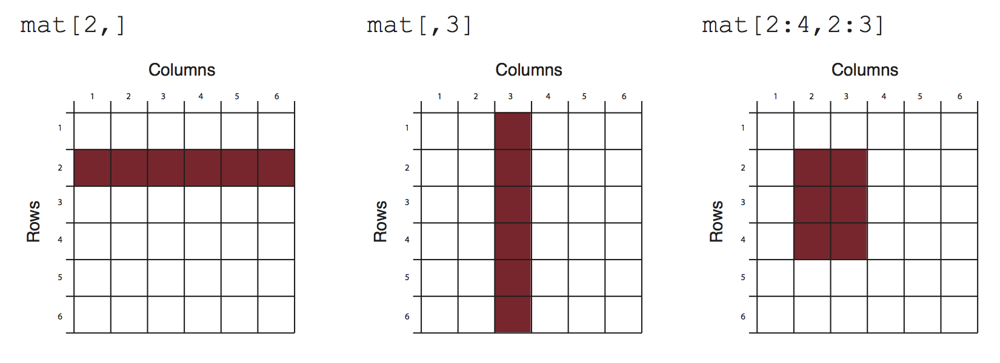

--- 
always_allow_html: true
---
```{r setup, include=FALSE}
knitr::opts_chunk$set(
  warning = FALSE,
  message = FALSE
)
```

# Introduction to R for biologists

## Basic Data Types in R

### Before Starting

When you're working with R, it's crucial to name your variables properly. Here are some simple rules to follow:

1. Allowed Characters: Variable names can include letters, numbers, underscores (_), and periods (.).

2. Starting Characters: A variable name must start with a letter or a period. It can't start with a number.

3. Case Sensitivity: R treats variable names as case-sensitive. For example, myvar is different from MyVar.

4. Dots in Names: While dots are allowed in variable names, it's best to avoid them except at the beginning.

5. Avoiding Conflicts: Don't use names that match existing functions in R, like mean or c.

#### Examples:

Valid:

* myvar

* my.var

* var1

* var_1

Invalid:

* 1var (can't start with a number)

* _temp (can't start with a _)

* c (matches existing function)

* my-var (hyphens aren't allowed)

* my var (spaces aren't allowed)

#### Tips for Naming:

* Meaningful Names: Choose descriptive names like patient_data instead of generic ones like x, y, or z.

* Short and Clear: Keep your names short but make sure they clearly represent what the variable contains.

* Naming Style: You can use camelCase or underscores_between_words for multi-word names. Make sure to stick to one style and be consistent.

Case Consistency: Decide whether you want all lowercase names or CapWords (also known as PascalCase), and stick to it throughout your code.

By following these naming conventions, your code will be easier to understand, and you'll avoid unexpected errors. Consistency is key when naming variables across your R scripts.

In R, data can be classified into several fundamental types, each serving specific purposes in data analysis and manipulation. Understanding these data types is crucial for effective data handling. Let's explore the primary data types in R:

### 1. Numeric

Numeric data represents continuous numerical values. These can be integers or real numbers (floating-point). Numeric data is used for mathematical calculations and statistical analysis.

Example:

```{r}
# Numeric data
age <- 28
height <- 1.75
```

The `<-` operator and the `=` operator in R are both used for assignment but have some key differences.

The `<-` operator is the standard assignment operator in R. It assigns values to objects.

* The arrow can be read as "gets". So age gets the value of 28.

* All R objects should be created using the `<-` operator.

The `=` Operator can also be used for assignments.

```{r}
age = 28
```

* This also assigns 28 to age.

* The `=` should be read as "is equal to". This is mainly used to specify function arguments.

So in a function call like:

```{r eval=FALSE}
plot(x = mydata)
```

We are specifying that the x argument is equal to mydata.

In summary, `<-` is the operator you should use when creating R objects, while 
`=` is reserved for function arguments. For assignments, both `<-` and `=` can be used.
If you want to read more differences, take a look at https://stat.ethz.ch/R-manual/R-patched/library/base/html/assignOps.html.

### 2. Character (String)

Character data represents text or strings of characters. You use character data for storing and manipulating text-based information, such as names, descriptions, and labels.

Example:

```{r}
# Character data
name <- "John Doe"
city <- "New York"
```

### 3. Integer

Integer data represents whole numbers. Unlike numeric data, which includes decimal points, integer data includes only whole numbers. It's commonly used when dealing with counts or discrete quantities.

Example:
```{r}
# Integer data
count <- 10
students <- 42
```

### 4. Logical (Boolean)

Logical data consists of two possible values: `TRUE` or `FALSE`. These values are used for binary decisions, conditions, and logical operations.

Example:

```{r}
# Logical data
is_student <- TRUE
has_permission <- FALSE
```

### 5. Factor

Factor data represents categorical variables with predefined levels or categories. Factors are used when you have data that can be divided into distinct categories, such as "High," "Medium," and "Low."

Example:

```{r}
# Factor data
grade <- factor(c("A", "B", "C", "B", "A"))
```

### 6. Date and Time

Date and time data types are used for representing dates, times, or both. These data types are crucial when dealing with time series data or conducting temporal analysis.

Example:

```{r}
# Date and time data
birth_date <- as.Date("1990-05-15")
timestamp <- as.POSIXct("2023-01-09 14:30:00")
```

### 7. Complex

Complex data types represent complex numbers, which have both real and imaginary parts. Complex numbers are used in advanced mathematical and engineering applications.

Example:

```{r}
# Complex data
z <- 3 + 2i
```

### 8. Missing Values (NA)

In R, missing values are represented as NA. These values indicate the absence of data or an undefined value. Handling missing data is essential in data analysis.

Example:
```{r}
# Missing value
missing_data <- NA
```

Understanding these data types and their characteristics is fundamental to effective data manipulation and analysis in R. Different operations and functions may behave differently depending on the data type, so being familiar with these types will help you work with data effectively.

## The key concept of R: Vectors

In the world of R, vectors are the building blocks of data. In fact, everything in R is a vector. Whether you're dealing with numbers or characters, R treats them all as vectors, which are simply collections of these elements. There is no concept of a scalar in R; even a single value is considered a one-element vector. To create a vector, you'll use the c function, which stands for "combine" or "concatenate."

### Creating Numeric and Character Vectors

Let's dive right in with examples:

```{r}
# A numeric vector
c(1, 2, 3)

# Output: [1] 1 2 3

# A character vector
c("A", "T", "C", "G")

# Output: [1] "A" "T" "C" "G"

```

Notice how `c()` is used to combine values into vectors. Even a single element, such as "A", is a vector in R. Similarly, numeric values like 5 are considered one-element vectors.

### Saving Vectors to Variables

Now, let's save these vectors into variables with meaningful names:

```{r}
number_vec <- c(1, 2, 3)
dna_base <- c("A", "T", "C", "G") 
gene_ids <- c("PAX6", "TP53", "MYC")
```

Remember, it's good practice to use informative variable names. Variable names cannot start with a number, so opt for names like `number_vec` and `dna_base`.

### Vectorized Calculations
One of the powerful features of R is vectorization, where operations are automatically applied element-wise to vectors. For example:

```{r}
number_vec + 1 
```

Here, we've added 1 to each element of `number_vec`. This vectorized behavior simplifies many calculations.

#### Understanding Indexing
You may have noticed the `[1]` that appears in the output. In R, it's called an index, and it indicates the position of each element in the result. For instance:

```{r}
x <- 1:100
x

```

In this case, `[1]` denotes the first position of each element. Understanding indexing helps when working with large datasets.

### Performing Vectorized Calculations
You can perform various calculations on vectors in R:

```{r}
number_vec * 2

# Output: [1] 2 4 6

number_vec / 2

# Output: [1] 0.5 1.0 1.5
```
Remember, all these calculations are vectorized, making R a powerful tool for data manipulation.

### Operations with character vectors

Character vectors in R offer a wide range of operations for text manipulation and analysis. Let's explore some of the essential operations:

#### Concatenation

You can combine character vectors using the c function:

```{r}
new_bases <- c(dna_base, "N")
new_bases
```
This operation is useful for extending or combining character vectors.

#### Changing Case

Transforming the case of characters is straightforward in R. You can convert characters to uppercase or lowercase:

```{r}
toupper(dna_base)

tolower(dna_base)

```

This is handy when you need consistent formatting.

### Logical Vectors

Character vectors also allow for logical operations, which can be incredibly powerful

```{r echo=FALSE}
library("vembedr")

embed_url("https://www.youtube.com/watch?v=DtiatInAJ-Q")
```

#### Finding Matches

To check which elements in a character vector meet certain criteria, use the %in% operator:

```{r}
dna_base %in% c("A", "C", "T")
```
This produces a logical vector where `TRUE` indicates a match. This is because the vector dna_base contains `A`, `T`, `C`, `G` and `G` does not match any element in the vector created by `c("A", "C", "T")`.

#### Saving a Logical Vector

Save the resulting logical vector to a new variable for future use:
```{r}
logical_vec <- dna_base %in% c("A", "C", "T")
logical_vec
```

The length of the logical vector matches the original character vector.

#### Negating a Logical Vector
You can negate a logical vector using the `!` operator:

```{r}
!logical_vec
```

Now, `TRUE` represents elements that do not match the criteria.

#### Subsetting with Logical Vectors
Using a logical vector for subsetting another vector is a common operation. It allows you to filter and extract specific elements:

```{r}
# Subsetting elements that meet the criteria
dna_base[logical_vec]

# Subsetting elements that do not meet the criteria
dna_base[!logical_vec]
```

This powerful technique helps you extract and manipulate data efficiently based on specified conditions.


### Conclusion
You've learned the fundamental operations that can be performed on both numeric and character vectors. These essential skills will serve as a strong foundation as you delve deeper into the world of data analysis and manipulation using R.

Remember that vectors are the building blocks of R, and they are used extensively in various data analysis tasks. Whether you're combining elements, changing case, or using logical operations to filter and extract data, you have now gained valuable insights into how vectors can be harnessed to accomplish your data analysis goals.

As you continue your journey in R programming, you'll encounter more complex data structures and operations, but the understanding of vectors will remain a cornerstone of your proficiency.

## Subsetting and Indexing

In this guide, we will explain one of the fundamental concepts for dealing with vectors: indexing and slicing. Understanding how R handles these operations is crucial as it differs from some other programming languages, like Python.

### Indexing in R

In R, unlike Python where indexing starts at 0, it begins at 1. This means that the first element in a sequence is located at position 1, the second at position 2, and so on. Let's dive into some practical examples to illustrate this concept.

```{r}
# Let's create a vector of DNA bases
dna_base <- c("A", "T", "C", "G")

# Accessing the second element (T) using indexing
dna_base[2]

# second and fourth element
dna_base[c(2,4)]
```

Here, we use square brackets `[ ]` to access elements by their position in the dna_base vector. So, `dna_base[2]` returns the second element, which is "T".

### Slicing in R
Slicing in R allows you to extract a chunk of elements from a vector or sequence. You can specify the start and end positions within the square brackets to define the slice.

```{r}
# Slicing the first two elements (A and T) from the dna_base vector
dna_base[1:2]
```

In this example, `dna_base[1:2]` retrieves elements from position 1 to 2, giving us "A" and "T".

### Negative Indexing
R also allows negative indexing to remove that element at that position:

```{r}
# remove first element by negative indexing
remove_first_element <- dna_base[-1]
```

```{r}
# remove second and fourth
dna_base[-c(2,4)]
# Output: [1] "A" "C"
```

### Conclusion
Remember that R starts indexing at 1, not 0, and you can use square brackets `[ ]` to access elements and slices within vectors and sequences. This is essential for working with data and performing various operations in R.

## Understanding and Manipulating Matrices

Matrices are essential for organizing and processing data, especially when dealing with gene expression data from technologies like RNA sequencing (RNAseq). In this tutorial, we will explore how to create, manipulate, and extract information from matrices using the R programming language. We will cover topics ranging from basic matrix operations to more advanced tasks like normalization for RNAseq data analysis.

### Creating a Matrix

To create a matrix in R, you can use the matrix() function. A matrix is essentially a 2-dimensional table for storing numerical data. Let's start by creating a simple matrix:

```{r}
expression_mat <- matrix(1:12, nrow = 3, ncol = 4)
expression_mat
```

Here, `expression_mat` is a dummy gene expression matrix with 3 rows (genes) and 4 columns (samples), where the entries represent counts for each gene in each sample.

### Adding Row and Column Names
You can enhance the clarity of your matrix by adding row and column names. This is particularly useful when dealing with real biological data. For example:

```{r}
rownames(expression_mat) <- c("gene1", "gene2", "gene3")
colnames(expression_mat) <- c("sample1", "sample2", "sample3", "sample4")
expression_mat
```

Now, instead of numerical indices, your matrix displays gene and sample names, making it easier to interpret.

### Subsetting a Matrix
Subsetting allows you to extract specific rows and columns from a matrix. You can use numerical indices, row/column names, or logical vectors. Remember, R is 1-based. Indices start at 1 while Python starts at 0.



#### Subsetting using numerical indices

```{r}
# Accessing a single element
expression_mat[1, 2]
```

slice a chunk

```{r}
expression_mat[1:2, 1:2]
```

If you leave either the row index blank or the column index, it will subset all the rows or columns. Subset the first two rows and all columns:

```{r}
expression_mat[1:2,]
```

Subset the columns 2 and 4 and all rows

```{r}
expression_mat[, c(2,4)]
```

#### Subsetting using row names

```{r}
# Accessing a specific gene's data
expression_mat["gene3", ]
```

When only one row or one column is left after subsetting, R returns a vector instead of a matrix. To return a single row or column matrix, add `drop=FALSE`.

```{r}
expression_mat["gene3", , drop=FALSE]
```

#### Subsetting using column names

```{r}
# Using predefined gene and sample names
differential_genes<- c("gene3", "gene1")
expression_mat[differential_genes, c("sample1", "sample2")]
```

You see how the matrix is subsetted and the row names are ordered as in `differential_genes`.

#### Subsetting using logical vectors

We have a matrix called `expression_mat` that contains gene expression data, and you want to subset it to include only the rows corresponding to certain "differential genes." Here's how you can do it:

```{r}
logical_vec_genes <- rownames(expression_mat) %in% differential_genes
expression_mat[logical_vec_genes,]
```

### Calculations with Matrices
You can perform various calculations on matrices, such as calculating the sum of counts for each sample (column level) or gene (row level):

```{r}
colSums(expression_mat)
```

```{r}
rowSums(expression_mat)
```

### Normalization

Normalization is crucial in RNAseq data analysis to account for differences in sequencing depth and gene length. Two common methods for normalization are RPKM (Reads Per Kilobase per Million) and TPM (Transcripts Per Million). Watch this video to understand better of their differences 

```{r echo=FALSE}
library("vembedr")

embed_url("https://www.youtube.com/watch?v=TTUrtCY2k-w")
```

>RPKM (Reads Per Kilobase per Million) and TPM (Transcripts Per Million) are two widely-used methods for normalizing gene expression data in RNAseq, with RPKM considering gene length and total reads per sample and TPM further accounting for differences in sequencing depth between samples.

Here's how you can normalize a matrix to RPKM and TPM:

```{r}
# Gene lengths (in kilobases)
gene_lengths <- c(1000, 2000, 3000)

# Normalizing to RPKM
rpkm_normalized <- t(t(expression_mat)/colSums(expression_mat))/gene_lengths * 1e6
rpkm_normalized

# Normalizing to TPM
tpm_normalized <- t(t(expression_mat/gene_lengths)/ colSums((expression_mat/gene_lengths))) * 1e6

tpm_normalized
```

Note, when you divide a matrix by a vector, the operation is row-wise.

```{r}
expression_mat

gene_lengths

expression_mat/gene_lengths
```

That's why if we want to divide the matrix by the column sum, we use the `t()` to transpose the matrix first.

### Conclusion
Understanding matrices and their manipulation is fundamental when working with biological data in R. Whether you're analyzing gene expression or any other numerical data, these matrix operations are essential tools for data exploration and analysis in the field of bioinformatics.

## Essential Functions in R

In this foundational lesson, we will explore several fundamental R functions that are indispensable for your daily bioinformatics tasks. As a beginner in programming, mastering these basic building blocks will provide you with a sturdy groundwork upon which to build your bioinformatics skills.

### `length` Function

The `length` function is your go-to tool for determining the size of a vector or list in R. It's immensely useful when working with gene expression data, as it allows you to gauge the number of elements in your dataset. Let's dive into an example:

```{r}
expression_vec <- c(10, 25, 30, 12, 20)
names(expression_vec) <- c("gene1", "gene2", "gene3", "gene4", "gene5")

length(expression_vec)
```

In this case, our `expression_vec` contains gene expression values, and the length function tells us that it comprises five elements. This straightforward function provides a crucial dimension for managing your data.

### `unique` Function

When working with genomics data, you'll often encounter lists of genes or sequences. The unique function is a valuable asset for identifying and extracting unique elements from such lists. Let's illustrate with a simple example:

```{r}
genes <- c("GeneC", "GeneA", "GeneB", "GeneA")
unique_genes <- unique(genes)

unique_genes
```

In this snippet, we have a list of genes, and unique helps us extract the unique gene names, which can be essential for various genomics analyses.

### `sort` Function

Sorting is a fundamental operation in data manipulation. The `sort` function in R allows you to arrange your data in ascending or descending order. It's particularly handy when dealing with gene lists, as it helps you organize genes alphabetically or numerically. Let's explore some examples:

```{r}
unique_genes <- c("GeneC", "GeneA", "GeneB")

# Sort alphabetically
sort(unique_genes)

```

```{r}
# Sort alphabetically in descending order
sort(unique_genes, decreasing = TRUE)
```

```{r}
# Sort numeric values
sort(expression_vec)
```

```{r}
# Sort numeric values in descending order
sort(expression_vec, decreasing = TRUE)
```

These examples demonstrate how the `sort` function can be applied to both character and numeric data. Sorting can be particularly useful when you need to organize and prioritize genes or data for downstream analyses.

### `cor` Function
The cor function is indispensable for bioinformatics tasks that involve assessing the relationships between variables, such as gene expression levels. It calculates the correlation coefficient, which measures the degree of association between two variables. Let's explore how it works:

```{r}
gene1 <- c(10, 15, 20, 25)
gene2 <- c(8, 12, 18, 22)

correlation_coefficient <- cor(gene1, gene2)

correlation_coefficient
```

In this example, we calculate the correlation between the expression levels of two genes, `gene1` and `gene2`. The resulting correlation coefficient value provides insights into the similarity of their expression patterns.

It's worth noting that the cor function supports various correlation methods, such as Pearson and Spearman. Understanding these correlations is crucial for deciphering gene interactions and conducting network analyses.

## Functions: Organizing Your Code for Reusability

In this section, we will delve into the concept of functions in R—a fundamental building block for creating organized and reusable code. Functions serve as a means to encapsulate specific tasks within your code and can significantly enhance your programming capabilities. In essence, a function is like a black box that takes input, processes it, and produces output, shielding you from the inner workings of the logic. We will explore how to create functions, define input arguments, and ensure they provide meaningful output.

### What is a Function?
A function in R is a way to bundle code that accomplishes a specific task or computation. It comprises defined input arguments and a code block, and you can invoke the function whenever you need to execute that particular logic.

Let's begin by creating a simple function to calculate the mean of a numeric vector.

### Creating a Basic Function: Calculating the Mean

To create a function, you should follow these steps:

1. Name Your Function: Give your function a meaningful name. In our example, we'll call it `mean_customer`.

2. Use the function Keyword: Begin your function with the function keyword, followed by parentheses. Inside the parentheses, define your input arguments. You can have multiple arguments for a function.

3. Body of the Function: The actual code of the function is enclosed within curly braces {}.

Let's create a mean_customer function to compute the mean of a numeric vector:

```{r}
mean_customer <- function(x) {
  total <- sum(x)
  mean_value <- total / length(x)
}
```

In this function, we first calculate the total sum of the input vector x using the built-in `sum` function. Then, we divide this sum by the length of the vector to obtain the mean.

### Using the Custom Function

Now that we have defined our `mean_customer` function, let's use it with an example vector:

```{r}
input_vec <- c(1, 2, 3, 4)
result <- mean_customer(input_vec)

result
```

You might have noticed that our initial function did not print anything to the console. To make a function display an output, you need a `return` statement. Let's add it to our function.

### Returning a Value from the Function

Returning a value in a function in a programming language like R is a fundamental concept that determines what the function does with its computed result. When you include a return statement within a function, you are specifying the value that the function should provide as output when it's called elsewhere in your code.

1. Calculation or Operation: Inside the function, there is a block of code that performs some calculation, operation, or task based on the input arguments provided to the function.

2. return Statement: When you include a return statement, it signifies that the function should terminate its execution at that point and immediately provide the value specified after return as its output. This value can be a single variable, an expression, or even a complex data structure.

3. Function Execution: When you call the function in your code, it starts executing from the beginning and proceeds until it encounters the return statement. At that point, the function stops executing further code within its body and exits, returning the value specified in the return statement.

4. Assigning to a Variable: Typically, you capture the returned value by assigning it to a variable when you call the function. This allows you to store and use the result elsewhere in your code.

For example, in R, following the previous example

```{r}
mean_customer <- function(x) {
  total <- sum(x)
  mean_value <- total / length(x)
  return(mean_value)
}
```

Now, when you use `mean_customer(input_vec)`, it will correctly display the mean value.

```{r}
# Calculate the mean of a numeric vector
input_vec <- c(1, 2, 3, 4)
result <- mean_customer(input_vec)
result
```

### Optional: Omitting the return Statement
You can also omit the return statement. By default, the last expression in the function will be returned as the output. Here's the updated function:

```{r}
mean_customer <- function(x) {
  total <- sum(x)
  mean_value <- total / length(x)
  mean_value
}
```

The behavior remains the same as before when you use `mean_customer(input_vec)`.


### Using more than one argument

Missing data is a common occurrence in real-world biological datasets, and learning how to handle it is crucial for robust data analysis in R. Let's create a custom function to calculate the mean of a numeric vector while accommodating missing values (NAs). We'll introduce the concept of the na.rm argument and illustrate how it allows us to decide whether or not to remove NAs before performing calculations.

### Understanding Missing Values (NAs) in R

In R, "NA" stands for "Not Available," and it is used to represent missing or undefined values in your data. Let's start by creating a couple of example vectors:

```{r}
genes <- c("TP53", NA, "MYC")
NA_vec <- c(1, 2, 3, NA)
```

As you can see, our genes vector contains a missing value (`NA`). To identify and handle `NAs`, we can use the `is.na()` function, which returns a logical vector indicating which elements are `NAs`:

```{r}
is.na(genes)

is.na(NA_vec)
```

### Initial Attempt: A Function Without Handling NAs

Let's start by creating a custom function to calculate the mean of a numeric vector. However, if the vector contains `NAs`, our initial function doesn't handle them correctly:

```{r}
mean_customer <- function(x){
    total <- sum(x)
    mean_value <- total / length(x)
    return(mean_value)
}
```

When we try to calculate the mean of `NA_vec`, it returns `NA`:

```{r}
mean_customer(NA_vec)
```

This outcome is not ideal, especially when we want to calculate the average of the non-missing values.

### Adding the `remove_na` Argument

To address this issue, we can enhance our function by introducing a new argument called `remove_na`, which allows us to control whether `NAs` should be removed before performing calculations. By default, we set `remove_na` to TRUE, indicating that NAs should be removed:

>You'll see that we declare the remove_na argument with an =. That means that if no value is provided, by default it will take the value TRUE.

```{r}
mean_customer_NA <- function(x, remove_na = TRUE){
    if (remove_na){
        x <- x[!is.na(x)]
    }
    total <- sum(x)
    mean_value <- total / length(x)
    return(mean_value)
}
```

Now, our function behaves differently based on the value of `remove_na`. If set to `TRUE`, it removes `NAs` from the vector before calculating the mean; if set to `FALSE`, it includes `NAs` in the calculation.

### Practical Application
Let's see how this enhanced function works with our example vector:

```{r}
mean_customer_NA(NA_vec)  # Default behavior (remove_na = TRUE)

mean_customer_NA(NA_vec, remove_na = TRUE)  # Explicitly removing NAs

mean_customer_NA(NA_vec, remove_na = FALSE)  # Including NAs
```

In the first two calls, we get a result of 2 by removing the `NAs`, while in the last call, we receive `NA` since we chose not to remove them.

### Getting help with functions

#### Using the `?` Operator for Documentation. 

The `?` operator is a quick and convenient way to access documentation directly within the R environment. Simply type in the console `?` followed by the name of the function you want to learn more about. For example:

```{r eval=FALSE}
?mean
```

This command will open the documentation for the `mean()` function, providing details on its usage, arguments, examples, and related functions.

#### Accessing Documentation via the `help()` Function

Alternatively, you can use the `help()` function to retrieve documentation for a specific function. Syntax:

```{r}
help(mean)
```

Executing this command will display the documentation for the `mean()` function in the Help pane of R Studio.

#### Utilizing the `help.search()` Function

f you are unsure about the exact function name or wish to search for functions related to a certain topic, you can use the help.search() function. This function allows you to search for keywords across all available documentation. Syntax:

```{r eval=FALSE}
help.search("keyword")
```

For example:

```{r}
help.search("linear regression")
```
This command will return a list of relevant documentation entries containing the specified keyword, assisting you in finding relevant functions and packages.

####  Exploring Online Resources and Community Forums

In addition to built-in documentation, online resources such as the official R documentation website (https://www.rdocumentation.org/) and community forums like Stack Overflow (https://stackoverflow.com/) are valuable sources of information and support. You can search for specific functions, read user discussions, and even ask questions if needed.

### A Real World Example

In the field of bioinformatics, analyzing gene expression data is a fundamental task. One common analysis involves identifying the most highly variable genes within a gene expression matrix. Let's create a custom R function for this purpose.

>Before diving into the creation our function, it's essential to understand some key pre-concepts. Firstly, gene expression data typically consists of a matrix where rows represent genes and columns represent samples or conditions. Second, the variability of gene expression across samples is a crucial metric, often measured by variance or standard deviation. Highly variable genes can provide valuable insights into biological processes.

Let's create a custom function, `findVariableGenes`, which identifies the top N most highly variable genes in a gene expression matrix. Below is the code for the function, with explanations:

```{r}
# Define the custom function
findVariableGenes <- function(expr_matrix, n = 10) {
  # Calculate variances for each gene
  gene_variances <- apply(expr_matrix, MARGIN = 1, var)
  
  # Sort genes by variance in descending order
  sorted_genes <- sort(gene_variances, decreasing=TRUE) 
  
  # Select the top N variable genes
  top_n <- names(sorted_genes[1:n])
  
  # Return the names of top variable genes
  return(top_n)
}
```

* expr_matrix: This is the gene expression matrix you want to analyze.

* n: The number of top variable genes you want to identify (default is 10).

* apply function applies the var function to the matrix for rows (`MARGIN =1`). if you want to apply a function for columns, use `MARGIN =2`.

Now, let's put our custom function to the test using some randomly generated gene expression data.

#### Generating Random Data

We'll create a gene expression matrix with 25 genes (rows) and 4 samples (columns) using normally distributed random data. To ensure reproducibility, we'll set a seed value (123). Here's the code and the resulting data matrix:

```{r}
# Set a seed for reproducibility (ensure all get the same random data)
set.seed(123)  # This sets a random seed to ensure that the random data generated below is reproducible.

data <- matrix(rnorm(100), ncol = 4)  # This line generates a matrix with 100 random numbers from a standard normal distribution and organizes them into 4 columns.
rownames(data) <- paste0("gene", 1:25)  # This line assigns row names to the matrix, labeling each row as "gene1", "gene2", and so on, up to "gene25".

# Display the generated data
print(data)
```

#### Using the Custom Function
Now that we have our gene expression data, let's apply our `findVariableGenes` function to identify the top 10 most highly variable genes:

```{r}
# Use the custom function to find highly variable genes
highly_variable <- findVariableGenes(data, n = 10)

# Display the list of highly variable genes
print(highly_variable)
```

Encapsulating logic into functions makes our code more organized, reusable, and scalable.Functions make code more organized, reusable, and scalable. As you code more in R, you’ll want to encapsulate logic into functions just as shown here.

### Conclusion
Understanding functions and their ability to encapsulate code and return specific values is crucial in R programming. Functions enhance code organization, maintainability, and reusability, making them a valuable tool for any data analyst or scientist. The flexibility and efficiency they offer become increasingly evident as you tackle more complex data analysis tasks in R.

## Common Mistakes to avoid

In this lesson we will discuss some common mistakes that absolute beginners often make when learning R. Learning a new programming language can be challenging, and it's natural to encounter stumbling blocks along the way. By understanding these common mistakes, you can avoid them and become a more proficient R programmer.

### Mixing Data Types
One common mistake is mixing different data types in operations. For instance, trying to add a number to a string or perform mathematical operations on non-numeric data types.

```{r eval=FALSE}
# Example:
x <- "5"
y <- 3
z <- x + y  # This will result in an error because you cannot add a string and a number.
```

### Forgetting Function Parentheses
Another mistake is forgetting to include parentheses when calling functions. In R, functions typically require parentheses, even if they don't have any arguments.

```{r eval=FALSE}
# Incorrect:
print "Hello, World!"

# Correct:
print("Hello, World!")
```

### Overwriting Built-in Functions
Sometimes you might unintentionally overwrite built-in functions or variable names, causing unexpected behavior in your code.

```{r eval=FALSE}
# Example:
# Incorrect:
mean <- function(x) {
  sum(x) / length(x)
}
# Now, mean function is overwritten and will not work as expected.
# e.g, it can not handel na.rm argument 
```

### Misunderstanding Variable Scoping

Variable scoping in R defines where a variable can be used in a program. If a variable is defined inside a function, it's only accessible within that function (local scope). Variables defined outside functions, usually at the start of a script or in the main program, can be used anywhere (global scope).

Understanding variable scoping is crucial for avoiding errors and writing maintainable code. One common mistake is assuming that variables defined in one part of the program will be accessible from another part.

Let's look at an example:

```{r}
# Example 1: Incorrect variable scoping
calculate_sum <- function(a, b) {
  result <- a + b
}

# Trying to access 'result' outside the function will result in an error.
print(result)
```

### Best practices for variable scoping include

1. Explicitly Pass Variables: When variables are needed in different parts of the program, it's better to explicitly pass them as arguments to functions rather than relying on global variables.

```{r}
# Example 2: Explicitly passing variables
calculate_sum <- function(a, b) {
  result <- a + b
  return(result)
}

# Call the function with arguments
result <- calculate_sum(3, 5)
print(result) 
```

2. Use Meaningful Variable Names: Clear and meaningful variable names can help avoid confusion about variable scope and improve code readability.

```{r}
# Example 3: Clear variable names
calculate_area <- function(length, width) {
  area <- length * width
  return(area)
}

# Call the function with arguments
area <- calculate_area(4, 5)
print(area)  
```

3. Avoid Modifying Global Variables Within Functions: Modifying global variables within functions can lead to unexpected behavior and make code harder to understand and debug. Instead, prefer returning values from functions.

```{r}
# Example 4: Avoid modifying global variables
x <- 10

modify_variable <- function() {
  x <- 20  # This creates a new local variable 'x', it does not modify the global 'x'
}

modify_variable()
print(x)  # Output: 10 (global 'x' remains unchanged)
```

### Conclusion
Learning R can be a rewarding experience, but it's common to encounter challenges along the way. By being aware of these common mistakes and understanding the allowed operations in R, you can avoid many pitfalls and become a more proficient R programmer. Remember to practice regularly and don't hesitate to seek help from resources like documentation, online tutorials, and community forums. Happy coding!

