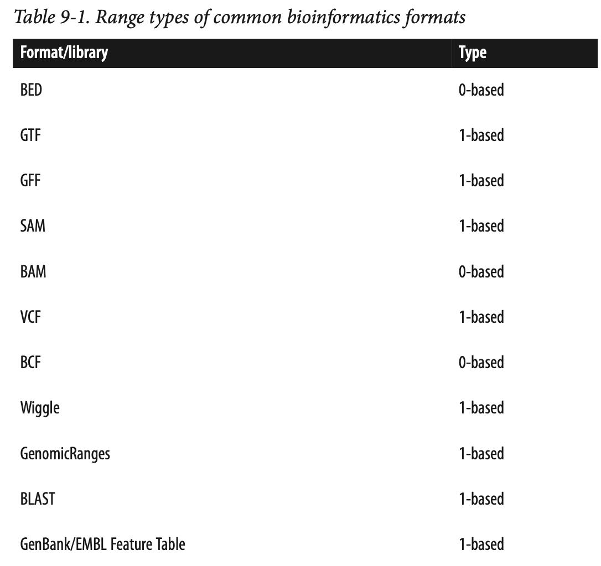

# Introduction to BioConductor

In the ever-evolving field of bioinformatics and computational biology, researchers and scientists rely on specialized tools and packages to analyze and interpret biological data efficiently. [`Bioconductor`](https://bioconductor.org/), a powerful and comprehensive suite of R packages, plays a pivotal role in addressing the unique challenges posed by genomics, transcriptomics, proteomics, and other biological data domains.

This section, "Introduction to Bioconductor in R," will serve as your gateway to this remarkable resource. We will explore the fundamentals of Bioconductor, its significance in the realm of life sciences, and how you can harness its capabilities to unlock valuable insights from complex biological datasets. Whether you are a biologist, bioinformatician, or data scientist, understanding Bioconductor is a crucial step towards advancing your research and data analysis endeavors in the field of biology. Let's embark on this exciting journey into the world of Bioconductor, where data meets discovery.

## Introduction to BiocManager

`BiocManager` is an R package that serves as the primary interface for managing `Bioconductor` packages, which are extensions of R developed specifically for bioinformatics applications. Bioconductor itself is a project that provides tools for the analysis and comprehension of high-throughput genomic data, including but not limited to next-generation sequencing (NGS), microarrays, and proteomics.

### Why Use BiocManager?
The role of BiocManager is ensuring compatibility among Bioconductor packages and between these packages and your version of R. It simplifies the process of installing Bioconductor packages, managing dependencies, and keeping packages up-to-date with the latest releases, thereby fostering a stable and efficient bioinformatics workflow.

### Installing BiocManager
To get started with BiocManager, you first need to install it from CRAN (the Comprehensive R Archive Network), which can be done using the following command in R:

```{r eval=FALSE}
install.packages("BiocManager")
```

Once installed, you can load `BiocManager` just like any other R package:

```{r}
library(BiocManager)
```

### Installing Bioconductor Packages
With `BiocManager` loaded, installing Bioconductor packages is straightforward. Suppose you want to install the `GenomicRanges` package; you can do so with the following command:

```{r eval=FALSE}
BiocManager::install("GenomicRanges")
```

BiocManager automatically resolves and installs any dependencies, ensuring that all required packages are installed for the `GenomicRanges` package to function correctly.

### Updating Bioconductor Packages

Keeping your Bioconductor packages up-to-date is crucial for accessing the latest features, improvements, and bug fixes. BiocManager facilitates this through the install function, which also checks for and updates any out-of-date packages:

```{r eval=FALSE}
BiocManager::install()
```

Running this command without specifying a package name updates all installed Bioconductor packages to their latest versions.

### Checking for Valid Bioconductor Versions
Compatibility between your R version and Bioconductor packages is vital for smooth bioinformatics analyses. BiocManager offers a function to validate this compatibility:

```{r eval=FALSE}
BiocManager::valid()
```

This command checks that all installed Bioconductor packages are compatible with each other and with your current version of R, providing a report of any inconsistencies.

### Conclusion

`BiocManager` is an indispensable tool for bioinformatics practitioners working with R and `Bioconductor`. It simplifies package management, ensuring that researchers can focus on their analyses without being bogged down by software compatibility issues. By leveraging `BiocManager`, you can maintain a cutting-edge bioinformatics toolkit, fully equipped to tackle the challenges of genomic data analysis.

## Working with Genomic Coordinates and Regions in R

Genomic coordinates are fundamental in the field of genomics. Whether you're dealing with genes, regulatory elements, ChIP-seq peaks, or mutation calling data, they are all represented as genomic coordinates. In R, you can efficiently handle genomic coordinates and regions using the `GenomicRanges` package and related tools. In this guide, we'll explore how to work with genomic ranges, extract relevant information, and perform common operations.

>For a complete overview check docs here: https://bioconductor.org/packages/release/bioc/vignettes/GenomicRanges/inst/doc/GenomicRangesIntroduction.html

### Introduction to GenomicRanges

The `GenomicRanges` package in R provides data structures for storing and manipulating genomic ranges. A genomic range typically includes information about the chromosome (seqname), the start and end positions, and the strand of the sequence.

1. Every gene or regulatory element (promoters, enhancers) in the genome can be represented in chromosome: start-end format.

2. You get a peak file from a ChIP-seq experiment. The peak file is usually represented in a at least 3-column bed format: chromosome, start and end.

3. You get a mutation calling [VCF](https://genome.ucsc.edu/goldenPath/help/vcf.html) file. You will have the chromosome and position of that single variant.

Let's start by creating a simple genomic range:

```{r}
library(GenomicRanges)

# Create a GenomicRanges object
gr <- GRanges(seqnames = "chr1", 
              ranges = IRanges(1:10, width = 3))

gr
```

In this example, we've created a GenomicRanges object for chromosome 1 with ten intervals of width 3. We did not specify the strand, so it is `*`. Alternatively, we can 
specify the genomic regions are on the `+` strand.

```{r}
GRanges(seqnames = "chr1", 
        ranges = IRanges(1:10, width = 3),
        strand = "+")
```

To understand the standness, read this [blog post](https://crazyhottommy.blogspot.com/2014/08/understanding-forward-strand-and.html) by me.


### Basic Operations with GenomicRanges

These operations are commonly used in genomics data analysis to perform tasks such as calculating the length of genomic features, extracting specific regions of interest, and modifying intervals for downstream analysis. `GenomicRanges` provides a flexible and efficient way to work with genomic intervals, which is essential for tasks like annotation, visualization, and statistical analysis of genomics data.

### Calculating width of Each Genomic Interval

Genomic intervals can represent various features in a genome, such as genes, exons, or regulatory regions. Knowing the width of these intervals is crucial when analyzing genomic data. For example, you might want to calculate the size of a gene or measure the distance between two regulatory elements. The `width()` function helps you obtain this information quickly.

```{r}
width(gr)
```

This function calculates the width (or length) of each genomic interval in the GenomicRanges object `gr`. In genomics, the width typically represents the number of base pairs or genomic coordinates covered by each interval.

### Start and End Positions
Genomic intervals are defined by their start and end positions along a chromosome. These functions allow you to extract these positions, which can be essential for tasks like determining the transcription start site of a gene or identifying the boundaries of a specific genomic region.

#### Getting start position

```{r}
start(gr)
```

This function retrieves the starting position (or the leftmost coordinate) of each genomic interval in the `GenomicRanges` object `gr`. It tells you where each interval begins along the genome.

#### Getting end position

```{r}
end(gr)
```

This function retrieves the ending position (or the rightmost coordinate) of each genomic interval in the `GenomicRanges` object `gr`. It tells you where each interval ends along the genome.

### Strand Information

In genomics, it's important to know the orientation of genomic features. The strand information (`+` or `-`) indicates whether a feature is on the forward (`+`) or reverse (`-`) strand of DNA. This can be crucial for understanding gene transcription direction, reading frames, and other biological processes.

```{r}
strand(gr)
```

Genomic intervals can be associated with a strand information to represent the directionality of a genomic feature. The strand function retrieves the strand information for each interval. The strand can be either "+" for the forward strand, "-" for the reverse strand, or "*" for strand-agnostic intervals.

### Shifting the Genomic Range
Sometimes, you need to shift genomic intervals to examine neighboring regions. For instance, you might want to find regions that overlap with a gene's promoter, which is typically located upstream of the transcription start site. Shifting intervals allows you to explore nearby genomic areas easily.

```{r}
gr + 1
```

This operation demonstrates how you can manipulate the genomic intervals in `gr`. Here, you are adding 1 to each start **AND** end position in the intervals, effectively expanding them by one base left and right .

```{r}
width(gr+1)
```

### Subsetting
Genomic data can be extensive, and you often need to focus on specific regions of interest. Subsetting helps you extract only the relevant intervals from a larger dataset. This is especially useful when you want to analyze a particular set of genes or genomic regions.

```{r}
gr[1:2]
```

This code subset the GenomicRanges object gr to select the first two intervals. It returns a new GenomicRanges object containing only those intervals.

### Flanking Regions

Imagine you have a specific location in the DNA, and you want to study not only that location but also the regions right before and after it. flank lets you do this. For example, if you're interested in a particular gene, you can use flank to include a bit of the DNA sequence before and after that gene. This helps you see the surrounding context and understand how the gene fits into the bigger picture.

```{r}
flank(gr, 2)
```

`flank` is useful for tasks like expanding genomic regions of interest to capture nearby regions or creating control regions around known features for downstream analysis. It is commonly used in genomics research to study the context around specific genomic locations.

### Resizing
Think of a situation where you have many different pieces of DNA (intervals), and they're all different lengths. Maybe you want to compare them or count something in each of them. It's easier to work with them if they're all the same size. That's what `resize` does. It makes sure that all the pieces of DNA are the same length, so you can compare or analyze them more easily.

```{r}
resize(gr, 10)
```

`resize` is used to standardize the length of genomic intervals, which can be useful for comparing or analyzing regions of interest with consistent sizes. It is often applied to ensure that intervals have the same width, making them suitable for various downstream analyses, such as counting reads or comparing features.

### 0 based and 1 based coordinate system

One needs to be aware that there are two genomics coordinate systems: 1 based and 0 based. There is really no mystery between these two. You EITHER count start at 0 OR at 1. However, this can make confusions when analyzing genomic data and one may make mistakes if not keep it in mind. Read https://www.biostars.org/p/84686/.

The reason that why it matters is that python index starts at 0 while R starts at 1.

Make sure you understand how different bioinformatics format use different coordinate
system. 



### Other packages 
In genomics research, we often work with genomic data in various formats such as GTF (Gene Transfer Format) and BED files. To facilitate this, we have a few essential packages at our disposal:

* **AnnotationHub**: This package provides access to a wide range of genome annotations, including GTF files, which are commonly used to represent gene models. These annotations are invaluable for understanding genomic regions and gene structures.

* **GenomicFeatures**: This package is the powerhouse for working with genomic data in R. It provides functions for creating and manipulating genomic feature objects.

* **rtracklayer**: This package specializes in reading and handling genomic data files, including BED and GTF files.

### Accessing Genome Annotations

>You can check AnnotationHub docs here: https://bioconductor.org/packages/release/bioc/vignettes/AnnotationHub/inst/doc/AnnotationHub.html

Genome annotations provide essential information about the location and structure of genes, which is crucial for understanding how genes function and how they are regulated. For example, knowing the coordinates of exons, introns, and promoters allows us to analyze where specific genetic elements are located in the genome.

```{r}
library(AnnotationHub)

# Initialize the AnnotationHub
ah <- AnnotationHub()

# Query for specific annotations, for example, Homo sapiens (human) in the GRCh37 assembly
annotations <- AnnotationHub::query(ah, c("gtf", "Homo_sapiens", "GRCh37"))

# Select one of the annotations (e.g., GRCh37.gtf)
GRCh37.gtf <- annotations[['AH10684']]
```

Now, we have a `GenomicRanges` object called `GRCh37.gtf`, which contains genomic features from the GRCh37 assembly of the human genome.

### Understanding Genomic Biotypes

Genes in the genome can have different biotypes, indicating their functional roles. We can filter our genomic features based on biotypes, such as "protein_coding" and "lincRNA."

Filtering genes by biotype helps us focus on specific classes of genes, such as protein-coding genes, which are involved in producing proteins, or long intergenic non-coding RNAs (lincRNAs), which play regulatory roles.

```{r}
# what are the avaiable biotypes
table(GRCh37.gtf$gene_biotype)

# subset 
GRCh37.gtf <- GRCh37.gtf[GRCh37.gtf$gene_biotype %in% c("protein_coding", "lincRNA")]
```

### Creating a Transcript Database (TxDb)

>You can check GenomicFeatures docs here: https://bioconductor.org/packages/release/bioc/vignettes/GenomicFeatures/inst/doc/GenomicFeatures.html

To perform more advanced analyses, we'll create a transcript database (`TxDb`) from our genomic features. A `TxDb` is a structured database of transcript information, allowing us to efficiently query and retrieve specific genomic elements for analysis.

```{r}
library(GenomicFeatures)

# Create a TxDb from the filtered genomic features
GRCh37.txdb <- makeTxDbFromGRanges(GRCh37.gtf)
```

### Extracting Exons, Introns, and Intergenic Regions
Now that we have our TxDb, we can extract various genomic elements for further analysis.

#### Exons by Gene

Analyzing exons by gene is essential for understanding the coding regions of genes and their splicing patterns. Let's retrieve exons grouped by genes.

```{r}
exonsByGene <- exonsBy(GRCh37.txdb, "gene") %>% 
  unlist()

exonsByGene
```

### Merging All Exons

Merging exons (exons can overlap with each other) helps simplify analysis, such as quantifying the overall exonic content of genes. To get a single range representing all exons, we can reduce them.

```{r}
allExons <- exons(GRCh37.txdb) %>% reduce()

allExons
```

### Introns

Identifying introns is crucial for studying gene splicing and understanding the non-coding regions within genes. To find intronic regions, we can use the `intronsByTranscript` function.

```{r}
introns <- intronsByTranscript(GRCh37.txdb) %>% 
  unlist() %>%
  reduce()

introns
```

### Getting All Genes
Having a complete list of genes is essential for various genomics analyses, including differential gene expression studies. Obtaining all genes is straightforward.

```{r}
allGenes <- genes(GRCh37.txdb)

allGenes
```

### Promoters
Promoter regions are critical for understanding gene regulation and identifying potential binding sites for transcription factors. To find promoter regions, typically defined as the region from `-1kb` to `+500bp` around the transcription start site (`TSS`), we can use the promoters function.

```{r}
promoterRegions <- promoters(genes(GRCh37.txdb), 
                             upstream = 1000, 
                             downstream = 500)

promoterRegions
```

### Full Genome
Having the entire genome as a single object is useful for genome-wide analyses and visualizations. To represent the entire genome as a GRanges object:

```{r}
chrom_granges <- as(seqinfo(GRCh37.txdb), "GRanges")
chrom_granges
```

### Full Transcriptome

Merging overlapping transcripts simplifies transcript-level analyses and helps identify the full extent of genes. To represent the entire transcriptome, we can merge overlapping features.

```{r}
collapsed_tx <- reduce(transcripts(GRCh37.txdb))

# Set strand information to '*'
strand(collapsed_tx) <- "*"
```

### Intergenic Regions
Intergenic regions often contain important regulatory elements, and identifying them can provide insights into gene regulation. To find regions that are not within any annotated genes, we can use the setdiff function.

```{r}
intergenicRegions <- GenomicRanges::setdiff(chrom_granges, collapsed_tx)

intergenicRegions 
```

### Exploring Untranslated Regions (UTRs)

UTRs play crucial roles in post-transcriptional regulation, and analyzing them can provide insights into gene regulation mechanisms. If you're interested in untranslated regions (UTRs) of genes, you can use functions like `fiveUTRsByTranscript` and `threeUTRsByTranscript` provided by the `GenomicFeatures` package.

```{r eval=FALSE}
# To get 5' UTRs by transcript
fiveUTRs <- fiveUTRsByTranscript(GRCh37.txdb)

# To get 3' UTRs by transcript
threeUTRs <- threeUTRsByTranscript(GRCh37.txdb)
```


### Real-World Applications
Understanding genomic features is crucial for various genomics tasks, including:

* ChIP-seq Analysis: You can use these genomic ranges to determine how many ChIP-seq peaks fall into promoters, exons, introns, or intergenic regions, helping you interpret the functional significance of your data.

* RNA-seq Analysis: Identifying which exons are covered by RNA-seq reads and counting reads in each exon allows you to quantify gene expression accurately.

* Functional Genomics: Investigating the genomic context of genes helps in understanding their regulatory elements, including promoters and enhancers.

* Genome Annotation: These tools are essential for creating comprehensive annotations of genomes, enabling researchers to understand gene structures and functions.

### Conclusion
In this lesson, we've explored various genomic features and their manipulation using R packages such as `GenomicFeatures`, `AnnotationHub`, and `rtracklayer`. These tools are invaluable for genomics research, allowing you to analyze and interpret genomic data effectively. Whether you're working with ChIP-seq, RNA-seq, or genome annotation, understanding genomic features is essential to uncover the secrets of the genome.


