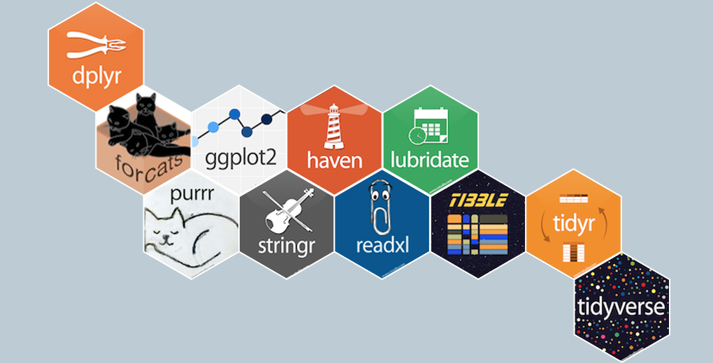
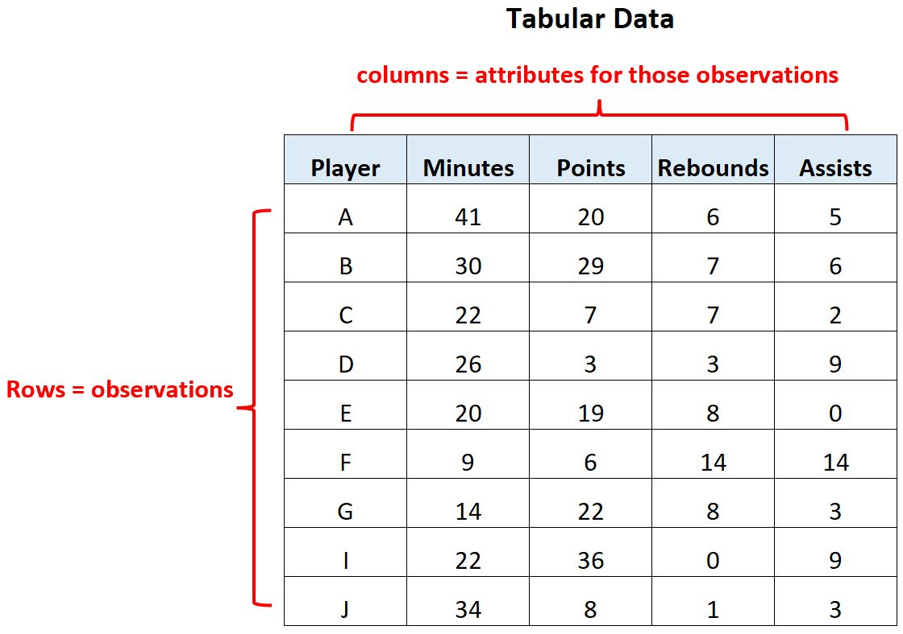
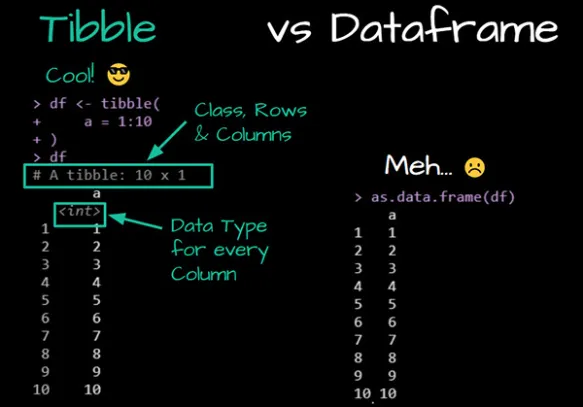
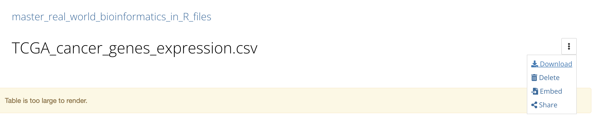

--- 
always_allow_html: true
---


# Introduction to the tidyverse ecosystem

## What is the Tidyverse?
In this lesson, we will explore the Tidyverse, a powerful collection of R packages designed to simplify and streamline the data science workflow. The Tidyverse is particularly well-suited for beginners and professionals alike, as it encourages a structured and intuitive approach to data manipulation and visualization.



The Tidyverse is a comprehensive ecosystem of R packages that share common principles for data manipulation and visualization. It encourages the use of tidy data, a specific data structure that makes data analysis more straightforward. Tidy data arranges observations in rows and variables in columns, making it easier to work with and visualize.

## Key Tidyverse Packages
Let's dive into some of the essential packages within the Tidyverse and understand how they can be beneficial in data analysis.

### dplyr
Explore dplyr docs [here](https://dplyr.tidyverse.org/).

The core of the Tidyverse is the `dplyr` package. It provides a set of functions for data manipulation, including filtering, summarizing, and transforming data frames. Here's a simple example of how you might use `dplyr` to filter data:


```r
# install.packages("dplyr")
# Load the dplyr package
library(dplyr)

# Create a data frame
data <- data.frame(
  Name = c("Alice", "Bob", "Charlie"),
  Age = c(25, 30, 22)
)

data 
```

```
##      Name Age
## 1   Alice  25
## 2     Bob  30
## 3 Charlie  22
```

```r
# Filter the data to select individuals older than 25
filtered_data <- data %>%
  filter(Age > 25)

# View the filtered data
filtered_data
```

```
##   Name Age
## 1  Bob  30
```

In this example, we used `filter()` to select rows where the "Age" column is greater than 25.

### A note on the pipe

You just saw the `%>%` operator. It is also called a pipe.

`%>%` is from the [magrittr](https://cran.r-project.org/web/packages/magrittr/vignettes/magrittr.html) package and when you load the `dplyr` package, the `%>%` will be available for you to use.

The R language has a new, built-in pipe operator as of R version 4.1: `|>`.


```r
mtcars %>%
  head()
```

```
##                    mpg cyl disp  hp drat    wt  qsec vs am gear carb
## Mazda RX4         21.0   6  160 110 3.90 2.620 16.46  0  1    4    4
## Mazda RX4 Wag     21.0   6  160 110 3.90 2.875 17.02  0  1    4    4
## Datsun 710        22.8   4  108  93 3.85 2.320 18.61  1  1    4    1
## Hornet 4 Drive    21.4   6  258 110 3.08 3.215 19.44  1  0    3    1
## Hornet Sportabout 18.7   8  360 175 3.15 3.440 17.02  0  0    3    2
## Valiant           18.1   6  225 105 2.76 3.460 20.22  1  0    3    1
```

```r
mtcars |>
  head()
```

```
##                    mpg cyl disp  hp drat    wt  qsec vs am gear carb
## Mazda RX4         21.0   6  160 110 3.90 2.620 16.46  0  1    4    4
## Mazda RX4 Wag     21.0   6  160 110 3.90 2.875 17.02  0  1    4    4
## Datsun 710        22.8   4  108  93 3.85 2.320 18.61  1  1    4    1
## Hornet 4 Drive    21.4   6  258 110 3.08 3.215 19.44  1  0    3    1
## Hornet Sportabout 18.7   8  360 175 3.15 3.440 17.02  0  0    3    2
## Valiant           18.1   6  225 105 2.76 3.460 20.22  1  0    3    1
```

Think of `%>%` and `|>` in R the same as `|` in the unix commands: the output of the previous command is the input of the next command.

The pipe operator `%>%` is a very useful tool for writing efficient, easy-to-read code in R. You can use as many pipes as you want. I usually build the pipes one by one by looking at the output.


```r
mtcars %>% 
  head() %>% 
  tail(n=3)
```

```
##                    mpg cyl disp  hp drat    wt  qsec vs am gear carb
## Hornet 4 Drive    21.4   6  258 110 3.08 3.215 19.44  1  0    3    1
## Hornet Sportabout 18.7   8  360 175 3.15 3.440 17.02  0  0    3    2
## Valiant           18.1   6  225 105 2.76 3.460 20.22  1  0    3    1
```
This means print out the first 6 rows and then take the last 3 rows.

### ggplot2

Explore `ggplot2` docs [here](https://ggplot2.tidyverse.org/index.html).

The `ggplot2` package is the go-to choice for data visualization in the Tidyverse. It follows the "grammar of graphics" approach, allowing you to build complex plots layer by layer. Here's a basic example:


```r
# install.packages("ggplot2")
# Load the ggplot2 package
library(ggplot2)

# Create a scatter plot
ggplot(data, aes(x = Age, y = Name)) +
  geom_point()
```

<!-- --> 

n this code, we used `ggplot()` to set up the plot and `geom_point()` to add scatterplot points to the canvas.

### tidyr

Explore tidyr docs [here](https://tidyr.tidyverse.org/index.html).

The `tidyr` package assists in reshaping data between **wide** and **long** formats, which is often necessary for analysis and visualization. Suppose you have a dataset with columns representing different years and want to convert it to a long format for easier analysis. `tidyr` can help with this transformation.


\includegraphics[width=1\linewidth]{images/wide} 

### readr

Explore readr docs [here](https://readr.tidyverse.org/index.html).

`readr` is a fast and efficient package for reading **tabular** data into R. It's faster than the base R functions like `read.csv()`. When working with large datasets, this can significantly speed up your data loading process.

Tabular data are rectangular:



### tibble

Explore tibble docs [here](https://tibble.tidyverse.org/index.html).

the rectangular data will be read into R as a dataframe. `tibble` provides an improved data frame structure that addresses some issues with traditional R data frames. It displays data more neatly and provides better compatibility with the Tidyverse functions.

### stringr
Explore stringr docs [here](https://stringr.tidyverse.org/index.html).

The `stringr` package offers a range of string manipulation functions that are easier to use and more consistent than the base R functions. It's particularly handy when dealing with text data, such as cleaning and formatting strings.

### forcats
Explore forcats docs [here](https://forcats.tidyverse.org/index.html).

`forcats` is designed for handling factor variables, which are categorical variables with predefined levels. It provides tools for changing the order of levels and combining levels when necessary.

### Real-World Applications
To illustrate the practical utility of the Tidyverse, consider the following scenarios:

1. Data Import: `readr` helps you efficiently import data from various sources, such as CSV files, Excel spreadsheets, or even web-based data.

2. Data Cleaning: When working with messy data, `tidyr` and `stringr` can assist in reshaping and cleaning data for analysis.

3. Data Exploration: When you receive a dataset, you can use `dplyr` to quickly filter, summarize, and explore the data, helping you understand its characteristics.

4. Data Visualization: `ggplot2` allows you to create stunning visualizations, making it easier to convey insights to others. For instance, you can create bar charts, scatter plots, and histograms.

5. Working with Factors: `forcats` simplifies tasks like reordering factor levels for better visual representation.

By mastering the Tidyverse, you'll have a powerful set of tools at your disposal for all stages of data analysis, from data preprocessing to visualization and modeling. Happy coding!

## Tibble and Readr - Modern Data Structures in R

In this lesson, we will explore two essential concepts in data manipulation with R: tibbles and the readr package. These tools are designed to make working with data more efficient and user-friendly, especially when dealing with large datasets. We'll see why tibbles are preferred over traditional data frames and how to read and manipulate data using the readr package.

### Tibbles: A Better Way to Store Data

Traditional Data Frames vs. Tibbles:


In R, data frames are widely used for storing and manipulating data. However, tibbles offer several advantages over traditional data frames:

1. Cleaner Printing: Tibbles offer a more organized way to present your data. When you print a tibble, it only displays the first 10 rows and as many columns as can fit on your screen. This ensures a concise overview of your data, which is particularly helpful for large datasets. In contrast, traditional data frames tend to print all rows and columns by default, leading to overwhelming output.

2. Structured Indexing: When you subset a tibble using [ ], it returns another tibble that retains the original data's structure. This means you still have clear column names and data types. In contrast, data frames return vectors, which provide less information about the structure of the data subset. You need to specify drop = FALSE to retain as a data frame and we see examples in previous lectures.

3. Preservation of Variable Types: Tibbles respect the original data types of your variables, even after subsetting. This is important because it ensures that your data remains consistent. In some cases, data frames may convert variables to factors or matrices when you subset them, potentially causing unexpected issues.

4. String Handling: In tibbles, character vectors remain as characters, maintaining the integrity of your data. However, data frames may automatically convert character vectors to factors by default. This behavior can lead to unexpected changes in your data and, subsequently, your analysis.

5. List-Columns: One unique feature of tibbles is their ability to directly contain list-columns. List-columns allow you to store lists within your tibble, providing a convenient way to work with complex data structures. Data frames do not offer this feature, which can limit your ability to represent certain types of data effectively.

6. Enhanced Output: Tibbles enhance the print display by showing data types, highlighting missing values, and truncating output for better readability. This additional information helps you understand your data at a glance, making it easier to spot potential issues or trends.

### Rownames and Tibbles
In regular data frames, you can assign and work with rownames, which are helpful for labeling and referencing rows. However, tibbles do not support rownames, so you want to add another column that contains the row ids.

### Reading Data with readr

To work with data effectively, you first need to import it into R. The `readr` package provides a powerful toolset for reading various data file formats. Let's see how to read data using readr.

#### Reading CSV Data

Download the TCGA gene expression data (CSV file) to your working directory or specify the correct file path.

>Download the file at https://osf.io/yeun5

Click the `Download`:



Suppose we have a CSV file named "TCGA_cancer_genes_expression.csv" in the Downloads folder, to read it using `readr::read_csv`, follow these steps:


```r
# Load the readr package (if not already loaded)
library(readr)

# Read the CSV data into a tibble
tcga_data <- readr::read_csv("~/Downloads/TCGA_cancer_genes_expression.csv")

# Display the first few rows of the tibble
head(tcga_data)
```

```
## # A tibble: 6 x 25
##   ...1      TACSTD2  VTCN1   MUC1 NECTIN4 FOLH1  FOLR1 CD276   MSLN  CLDN6 ERBB2
##   <chr>       <dbl>  <dbl>  <dbl>   <dbl> <dbl>  <dbl> <dbl>  <dbl>  <dbl> <dbl>
## 1 43e715bf~   0.704 0      0.675   0.0862  7.21 0       52.8 0.0667 0.0970  1.88
## 2 1a5db9fc~  25.4   0      2.02    0.0728 23.6  0.122   78.8 0.956  0.255   7.78
## 3 93b382e4~   1.58  0      0.908   0.699   2.85 1.01   146.  0.0456 0.257   2.91
## 4 1f39dadd~   0.270 0.0910 0.0429  0.0165  1.16 0.279   48.5 0.0315 0.247   4.91
## 5 8c8c09b9~   0.412 0      0.115   0.0317  2.41 0.0492  42.3 0.270  0.126   1.49
## 6 85a86b91~   4.55  4.86   0.0421  0.0683  1.01 0.0225  20.6 0.0134 0.0182 13.5 
## # i 14 more variables: MUC16 <dbl>, DLL3 <dbl>, CEACAM5 <dbl>, PVR <dbl>,
## #   EPCAM <dbl>, PROM1 <dbl>, CD24 <dbl>, EGFR <dbl>, MET <dbl>,
## #   TNFRSF10B <dbl>, tcga.tcga_barcode <chr>,
## #   tcga.cgc_sample_sample_type <chr>, study <chr>, sample_type <chr>
```

Here, we load the `readr` package, use `read_csv` to read the CSV file, and store the data in the `tcga_data` tibble. Finally, we use `head` to display the first few rows of the tibble.

note that the first column's name changes to "...1," which is a default behavior when column names are missing in the source data.


#### Understanding the Output

The output shows the data in a neat tabular format. Column names are displayed at the top, followed by rows of data. Each column's data type is indicated (e.g., `dbl` for double-precision floating point numbers or `chr` for character).


### Using Tibbles with Imported Data
When working with tibbles, imported data maintains its format and advantages over data frames. Here's how you can convert the imported data into a tibble:


```r
# Load the dplyr package for tibble conversion
library(dplyr)

# read in the data using built-in read.csv
tcga_data<- read.csv("~/Downloads/TCGA_cancer_genes_expression.csv")

# regular dataframe, and the first column name is X if it is empty
head(tcga_data)
```

```
##                                      X    TACSTD2      VTCN1       MUC1
## 1 43e715bf-28d9-4b5e-b762-8cd1b69a430e  0.7035937 0.00000000 0.67502205
## 2 1a5db9fc-2abd-4e1b-b5ef-b1cf5e5f3872 25.4360736 0.00000000 2.01525394
## 3 93b382e4-9c9a-43f5-bd3b-502cc260b886  1.5756197 0.00000000 0.90784666
## 4 1f39dadd-3655-474e-ba4c-a5bd32c97a8b  0.2702156 0.09099681 0.04293345
## 5 8c8c09b9-ec83-45ec-bc4c-0ba92de60acb  0.4122814 0.00000000 0.11484380
## 6 85a86b91-4f24-4e77-ae2d-520f8e205efc  4.5469193 4.85973690 0.04208195
##      NECTIN4     FOLH1      FOLR1     CD276       MSLN      CLDN6     ERBB2
## 1 0.08620727  7.213342 0.00000000  52.75981 0.06674445 0.09704962  1.879518
## 2 0.07279804 23.552286 0.12154673  78.78551 0.95554610 0.25458796  7.777976
## 3 0.69905270  2.853812 1.01000271 145.84399 0.04563568 0.25701910  2.905926
## 4 0.01652257  1.157070 0.27942068  48.45022 0.03154912 0.24746913  4.914280
## 5 0.03168398  2.408137 0.04922458  42.25592 0.26968788 0.12576720  1.494744
## 6 0.06828305  1.010411 0.02248965  20.63795 0.01336404 0.01823883 13.474689
##          MUC16       DLL3 CEACAM5      PVR     EPCAM       PROM1       CD24
## 1 0.0011479879 0.49589978       0 52.08113  4.521984 0.025311008 0.55036003
## 2 0.0008049670 2.52244014       0 40.87926  9.530414 0.023576862 9.67272890
## 3 0.0026190288 0.77074712       0 33.26727 42.358567 0.000000000 0.06939934
## 4 0.0051705741 0.10636402       0 28.26457 16.316524 0.007783431 0.84522244
## 5 0.0004894306 0.04483123       0 41.66776 12.529742 0.019204339 0.21369023
## 6 0.0000000000 0.01184285       0 30.18711  2.430109 0.043719865 4.95506593
##        EGFR        MET TNFRSF10B            tcga.tcga_barcode
## 1  1.286481  0.9320235  12.80547 TCGA-OR-A5KU-01A-11R-A29S-07
## 2  5.373307  8.0610999  31.46289 TCGA-P6-A5OG-01A-22R-A29S-07
## 3  4.600918  0.1295387  65.57967 TCGA-OR-A5K5-01A-11R-A29S-07
## 4  3.010374  2.9728030  24.31636 TCGA-OR-A5K4-01A-11R-A29S-07
## 5 16.476552 19.7360055  21.11014 TCGA-OR-A5LP-01A-11R-A29S-07
## 6  2.010338  8.6087283  37.91574 TCGA-PK-A5H9-01A-11R-A29S-07
##   tcga.cgc_sample_sample_type study sample_type
## 1               Primary Tumor   ACC      cancer
## 2               Primary Tumor   ACC      cancer
## 3               Primary Tumor   ACC      cancer
## 4               Primary Tumor   ACC      cancer
## 5               Primary Tumor   ACC      cancer
## 6               Primary Tumor   ACC      cancer
```

```r
# Convert the data to a tibble
tcga_data <- tcga_data %>% 
  tibble::as_tibble()

# Display the first few rows of the tibble
head(tcga_data)
```

```
## # A tibble: 6 x 25
##   X         TACSTD2  VTCN1   MUC1 NECTIN4 FOLH1  FOLR1 CD276   MSLN  CLDN6 ERBB2
##   <chr>       <dbl>  <dbl>  <dbl>   <dbl> <dbl>  <dbl> <dbl>  <dbl>  <dbl> <dbl>
## 1 43e715bf~   0.704 0      0.675   0.0862  7.21 0       52.8 0.0667 0.0970  1.88
## 2 1a5db9fc~  25.4   0      2.02    0.0728 23.6  0.122   78.8 0.956  0.255   7.78
## 3 93b382e4~   1.58  0      0.908   0.699   2.85 1.01   146.  0.0456 0.257   2.91
## 4 1f39dadd~   0.270 0.0910 0.0429  0.0165  1.16 0.279   48.5 0.0315 0.247   4.91
## 5 8c8c09b9~   0.412 0      0.115   0.0317  2.41 0.0492  42.3 0.270  0.126   1.49
## 6 85a86b91~   4.55  4.86   0.0421  0.0683  1.01 0.0225  20.6 0.0134 0.0182 13.5 
## # i 14 more variables: MUC16 <dbl>, DLL3 <dbl>, CEACAM5 <dbl>, PVR <dbl>,
## #   EPCAM <dbl>, PROM1 <dbl>, CD24 <dbl>, EGFR <dbl>, MET <dbl>,
## #   TNFRSF10B <dbl>, tcga.tcga_barcode <chr>,
## #   tcga.cgc_sample_sample_type <chr>, study <chr>, sample_type <chr>
```

By using the `%>%` pipe operator and `tibble::as_tibble()`, we convert the data into a tibble while preserving its structure and advantages.

The output remains in a similar format as before, with clear column names and data types.

### Note on reading Excel files

We still deal with a lot of spreadsheets, to read in Excel files, take a look at the [`readxl`](https://readxl.tidyverse.org/) package.

### Conclusion

In this lesson, we learned about `tibbles`, a modern data structure in R that offers several advantages over traditional data frames. We also explored how to read and manipulate data using the readr package, converting imported data into tibbles for efficient data analysis. Tibbles and readr are valuable tools for data scientists and analysts working with R, making data manipulation and exploration more user-friendly and efficient.

## The tidy data format

In this lesson, we will delve into the essential data cleaning and tidying operations in R using the powerful dplyr package. Tidying data is a crucial step in data analysis, especially when dealing with real-world data that can be messy and inconsistent. We will explore the concept of tidy data and learn about the distinction between long and wide dataset formats.

### The Importance of Tidy Data
Real-world data is often messy, scattered across various files, missing metadata, and inputted in inconsistent formats. Before we can effectively analyze this data, we need to bring it all together into one structured table and resolve any issues. This process of data ingestion and standardization is known as data tidying.


The tidyverse packages, including `dplyr`, work seamlessly with tidy data. As defined by Hadley Wickham in [R for Data Science](https://r4ds.had.co.nz/), tidy data adheres to three interrelated rules:

1. Each variable must have its own column.

2. Each observation must have its own row.

3. Each value must have its own cell.

Why should we make our data tidy? There are both general and specific advantages:

* General Advantage: Using a consistent data structure makes it easier to learn and work with data manipulation tools because they follow a uniform pattern.

* Specific Advantage: Placing variables in columns allows R's vectorized nature to shine. Most built-in R functions work efficiently with vectors of values. This natural alignment between tidy data and R's capabilities makes data transformation feel particularly intuitive.

### Long Format vs. Wide Format

Before we dive into the practical aspects of tidying data, let's understand the difference between long format and wide format for a dataframe. We'll use an example with the dplyr package:


```r
library(tidyverse)

head(table4a)
```

```
## # A tibble: 3 x 3
##   country     `1999` `2000`
##   <chr>        <dbl>  <dbl>
## 1 Afghanistan    745   2666
## 2 Brazil       37737  80488
## 3 China       212258 213766
```

The `table4a` dataframe is in the wide format, which is a common way to enter data into software like Excel. In this format, each column often represents a year, and the values are spread across columns for each country.

To convert this data into the long format, we'll use `tidyr::pivot_longer()`. This function reshapes the data, making it easier to work with:


```r
table4a %>% 
  pivot_longer(c(`1999`, `2000`), names_to = "year", values_to = "cases")
```

```
## # A tibble: 6 x 3
##   country     year   cases
##   <chr>       <chr>  <dbl>
## 1 Afghanistan 1999     745
## 2 Afghanistan 2000    2666
## 3 Brazil      1999   37737
## 4 Brazil      2000   80488
## 5 China       1999  212258
## 6 China       2000  213766
```

Now, the data fulfills the three rules for tidy data:

1. Each variable (country and year) has its own column.

2. Each observation (combinations of country and year) has its own row.

3. Each value (the number of cases) has its own cell.

Understanding the difference between long and wide formats is essential because it determines how we structure our data for analysis. Once you grasp these concepts, reshaping and tidying data becomes a more comfortable and intuitive process.

Take your time to study and understand these data formats. It will significantly boost your confidence in reshaping and tidying data for your analytical tasks.

## Introducing dplyr: Your Data Wrangling Toolkit

In this lesson, we'll delve into the world of the dplyr package in R, which offers a powerful and concise set of tools for working with data frames. As a biology student new to programming, dplyr will be your trusty companion for effortlessly managing, filtering, and summarizing biological data.

To master dplyr, it's crucial to grasp its five core functions: `mutate()`, `select()`, `filter()`, `summarise()`, and `arrange()`. Each function serves a specific purpose in data manipulation.

### Selecting Specific Columns
We will be working with the same tibble called tcga_data that has numerous columns, but you're interested in extracting the "EPCAM" column along with other metadata columns. `EPCAM`, short for epithelial cellular adhesion molecule, is highly relevant in the context of epithelial cancer cells.


```r
tcga_data %>%
  select(EPCAM, tcga.tcga_barcode:sample_type)
```

```
## # A tibble: 11,348 x 5
##    EPCAM tcga.tcga_barcode            tcga.cgc_sample_sample~1 study sample_type
##    <dbl> <chr>                        <chr>                    <chr> <chr>      
##  1  4.52 TCGA-OR-A5KU-01A-11R-A29S-07 Primary Tumor            ACC   cancer     
##  2  9.53 TCGA-P6-A5OG-01A-22R-A29S-07 Primary Tumor            ACC   cancer     
##  3 42.4  TCGA-OR-A5K5-01A-11R-A29S-07 Primary Tumor            ACC   cancer     
##  4 16.3  TCGA-OR-A5K4-01A-11R-A29S-07 Primary Tumor            ACC   cancer     
##  5 12.5  TCGA-OR-A5LP-01A-11R-A29S-07 Primary Tumor            ACC   cancer     
##  6  2.43 TCGA-PK-A5H9-01A-11R-A29S-07 Primary Tumor            ACC   cancer     
##  7  3.74 TCGA-OR-A5LD-01A-11R-A29S-07 Primary Tumor            ACC   cancer     
##  8  4.08 TCGA-OR-A5JX-01A-11R-A29S-07 Primary Tumor            ACC   cancer     
##  9  2.84 TCGA-PK-A5H8-01A-11R-A29S-07 Primary Tumor            ACC   cancer     
## 10  3.61 TCGA-OR-A5J3-01A-11R-A29S-07 Primary Tumor            ACC   cancer     
## # i 11,338 more rows
## # i abbreviated name: 1: tcga.cgc_sample_sample_type
```

This code utilizes the `select()` function to pick specific columns by their names, creating a tidy subset of your data. We used `:` to select a range of columns. Note that the columns are reordered 
putting `EPCAM` to the first column.

You can also use index to select the columns

```r
colnames(tcga_data)
```

```
##  [1] "X"                           "TACSTD2"                    
##  [3] "VTCN1"                       "MUC1"                       
##  [5] "NECTIN4"                     "FOLH1"                      
##  [7] "FOLR1"                       "CD276"                      
##  [9] "MSLN"                        "CLDN6"                      
## [11] "ERBB2"                       "MUC16"                      
## [13] "DLL3"                        "CEACAM5"                    
## [15] "PVR"                         "EPCAM"                      
## [17] "PROM1"                       "CD24"                       
## [19] "EGFR"                        "MET"                        
## [21] "TNFRSF10B"                   "tcga.tcga_barcode"          
## [23] "tcga.cgc_sample_sample_type" "study"                      
## [25] "sample_type"
```

The `EPCAM` column is the 16th column; `tcga.tcga_barcode` is the 23rd column;
`sample_type` is 25th column:


```r
tcga_data %>%
  select(16, 23:25)
```

```
## # A tibble: 11,348 x 4
##    EPCAM tcga.cgc_sample_sample_type study sample_type
##    <dbl> <chr>                       <chr> <chr>      
##  1  4.52 Primary Tumor               ACC   cancer     
##  2  9.53 Primary Tumor               ACC   cancer     
##  3 42.4  Primary Tumor               ACC   cancer     
##  4 16.3  Primary Tumor               ACC   cancer     
##  5 12.5  Primary Tumor               ACC   cancer     
##  6  2.43 Primary Tumor               ACC   cancer     
##  7  3.74 Primary Tumor               ACC   cancer     
##  8  4.08 Primary Tumor               ACC   cancer     
##  9  2.84 Primary Tumor               ACC   cancer     
## 10  3.61 Primary Tumor               ACC   cancer     
## # i 11,338 more rows
```

We can even mix the index with column names:


```r
tcga_data %>%
  select(EPCAM, 23:25)
```

```
## # A tibble: 11,348 x 4
##    EPCAM tcga.cgc_sample_sample_type study sample_type
##    <dbl> <chr>                       <chr> <chr>      
##  1  4.52 Primary Tumor               ACC   cancer     
##  2  9.53 Primary Tumor               ACC   cancer     
##  3 42.4  Primary Tumor               ACC   cancer     
##  4 16.3  Primary Tumor               ACC   cancer     
##  5 12.5  Primary Tumor               ACC   cancer     
##  6  2.43 Primary Tumor               ACC   cancer     
##  7  3.74 Primary Tumor               ACC   cancer     
##  8  4.08 Primary Tumor               ACC   cancer     
##  9  2.84 Primary Tumor               ACC   cancer     
## 10  3.61 Primary Tumor               ACC   cancer     
## # i 11,338 more rows
```

```r
# save it to a new variable

tcga_data<- tcga_data %>%
  select(EPCAM, 23:25)
```

### Adding New Columns
The `mutate()` function allows you to introduce new variables that are derived from existing ones. For instance, you can create a new column, "log2EPCAM," containing the logarithm base-2 of the EPCAM values:


```r
tcga_data<- tcga_data %>%
  mutate(log2EPCAM = log2(EPCAM))

tcga_data
```

```
## # A tibble: 11,348 x 5
##    EPCAM tcga.cgc_sample_sample_type study sample_type log2EPCAM
##    <dbl> <chr>                       <chr> <chr>           <dbl>
##  1  4.52 Primary Tumor               ACC   cancer           2.18
##  2  9.53 Primary Tumor               ACC   cancer           3.25
##  3 42.4  Primary Tumor               ACC   cancer           5.40
##  4 16.3  Primary Tumor               ACC   cancer           4.03
##  5 12.5  Primary Tumor               ACC   cancer           3.65
##  6  2.43 Primary Tumor               ACC   cancer           1.28
##  7  3.74 Primary Tumor               ACC   cancer           1.90
##  8  4.08 Primary Tumor               ACC   cancer           2.03
##  9  2.84 Primary Tumor               ACC   cancer           1.51
## 10  3.61 Primary Tumor               ACC   cancer           1.85
## # i 11,338 more rows
```

### Reordering Columns
If you want to rearrange the order of columns, you can again use `select()`. Here, we move the "log2EPCAM" column to the front while keeping all other columns intact:


```r
tcga_data %>%
  select(EPCAM, log2EPCAM, everything())
```

```
## # A tibble: 11,348 x 5
##    EPCAM log2EPCAM tcga.cgc_sample_sample_type study sample_type
##    <dbl>     <dbl> <chr>                       <chr> <chr>      
##  1  4.52      2.18 Primary Tumor               ACC   cancer     
##  2  9.53      3.25 Primary Tumor               ACC   cancer     
##  3 42.4       5.40 Primary Tumor               ACC   cancer     
##  4 16.3       4.03 Primary Tumor               ACC   cancer     
##  5 12.5       3.65 Primary Tumor               ACC   cancer     
##  6  2.43      1.28 Primary Tumor               ACC   cancer     
##  7  3.74      1.90 Primary Tumor               ACC   cancer     
##  8  4.08      2.03 Primary Tumor               ACC   cancer     
##  9  2.84      1.51 Primary Tumor               ACC   cancer     
## 10  3.61      1.85 Primary Tumor               ACC   cancer     
## # i 11,338 more rows
```

The `everything()` helper function denotes all other columns, ensuring your numeric columns are at the front.

### Filtering Data

`filter()` is your go-to function for extracting observations that meet specific criteria. To isolate data only related to glioblastoma (GBM), you can apply the following filter:


```r
tcga_data %>%
  filter(study == "GBM")
```

```
## # A tibble: 175 x 5
##     EPCAM tcga.cgc_sample_sample_type study sample_type log2EPCAM
##     <dbl> <chr>                       <chr> <chr>           <dbl>
##  1 0.329  Primary Tumor               GBM   cancer         -1.60 
##  2 0.152  Primary Tumor               GBM   cancer         -2.72 
##  3 0.0814 Primary Tumor               GBM   cancer         -3.62 
##  4 0.367  Recurrent Tumor             GBM   cancer         -1.45 
##  5 0.0614 Primary Tumor               GBM   cancer         -4.02 
##  6 0.350  Primary Tumor               GBM   cancer         -1.51 
##  7 0.165  Primary Tumor               GBM   cancer         -2.60 
##  8 0.0989 Primary Tumor               GBM   cancer         -3.34 
##  9 0.466  Primary Tumor               GBM   cancer         -1.10 
## 10 0.707  Recurrent Tumor             GBM   cancer         -0.500
## # i 165 more rows
```
  
This code snippet retains only the rows corresponding to GBM in your dataset.

### Summarizing Data
Suppose you want to calculate the average EPCAM expression for each cancer type in your dataset. You can utilize `summarise()` in conjunction with `group_by()`:


```r
tcga_data %>%
  group_by(study) %>%
  summarise(average_EPCAM = mean(EPCAM))
```

```
## # A tibble: 33 x 2
##    study average_EPCAM
##    <chr>         <dbl>
##  1 ACC          11.2  
##  2 BLCA        102.   
##  3 BRCA        177.   
##  4 CESC        166.   
##  5 CHOL        223.   
##  6 COAD        792.   
##  7 DLBC          2.61 
##  8 ESCA        273.   
##  9 GBM           0.623
## 10 HNSC         50.3  
## # i 23 more rows
```

Here, the data is grouped by the "study" variable, and the `summarise()` function calculates the mean `EPCAM` value for each group.

### Sorting Data
To sort your data frame based on a specific column, employ `arrange()`. For instance, you can order your dataset by the median level of EPCAM:


```r
tcga_data %>%
  group_by(study) %>%
  summarise(average_EPCAM = mean(EPCAM),
            median_EPCAM = median(EPCAM)) %>%
  arrange(median_EPCAM)
```

```
## # A tibble: 33 x 3
##    study average_EPCAM median_EPCAM
##    <chr>         <dbl>        <dbl>
##  1 UVM           0.765       0.0583
##  2 SKCM          0.980       0.133 
##  3 SARC          2.87        0.224 
##  4 GBM           0.623       0.323 
##  5 DLBC          2.61        0.578 
##  6 LAML          3.14        0.595 
##  7 LGG           0.906       0.681 
##  8 MESO         11.3         1.14  
##  9 LIHC         31.2         1.22  
## 10 ACC          11.2         4.83  
## # i 23 more rows
```

The default is arrange from the smallest to the biggest. Let’s reverse it by using the helper descending function `desc`:


```r
tcga_data %>%
  group_by(study) %>%
  summarise(average_EPCAM = mean(EPCAM),
            median_EPCAM = median(EPCAM)) %>%
  arrange(desc(median_EPCAM))
```

```
## # A tibble: 33 x 3
##    study average_EPCAM median_EPCAM
##    <chr>         <dbl>        <dbl>
##  1 READ           834.         808.
##  2 COAD           792.         787.
##  3 THCA           350.         345.
##  4 UCEC           351.         337.
##  5 STAD           335.         306.
##  6 LUAD           307.         289.
##  7 PAAD           278.         265.
##  8 CHOL           223.         236.
##  9 OV             228.         207.
## 10 PRAD           199.         182.
## # i 23 more rows
```
  
We see `READ` and `COAD` colon cancers have the highest `EPCAM` expression.

This code sorts the dataset from the smallest to the largest median EPCAM values.

### Conclusion 

In summary:

* mutate() adds new columns.

* filter() extracts specific observations.

* select() picks/reorders columns.

* summarise() reduces multiple values to summaries.

* arrange() reorders rows.

These four fundamental functions empower you to efficiently manipulate, analyze, and summarize biological data frames, providing a more concise and readable approach compared to traditional R methods. As your programming skills grow, `dplyr` will remain an indispensable tool in your data science toolkit.

## stringr: your essential toolkit to manipulate strings

xxxx

## purrr: ditch your for loops

In this lesson, we’ll learn about the `purrr` package in R. `Purrr` provides a set of tools for working with lists and other recursive data structures in a functional programming style.

>A recursive data structure in R refers to a data object that can contain other objects of the same type as its components. For example, a list in R can be recursive because it can contain other lists within it, creating a nested or hierarchical structure.

As a biology student, you’ll likely need to apply the same operation to multiple data sets or columns. That’s where `purrr` becomes really handy! The key functions we’ll cover are:

* `map()` and its variants `map_chr()`, `map_dbl()` - Applies a function to each element of a list or vector. For example, you could calculate the mean of every column in a data frame:

In the previous section, we learned about loops. There is nothing wrong with for loops. However, with `purrr::map()`, I find myself writing less and less for loops.

### Nesting Data with nest()

The `nest()` function in R, when used with tibbles, groups your data based on a specific variable and creates a new column containing nested data frames for each group. It's like putting similar data into separate containers, making it easier to work with and analyze them as a whole or individually.

Imagine you have a large table of information about different types of cancer samples. You want to organize this data in a way that groups all the information related to each type of cancer separately. One way to do this is by using the `tidyr::nest()` function along with the purrr package in R.

Here's how you can achieve this:


```r
# read in the data again
tcga_data <- readr::read_csv("~/Downloads/TCGA_cancer_genes_expression.csv")

# Group and nest the data
tcga_nest <- tcga_data %>%
  filter(sample_type == "cancer") %>%
  select(EPCAM, tcga.tcga_barcode:sample_type) %>%
  group_by(study) %>%
  tidyr::nest()

tcga_nest
```

```
## # A tibble: 32 x 2
## # Groups:   study [32]
##    study data                
##    <chr> <list>              
##  1 ACC   <tibble [79 x 4]>   
##  2 BLCA  <tibble [414 x 4]>  
##  3 BRCA  <tibble [1,127 x 4]>
##  4 CESC  <tibble [304 x 4]>  
##  5 CHOL  <tibble [36 x 4]>   
##  6 COAD  <tibble [504 x 4]>  
##  7 DLBC  <tibble [48 x 4]>   
##  8 ESCA  <tibble [184 x 4]>  
##  9 GBM   <tibble [170 x 4]>  
## 10 HNSC  <tibble [502 x 4]>  
## # i 22 more rows
```
The `tidyr::nest()` function creates a list-column within your tibble, where each element of the list is a nested data frame. This is a powerful feature of tibbles, as they can contain tables within the table.

You can access the nested data using the `$` sign, just like you would with a regular data frame, and use the double bracket to access the element. For example:


```r
# Accessing the first nested data frame
first_nested_df <- tcga_nest$data[[1]]

first_nested_df
```

```
## # A tibble: 79 x 4
##    EPCAM tcga.tcga_barcode            tcga.cgc_sample_sample_type sample_type
##    <dbl> <chr>                        <chr>                       <chr>      
##  1  4.52 TCGA-OR-A5KU-01A-11R-A29S-07 Primary Tumor               cancer     
##  2  9.53 TCGA-P6-A5OG-01A-22R-A29S-07 Primary Tumor               cancer     
##  3 42.4  TCGA-OR-A5K5-01A-11R-A29S-07 Primary Tumor               cancer     
##  4 16.3  TCGA-OR-A5K4-01A-11R-A29S-07 Primary Tumor               cancer     
##  5 12.5  TCGA-OR-A5LP-01A-11R-A29S-07 Primary Tumor               cancer     
##  6  2.43 TCGA-PK-A5H9-01A-11R-A29S-07 Primary Tumor               cancer     
##  7  3.74 TCGA-OR-A5LD-01A-11R-A29S-07 Primary Tumor               cancer     
##  8  4.08 TCGA-OR-A5JX-01A-11R-A29S-07 Primary Tumor               cancer     
##  9  2.84 TCGA-PK-A5H8-01A-11R-A29S-07 Primary Tumor               cancer     
## 10  3.61 TCGA-OR-A5J3-01A-11R-A29S-07 Primary Tumor               cancer     
## # i 69 more rows
```
In this example, first_nested_df contains the first nested data frame, which corresponds to one of the "study" groups.

You can add the names to the list column, and now you can access it by cancer type:


```r
names(tcga_nest$data)<- tcga_nest$study

tcga_nest
```

```
## # A tibble: 32 x 2
## # Groups:   study [32]
##    study data                
##    <chr> <named list>        
##  1 ACC   <tibble [79 x 4]>   
##  2 BLCA  <tibble [414 x 4]>  
##  3 BRCA  <tibble [1,127 x 4]>
##  4 CESC  <tibble [304 x 4]>  
##  5 CHOL  <tibble [36 x 4]>   
##  6 COAD  <tibble [504 x 4]>  
##  7 DLBC  <tibble [48 x 4]>   
##  8 ESCA  <tibble [184 x 4]>  
##  9 GBM   <tibble [170 x 4]>  
## 10 HNSC  <tibble [502 x 4]>  
## # i 22 more rows
```

```r
tcga_nest$data[["ACC"]]
```

```
## # A tibble: 79 x 4
##    EPCAM tcga.tcga_barcode            tcga.cgc_sample_sample_type sample_type
##    <dbl> <chr>                        <chr>                       <chr>      
##  1  4.52 TCGA-OR-A5KU-01A-11R-A29S-07 Primary Tumor               cancer     
##  2  9.53 TCGA-P6-A5OG-01A-22R-A29S-07 Primary Tumor               cancer     
##  3 42.4  TCGA-OR-A5K5-01A-11R-A29S-07 Primary Tumor               cancer     
##  4 16.3  TCGA-OR-A5K4-01A-11R-A29S-07 Primary Tumor               cancer     
##  5 12.5  TCGA-OR-A5LP-01A-11R-A29S-07 Primary Tumor               cancer     
##  6  2.43 TCGA-PK-A5H9-01A-11R-A29S-07 Primary Tumor               cancer     
##  7  3.74 TCGA-OR-A5LD-01A-11R-A29S-07 Primary Tumor               cancer     
##  8  4.08 TCGA-OR-A5JX-01A-11R-A29S-07 Primary Tumor               cancer     
##  9  2.84 TCGA-PK-A5H8-01A-11R-A29S-07 Primary Tumor               cancer     
## 10  3.61 TCGA-OR-A5J3-01A-11R-A29S-07 Primary Tumor               cancer     
## # i 69 more rows
```

### `map()` and Its Variants
Let’s calculate the median value of EPCAM for each cancer type using `map()`.

`map()` takes in a vector or a list, and a function to be applied to every element of the vector or the list.


```r
map(tcga_nest$data, function(x) (median(x$EPCAM)))
```

```
## $ACC
## [1] 4.830195
## 
## $BLCA
## [1] 81.1488
## 
## $BRCA
## [1] 161.9358
## 
## $CESC
## [1] 75.93449
## 
## $CHOL
## [1] 251.4888
## 
## $COAD
## [1] 777.5484
## 
## $DLBC
## [1] 0.5783636
## 
## $ESCA
## [1] 189.3882
## 
## $GBM
## [1] 0.3073375
## 
## $HNSC
## [1] 24.70459
## 
## $KICH
## [1] 93.78075
## 
## $KIRC
## [1] 24.10957
## 
## $KIRP
## [1] 71.4589
## 
## $LGG
## [1] 0.6812875
## 
## $LIHC
## [1] 0.7269132
## 
## $LUAD
## [1] 305.5941
## 
## $LUSC
## [1] 138.6225
## 
## $MESO
## [1] 1.144048
## 
## $OV
## [1] 206.6447
## 
## $PAAD
## [1] 267.3574
## 
## $PCPG
## [1] 6.188397
## 
## $PRAD
## [1] 194.4213
## 
## $READ
## [1] 808.5985
## 
## $SARC
## [1] 0.2179763
## 
## $SKCM
## [1] 0.2021555
## 
## $STAD
## [1] 320.1896
## 
## $TGCT
## [1] 116.1016
## 
## $THCA
## [1] 342.4736
## 
## $THYM
## [1] 13.63511
## 
## $UCEC
## [1] 348.4112
## 
## $UCS
## [1] 94.77784
## 
## $UVM
## [1] 0.05832845
```

In this example, the function takes each element of the list of the data frame and return the median of the EPCAM.

### Note on Anonymous functions

There are three ways to specify a function


```r
# full function with a function name
calculate_median<- function(x){
  return(median(x$EPCAM))
}
```


```r
# base R anonymous function
function(x) (median(x$EPCAM))
```


```r
# purrr anonymouse function using formula ~, note you use .x instead of x
~ median(.x$EPCAM)
```

The following will have the same results


```r
map(tcga_nest$data, calculate_median)
map(tcga_nest$data, function(x) (median(x$EPCAM)))
map(tcga_nest$data, ~ median(.x$EPCAM))
```

read more at https://jennybc.github.io/purrr-tutorial/ls03_map-function-syntax.html#anonymous_function,_conventional.

map always returns a list, it returns a list of median values in this case. If you want to return a vector, use `map_dbl`:


```r
map_dbl(tcga_nest$data, function(x) (median(x$EPCAM)))
```

```
##          ACC         BLCA         BRCA         CESC         CHOL         COAD 
##   4.83019522  81.14880204 161.93580869  75.93448764 251.48875310 777.54836210 
##         DLBC         ESCA          GBM         HNSC         KICH         KIRC 
##   0.57836358 189.38816785   0.30733745  24.70459340  93.78075352  24.10956585 
##         KIRP          LGG         LIHC         LUAD         LUSC         MESO 
##  71.45889552   0.68128748   0.72691319 305.59410291 138.62247973   1.14404760 
##           OV         PAAD         PCPG         PRAD         READ         SARC 
## 206.64472617 267.35742947   6.18839726 194.42130740 808.59850470   0.21797629 
##         SKCM         STAD         TGCT         THCA         THYM         UCEC 
##   0.20215548 320.18957706 116.10162785 342.47358682  13.63510740 348.41123728 
##          UCS          UVM 
##  94.77783740   0.05832845
```

Let’s save the output to a new variable


```r
median_EPCAM<- map_dbl(tcga_nest$data, function(x) (median(x$EPCAM)))

# returns a list of log2 values
map(median_EPCAM, function(x) log2(x))
```

```
## $ACC
## [1] 2.272081
## 
## $BLCA
## [1] 6.342498
## 
## $BRCA
## [1] 7.339278
## 
## $CESC
## [1] 6.246683
## 
## $CHOL
## [1] 7.97435
## 
## $COAD
## [1] 9.602789
## 
## $DLBC
## [1] -0.7899514
## 
## $ESCA
## [1] 7.565202
## 
## $GBM
## [1] -1.702105
## 
## $HNSC
## [1] 4.626707
## 
## $KICH
## [1] 6.55122
## 
## $KIRC
## [1] 4.591534
## 
## $KIRP
## [1] 6.159042
## 
## $LGG
## [1] -0.5536644
## 
## $LIHC
## [1] -0.460145
## 
## $LUAD
## [1] 8.255473
## 
## $LUSC
## [1] 7.115017
## 
## $MESO
## [1] 0.1941471
## 
## $OV
## [1] 7.691009
## 
## $PAAD
## [1] 8.062626
## 
## $PCPG
## [1] 2.629566
## 
## $PRAD
## [1] 7.603043
## 
## $READ
## [1] 9.65928
## 
## $SARC
## [1] -2.197757
## 
## $SKCM
## [1] -2.306463
## 
## $STAD
## [1] 8.322783
## 
## $TGCT
## [1] 6.859244
## 
## $THCA
## [1] 8.419849
## 
## $THYM
## [1] 3.769254
## 
## $UCEC
## [1] 8.444647
## 
## $UCS
## [1] 6.566478
## 
## $UVM
## [1] -4.099656
```

```r
# returns a vector
map_dbl(median_EPCAM, function(x) log2(x))
```

```
##        ACC       BLCA       BRCA       CESC       CHOL       COAD       DLBC 
##  2.2720815  6.3424979  7.3392782  6.2466834  7.9743501  9.6027886 -0.7899514 
##       ESCA        GBM       HNSC       KICH       KIRC       KIRP        LGG 
##  7.5652024 -1.7021045  4.6267074  6.5512200  4.5915338  6.1590417 -0.5536644 
##       LIHC       LUAD       LUSC       MESO         OV       PAAD       PCPG 
## -0.4601450  8.2554729  7.1150174  0.1941471  7.6910087  8.0626260  2.6295658 
##       PRAD       READ       SARC       SKCM       STAD       TGCT       THCA 
##  7.6030425  9.6592797 -2.1977569 -2.3064627  8.3227825  6.8592444  8.4198489 
##       THYM       UCEC        UCS        UVM 
##  3.7692542  8.4446473  6.5664778 -4.0996564
```

We can stay in the original tibble by just adding the median to a new column with `mutate()`:


```r
tcga_nest %>%
  mutate(median_EPCAM = map_dbl(data, function(x) (median(x$EPCAM))))
```

```
## # A tibble: 32 x 3
## # Groups:   study [32]
##    study data                 median_EPCAM
##    <chr> <named list>                <dbl>
##  1 ACC   <tibble [79 x 4]>           4.83 
##  2 BLCA  <tibble [414 x 4]>         81.1  
##  3 BRCA  <tibble [1,127 x 4]>      162.   
##  4 CESC  <tibble [304 x 4]>         75.9  
##  5 CHOL  <tibble [36 x 4]>         251.   
##  6 COAD  <tibble [504 x 4]>        778.   
##  7 DLBC  <tibble [48 x 4]>           0.578
##  8 ESCA  <tibble [184 x 4]>        189.   
##  9 GBM   <tibble [170 x 4]>          0.307
## 10 HNSC  <tibble [502 x 4]>         24.7  
## # i 22 more rows
```

of course, we can use `group_by` followed by summarise as shown above to get the same thing, but it demonstrates how we can combine `map()` function and list column to do powerful data analysis within a data frame.


```r
tcga_data %>%
  filter(sample_type == "cancer") %>%
  select(EPCAM, tcga.tcga_barcode:sample_type) %>%
  group_by(study) %>%
  summarise(median_EPCAM = median(EPCAM))
```

```
## # A tibble: 32 x 2
##    study median_EPCAM
##    <chr>        <dbl>
##  1 ACC          4.83 
##  2 BLCA        81.1  
##  3 BRCA       162.   
##  4 CESC        75.9  
##  5 CHOL       251.   
##  6 COAD       778.   
##  7 DLBC         0.578
##  8 ESCA       189.   
##  9 GBM          0.307
## 10 HNSC        24.7  
## # i 22 more rows
```

Read this https://dplyr.tidyverse.org/reference/summarise.html for more examples using group_by with summarise.

You can even nest by two columns:


```r
tcga_data %>%
  select(EPCAM, tcga.tcga_barcode:sample_type) %>%
  group_by(study, sample_type) %>%
  tidyr::nest()
```

```
## # A tibble: 73 x 3
## # Groups:   study, sample_type [73]
##    study sample_type data                
##    <chr> <chr>       <list>              
##  1 ACC   cancer      <tibble [79 x 3]>   
##  2 BLCA  cancer      <tibble [414 x 3]>  
##  3 BLCA  normal      <tibble [19 x 3]>   
##  4 BRCA  cancer      <tibble [1,127 x 3]>
##  5 BRCA  normal      <tibble [112 x 3]>  
##  6 BRCA  metastatic  <tibble [7 x 3]>    
##  7 BRCA  <NA>        <tibble [10 x 3]>   
##  8 CESC  cancer      <tibble [304 x 3]>  
##  9 CESC  normal      <tibble [3 x 3]>    
## 10 CESC  metastatic  <tibble [2 x 3]>    
## # i 63 more rows
```

You can easily see some cancer types have normal and some have metastatic samples and you can do everything within a dataframe.

The other way to check the information is to use the table function:


```r
table(tcga_data$sample_type, tcga_data$study)
```

```
##             
##               ACC BLCA BRCA CESC CHOL COAD DLBC ESCA  GBM HNSC KICH KIRC KIRP
##   cancer       79  414 1127  304   36  504   48  184  170  502   66  544  291
##   metastatic    0    0    7    2    0    1    0    1    0    2    0    0    0
##   normal        0   19  112    3    9   41    0   13    5   44   25   72   32
##             
##              LAML  LGG LIHC LUAD LUSC MESO   OV PAAD PCPG PRAD READ SARC SKCM
##   cancer        0  532  374  542  504   87  429  178  182  505  167  262  103
##   metastatic    0    0    0    0    0    0    0    1    2    1    0    1  368
##   normal        0    0   50   59   51    0    0    4    3   52   10    2    1
##             
##              STAD TGCT THCA THYM UCEC  UCS  UVM
##   cancer      415  156  505  120  554   57   80
##   metastatic    0    0    8    0    0    0    0
##   normal       37    0   59    2   35    0    0
```

The key takeaways is:

* map() applies a function over each element of a list/vector

### Conclusion

With purrr, you get a powerful toolkit for iterating over biological data in a functional programming style. As you advance in bioinformatics, purrr will continue to make your code more clear and more concise. This is introduction is just the tip of the iceberg. To learn more about purrr, read this https://jennybc.github.io/purrr-tutorial/

Some key benefits of the tidyverse include:

1. Consistent language and grammar across packages like piping (%>%) and verb functions (filter(), mutate()).

2. Works well with pipe workflows for transforming and visualizing data.

3. Enhances exploratory data analysis and makes it easy to go from raw data to insights.

4. Large community providing learning resources and support.

The tidyverse packages work seamlessly together, allowing you to conduct complete data science projects in R. From import to wrangling to visualization, the tidyverse provides a set of tools that follow common principles. While we can dedicate a full chapter on each package, we only focused on `dplyr`, `tidyr` and `purrr`.

## Tidying metadata from GEO.

In this lesson, we will learn how to tidy metadata obtained from the [`Gene Expression Omnibus (GEO)`](https://www.ncbi.nlm.nih.gov/geo/) database using the Tidyverse package in R. Tidying metadata is an essential step in preparing data for analysis. We will use a real-world example from GEO to demonstrate the process step-by-step.

### Prerequisites

Before we begin, make sure you have R and the necessary packages installed. You can install the required packages using the following commands:


```r
BiocManager::install("GEOquery")
install.packages("tidyverse")
```

### Getting Started

We'll start by loading the necessary libraries and fetching metadata from a GEO dataset called `GSE176021`. GEO is a repository for gene expression data and other omics data, and it often contains metadata in a wide format, which is not suitable for analysis.


```r
# Load the necessary libraries
library(GEOquery)
library(tidyverse)

# Fetch metadata from GEO
GSE176021_meta <- getGEO(GEO = "GSE176021", GSEMatrix = FALSE)
```

Let's use the `str` structure command to inspect the GSE176021_meta@gsms object


```r
str(GSE176021_meta@gsms, max.level = 1)
```

```
## List of 110
##  $ GSM5352886:Formal class 'GSM' [package "GEOquery"] with 2 slots
##  $ GSM5352887:Formal class 'GSM' [package "GEOquery"] with 2 slots
##  $ GSM5352888:Formal class 'GSM' [package "GEOquery"] with 2 slots
##  $ GSM5352889:Formal class 'GSM' [package "GEOquery"] with 2 slots
##  $ GSM5352890:Formal class 'GSM' [package "GEOquery"] with 2 slots
##  $ GSM5352891:Formal class 'GSM' [package "GEOquery"] with 2 slots
##  $ GSM5352892:Formal class 'GSM' [package "GEOquery"] with 2 slots
##  $ GSM5352893:Formal class 'GSM' [package "GEOquery"] with 2 slots
##  $ GSM5352894:Formal class 'GSM' [package "GEOquery"] with 2 slots
##  $ GSM5352895:Formal class 'GSM' [package "GEOquery"] with 2 slots
##  $ GSM5352896:Formal class 'GSM' [package "GEOquery"] with 2 slots
##  $ GSM5352897:Formal class 'GSM' [package "GEOquery"] with 2 slots
##  $ GSM5352898:Formal class 'GSM' [package "GEOquery"] with 2 slots
##  $ GSM5352899:Formal class 'GSM' [package "GEOquery"] with 2 slots
##  $ GSM5352900:Formal class 'GSM' [package "GEOquery"] with 2 slots
##  $ GSM5352901:Formal class 'GSM' [package "GEOquery"] with 2 slots
##  $ GSM5352902:Formal class 'GSM' [package "GEOquery"] with 2 slots
##  $ GSM5352903:Formal class 'GSM' [package "GEOquery"] with 2 slots
##  $ GSM5352904:Formal class 'GSM' [package "GEOquery"] with 2 slots
##  $ GSM5352905:Formal class 'GSM' [package "GEOquery"] with 2 slots
##  $ GSM5352906:Formal class 'GSM' [package "GEOquery"] with 2 slots
##  $ GSM5352907:Formal class 'GSM' [package "GEOquery"] with 2 slots
##  $ GSM5352908:Formal class 'GSM' [package "GEOquery"] with 2 slots
##  $ GSM5352909:Formal class 'GSM' [package "GEOquery"] with 2 slots
##  $ GSM5352910:Formal class 'GSM' [package "GEOquery"] with 2 slots
##  $ GSM5352911:Formal class 'GSM' [package "GEOquery"] with 2 slots
##  $ GSM5352912:Formal class 'GSM' [package "GEOquery"] with 2 slots
##  $ GSM5352913:Formal class 'GSM' [package "GEOquery"] with 2 slots
##  $ GSM5352914:Formal class 'GSM' [package "GEOquery"] with 2 slots
##  $ GSM5352915:Formal class 'GSM' [package "GEOquery"] with 2 slots
##  $ GSM5352916:Formal class 'GSM' [package "GEOquery"] with 2 slots
##  $ GSM5352917:Formal class 'GSM' [package "GEOquery"] with 2 slots
##  $ GSM5352918:Formal class 'GSM' [package "GEOquery"] with 2 slots
##  $ GSM5352919:Formal class 'GSM' [package "GEOquery"] with 2 slots
##  $ GSM5352920:Formal class 'GSM' [package "GEOquery"] with 2 slots
##  $ GSM5352921:Formal class 'GSM' [package "GEOquery"] with 2 slots
##  $ GSM5352922:Formal class 'GSM' [package "GEOquery"] with 2 slots
##  $ GSM5352923:Formal class 'GSM' [package "GEOquery"] with 2 slots
##  $ GSM5352924:Formal class 'GSM' [package "GEOquery"] with 2 slots
##  $ GSM5352925:Formal class 'GSM' [package "GEOquery"] with 2 slots
##  $ GSM5352926:Formal class 'GSM' [package "GEOquery"] with 2 slots
##  $ GSM5352927:Formal class 'GSM' [package "GEOquery"] with 2 slots
##  $ GSM5352928:Formal class 'GSM' [package "GEOquery"] with 2 slots
##  $ GSM5352929:Formal class 'GSM' [package "GEOquery"] with 2 slots
##  $ GSM5352930:Formal class 'GSM' [package "GEOquery"] with 2 slots
##  $ GSM5352931:Formal class 'GSM' [package "GEOquery"] with 2 slots
##  $ GSM5352932:Formal class 'GSM' [package "GEOquery"] with 2 slots
##  $ GSM5352933:Formal class 'GSM' [package "GEOquery"] with 2 slots
##  $ GSM5352934:Formal class 'GSM' [package "GEOquery"] with 2 slots
##  $ GSM5352935:Formal class 'GSM' [package "GEOquery"] with 2 slots
##  $ GSM5352936:Formal class 'GSM' [package "GEOquery"] with 2 slots
##  $ GSM5352937:Formal class 'GSM' [package "GEOquery"] with 2 slots
##  $ GSM5352938:Formal class 'GSM' [package "GEOquery"] with 2 slots
##  $ GSM5352939:Formal class 'GSM' [package "GEOquery"] with 2 slots
##  $ GSM5352940:Formal class 'GSM' [package "GEOquery"] with 2 slots
##  $ GSM5352941:Formal class 'GSM' [package "GEOquery"] with 2 slots
##  $ GSM5352942:Formal class 'GSM' [package "GEOquery"] with 2 slots
##  $ GSM5352943:Formal class 'GSM' [package "GEOquery"] with 2 slots
##  $ GSM5352944:Formal class 'GSM' [package "GEOquery"] with 2 slots
##  $ GSM5352945:Formal class 'GSM' [package "GEOquery"] with 2 slots
##  $ GSM5352946:Formal class 'GSM' [package "GEOquery"] with 2 slots
##  $ GSM5352947:Formal class 'GSM' [package "GEOquery"] with 2 slots
##  $ GSM5352948:Formal class 'GSM' [package "GEOquery"] with 2 slots
##  $ GSM5352949:Formal class 'GSM' [package "GEOquery"] with 2 slots
##  $ GSM5352950:Formal class 'GSM' [package "GEOquery"] with 2 slots
##  $ GSM5352951:Formal class 'GSM' [package "GEOquery"] with 2 slots
##  $ GSM5352952:Formal class 'GSM' [package "GEOquery"] with 2 slots
##  $ GSM5352953:Formal class 'GSM' [package "GEOquery"] with 2 slots
##  $ GSM5352954:Formal class 'GSM' [package "GEOquery"] with 2 slots
##  $ GSM5352955:Formal class 'GSM' [package "GEOquery"] with 2 slots
##  $ GSM5352956:Formal class 'GSM' [package "GEOquery"] with 2 slots
##  $ GSM5352957:Formal class 'GSM' [package "GEOquery"] with 2 slots
##  $ GSM5352958:Formal class 'GSM' [package "GEOquery"] with 2 slots
##  $ GSM5352959:Formal class 'GSM' [package "GEOquery"] with 2 slots
##  $ GSM5352960:Formal class 'GSM' [package "GEOquery"] with 2 slots
##  $ GSM5352961:Formal class 'GSM' [package "GEOquery"] with 2 slots
##  $ GSM5352962:Formal class 'GSM' [package "GEOquery"] with 2 slots
##  $ GSM5352963:Formal class 'GSM' [package "GEOquery"] with 2 slots
##  $ GSM5352964:Formal class 'GSM' [package "GEOquery"] with 2 slots
##  $ GSM5352965:Formal class 'GSM' [package "GEOquery"] with 2 slots
##  $ GSM5352966:Formal class 'GSM' [package "GEOquery"] with 2 slots
##  $ GSM5352967:Formal class 'GSM' [package "GEOquery"] with 2 slots
##  $ GSM5352968:Formal class 'GSM' [package "GEOquery"] with 2 slots
##  $ GSM5352969:Formal class 'GSM' [package "GEOquery"] with 2 slots
##  $ GSM5352970:Formal class 'GSM' [package "GEOquery"] with 2 slots
##  $ GSM5352971:Formal class 'GSM' [package "GEOquery"] with 2 slots
##  $ GSM5352972:Formal class 'GSM' [package "GEOquery"] with 2 slots
##  $ GSM5352973:Formal class 'GSM' [package "GEOquery"] with 2 slots
##  $ GSM5352974:Formal class 'GSM' [package "GEOquery"] with 2 slots
##  $ GSM5352975:Formal class 'GSM' [package "GEOquery"] with 2 slots
##  $ GSM5352976:Formal class 'GSM' [package "GEOquery"] with 2 slots
##  $ GSM5352977:Formal class 'GSM' [package "GEOquery"] with 2 slots
##  $ GSM5352978:Formal class 'GSM' [package "GEOquery"] with 2 slots
##  $ GSM5352979:Formal class 'GSM' [package "GEOquery"] with 2 slots
##  $ GSM5352980:Formal class 'GSM' [package "GEOquery"] with 2 slots
##  $ GSM5352981:Formal class 'GSM' [package "GEOquery"] with 2 slots
##  $ GSM5352982:Formal class 'GSM' [package "GEOquery"] with 2 slots
##  $ GSM5352983:Formal class 'GSM' [package "GEOquery"] with 2 slots
##  $ GSM5352984:Formal class 'GSM' [package "GEOquery"] with 2 slots
##   [list output truncated]
```

So it is a list of 110 GSM objects. Let's take a look at the first element of the list


```r
GSE176021_meta@gsms[[1]]@header 
```

```
## $channel_count
## [1] "1"
## 
## $characteristics_ch1
## [1] "patientid: MD01-024"      "cell type: lymphocytes"  
## [3] "response status: Non-MPR"
## 
## $contact_address
## [1] "1650 Orleans Street, CRB1, 4M"
## 
## $contact_city
## [1] "Baltimore"
## 
## $contact_country
## [1] "USA"
## 
## $contact_email
## [1] "ksmit228@jhmi.edu"
## 
## $contact_institute
## [1] "Johns Hopkins University"
## 
## $contact_name
## [1] "Kellie,Nicole,Smith"
## 
## $contact_state
## [1] "MD"
## 
## $`contact_zip/postal_code`
## [1] "21287"
## 
## $data_processing
## [1] "Cell Ranger v3.1.0 was used to demultiplex the FASTQ reads, align them to the GRCh38 human transcriptome, and extract their “cell” and “UMI” barcodes. The output of this pipeline is a digital gene expression (DGE) matrix for each sample, which records the number of UMIs for each gene that are associated with each cell barcode."
## [2] "Supplementary_files_format_and_content: Cell ranger output"                                                                                                                                                                                                                                                                              
## [3] "Supplementary_files_format_and_content: RDS files include metadata with cell type annotations"                                                                                                                                                                                                                                           
## 
## $data_row_count
## [1] "0"
## 
## $extract_protocol_ch1
## [1] "Cryobanked T cells were thawed and washed twice with pre-warmed RPMI with 20% FBS and gentamicin. Cells were resuspended in PBS and stained with a viability marker (LIVE/DEAD™ Fixable Near-IR; ThermoFisher) for 15mins at RT in the dark. Cells were the incubated with FC block for 15 mins on ice and stained with antibody against CD3 (BV421, clone SK7) for 30mins on ice. After staining, highly viable CD3+ T cells were sorted into 0.04% BSA in PBS using a BD FACSAria II Cell Sorter. Sorted cells were manually counted using a hemocytometer and prepared at the desired cell concentration (1000 cells/ul), when possible"                                                                                                                                                      
## [2] "The Single Cell 5’ V(D)J and 5’ DGE kits (10X Genomics) were used to capture immune repertoire information and gene expression from the same cell in an emulsion-based protocol at the single cell level. Cells and barcoded gel beads were partitioned into nanoliter scale droplets using the 10X Genomics Chromium platform to partition up to 10,000 cells per sample followed by RNA capture and cell-barcoded cDNA synthesis using the manufacturer’s standard protocols. Libraries were generated and sequenced on an Illumina NovaSeq instrument using 2x150bp paired end sequencing. 5’ VDJ libraries were sequenced to a depth of ~5,000 reads per cell, for a total of 5 million to 25 million reads. The 5’ DGE libraries were sequenced to a target depth of ~50,000 reads per cell"
## 
## $geo_accession
## [1] "GSM5352886"
## 
## $instrument_model
## [1] "Illumina NovaSeq 6000"
## 
## $last_update_date
## [1] "Feb 20 2024"
## 
## $library_selection
## [1] "cDNA"
## 
## $library_source
## [1] "transcriptomic"
## 
## $library_strategy
## [1] "RNA-Seq"
## 
## $molecule_ch1
## [1] "total RNA"
## 
## $organism_ch1
## [1] "Homo sapiens"
## 
## $platform_id
## [1] "GPL24676"
## 
## $relation
## [1] "BioSample: https://www.ncbi.nlm.nih.gov/biosample/SAMN19514461"
## 
## $series_id
## [1] "GSE173351" "GSE176021"
## 
## $source_name_ch1
## [1] "tumor"
## 
## $status
## [1] "Public on Jul 21 2021"
## 
## $submission_date
## [1] "Jun 02 2021"
## 
## $supplementary_file_1
## [1] "ftp://ftp.ncbi.nlm.nih.gov/geo/samples/GSM5352nnn/GSM5352886/suppl/GSM5352886_MD01-024_tumor_1.tar.gz"
## 
## $supplementary_file_2
## [1] "ftp://ftp.ncbi.nlm.nih.gov/geo/samples/GSM5352nnn/GSM5352886/suppl/GSM5352886_MD01-024_tumor_1.vdj.tar.gz"
## 
## $taxid_ch1
## [1] "9606"
## 
## $title
## [1] "MD01-024_tumor_1"
## 
## $type
## [1] "SRA"
```

It will print out a long text. We only need the `characteristics_ch1`


```r
GSE176021_meta@gsms[[1]]@header$characteristics_ch1
```

```
## [1] "patientid: MD01-024"      "cell type: lymphocytes"  
## [3] "response status: Non-MPR"
```

This contains the metadata we need.

Now, let's extract all the metadata for all samples and bind them to a dataframe.


```r
GSE176021_meta <- purrr::map(GSE176021_meta@gsms, 
                             function(x) x@header$characteristics_ch1) %>%
  bind_rows() %>%
  dplyr::slice(c(1, 3))

GSE176021_meta
```

```
## # A tibble: 2 x 110
##   GSM5352886   GSM5352887 GSM5352888 GSM5352889 GSM5352890 GSM5352891 GSM5352892
##   <chr>        <chr>      <chr>      <chr>      <chr>      <chr>      <chr>     
## 1 patientid: ~ patientid~ patientid~ patientid~ patientid~ patientid~ patientid~
## 2 response st~ response ~ response ~ response ~ response ~ response ~ response ~
## # i 103 more variables: GSM5352893 <chr>, GSM5352894 <chr>, GSM5352895 <chr>,
## #   GSM5352896 <chr>, GSM5352897 <chr>, GSM5352898 <chr>, GSM5352899 <chr>,
## #   GSM5352900 <chr>, GSM5352901 <chr>, GSM5352902 <chr>, GSM5352903 <chr>,
## #   GSM5352904 <chr>, GSM5352905 <chr>, GSM5352906 <chr>, GSM5352907 <chr>,
## #   GSM5352908 <chr>, GSM5352909 <chr>, GSM5352910 <chr>, GSM5352911 <chr>,
## #   GSM5352912 <chr>, GSM5352913 <chr>, GSM5352914 <chr>, GSM5352915 <chr>,
## #   GSM5352916 <chr>, GSM5352917 <chr>, GSM5352918 <chr>, GSM5352919 <chr>, ...
```

In this code:

1. We load the `GEOquery` library to access functions related to the Gene Expression Omnibus (GEO) database.

2. We fetch metadata from the GEO dataset "GSE176021" using the `getGEO` function. The `GSEMatrix = FALSE` argument ensures that we retrieve metadata rather than expression data.

3. We use `purrr::map` to extract the "characteristics_ch1" information from each sample within the GEO dataset. This information typically contains details about the samples, such as patient identifiers and response statuses.

4. Next, we use `bind_rows()` to combine these extracted characteristics into a single data frame.

5. We use `dplyr::slice(c(1, 3))` to select only the first and third rows of the resulting data frame, essentially keeping a subset of the metadata for demonstration purposes.

Now, let's take a look at the wide-format metadata:


```r
# Display the first two rows and first ten columns of the wide-format metadata
GSE176021_meta[1:2, 1:10]
```

```
## # A tibble: 2 x 10
##   GSM5352886   GSM5352887 GSM5352888 GSM5352889 GSM5352890 GSM5352891 GSM5352892
##   <chr>        <chr>      <chr>      <chr>      <chr>      <chr>      <chr>     
## 1 patientid: ~ patientid~ patientid~ patientid~ patientid~ patientid~ patientid~
## 2 response st~ response ~ response ~ response ~ response ~ response ~ response ~
## # i 3 more variables: GSM5352893 <chr>, GSM5352894 <chr>, GSM5352895 <chr>
```

The wide-format metadata is not suitable for analysis. It has many columns, and we need to tidy it before proceeding.

### Tidying the Metadata
We will follow these steps to tidy the metadata:

1. Add a "meta" column with labels.

2. Reorder the columns to have the "meta" column first.


```r
# Add a "meta" column and reorder the columns
GSE176021_meta <- GSE176021_meta %>%
  mutate(meta = c("id", "response")) %>%
  select(meta, everything())
```

Now, let's see how it looks like:


```r
# Display the first two rows and first ten columns of the tidied metadata
GSE176021_meta[1:2, 1:10]
```

```
## # A tibble: 2 x 10
##   meta     GSM5352886     GSM5352887 GSM5352888 GSM5352889 GSM5352890 GSM5352891
##   <chr>    <chr>          <chr>      <chr>      <chr>      <chr>      <chr>     
## 1 id       patientid: MD~ patientid~ patientid~ patientid~ patientid~ patientid~
## 2 response response stat~ response ~ response ~ response ~ response ~ response ~
## # i 3 more variables: GSM5352892 <chr>, GSM5352893 <chr>, GSM5352894 <chr>
```

The metadata is ready to be shaped into a long format.

### Converting to a Tidy Data Frame
To fulfill the three tidy data rules, we will convert the metadata into a tidy data frame using the `pivot_longer` and `pivot_wider` functions:


```r
# pivot it to long format
GSE176021_meta %>%
  pivot_longer(cols = -meta)
```

```
## # A tibble: 220 x 3
##    meta  name       value               
##    <chr> <chr>      <chr>               
##  1 id    GSM5352886 patientid: MD01-024 
##  2 id    GSM5352887 patientid: MD01-010 
##  3 id    GSM5352888 patientid: MD01-010 
##  4 id    GSM5352889 patientid: MD01-004 
##  5 id    GSM5352890 patientid: MD01-004 
##  6 id    GSM5352891 patientid: MD01-004 
##  7 id    GSM5352892 patientid: MD01-004 
##  8 id    GSM5352893 patientid: MD043-011
##  9 id    GSM5352894 patientid: MD043-011
## 10 id    GSM5352895 patientid: MD043-011
## # i 210 more rows
```

```r
# pivot to wide format
GSE176021_meta %>%
  pivot_longer(cols = -meta) %>%
  pivot_wider(names_from = meta, values_from = value)
```

```
## # A tibble: 110 x 3
##    name       id                   response                
##    <chr>      <chr>                <chr>                   
##  1 GSM5352886 patientid: MD01-024  response status: Non-MPR
##  2 GSM5352887 patientid: MD01-010  response status: MPR    
##  3 GSM5352888 patientid: MD01-010  response status: MPR    
##  4 GSM5352889 patientid: MD01-004  response status: Non-MPR
##  5 GSM5352890 patientid: MD01-004  response status: Non-MPR
##  6 GSM5352891 patientid: MD01-004  response status: Non-MPR
##  7 GSM5352892 patientid: MD01-004  response status: Non-MPR
##  8 GSM5352893 patientid: MD043-011 response status: Non-MPR
##  9 GSM5352894 patientid: MD043-011 response status: Non-MPR
## 10 GSM5352895 patientid: MD043-011 response status: Non-MPR
## # i 100 more rows
```

```r
# put it together
tidy_data <- GSE176021_meta %>%
  pivot_longer(cols = -meta) %>%
  pivot_wider(names_from = meta, values_from = value)
```

Let's take a look at the resulting tidy data frame:


```r
# Display the first 10 rows of the tidy data frame
head(tidy_data, 10)
```

```
## # A tibble: 10 x 3
##    name       id                   response                
##    <chr>      <chr>                <chr>                   
##  1 GSM5352886 patientid: MD01-024  response status: Non-MPR
##  2 GSM5352887 patientid: MD01-010  response status: MPR    
##  3 GSM5352888 patientid: MD01-010  response status: MPR    
##  4 GSM5352889 patientid: MD01-004  response status: Non-MPR
##  5 GSM5352890 patientid: MD01-004  response status: Non-MPR
##  6 GSM5352891 patientid: MD01-004  response status: Non-MPR
##  7 GSM5352892 patientid: MD01-004  response status: Non-MPR
##  8 GSM5352893 patientid: MD043-011 response status: Non-MPR
##  9 GSM5352894 patientid: MD043-011 response status: Non-MPR
## 10 GSM5352895 patientid: MD043-011 response status: Non-MPR
```
Now, our data fulfills the three tidy data rules, making it suitable for analysis.

### Bonus: Reading Multiple TSV Files

If you have multiple TSV (Tab-Separated Values) files in a directory that you want to read into R and combine, here's how you can do it:


```r
# List all TSV files in the current directory
files <- as.list(dir(".", pattern = ".tsv"))

# Read and combine all TSV files into a single data frame
datlist <- lapply(files, function(f) {
  dat <- read_tsv(f, col_names = TRUE)
  dat$sample <- gsub(".tsv", "", f)
  return(dat)
})

data <- do.call(rbind, datlist)
```

Alternatively, you can use the `bind_rows` function from the dplyr package:


```r
# Read and combine all TSV files into a single data frame using bind_rows
data <- bind_rows(datlist, .id = "sample")
```

If your files have a common column (e.g., "GeneID"), and you want to create a single data frame with gene IDs and raw counts, you can use the reduce function from the purrr package:


```r
# Combine data frames using reduce and left_join
CCLE_counts <- purrr::reduce(datlist, left_join, by = "GeneID")
```

Watch this video:


```{=html}
<div class="vembedr">
<div>
<iframe src="https://www.youtube.com/embed/gIQe5kGEiIA" width="533" height="300" frameborder="0" allowfullscreen="" data-external="1"></iframe>
</div>
</div>
```

## Section Complete

Congratulations on completing this segment of the course!

We've covered the Tidyverse, data manipulation, and analysis techniques, including handling GEO metadata and using purrr for functional programming. These skills are crucial for efficient data analysis in R, simplifying workflows and cleaning up complex datasets.

As you move forward in the course, remember to utilize the Q&A section and comments for support. Engage actively for any clarifications or assistance you need.


### Conclusion
In this lesson, we learned how to tidy metadata from GEO using Tidyverse in R. Tidying data is a crucial step in data preparation for analysis. We also explored how to read and combine multiple TSV files from a directory, which is a common task when dealing with large datasets.

Remember that these skills are valuable in many data analysis and bioinformatics tasks, allowing you to work efficiently with real-world data.

