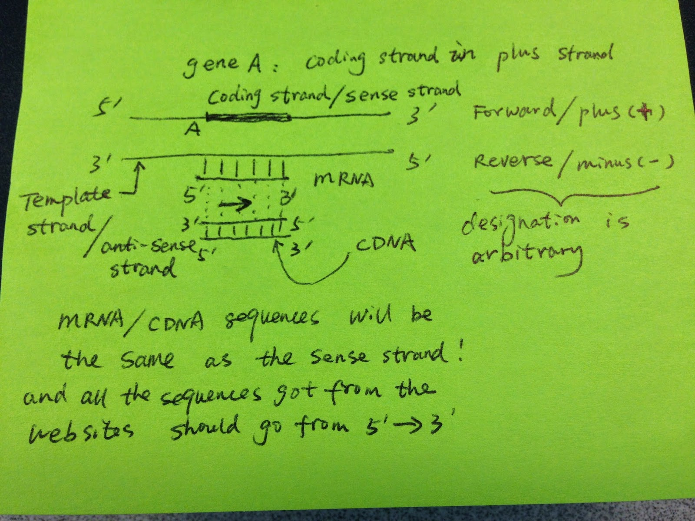

--- 
always_allow_html: true
---


# Introduction to BioConductor

In the ever-evolving field of bioinformatics and computational biology, researchers and scientists rely on specialized tools and packages to analyze and interpret biological data efficiently. [`Bioconductor`](https://bioconductor.org/), a powerful and comprehensive suite of R packages, plays a pivotal role in addressing the unique challenges posed by genomics, transcriptomics, proteomics, and other biological data domains.

This section, "Introduction to Bioconductor in R," will serve as your gateway to this remarkable resource. We will explore the fundamentals of Bioconductor, its significance in the realm of life sciences, and how you can harness its capabilities to unlock valuable insights from complex biological datasets. Whether you are a biologist, bioinformatician, or data scientist, understanding Bioconductor is a crucial step towards advancing your research and data analysis endeavors in the field of biology. Let's embark on this exciting journey into the world of Bioconductor, where data meets discovery.

## Introduction to BiocManager

`BiocManager` is an R package that serves as the primary interface for managing `Bioconductor` packages, which are extensions of R developed specifically for bioinformatics applications. Bioconductor itself is a project that provides tools for the analysis and comprehension of high-throughput genomic data, including but not limited to next-generation sequencing (NGS), microarrays, and proteomics.

### Why Use BiocManager?
The role of BiocManager is ensuring compatibility among Bioconductor packages and between these packages and your version of R. It simplifies the process of installing Bioconductor packages, managing dependencies, and keeping packages up-to-date with the latest releases, thereby fostering a stable and efficient bioinformatics workflow.

### Installing BiocManager
To get started with BiocManager, you first need to install it from CRAN (the Comprehensive R Archive Network), which can be done using the following command in R:


```r
install.packages("BiocManager")
```

Once installed, you can load `BiocManager` just like any other R package:


```r
library(BiocManager)
```

### Installing Bioconductor Packages
With `BiocManager` loaded, installing Bioconductor packages is straightforward. Suppose you want to install the `GenomicRanges` package; you can do so with the following command:


```r
BiocManager::install("GenomicRanges")
```

BiocManager automatically resolves and installs any dependencies, ensuring that all required packages are installed for the `GenomicRanges` package to function correctly.

### Updating Bioconductor Packages

Keeping your Bioconductor packages up-to-date is crucial for accessing the latest features, improvements, and bug fixes. BiocManager facilitates this through the install function, which also checks for and updates any out-of-date packages:


```r
BiocManager::install()
```

Running this command without specifying a package name updates all installed Bioconductor packages to their latest versions.

### Checking for Valid Bioconductor Versions
Compatibility between your R version and Bioconductor packages is vital for smooth bioinformatics analyses. BiocManager offers a function to validate this compatibility:


```r
BiocManager::valid()
```

This command checks that all installed Bioconductor packages are compatible with each other and with your current version of R, providing a report of any inconsistencies.

### Conclusion

`BiocManager` is an indispensable tool for bioinformatics practitioners working with R and `Bioconductor`. It simplifies package management, ensuring that researchers can focus on their analyses without being bogged down by software compatibility issues. By leveraging `BiocManager`, you can maintain a cutting-edge bioinformatics toolkit, fully equipped to tackle the challenges of genomic data analysis.

## Working with Genomic Coordinates and Regions in R

Genomic coordinates are fundamental in the field of genomics. Whether you're dealing with genes, regulatory elements, ChIP-seq peaks, or mutation calling data, they are all represented as genomic coordinates. In R, you can efficiently handle genomic coordinates and regions using the `GenomicRanges` package and related tools. In this guide, we'll explore how to work with genomic ranges, extract relevant information, and perform common operations.

>For a complete overview check docs here: https://bioconductor.org/packages/release/bioc/vignettes/GenomicRanges/inst/doc/GenomicRangesIntroduction.html

### Introduction to GenomicRanges

The `GenomicRanges` package in R provides data structures for storing and manipulating genomic ranges. A genomic range typically includes information about the chromosome (seqname), the start and end positions, and the strand of the sequence.

1. Every gene or regulatory element (promoters, enhancers) in the genome can be represented in chromosome: start-end format.

2. You get a peak file from a ChIP-seq experiment. The peak file is usually represented in a at least 3-column bed format: chromosome, start and end.

3. You get a mutation calling [VCF](https://genome.ucsc.edu/goldenPath/help/vcf.html) file. You will have the chromosome and position of that single variant.

Let's start by creating a simple genomic range:


```r
library(GenomicRanges)

# Create a GenomicRanges object
gr <- GRanges(seqnames = "chr1", 
              ranges = IRanges(1:10, width = 3))

gr
```

```
## GRanges object with 10 ranges and 0 metadata columns:
##        seqnames    ranges strand
##           <Rle> <IRanges>  <Rle>
##    [1]     chr1       1-3      *
##    [2]     chr1       2-4      *
##    [3]     chr1       3-5      *
##    [4]     chr1       4-6      *
##    [5]     chr1       5-7      *
##    [6]     chr1       6-8      *
##    [7]     chr1       7-9      *
##    [8]     chr1      8-10      *
##    [9]     chr1      9-11      *
##   [10]     chr1     10-12      *
##   -------
##   seqinfo: 1 sequence from an unspecified genome; no seqlengths
```

In this example, we've created a GenomicRanges object for chromosome 1 with ten intervals of width 3. We did not specify the strand, so it is `*`. Alternatively, we can 
specify the genomic regions are on the `+` strand.


```r
GRanges(seqnames = "chr1", 
        ranges = IRanges(1:10, width = 3),
        strand = "+")
```

```
## GRanges object with 10 ranges and 0 metadata columns:
##        seqnames    ranges strand
##           <Rle> <IRanges>  <Rle>
##    [1]     chr1       1-3      +
##    [2]     chr1       2-4      +
##    [3]     chr1       3-5      +
##    [4]     chr1       4-6      +
##    [5]     chr1       5-7      +
##    [6]     chr1       6-8      +
##    [7]     chr1       7-9      +
##    [8]     chr1      8-10      +
##    [9]     chr1      9-11      +
##   [10]     chr1     10-12      +
##   -------
##   seqinfo: 1 sequence from an unspecified genome; no seqlengths
```

To understand the standness, read this [blog post](https://crazyhottommy.blogspot.com/2014/08/understanding-forward-strand-and.html) by me.



### Basic Operations with GenomicRanges

These operations are commonly used in genomics data analysis to perform tasks such as calculating the length of genomic features, extracting specific regions of interest, and modifying intervals for downstream analysis. `GenomicRanges` provides a flexible and efficient way to work with genomic intervals, which is essential for tasks like annotation, visualization, and statistical analysis of genomics data.

### Calculating width of Each Genomic Interval

Genomic intervals can represent various features in a genome, such as genes, exons, or regulatory regions. Knowing the width of these intervals is crucial when analyzing genomic data. For example, you might want to calculate the size of a gene or measure the distance between two regulatory elements. The `width()` function helps you obtain this information quickly.


```r
width(gr)
```

```
##  [1] 3 3 3 3 3 3 3 3 3 3
```

This function calculates the width (or length) of each genomic interval in the GenomicRanges object `gr`. In genomics, the width typically represents the number of base pairs or genomic coordinates covered by each interval.

### Start and End Positions
Genomic intervals are defined by their start and end positions along a chromosome. These functions allow you to extract these positions, which can be essential for tasks like determining the transcription start site of a gene or identifying the boundaries of a specific genomic region.

#### Getting start position


```r
start(gr)
```

```
##  [1]  1  2  3  4  5  6  7  8  9 10
```

This function retrieves the starting position (or the leftmost coordinate) of each genomic interval in the `GenomicRanges` object `gr`. It tells you where each interval begins along the genome.

#### Getting end position


```r
end(gr)
```

```
##  [1]  3  4  5  6  7  8  9 10 11 12
```

This function retrieves the ending position (or the rightmost coordinate) of each genomic interval in the `GenomicRanges` object `gr`. It tells you where each interval ends along the genome.

### Strand Information

In genomics, it's important to know the orientation of genomic features. The strand information (`+` or `-`) indicates whether a feature is on the forward (`+`) or reverse (`-`) strand of DNA. This can be crucial for understanding gene transcription direction, reading frames, and other biological processes.


```r
strand(gr)
```

```
## factor-Rle of length 10 with 1 run
##   Lengths: 10
##   Values :  *
## Levels(3): + - *
```

Genomic intervals can be associated with a strand information to represent the directionality of a genomic feature. The strand function retrieves the strand information for each interval. The strand can be either "+" for the forward strand, "-" for the reverse strand, or "*" for strand-agnostic intervals.

### Shifting the Genomic Range
Sometimes, you need to shift genomic intervals to examine neighboring regions. For instance, you might want to find regions that overlap with a gene's promoter, which is typically located upstream of the transcription start site. Shifting intervals allows you to explore nearby genomic areas easily.


```r
gr + 1
```

```
## GRanges object with 10 ranges and 0 metadata columns:
##        seqnames    ranges strand
##           <Rle> <IRanges>  <Rle>
##    [1]     chr1       0-4      *
##    [2]     chr1       1-5      *
##    [3]     chr1       2-6      *
##    [4]     chr1       3-7      *
##    [5]     chr1       4-8      *
##    [6]     chr1       5-9      *
##    [7]     chr1      6-10      *
##    [8]     chr1      7-11      *
##    [9]     chr1      8-12      *
##   [10]     chr1      9-13      *
##   -------
##   seqinfo: 1 sequence from an unspecified genome; no seqlengths
```

This operation demonstrates how you can manipulate the genomic intervals in `gr`. Here, you are adding 1 to each start **AND** end position in the intervals, effectively expanding them by one base left and right .


```r
width(gr+1)
```

```
##  [1] 5 5 5 5 5 5 5 5 5 5
```

### Subsetting
Genomic data can be extensive, and you often need to focus on specific regions of interest. Subsetting helps you extract only the relevant intervals from a larger dataset. This is especially useful when you want to analyze a particular set of genes or genomic regions.


```r
gr[1:2]
```

```
## GRanges object with 2 ranges and 0 metadata columns:
##       seqnames    ranges strand
##          <Rle> <IRanges>  <Rle>
##   [1]     chr1       1-3      *
##   [2]     chr1       2-4      *
##   -------
##   seqinfo: 1 sequence from an unspecified genome; no seqlengths
```

This code subset the GenomicRanges object gr to select the first two intervals. It returns a new GenomicRanges object containing only those intervals.

### Flanking Regions

Imagine you have a specific location in the DNA, and you want to study not only that location but also the regions right before and after it. flank lets you do this. For example, if you're interested in a particular gene, you can use flank to include a bit of the DNA sequence before and after that gene. This helps you see the surrounding context and understand how the gene fits into the bigger picture.


```r
flank(gr, 2)
```

```
## GRanges object with 10 ranges and 0 metadata columns:
##        seqnames    ranges strand
##           <Rle> <IRanges>  <Rle>
##    [1]     chr1      -1-0      *
##    [2]     chr1       0-1      *
##    [3]     chr1       1-2      *
##    [4]     chr1       2-3      *
##    [5]     chr1       3-4      *
##    [6]     chr1       4-5      *
##    [7]     chr1       5-6      *
##    [8]     chr1       6-7      *
##    [9]     chr1       7-8      *
##   [10]     chr1       8-9      *
##   -------
##   seqinfo: 1 sequence from an unspecified genome; no seqlengths
```

`flank` is useful for tasks like expanding genomic regions of interest to capture nearby regions or creating control regions around known features for downstream analysis. It is commonly used in genomics research to study the context around specific genomic locations.

### Resizing
Think of a situation where you have many different pieces of DNA (intervals), and they're all different lengths. Maybe you want to compare them or count something in each of them. It's easier to work with them if they're all the same size. That's what `resize` does. It makes sure that all the pieces of DNA are the same length, so you can compare or analyze them more easily.


```r
resize(gr, 10)
```

```
## GRanges object with 10 ranges and 0 metadata columns:
##        seqnames    ranges strand
##           <Rle> <IRanges>  <Rle>
##    [1]     chr1      1-10      *
##    [2]     chr1      2-11      *
##    [3]     chr1      3-12      *
##    [4]     chr1      4-13      *
##    [5]     chr1      5-14      *
##    [6]     chr1      6-15      *
##    [7]     chr1      7-16      *
##    [8]     chr1      8-17      *
##    [9]     chr1      9-18      *
##   [10]     chr1     10-19      *
##   -------
##   seqinfo: 1 sequence from an unspecified genome; no seqlengths
```

`resize` is used to standardize the length of genomic intervals, which can be useful for comparing or analyzing regions of interest with consistent sizes. It is often applied to ensure that intervals have the same width, making them suitable for various downstream analyses, such as counting reads or comparing features.

### 0 based and 1 based coordinate system

One needs to be aware that there are two genomics coordinate systems: 1 based and 0 based. There is really no mystery between these two. You EITHER count start at 0 OR at 1. However, this can make confusions when analyzing genomic data and one may make mistakes if not keep it in mind. Read https://www.biostars.org/p/84686/.

The reason that why it matters is that python index starts at 0 while R starts at 1.

Make sure you understand how different bioinformatics format use different coordinate
system. 


### Other packages 
In genomics research, we often work with genomic data in various formats such as GTF (Gene Transfer Format) and BED files. To facilitate this, we have a few essential packages at our disposal:

* **AnnotationHub**: This package provides access to a wide range of genome annotations, including GTF files, which are commonly used to represent gene models. These annotations are invaluable for understanding genomic regions and gene structures.

* **GenomicFeatures**: This package is the powerhouse for working with genomic data in R. It provides functions for creating and manipulating genomic feature objects.

* **rtracklayer**: This package specializes in reading and handling genomic data files, including BED and GTF files.

### Accessing Genome Annotations

>You can check AnnotationHub docs here: https://bioconductor.org/packages/release/bioc/vignettes/AnnotationHub/inst/doc/AnnotationHub.html

Genome annotations provide essential information about the location and structure of genes, which is crucial for understanding how genes function and how they are regulated. For example, knowing the coordinates of exons, introns, and promoters allows us to analyze where specific genetic elements are located in the genome.


```r
library(AnnotationHub)

# Initialize the AnnotationHub
ah <- AnnotationHub()

# Query for specific annotations, for example, Homo sapiens (human) in the GRCh37 assembly
annotations <- AnnotationHub::query(ah, c("gtf", "Homo_sapiens", "GRCh37"))

annotations
```

```
## AnnotationHub with 7 records
## # snapshotDate(): 2021-10-20
## # $dataprovider: Ensembl
## # $species: Homo sapiens
## # $rdataclass: GRanges
## # additional mcols(): taxonomyid, genome, description,
## #   coordinate_1_based, maintainer, rdatadateadded, preparerclass, tags,
## #   rdatapath, sourceurl, sourcetype 
## # retrieve records with, e.g., 'object[["AH7558"]]' 
## 
##             title                     
##   AH7558  | Homo_sapiens.GRCh37.70.gtf
##   AH7619  | Homo_sapiens.GRCh37.69.gtf
##   AH7666  | Homo_sapiens.GRCh37.71.gtf
##   AH7726  | Homo_sapiens.GRCh37.72.gtf
##   AH7790  | Homo_sapiens.GRCh37.73.gtf
##   AH8753  | Homo_sapiens.GRCh37.74.gtf
##   AH10684 | Homo_sapiens.GRCh37.75.gtf
```

```r
# Select one of the annotations (e.g., GRCh37.gtf)
GRCh37.gtf <- annotations[['AH8753']]
```

Now, we have a `GenomicRanges` object called `GRCh37.gtf`, which contains genomic features from the GRCh37 assembly of the human genome.

### Understanding Genomic Biotypes

Genes in the genome can have different biotypes, indicating their functional roles. We can filter our genomic features based on biotypes, such as "protein_coding" and "lincRNA."

Filtering genes by biotype helps us focus on specific classes of genes, such as protein-coding genes, which are involved in producing proteins, or long intergenic non-coding RNAs (lincRNAs), which play regulatory roles.


```r
# what are the avaiable biotypes
table(GRCh37.gtf$gene_biotype)
```

```
## 
## 3prime_overlapping_ncrna                antisense                IG_C_gene 
##                       63                    28001                      228 
##          IG_C_pseudogene                IG_D_gene                IG_J_gene 
##                       27                      128                       52 
##          IG_J_pseudogene                IG_V_gene          IG_V_pseudogene 
##                        6                      747                      393 
##                  lincRNA                    miRNA                 misc_RNA 
##                    34236                     3361                     2174 
##                  Mt_rRNA                  Mt_tRNA   polymorphic_pseudogene 
##                        2                       22                     3475 
##     processed_pseudogene     processed_transcript           protein_coding 
##                        1                    12720                  2106659 
##               pseudogene                     rRNA           sense_intronic 
##                    44993                      568                     1662 
##        sense_overlapping                   snoRNA                    snRNA 
##                      841                     1549                     2067 
##                TR_C_gene                TR_D_gene                TR_J_gene 
##                       44                        6                      164 
##          TR_J_pseudogene                TR_V_gene          TR_V_pseudogene 
##                        4                      597                       67
```

```r
# subset 
GRCh37.gtf <- GRCh37.gtf[GRCh37.gtf$gene_biotype %in% c("protein_coding", "lincRNA")]
```

### Creating a Transcript Database (TxDb)

>You can check GenomicFeatures docs here: https://bioconductor.org/packages/release/bioc/vignettes/GenomicFeatures/inst/doc/GenomicFeatures.html

To perform more advanced analyses, we'll create a transcript database (`TxDb`) from our genomic features. A `TxDb` is a structured database of transcript information, allowing us to efficiently query and retrieve specific genomic elements for analysis.


```r
library(GenomicFeatures)

# Create a TxDb from the filtered genomic features
GRCh37.txdb <- makeTxDbFromGRanges(GRCh37.gtf)

GRCh37.txdb
```

```
## TxDb object:
## # Db type: TxDb
## # Supporting package: GenomicFeatures
## # Genome: GRCh37
## # Nb of transcripts: 171683
## # Db created by: GenomicFeatures package from Bioconductor
## # Creation time: 2024-06-14 23:15:06 -0400 (Fri, 14 Jun 2024)
## # GenomicFeatures version at creation time: 1.46.5
## # RSQLite version at creation time: 2.3.1
## # DBSCHEMAVERSION: 1.2
```

### Extracting Exons, Introns, and Intergenic Regions
Now that we have our TxDb, we can extract various genomic elements for further analysis.

#### Exons by Gene

Analyzing exons by gene is essential for understanding the coding regions of genes and their splicing patterns. Let's retrieve exons grouped by genes.


```r
exonsByGene <- exonsBy(GRCh37.txdb, "gene") 

# GRangesList object, a list of GRanges 
exonsByGene
```

```
## GRangesList object of length 30150:
## $ENSG00000000003
## GRanges object with 17 ranges and 2 metadata columns:
##        seqnames            ranges strand |   exon_id       exon_name
##           <Rle>         <IRanges>  <Rle> | <integer>     <character>
##    [1]        X 99883667-99884983      - |    591006 ENSE00001459322
##    [2]        X 99885756-99885863      - |    591007 ENSE00000868868
##    [3]        X 99887482-99887565      - |    591008 ENSE00000401072
##    [4]        X 99887538-99887565      - |    591009 ENSE00001849132
##    [5]        X 99888402-99888536      - |    591010 ENSE00003554016
##    ...      ...               ...    ... .       ...             ...
##   [13]        X 99890555-99890743      - |    591018 ENSE00003662440
##   [14]        X 99891188-99891686      - |    591019 ENSE00001886883
##   [15]        X 99891605-99891803      - |    591020 ENSE00001855382
##   [16]        X 99891790-99892101      - |    591021 ENSE00001863395
##   [17]        X 99894942-99894988      - |    591022 ENSE00001828996
##   -------
##   seqinfo: 265 sequences (1 circular) from GRCh37 genome
## 
## ...
## <30149 more elements>
```

### Merging All Exons

Merging exons (exons can overlap with each other) helps simplify analysis, such as quantifying the overall exonic content of genes. To get a single range representing all exons, we can reduce them.


```r
allExons <- exons(GRCh37.txdb) %>% 
  GenomicRanges::reduce()

allExons
```

```
## GRanges object with 279054 ranges and 0 metadata columns:
##                 seqnames              ranges strand
##                    <Rle>           <IRanges>  <Rle>
##        [1]             1         29554-30039      +
##        [2]             1         30267-30667      +
##        [3]             1         30976-31109      +
##        [4]             1         69091-70008      +
##        [5]             1       160446-160690      +
##        ...           ...                 ...    ...
##   [279050] HSCHR7_1_CTG6 141373867-141374020      -
##   [279051] HSCHR7_1_CTG6 141385280-141385438      -
##   [279052] HSCHR7_1_CTG6 141386361-141386460      -
##   [279053] HSCHR7_1_CTG6 141401359-141401418      -
##   [279054] HSCHR7_1_CTG6 141401689-141401956      -
##   -------
##   seqinfo: 265 sequences (1 circular) from GRCh37 genome
```

### Introns

Identifying introns is crucial for studying gene splicing and understanding the non-coding regions within genes. To find intronic regions, we can use the `intronsByTranscript` function.


```r
introns <- intronsByTranscript(GRCh37.txdb) %>% 
  unlist() %>%
  GenomicRanges::reduce()

introns
```

```
## GRanges object with 185379 ranges and 0 metadata columns:
##                 seqnames              ranges strand
##                    <Rle>           <IRanges>  <Rle>
##        [1]             1         30040-30563      +
##        [2]             1         30668-30975      +
##        [3]             1       160691-161313      +
##        [4]             1       317782-334128      +
##        [5]             1       334298-439466      +
##        ...           ...                 ...    ...
##   [185375] HSCHR7_1_CTG6 141365119-141366086      -
##   [185376] HSCHR7_1_CTG6 141366187-141373866      -
##   [185377] HSCHR7_1_CTG6 141374021-141385279      -
##   [185378] HSCHR7_1_CTG6 141385439-141386360      -
##   [185379] HSCHR7_1_CTG6 141386461-141401688      -
##   -------
##   seqinfo: 265 sequences (1 circular) from GRCh37 genome
```

### Getting All Genes
Having a complete list of genes is essential for various genomics analyses, including differential gene expression studies. Obtaining all genes is straightforward.


```r
allGenes <- genes(GRCh37.txdb)

allGenes
```

```
## GRanges object with 30150 ranges and 1 metadata column:
##                                seqnames              ranges strand |
##                                   <Rle>           <IRanges>  <Rle> |
##   ENSG00000000003                     X   99883667-99894988      - |
##   ENSG00000000005                     X   99839799-99854882      + |
##   ENSG00000000419                    20   49551404-49575092      - |
##   ENSG00000000457                     1 169818772-169863408      - |
##   ENSG00000000460                     1 169631245-169823221      + |
##               ...                   ...                 ...    ... .
##   ENSG00000273488                     3 100080031-100080481      + |
##   ENSG00000273490 HSCHR19LRC_LRC_J_CTG1   54693789-54697585      + |
##   ENSG00000273491          HG1308_PATCH 130600118-130603315      + |
##   ENSG00000273492                    21   27543189-27589700      + |
##   ENSG00000273493                     3   58315692-58315845      + |
##                           gene_id
##                       <character>
##   ENSG00000000003 ENSG00000000003
##   ENSG00000000005 ENSG00000000005
##   ENSG00000000419 ENSG00000000419
##   ENSG00000000457 ENSG00000000457
##   ENSG00000000460 ENSG00000000460
##               ...             ...
##   ENSG00000273488 ENSG00000273488
##   ENSG00000273490 ENSG00000273490
##   ENSG00000273491 ENSG00000273491
##   ENSG00000273492 ENSG00000273492
##   ENSG00000273493 ENSG00000273493
##   -------
##   seqinfo: 265 sequences (1 circular) from GRCh37 genome
```

### Promoters
Promoter regions are critical for understanding gene regulation and identifying potential binding sites for transcription factors. To find promoter regions, typically defined as the region from `-1kb` to `+500bp` around the transcription start site (`TSS`), we can use the promoters function.


```r
promoterRegions <- promoters(genes(GRCh37.txdb), 
                             upstream = 1000, 
                             downstream = 500)

promoterRegions
```

```
## GRanges object with 30150 ranges and 1 metadata column:
##                                seqnames              ranges strand |
##                                   <Rle>           <IRanges>  <Rle> |
##   ENSG00000000003                     X   99894489-99895988      - |
##   ENSG00000000005                     X   99838799-99840298      + |
##   ENSG00000000419                    20   49574593-49576092      - |
##   ENSG00000000457                     1 169862909-169864408      - |
##   ENSG00000000460                     1 169630245-169631744      + |
##               ...                   ...                 ...    ... .
##   ENSG00000273488                     3 100079031-100080530      + |
##   ENSG00000273490 HSCHR19LRC_LRC_J_CTG1   54692789-54694288      + |
##   ENSG00000273491          HG1308_PATCH 130599118-130600617      + |
##   ENSG00000273492                    21   27542189-27543688      + |
##   ENSG00000273493                     3   58314692-58316191      + |
##                           gene_id
##                       <character>
##   ENSG00000000003 ENSG00000000003
##   ENSG00000000005 ENSG00000000005
##   ENSG00000000419 ENSG00000000419
##   ENSG00000000457 ENSG00000000457
##   ENSG00000000460 ENSG00000000460
##               ...             ...
##   ENSG00000273488 ENSG00000273488
##   ENSG00000273490 ENSG00000273490
##   ENSG00000273491 ENSG00000273491
##   ENSG00000273492 ENSG00000273492
##   ENSG00000273493 ENSG00000273493
##   -------
##   seqinfo: 265 sequences (1 circular) from GRCh37 genome
```

### Full Genome
Having the entire genome as a single object is useful for genome-wide analyses and visualizations. To represent the entire genome as a GRanges object:


```r
chrom_granges <- as(seqinfo(GRCh37.txdb), "GRanges")
chrom_granges
```

```
## GRanges object with 265 ranges and 0 metadata columns:
##                        seqnames      ranges strand
##                           <Rle>   <IRanges>  <Rle>
##                1              1 1-249250621      *
##                2              2 1-243199373      *
##                3              3 1-198022430      *
##                4              4 1-191154276      *
##                5              5 1-180915260      *
##              ...            ...         ...    ...
##    HSCHR7_1_CTG6  HSCHR7_1_CTG6 1-159144671      *
##    HSCHR9_1_CTG1  HSCHR9_1_CTG1 1-141228243      *
##   HSCHR9_1_CTG35 HSCHR9_1_CTG35 1-141221627      *
##   HSCHR9_2_CTG35 HSCHR9_2_CTG35 1-141219511      *
##   HSCHR9_3_CTG35 HSCHR9_3_CTG35 1-141224529      *
##   -------
##   seqinfo: 265 sequences (1 circular) from GRCh37 genome
```

### Full Transcriptome

Merging overlapping transcripts simplifies transcript-level analyses and helps identify the full extent of genes. To represent the entire transcriptome, we can merge overlapping features.


```r
collapsed_tx <- GenomicRanges::reduce(transcripts(GRCh37.txdb))

# Set strand information to '*'
strand(collapsed_tx) <- "*"
```

### Intergenic Regions
Intergenic regions often contain important regulatory elements, and identifying them can provide insights into gene regulation. To find regions that are not within any annotated genes, we can use the setdiff function.


```r
intergenicRegions <- GenomicRanges::setdiff(chrom_granges, collapsed_tx)

intergenicRegions 
```

```
## GRanges object with 24100 ranges and 0 metadata columns:
##                 seqnames              ranges strand
##                    <Rle>           <IRanges>  <Rle>
##       [1]              1             1-29553      *
##       [2]              1         31110-34553      *
##       [3]              1         36082-69090      *
##       [4]              1         70009-89294      *
##       [5]              1       133567-134900      *
##       ...            ...                 ...    ...
##   [24096]  HSCHR7_1_CTG6 141493731-159144671      *
##   [24097]  HSCHR9_1_CTG1         1-141228243      *
##   [24098] HSCHR9_1_CTG35         1-141221627      *
##   [24099] HSCHR9_2_CTG35         1-141219511      *
##   [24100] HSCHR9_3_CTG35         1-141224529      *
##   -------
##   seqinfo: 265 sequences (1 circular) from GRCh37 genome
```

### Exploring Untranslated Regions (UTRs)

UTRs play crucial roles in post-transcriptional regulation, and analyzing them can provide insights into gene regulation mechanisms. If you're interested in untranslated regions (UTRs) of genes, you can use functions like `fiveUTRsByTranscript` and `threeUTRsByTranscript` provided by the `GenomicFeatures` package.


```r
# To get 5' UTRs by transcript
fiveUTRs <- fiveUTRsByTranscript(GRCh37.txdb)

# To get 3' UTRs by transcript
threeUTRs <- threeUTRsByTranscript(GRCh37.txdb)
```


### Conclusion
In this lesson, we've explored various genomic features and their manipulation using R packages such as `GenomicFeatures`, `AnnotationHub`, and `rtracklayer`. These tools are invaluable for genomics research, allowing you to analyze and interpret genomic data effectively. Whether you're working with ChIP-seq, RNA-seq, or genome annotation, understanding genomic features is essential to uncover the secrets of the genome.

## Exploring CpG Islands and Shores in Genomic Data

In this lesson, we will delve into the fascinating world of genomics and learn how to manipulate and analyze genomic data using the powerful tools available in the Bioconductor package. We will specifically focus on CpG islands and their shores, exploring how to extract and analyze these critical genomic features.

### Introduction to CpG Islands

CpG islands are regions of DNA that contain a high frequency of cytosine-guanine (CpG) dinucleotide pairs. These regions are essential for regulating gene expression and have critical roles in various biological processes, including DNA methylation and epigenetic modifications. Analyzing CpG islands can provide valuable insights into gene regulation and genome function.

In this lesson, we will use Bioconductor to fetch CpG island coordinates from the UCSC Genome Browser, extract CpG shores, and perform various genomic operations.

### Fetching CpG Island Coordinates

CpG islands are critical genomic regions involved in gene regulation and epigenetic modifications. Accessing their coordinates is the first step in understanding their distribution across the genome and their potential functional roles.

Researchers often use CpG island coordinates to investigate gene promoters, identify potential regulatory elements, and study the epigenetic regulation of specific genes in various diseases, including cancer.

To begin, we will retrieve the CpG island coordinates from the UCSC Genome Browser using the `AnnotationHub` package. CpG islands are available for various species, and in this example, we are using Homo sapiens (human) data.


```r
# Fetching CpG island coordinates from UCSC Genome Browser
library(AnnotationHub)
ah <- AnnotationHub()

AnnotationHub::query(ah, c("cpg", "UCSC"))
```

```
## AnnotationHub with 59 records
## # snapshotDate(): 2021-10-20
## # $dataprovider: UCSC
## # $species: Homo sapiens, Bos taurus, Pan troglodytes, Felis catus, Rattus n...
## # $rdataclass: GRanges
## # additional mcols(): taxonomyid, genome, description,
## #   coordinate_1_based, maintainer, rdatadateadded, preparerclass, tags,
## #   rdatapath, sourceurl, sourcetype 
## # retrieve records with, e.g., 'object[["AH5086"]]' 
## 
##            title      
##   AH5086 | CpG Islands
##   AH5096 | Evo Cpg    
##   AH5204 | CpG Islands
##   AH5227 | Evo Cpg    
##   AH5344 | CpG Islands
##   ...      ...        
##   AH7109 | CpG Islands
##   AH7116 | CpG Islands
##   AH7135 | CpG Islands
##   AH7168 | CpG Islands
##   AH7203 | CpG Islands
```

use the first entry


```r
cgi <- ah[["AH5086"]]
cgi
```

```
## GRanges object with 28691 ranges and 1 metadata column:
##                        seqnames        ranges strand |        name
##                           <Rle>     <IRanges>  <Rle> | <character>
##       [1]                  chr1   28736-29810      * |    CpG:_116
##       [2]                  chr1 135125-135563      * |     CpG:_30
##       [3]                  chr1 327791-328229      * |     CpG:_29
##       [4]                  chr1 437152-438164      * |     CpG:_84
##       [5]                  chr1 449274-450544      * |     CpG:_99
##       ...                   ...           ...    ... .         ...
##   [28687]  chr9_gl000201_random   15651-15909      * |     CpG:_30
##   [28688]  chr9_gl000201_random   26397-26873      * |     CpG:_43
##   [28689] chr11_gl000202_random   16284-16540      * |     CpG:_23
##   [28690] chr17_gl000204_random   54686-57368      * |    CpG:_228
##   [28691] chr17_gl000205_random 117501-117801      * |     CpG:_23
##   -------
##   seqinfo: 93 sequences (1 circular) from hg19 genome
```

We now have the CpG island coordinates stored in the `cgi` GenomicRanges object.

### Defining CpG Shores
CpG shores are regions located near CpG islands, and they play a crucial role in gene regulation. Defining these shores allows us to explore the regulatory landscape around CpG islands and identify regions of potential interest.

By analyzing CpG shores, researchers can gain insights into how epigenetic modifications in these regions affect gene expression. This knowledge is vital for understanding diseases that involve aberrant gene regulation.

CpG shores are regions located 2000 base pairs upstream and 2000 base pairs downstream of CpG islands. We can use Bioconductor to extract these shores.


```r
# Extract the shore defined by 2000 bp upstream of CpG islands
shore1 <- trim(flank(cgi, width = 2000, start = TRUE))

# Extract the shore defined by 2000 bp downstream of CpG islands
shore2 <- trim(flank(cgi, width = 2000, start = FALSE))
```

`trim` will trim off the bases that exceed the chromosome ends since we extend 2000 bp
upstream and downstream of the CpG sites. Some CpG sites can be very close to the ends of the chromosomes.

### Combining and Analyzing CpG Shores
Combining the upstream and downstream shores and analyzing their overlap with CpG islands helps identify regions with unique genomic characteristics. This step allows researchers to pinpoint areas of interest for further investigation.

Researchers often use this analysis to identify differentially methylated regions (DMRs) associated with specific diseases or conditions. DMRs can serve as biomarkers or potential therapeutic targets.

Now, let's perform some genomic operations on these CpG shores. We'll combine the upstream and downstream shores and identify the features that are present in shores but not in CpG islands (i.e., shores not overlapping with islands).


```r
# Combine the shores where they overlap
shore1_2 <- GenomicRanges::reduce(c(shore1, shore2))

# Extract the features (ranges) that are present in shores only and not in CpG islands
cpgi_shores <- GenomicRanges::setdiff(shore1_2, cgi)
cpgi_shores$name <- paste("shore", 1:length(cpgi_shores), sep = "_")

cpgi_shores
```

```
## GRanges object with 51914 ranges and 1 metadata column:
##                 seqnames        ranges strand |        name
##                    <Rle>     <IRanges>  <Rle> | <character>
##       [1]           chr1   26736-28735      * |     shore_1
##       [2]           chr1   29811-31810      * |     shore_2
##       [3]           chr1 133125-135124      * |     shore_3
##       [4]           chr1 135564-137563      * |     shore_4
##       [5]           chr1 325791-327790      * |     shore_5
##       ...            ...           ...    ... .         ...
##   [51910] chrUn_gl000241   37274-39273      * | shore_51910
##   [51911] chrUn_gl000242   10843-12842      * | shore_51911
##   [51912] chrUn_gl000242   13100-15099      * | shore_51912
##   [51913] chrUn_gl000243   28420-30419      * | shore_51913
##   [51914] chrUn_gl000243   30716-32715      * | shore_51914
##   -------
##   seqinfo: 93 sequences (1 circular) from hg19 genome
```

Now, `cpgi_shores` contains the `GenomicRanges` object representing CpG shores, and each shore is labeled with a unique name.

### Conclusion

In this lesson, we've explored the powerful capabilities of the Bioconductor package for working with genomic data. We've fetched CpG island coordinates, extracted CpG shores, and performed genomic operations to identify regions of interest. These techniques are fundamental for researchers and bioinformaticians working with genomics data to unravel the mysteries of the genome.

If you're interested in diving deeper into genomics analysis, consider exploring the tutorials provided by Bioconductor on their website. They offer a wealth of knowledge and resources to help you harness the full potential of genomic data analysis.

## Real-World Applications: ChIP-seq

Understanding genomic features is crucial for various genomics tasks, including:

* ChIP-seq Analysis: You can use these genomic ranges to determine how many ChIP-seq peaks fall into promoters, exons, introns, or intergenic regions, helping you interpret the functional significance of your data.

* RNA-seq Analysis: Identifying which exons are covered by RNA-seq reads and counting reads in each exon allows you to quantify gene expression accurately.

* Functional Genomics: Investigating the genomic context of genes helps in understanding their regulatory elements, including promoters and enhancers.

* Genome Annotation: These tools are essential for creating comprehensive annotations of genomes, enabling researchers to understand gene structures and functions.

#### read in peak file

### Identify promoters that overlap with the peaks

### use the ChIPseeker package

## Analyzing and Visualizing Genomic Data

In this lesson, we will explore several essential tools and techniques used in genomics research, including `GEOquery` for data retrieval, gene ID conversion using `biomaRt` and `org.Hs.eg.db`, and visualization with `ComplexHeatmap`. These tools are commonly used in genomics to analyze and visualize gene expression data. We will briefly mention `DESeq2` for differential expression analysis.

### DESeq2

>You can explore docs here: https://bioconductor.org/packages/release/bioc/vignettes/DESeq2/inst/doc/DESeq2.html

`DESeq2` is a powerful Bioconductor package used for differential expression analysis. It is particularly helpful when working with RNA-seq data. This tool helps identify genes that are differentially expressed under different conditions. The tutorial on Bioconductor is very comprehensive and I will leave the students to read by themselves. We will use it in our final project.

### GEOquery

>You can explore docs here: https://bioconductor.org/packages/release/bioc/vignettes/GEOquery/inst/doc/GEOquery.html

`GEOquery` is a valuable R package for downloading and importing gene expression data directly from public repositories such as the Gene Expression Omnibus (GEO).


```r
# Loading the GEOquery library
library(GEOquery)

# Downloading and importing data from GEO
GSE197576 <- getGEO(GEO = "GSE197576", GSEMatrix = TRUE, destdir = "~/Downloads")

GSE197576
```

```
## $GSE197576_series_matrix.txt.gz
## ExpressionSet (storageMode: lockedEnvironment)
## assayData: 0 features, 12 samples 
##   element names: exprs 
## protocolData: none
## phenoData
##   sampleNames: GSM5920759 GSM5920760 ... GSM5920770 (12 total)
##   varLabels: title geo_accession ... tissue:ch1 (43 total)
##   varMetadata: labelDescription
## featureData: none
## experimentData: use 'experimentData(object)'
##   pubMedIds: 35487218 
## Annotation: GPL18573
```

```r
# Accessing expression data
exprs(GSE197576$GSE197576_series_matrix.txt.gz)
```

```
##      GSM5920759 GSM5920760 GSM5920761 GSM5920762 GSM5920763 GSM5920764
##      GSM5920765 GSM5920766 GSM5920767 GSM5920768 GSM5920769 GSM5920770
```
In this example, it returns an empty `ExpressionSet` object. We used `exprs` to return
the matrix but it has no features. You may try a different GEO accession.

`GEOquery` simplifies the process of retrieving gene expression data from public repositories like GEO. Researchers use it to access valuable datasets for their studies.

### Converting Gene IDs

In genomics research, integrating data from various sources often involves working with different gene identifier systems. Converting gene IDs is a crucial step to harmonize and standardize data for downstream analysis. Here, we discuss two commonly used methods, biomaRt and org.Hs.eg.db, and explain why these tasks are essential in a researcher's environment.

#### Using biomaRt

>You can explore docs here: https://bioconductor.org/packages/release/bioc/vignettes/biomaRt/inst/doc/accessing_ensembl.html

Converting gene IDs using `biomaRt` is essential for mapping Ensembl gene IDs to more recognizable gene symbols and associated information.


```r
library(biomaRt)
ensembl <- useMart("ensembl", dataset = "hsapiens_gene_ensembl")

gene_info <- getBM(attributes = c("ensembl_gene_id", "gene_biotype",
                                  "chromosome_name", "hgnc_symbol"),
                   filters = "ensembl_gene_id", 
                   values = c("ENSG00000164307"), 
                   mart = ensembl)
print(gene_info)
```

```
##   ensembl_gene_id   gene_biotype chromosome_name hgnc_symbol
## 1 ENSG00000164307 protein_coding               5       ERAP1
```

#### Using org.Hs.eg.db

>You can explore docs here: https://bioconductor.org/packages/release/data/annotation/html/org.Hs.eg.db.html

Mapping ENTREZIDs to official gene symbols using `org.Hs.eg.db` is crucial for researchers working with gene expression data.

Why Researchers Do This:

* Consistency in Annotation: ENTREZIDs are a widely accepted and consistent gene identifier system. Mapping other identifiers to ENTREZIDs ensures that gene information is uniform and can be compared across different studies.

* Integration with Other Databases: Many databases and tools use ENTREZIDs (e.g., the KEGG pathway database) as a standard for gene annotation. Converting identifiers to ENTREZIDs facilitates seamless integration with these resources.

* Gene Symbol Mapping: Once converted to ENTREZIDs, researchers can efficiently map these to official gene symbols, providing meaningful and interpretable gene names for further analysis and reporting.


```r
# Loading the org.Hs.eg.db library
library(org.Hs.eg.db)
library(TxDb.Hsapiens.UCSC.hg19.knownGene)

# Accessing gene information
hg19_genes <- genes(TxDb.Hsapiens.UCSC.hg19.knownGene)

# Mapping ENTREZIDs to official gene symbols
map <- AnnotationDbi::select(org.Hs.eg.db, keys = hg19_genes$gene_id, 
                            columns = "SYMBOL", keytype = "ENTREZID")

head(map, n = 10)
```

```
##     ENTREZID     SYMBOL
## 1          1       A1BG
## 2         10       NAT2
## 3        100        ADA
## 4       1000       CDH2
## 5      10000       AKT3
## 6  100008586    GAGE12F
## 7  100009676 ZBTB11-AS1
## 8      10001       MED6
## 9      10002      NR2E3
## 10     10003    NAALAD2
```

In genomics research, this type of mapping is essential when you have data that uses ENTREZIDs, and you want to work with more interpretable gene symbols for analysis or visualization. It allows you to associate gene identifiers with their official names, making the data more understandable and facilitating downstream analyses and interpretation.

### ComplexHeatmap

>You can explore docs here: https://bioconductor.org/packages/release/bioc/html/ComplexHeatmap.html

Visualizing gene expression data is a crucial step in genomics research because it helps researchers gain insights into how genes are expressed under different conditions or in various samples. `ComplexHeatmap` is a versatile R package that serves as an artistic palette for creating intricate and informative heatmaps. Here's why visualizing gene expression data using `ComplexHeatmap` is essential:

1. Identify Expression Patterns: Gene expression data often involve a large number of genes and samples. Heatmaps allow you to quickly identify patterns in gene expression, such as clusters of genes with similar expression profiles. This can reveal groups of genes that are co-regulated or have similar functions.

2. Visualize Differential Expression: When comparing gene expression between different conditions or treatments (e.g., healthy vs. diseased tissue), heatmaps can highlight genes that are significantly upregulated or downregulated. This visualization aids in pinpointing genes of interest for further investigation.

3. Sample Relationships: Heatmaps also help in understanding the relationships between samples. For example, you can identify outliers, detect batch effects, or confirm the consistency of replicates by examining how samples cluster based on their expression profiles.

4. Publication-Ready Figures: ComplexHeatmap generates high-quality heatmap images that are suitable for inclusion in research papers and presentations. It provides the ability to export heatmaps in various formats (e.g., PDF, PNG) for easy sharing and publication.

5. Interactive Exploration: In addition to static heatmaps, [InteractiveComplexHeatmap](https://www.bioconductor.org/packages/release/bioc/html/InteractiveComplexHeatmap.html) from the same author supports interactive exploration. You can zoom in on specific sections of the heatmap, hover over cells to view gene names or expression values, and provide interactive tools for your audience to explore the data themselves.

Le's go through an example by simulating a count matrix from a gene expression experiment:


```r
library(ComplexHeatmap)

set.seed(123)

# Parameters for the negative binomial distribution
size_parameter <- 3 # Size parameter (dispersion)
mean_parameter <- 10  # Mean parameter

# Number of genes (rows) and samples (columns)
num_genes <- 10
num_samples <- 20

# Simulate a count table with negative binomial distribution
expr_data <- matrix(rnbinom(num_genes * num_samples, 
                            size = size_parameter, 
                            mu = mean_parameter), 
                    nrow = num_genes, 
                    ncol = num_samples)
```

check the quantiles of the data. This is important because we need to know the
ranges of the data so we can map the values to color.


```r
quantile(expr_data, c(0, 0.2, 0.5, 0.8, 1))
```

```
##   0%  20%  50%  80% 100% 
##    0    4    9   14   31
```

Map the color to the values


```r
color_map<- circlize::colorRamp2(c(0, 9, 25), c("blue", "white", "red"))
```

Any value beyond 25 will be mapped to the same intensity of redness.

Make the heatmap:

```r
Heatmap(expr_data, col=color_map, name = "gene_expression")
```

<!-- --> 

By default, it will cluster both the rows and columns.

Let’s see how it looks if we change the color mapping


```r
color_map2<- circlize::colorRamp2(c(0, 25, 31), c("blue", "white", "red"))
Heatmap(expr_data, col=color_map2, name = "gene_expression")
```

<!-- --> 
Now, we see very fewer red cells, but the underlying data is the same! How you map the values to color makes a big difference on how the heatmap look. Note the legend reflects our changes in the color mapping.

We will use it again in the next section.

### Conclusion
This lesson has provided an overview of essential tools and techniques used in genomics research. We have explored the following key topics:

* `DESeq2`: We learned about DESeq2 for differential expression analysis, which is crucial for identifying genes that are differentially expressed under different conditions, such as in disease versus healthy states.

* `GEOquery`: We discussed how to retrieve gene expression data from public repositories like GEO using the GEOquery package. Accessing publicly available datasets is a valuable resource for genomics research.

* Gene ID Conversion: We covered two methods, `biomaRt` and `org.Hs.eg.db`, for converting gene IDs. This step is essential for integrating data from various sources and ensuring consistent gene identification.

* `ComplexHeatmap`: We explored the `ComplexHeatmap` package, a powerful tool for visualizing gene expression data through heatmaps. Visualization aids in identifying patterns and trends in large genomic datasets.

These tools and techniques are indispensable for genomics researchers, enabling them to analyze, integrate, and visualize genomic data effectively. By mastering these skills, researchers can gain valuable insights into gene expression patterns, biological processes, and potential biomarkers for various conditions and diseases.

## Real-World Example - TCGA Analysis

In this lesson, we will explore a real-world example of analyzing cancer genomics data from [The Cancer Genome Atlas (TCGA)](https://www.cancer.gov/ccg/research/genome-sequencing/tcga) project. TCGA is one of the largest and most renowned cancer sequencing projects, providing access to a wealth of genomic data from various cancer types. We will use R and several bioinformatics packages to download raw RNA-seq counts for 33 different cancer types, convert them to TPM (transcripts per million), and visualize the data in a heatmap.

### Introduction to TCGA

The Cancer Genome Atlas (TCGA) project is a groundbreaking initiative that has sequenced approximately 10,000 treatment-naive tumors across 33 different cancer types. It has generated a diverse range of data types, including whole-exome sequencing, whole-genome sequencing, copy-number variation analysis (SNP arrays), bulk RNA-seq, protein expression data (Reverse-Phase Protein Array), and DNA methylation profiles. TCGA has significantly contributed to our understanding of cancer biology and has opened up new avenues for cancer research.

### Why Analyze TCGA Data?
Analyzing TCGA data can provide valuable insights into the molecular basis of cancer. Researchers can use this data to identify potential biomarkers, discover novel therapeutic targets, and gain a deeper understanding of the genetic alterations associated with specific cancer types. Moreover, TCGA data is freely accessible, making it a valuable resource for the scientific community.

### Getting Started

We will use the [`recount3`](https://bioconductor.org/packages/release/bioc/html/recount3.html) package to access TCGA data. `recount3` is an online resource that provides RNA-seq gene, exon, and exon-exon junction counts, along with coverage bigWig files for thousands of studies in both human and mouse. It represents the third generation of the [ReCount](https://rna.recount.bio/) project.

### Step 1: Install and Load Required Packages


```r
# Install the recount3 package if not already installed
# BiocManager::install("recount3")

# Load necessary libraries
library(recount3)
library(purrr)
library(dplyr)
library(ggplot2)
```

* recount3: This package is crucial for accessing TCGA data. It allows us to retrieve RNA-seq gene counts and other genomic information from the TCGA project.

* purrr: The purrr package is used for functional programming in R. We use it to apply functions to elements of a list, which is particularly useful for handling multiple datasets or projects.

* dplyr: dplyr is a powerful package for data manipulation. It helps us filter and process data efficiently, making it easier to work with large datasets like TCGA.

* ggplot2: For data visualization, we use the ggplot2 package. It allows us to create high-quality graphs and plots, which can be essential for presenting our findings.

By loading these packages, we ensure that we have access to the tools needed to analyze and visualize TCGA data effectively.

### Step 2: Retrieve TCGA Project Information
Let's fetch information about available TCGA projects. TCGA encompasses a wide range of cancer types and studies. We filter the projects to focus only on those that originate from TCGA data sources.


```r
# Get information about available TCGA projects
human_projects <- available_projects()

# Filter projects that are from TCGA data sources
tcga_info <- subset(
    human_projects,
    file_source == "tcga" & project_type == "data_sources"
)


head(tcga_info)
```

```
##      project organism file_source      project_home project_type n_samples
## 8710     ACC    human        tcga data_sources/tcga data_sources        79
## 8711    BLCA    human        tcga data_sources/tcga data_sources       433
## 8712    BRCA    human        tcga data_sources/tcga data_sources      1256
## 8713    CESC    human        tcga data_sources/tcga data_sources       309
## 8714    CHOL    human        tcga data_sources/tcga data_sources        45
## 8715    COAD    human        tcga data_sources/tcga data_sources       546
```

This step is essential to identify the relevant projects and data sources within TCGA. By narrowing our focus to TCGA data sources, we ensure that we are working with the specific datasets we need for our analysis.


### Step 3: Create a RangedSummarizedExperiment Object

Now that we have identified the TCGA data sources of interest, we proceed to create a data structure called a [`RangedSummarizedExperiment`](https://www.bioconductor.org/packages/devel/bioc/vignettes/SummarizedExperiment/inst/doc/SummarizedExperiment.html) object. This object allows us to efficiently organize and work with genomic data, including RNA-seq counts.


```r
# Create a list of RangedSummarizedExperiment objects
proj_info <- purrr::map(seq(nrow(tcga_info)), ~tcga_info[.x, ])
rse_tcga <- purrr::map(proj_info, ~create_rse(.x))
```

Here, we create a list of `RangedSummarizedExperiment` objects, one for each project within TCGA. These objects will serve as containers for the gene expression data, making it easier to manipulate and analyze the information.

The first time you use `recount3`, it will ask:

>/Users/tommytang/Library/Caches/org.R-project.R/R/recount3 does not exist, create directory? (yes/no): yes

`rse_tcga` is a list of `RangedSummarizedExperimentobject`, let’s take a look at one of them. `RangedSummarizedExperiment` is a child of the `SummarizedExperiment`.


```r
rse_tcga[[1]]
```

```
## class: RangedSummarizedExperiment 
## dim: 63856 79 
## metadata(8): time_created recount3_version ... annotation recount3_url
## assays(1): raw_counts
## rownames(63856): ENSG00000278704.1 ENSG00000277400.1 ...
##   ENSG00000182484.15_PAR_Y ENSG00000227159.8_PAR_Y
## rowData names(10): source type ... havana_gene tag
## colnames(79): 43e715bf-28d9-4b5e-b762-8cd1b69a430e
##   1a5db9fc-2abd-4e1b-b5ef-b1cf5e5f3872 ...
##   a08b85ea-d1e7-4b77-8dec-36294305b9f7
##   aa2d53e5-d389-4332-9dd5-a736052e48f8
## colData names(937): rail_id external_id ... recount_seq_qc.errq
##   BigWigURL
```

### Step 4: Explore TCGA Data

With our `RangedSummarizedExperiment` objects in place, we can now explore the TCGA data in more detail. Let's look at three aspects: gene counts, gene information, and metadata.

#### Gene Counts
We start by examining the raw RNA-seq counts, which represent how many times each gene was sequenced in each sample.


```r
# Access raw gene counts from one RangedSummarizedExperiment object
raw_counts <- rse_tcga[[1]]@assays@data$raw_counts[1:5, 1:5]

raw_counts
```

```
##                   43e715bf-28d9-4b5e-b762-8cd1b69a430e
## ENSG00000278704.1                                    0
## ENSG00000277400.1                                    0
## ENSG00000274847.1                                    0
## ENSG00000277428.1                                    0
## ENSG00000276256.1                                    0
##                   1a5db9fc-2abd-4e1b-b5ef-b1cf5e5f3872
## ENSG00000278704.1                                    0
## ENSG00000277400.1                                    0
## ENSG00000274847.1                                    0
## ENSG00000277428.1                                    0
## ENSG00000276256.1                                    0
##                   93b382e4-9c9a-43f5-bd3b-502cc260b886
## ENSG00000278704.1                                    0
## ENSG00000277400.1                                    0
## ENSG00000274847.1                                    0
## ENSG00000277428.1                                    0
## ENSG00000276256.1                                    0
##                   1f39dadd-3655-474e-ba4c-a5bd32c97a8b
## ENSG00000278704.1                                    0
## ENSG00000277400.1                                    0
## ENSG00000274847.1                                    0
## ENSG00000277428.1                                    0
## ENSG00000276256.1                                    0
##                   8c8c09b9-ec83-45ec-bc4c-0ba92de60acb
## ENSG00000278704.1                                    0
## ENSG00000277400.1                                    0
## ENSG00000274847.1                                    0
## ENSG00000277428.1                                    0
## ENSG00000276256.1                                    0
```

This line extracts a subset of raw gene counts from the first dataset in the `RangedSummarizedExperiment` object `rse_tcga`. It takes the first 5 genes and the first 5 samples, providing a small portion of the data for analysis or exploration.

The `raw_counts` matrix provides a glimpse into the data, allowing us to see the sequencing counts for a subset of genes and samples.


#### Gene Information
Next, we retrieve information about the genes included in the dataset. This information includes details such as genomic location, gene type, and gene names.


```r
# Access gene information
gene_info <- rse_tcga[[1]]@rowRanges

gene_info
```

```
## GRanges object with 63856 ranges and 10 metadata columns:
##                              seqnames            ranges strand |   source
##                                 <Rle>         <IRanges>  <Rle> | <factor>
##          ENSG00000278704.1 GL000009.2       56140-58376      - |  ENSEMBL
##          ENSG00000277400.1 GL000194.1      53590-115018      - |  ENSEMBL
##          ENSG00000274847.1 GL000194.1      53594-115055      - |  ENSEMBL
##          ENSG00000277428.1 GL000195.1       37434-37534      - |  ENSEMBL
##          ENSG00000276256.1 GL000195.1       42939-49164      - |  ENSEMBL
##                        ...        ...               ...    ... .      ...
##   ENSG00000124334.17_PAR_Y       chrY 57184101-57197337      + |   HAVANA
##   ENSG00000185203.12_PAR_Y       chrY 57201143-57203357      - |   HAVANA
##    ENSG00000270726.6_PAR_Y       chrY 57190738-57208756      + |   HAVANA
##   ENSG00000182484.15_PAR_Y       chrY 57207346-57212230      + |   HAVANA
##    ENSG00000227159.8_PAR_Y       chrY 57212184-57214397      - |   HAVANA
##                                type bp_length     phase                gene_id
##                            <factor> <numeric> <integer>            <character>
##          ENSG00000278704.1     gene      2237      <NA>      ENSG00000278704.1
##          ENSG00000277400.1     gene      2179      <NA>      ENSG00000277400.1
##          ENSG00000274847.1     gene      1599      <NA>      ENSG00000274847.1
##          ENSG00000277428.1     gene       101      <NA>      ENSG00000277428.1
##          ENSG00000276256.1     gene      2195      <NA>      ENSG00000276256.1
##                        ...      ...       ...       ...                    ...
##   ENSG00000124334.17_PAR_Y     gene      2504      <NA> ENSG00000124334.17_P..
##   ENSG00000185203.12_PAR_Y     gene      1054      <NA> ENSG00000185203.12_P..
##    ENSG00000270726.6_PAR_Y     gene       773      <NA> ENSG00000270726.6_PA..
##   ENSG00000182484.15_PAR_Y     gene      4618      <NA> ENSG00000182484.15_P..
##    ENSG00000227159.8_PAR_Y     gene      1306      <NA> ENSG00000227159.8_PA..
##                                         gene_type   gene_name       level
##                                       <character> <character> <character>
##          ENSG00000278704.1         protein_coding  BX004987.1           3
##          ENSG00000277400.1         protein_coding  AC145212.2           3
##          ENSG00000274847.1         protein_coding  AC145212.1           3
##          ENSG00000277428.1               misc_RNA       Y_RNA           3
##          ENSG00000276256.1         protein_coding  AC011043.1           3
##                        ...                    ...         ...         ...
##   ENSG00000124334.17_PAR_Y         protein_coding        IL9R           2
##   ENSG00000185203.12_PAR_Y              antisense      WASIR1           2
##    ENSG00000270726.6_PAR_Y   processed_transcript AJ271736.10           2
##   ENSG00000182484.15_PAR_Y transcribed_unproces..      WASH6P           2
##    ENSG00000227159.8_PAR_Y unprocessed_pseudogene    DDX11L16           2
##                                     havana_gene         tag
##                                     <character> <character>
##          ENSG00000278704.1                 <NA>        <NA>
##          ENSG00000277400.1                 <NA>        <NA>
##          ENSG00000274847.1                 <NA>        <NA>
##          ENSG00000277428.1                 <NA>        <NA>
##          ENSG00000276256.1                 <NA>        <NA>
##                        ...                  ...         ...
##   ENSG00000124334.17_PAR_Y OTTHUMG00000022720.1         PAR
##   ENSG00000185203.12_PAR_Y OTTHUMG00000022676.3         PAR
##    ENSG00000270726.6_PAR_Y OTTHUMG00000184987.2         PAR
##   ENSG00000182484.15_PAR_Y OTTHUMG00000022677.5         PAR
##    ENSG00000227159.8_PAR_Y OTTHUMG00000022678.1         PAR
##   -------
##   seqinfo: 374 sequences from an unspecified genome; no seqlengths
```

The `gene_info` object provides essential context about the genes being studied, enabling us to interpret the gene expression data more effectively.

#### Metadata Information

Lastly, we access metadata information associated with the samples. Metadata contains additional details about each sample, such as unique identifiers, external IDs, and the TCGA study to which each sample belongs.


```r
# Access metadata information
metadata_info<- rse_tcga[[1]]@colData@listData %>% as.data.frame() %>% `[`(1:5, 1:5)

metadata_info 
```

```
##   rail_id                          external_id study
## 1  106797 43e715bf-28d9-4b5e-b762-8cd1b69a430e   ACC
## 2  110230 1a5db9fc-2abd-4e1b-b5ef-b1cf5e5f3872   ACC
## 3  110773 93b382e4-9c9a-43f5-bd3b-502cc260b886   ACC
## 4  110869 1f39dadd-3655-474e-ba4c-a5bd32c97a8b   ACC
## 5  116503 8c8c09b9-ec83-45ec-bc4c-0ba92de60acb   ACC
##              tcga.tcga_barcode                     tcga.gdc_file_id
## 1 TCGA-OR-A5KU-01A-11R-A29S-07 43e715bf-28d9-4b5e-b762-8cd1b69a430e
## 2 TCGA-P6-A5OG-01A-22R-A29S-07 1a5db9fc-2abd-4e1b-b5ef-b1cf5e5f3872
## 3 TCGA-OR-A5K5-01A-11R-A29S-07 93b382e4-9c9a-43f5-bd3b-502cc260b886
## 4 TCGA-OR-A5K4-01A-11R-A29S-07 1f39dadd-3655-474e-ba4c-a5bd32c97a8b
## 5 TCGA-OR-A5LP-01A-11R-A29S-07 8c8c09b9-ec83-45ec-bc4c-0ba92de60acb
```

>NOTE: `[` is a function itself for subsetting.

This line creates a dataframe (metadata_info) containing metadata information from the first dataset in the `RangedSummarizedExperiment` object `rse_tcga`. It selects the first 5 rows and first 5 columns of this metadata for examination or analysis. Metadata often includes details about the samples, helping researchers understand their characteristics and context within the dataset.

This metadata is crucial for tracking and organizing the samples and understanding their context within the TCGA project.

### Step 5: Data Transformation - Converting Raw Counts to TPM
In this step, we will convert the raw RNA-seq counts into TPM (Transcripts Per Million) values. This transformation normalizes the data, making it comparable across samples and genes. TPM accounts for both the length of genes and the total number of reads in each sample.

First, we define a function called `count2tpm` that takes a `RangedSummarizedExperiment` object (rse) as input and performs the TPM conversion. Here's what each part of the function does:

1. We extract the raw gene count matrix from the rse object.

2. We retrieve the effective gene length for each gene, which is needed for TPM calculation. In this example, we use the gene length information provided in the TCGA data.

3. We calculate the Reads Per Kilobase (RPK) for each gene by dividing the raw counts by the gene length.

4. We calculate the sum of RPK values for each sample (column) and divide it by 1,000,000 (1e6) to scale to a per-million basis.

5. Finally, we calculate TPM values by dividing the RPK values for each gene by the per-million scale factor.


```r
genes_of_interest<- c("MSLN", "EGFR", "ERBB2", "CEACAM5", "NECTIN4", "EPCAM", 
                      "MUC16", "MUC1", "CD276", "FOLH1", "DLL3", "VTCN1", 
                      "PROM1", "PVR", "CLDN6", "MET", "FOLR1", "TNFRSF10B", 
                      "TACSTD2", "CD24")

count2tpm <- function(rse) {
    count_matrix <- rse@assays@data$raw_counts
    gene_length <- rse@rowRanges$bp_length
    reads_per_rpk <- count_matrix / gene_length
    per_mil_scale <- colSums(reads_per_rpk) / 1e6
    tpm_matrix <- t(t(reads_per_rpk) / per_mil_scale)
    
    # Make sure they match the ENSG and gene order
    gene_ind <- rse@rowRanges$gene_name %in% genes_of_interest
    tpm_submatrix <- tpm_matrix[gene_ind,]
    rownames(tpm_submatrix) <- rse@rowRanges[gene_ind, ]$gene_name
    
    return(tpm_submatrix)
}
```

After defining the `count2tpm` function, we apply it to each of our `RangedSummarizedExperiment` objects stored in `rse_tcga`. This step converts the raw counts to TPM values and subsets the data to include only the genes of interest (specified in the genes_of_interest vector). The resulting `tpm_data` is a list of TPM matrices for each TCGA project.


### Step 6: Combine Data and Metadata

In this step, we will combine the TPM data matrices from different TCGA projects and merge the associated metadata. This process is essential for creating a comprehensive dataset for further analysis and visualization.

#### Combining TPM Data Matrices

We have already obtained TPM values for each TCGA project and stored them in the `tpm_data` list, where each element represents a TPM matrix for one project. Now, we will combine these matrices into a single matrix, `tpm_data2`, which will contain TPM values for all samples across all projects.


```r
# Convert raw count matrix per cancer type to TPM and subset to only the genes of interest
tpm_data <- map(rse_tcga, count2tpm)

# Combine the TPM data matrices into one matrix
tpm_data2 <- do.call(cbind, tpm_data)
```

In the code above, we use the `map()` function to apply the `count2tpm` function to each `RangedSummarizedExperiment` object in rse_tcga. The `do.call()` function then combines the resulting TPM matrices horizontally (column-wise), creating the `tpm_data2` matrix.

#### Combining Metadata
Next, we need to combine the metadata associated with each TCGA project into a single metadata table. This metadata contains information about the samples, such as sample type, study, and unique identifiers.


```r
# Get the metadata columns for each project and convert them to data frames
metadata <- map(rse_tcga, ~.x@colData@listData %>% as.data.frame())

# Combine the metadata data frames into one data frame
metadata2 <- do.call(rbind, metadata)
```

In this code, we again use the `map()` function to extract metadata columns from each `RangedSummarizedExperiment` object. We convert these columns into data frames and then use `bind_rows()` to vertically stack them into the `metadata2` data frame.
`do.call` is a function from base R. `do.call(cbind)` is similar to `dplyr::bind_rows`, and `do.call(rbind`) is similar to `dplyr::bind_cols()`.

#### Checking the Dimensions
Finally, let's check the dimensions of our combined data matrix and metadata data frame to ensure that the combination was successful.


```r
# Check the dimensions of the combined TPM data matrix
dim(tpm_data2)
```

```
## [1]    20 11348
```


```r
# Check the dimensions of the combined metadata data frame
dim(metadata2)
```

```
## [1] 11348   937
```

Running the `dim()` function on `tpm_data2` will give you the dimensions of the TPM data matrix, which should indicate the number of genes and samples in the combined dataset. Similarly, checking the dimensions of `metadata2` will confirm the number of metadata columns and rows, which correspond to the samples and their associated information.

With this combined dataset, you can proceed with various analyses, visualizations, and explorations of gene expression patterns and relationships with clinical metadata across different TCGA projects.

### Step 7: Renaming Metadata Columns
Now, let's proceed with renaming some of the metadata columns for clarity and convenience. We will select specific columns from the metadata and create a new column called `sample_type` based on the `tcga.cgc_sample_sample_typ`e column's values. This new column will categorize samples into "cancer," "metastatic," or "normal" based on their sample type.


```r
metadata2 <- metadata2 %>%
  dplyr::select(tcga.tcga_barcode, tcga.cgc_sample_sample_type, study) %>%
  mutate(sample_type = case_when(
    tcga.cgc_sample_sample_type == "Additional - New Primary" ~ "cancer",
    tcga.cgc_sample_sample_type == "Additional Metastatic" ~ "metastatic",
    tcga.cgc_sample_sample_type == "Metastatic" ~ "metastatic",
    tcga.cgc_sample_sample_type == "Primary Blood Derived Cancer - Peripheral Blood " ~ "cancer",
    tcga.cgc_sample_sample_type == "Primary Tumor" ~ "cancer",
    tcga.cgc_sample_sample_type == "Recurrent Tumor" ~ "cancer",
    tcga.cgc_sample_sample_type == "Solid Tissue Normal" ~ "normal"
  ))
```

In the code above, we use the `select()` function to choose specific columns from the metadata that we want to retain. We then create a new `sample_type` column using `mutate()` and `case_when()` based on the values of `tcga.cgc_sample_sample_type`.

### Step 8: Merging into a single DataFrame

With the TPM data matrix and the updated metadata, we can combine them into a single dataframe named `final_df`. This dataframe will have TPM values for the selected genes along with associated metadata columns.


```r
# Combine the TPM data matrix and metadata into a single dataframe
final_df <- cbind(t(tpm_data2), metadata2)
```

In this code, we use `cbind()` to merge the transposed TPM data matrix `(t(tpm_data2))` with the metadata `(metadata2)` to create the `final_df` dataframe.

#### Displaying the Head of the Combined Dataframe

Finally, let's check the first few rows of the combined dataframe to ensure that the merging process was successful:


```r
# Display the first few rows of the combined dataframe
head(final_df)
```

```
##                                         TACSTD2      VTCN1       MUC1
## 43e715bf-28d9-4b5e-b762-8cd1b69a430e  0.7035937 0.00000000 0.67502205
## 1a5db9fc-2abd-4e1b-b5ef-b1cf5e5f3872 25.4360736 0.00000000 2.01525394
## 93b382e4-9c9a-43f5-bd3b-502cc260b886  1.5756197 0.00000000 0.90784666
## 1f39dadd-3655-474e-ba4c-a5bd32c97a8b  0.2702156 0.09099681 0.04293345
## 8c8c09b9-ec83-45ec-bc4c-0ba92de60acb  0.4122814 0.00000000 0.11484380
## 85a86b91-4f24-4e77-ae2d-520f8e205efc  4.5469193 4.85973690 0.04208195
##                                         NECTIN4     FOLH1      FOLR1     CD276
## 43e715bf-28d9-4b5e-b762-8cd1b69a430e 0.08620727  7.213342 0.00000000  52.75981
## 1a5db9fc-2abd-4e1b-b5ef-b1cf5e5f3872 0.07279804 23.552286 0.12154673  78.78551
## 93b382e4-9c9a-43f5-bd3b-502cc260b886 0.69905270  2.853812 1.01000271 145.84399
## 1f39dadd-3655-474e-ba4c-a5bd32c97a8b 0.01652257  1.157070 0.27942068  48.45022
## 8c8c09b9-ec83-45ec-bc4c-0ba92de60acb 0.03168398  2.408137 0.04922458  42.25592
## 85a86b91-4f24-4e77-ae2d-520f8e205efc 0.06828305  1.010411 0.02248965  20.63795
##                                            MSLN      CLDN6     ERBB2
## 43e715bf-28d9-4b5e-b762-8cd1b69a430e 0.06674445 0.09704962  1.879518
## 1a5db9fc-2abd-4e1b-b5ef-b1cf5e5f3872 0.95554610 0.25458796  7.777976
## 93b382e4-9c9a-43f5-bd3b-502cc260b886 0.04563568 0.25701910  2.905926
## 1f39dadd-3655-474e-ba4c-a5bd32c97a8b 0.03154912 0.24746913  4.914280
## 8c8c09b9-ec83-45ec-bc4c-0ba92de60acb 0.26968788 0.12576720  1.494744
## 85a86b91-4f24-4e77-ae2d-520f8e205efc 0.01336404 0.01823883 13.474689
##                                             MUC16       DLL3 CEACAM5      PVR
## 43e715bf-28d9-4b5e-b762-8cd1b69a430e 0.0011479879 0.49589978       0 52.08113
## 1a5db9fc-2abd-4e1b-b5ef-b1cf5e5f3872 0.0008049670 2.52244014       0 40.87926
## 93b382e4-9c9a-43f5-bd3b-502cc260b886 0.0026190288 0.77074712       0 33.26727
## 1f39dadd-3655-474e-ba4c-a5bd32c97a8b 0.0051705741 0.10636402       0 28.26457
## 8c8c09b9-ec83-45ec-bc4c-0ba92de60acb 0.0004894306 0.04483123       0 41.66776
## 85a86b91-4f24-4e77-ae2d-520f8e205efc 0.0000000000 0.01184285       0 30.18711
##                                          EPCAM       PROM1       CD24      EGFR
## 43e715bf-28d9-4b5e-b762-8cd1b69a430e  4.521984 0.025311008 0.55036003  1.286481
## 1a5db9fc-2abd-4e1b-b5ef-b1cf5e5f3872  9.530414 0.023576862 9.67272890  5.373307
## 93b382e4-9c9a-43f5-bd3b-502cc260b886 42.358567 0.000000000 0.06939934  4.600918
## 1f39dadd-3655-474e-ba4c-a5bd32c97a8b 16.316524 0.007783431 0.84522244  3.010374
## 8c8c09b9-ec83-45ec-bc4c-0ba92de60acb 12.529742 0.019204339 0.21369023 16.476552
## 85a86b91-4f24-4e77-ae2d-520f8e205efc  2.430109 0.043719865 4.95506593  2.010338
##                                             MET TNFRSF10B
## 43e715bf-28d9-4b5e-b762-8cd1b69a430e  0.9320235  12.80547
## 1a5db9fc-2abd-4e1b-b5ef-b1cf5e5f3872  8.0610999  31.46289
## 93b382e4-9c9a-43f5-bd3b-502cc260b886  0.1295387  65.57967
## 1f39dadd-3655-474e-ba4c-a5bd32c97a8b  2.9728030  24.31636
## 8c8c09b9-ec83-45ec-bc4c-0ba92de60acb 19.7360055  21.11014
## 85a86b91-4f24-4e77-ae2d-520f8e205efc  8.6087283  37.91574
##                                                 tcga.tcga_barcode
## 43e715bf-28d9-4b5e-b762-8cd1b69a430e TCGA-OR-A5KU-01A-11R-A29S-07
## 1a5db9fc-2abd-4e1b-b5ef-b1cf5e5f3872 TCGA-P6-A5OG-01A-22R-A29S-07
## 93b382e4-9c9a-43f5-bd3b-502cc260b886 TCGA-OR-A5K5-01A-11R-A29S-07
## 1f39dadd-3655-474e-ba4c-a5bd32c97a8b TCGA-OR-A5K4-01A-11R-A29S-07
## 8c8c09b9-ec83-45ec-bc4c-0ba92de60acb TCGA-OR-A5LP-01A-11R-A29S-07
## 85a86b91-4f24-4e77-ae2d-520f8e205efc TCGA-PK-A5H9-01A-11R-A29S-07
##                                      tcga.cgc_sample_sample_type study
## 43e715bf-28d9-4b5e-b762-8cd1b69a430e               Primary Tumor   ACC
## 1a5db9fc-2abd-4e1b-b5ef-b1cf5e5f3872               Primary Tumor   ACC
## 93b382e4-9c9a-43f5-bd3b-502cc260b886               Primary Tumor   ACC
## 1f39dadd-3655-474e-ba4c-a5bd32c97a8b               Primary Tumor   ACC
## 8c8c09b9-ec83-45ec-bc4c-0ba92de60acb               Primary Tumor   ACC
## 85a86b91-4f24-4e77-ae2d-520f8e205efc               Primary Tumor   ACC
##                                      sample_type
## 43e715bf-28d9-4b5e-b762-8cd1b69a430e      cancer
## 1a5db9fc-2abd-4e1b-b5ef-b1cf5e5f3872      cancer
## 93b382e4-9c9a-43f5-bd3b-502cc260b886      cancer
## 1f39dadd-3655-474e-ba4c-a5bd32c97a8b      cancer
## 8c8c09b9-ec83-45ec-bc4c-0ba92de60acb      cancer
## 85a86b91-4f24-4e77-ae2d-520f8e205efc      cancer
```

With everything in a single dataframe, we are ready to do anything you want:) You will notice that this is the dataset we used in previous lectures and I just showed you how to get it from the source.

With everything now in a single dataframe, you can proceed with various data analysis tasks, such as identifying patterns, conducting differential expression analysis, or generating visualizations to gain insights from this comprehensive TCGA dataset.

### Step 9: Create a Gene Expression Heatmap
To create the gene expression heatmap, we will follow these steps:


```r
# import ComplexHeatmap
library(ComplexHeatmap)
```

#### Filter and Transform Data:
First, we'll filter the data to include only cancer samples, calculate the median expression for each gene within the same cancer type, and take the logarithm of the expression values to create a `log2` transformation. This makes the data suitable for heatmap visualization.


```r
tcga_df <- final_df %>%
  dplyr::filter(sample_type == "cancer") %>%
  group_by(sample_type, study) %>%
  summarise(across(1:20, ~log2(.x + 1))) %>%
  summarise(across(1:20, median)) %>%
  arrange(study) %>%
  dplyr::filter(!is.na(sample_type))
```

#### Create a Gene Expression Matrix:
Let's convert the summarized data into a matrix format. Rows represent cancer types, columns represent genes, and the matrix values are the median log2-transformed expression levels.


```r
# Create a matrix 'tcga_mat' from 'tcga_df' excluding the first two columns and convert it to a matrix format.
tcga_mat <- tcga_df[, -c(1, 2)] %>% as.matrix()
rownames(tcga_mat) <- tcga_df %>% pull(study)

dim(tcga_mat)
```

```
## [1] 32 20
```

`dim(tcga_mat)` tells us that we have 32 rows (cancer types) and 20 columns (genes) in the resulting matrix. Let's print the matrix:


```r
tcga_mat
```

```
##        TACSTD2       VTCN1      MUC1    NECTIN4     FOLH1      FOLR1    CD276
## ACC  0.4807693 0.000000000 0.2410192 0.04359167 1.6264037 0.02425151 5.297494
## BLCA 9.3725643 2.220041940 5.5991868 6.57397122 0.8918716 0.30467605 5.381322
## BRCA 8.0335879 5.770754248 7.5184905 5.51512285 1.4233695 1.39552103 5.784310
## CESC 9.7498568 1.914881813 6.5567883 6.43148129 0.7041431 0.87034258 4.965822
## CHOL 5.5273588 6.051437587 5.1893312 4.24539532 1.5456811 3.20878730 5.811681
## COAD 3.3928422 0.074410401 5.4975137 3.38347931 0.8062397 1.13574612 5.090426
## DLBC 0.6352793 0.002451433 1.1990101 1.01033523 0.2645891 0.03749739 3.266925
## ESCA 8.2368067 1.499102374 5.9425749 4.73125564 1.1132842 0.50368752 5.398227
## GBM  0.5207019 0.204680580 2.7142306 0.21242126 2.3137440 2.37227202 5.916635
## HNSC 9.0661567 0.694964205 4.0868590 6.08414302 1.1091992 0.38462756 5.830814
## KICH 2.7171000 0.145383937 5.5732785 0.38002326 0.9940703 1.89521752 4.194597
## KIRC 2.7574839 0.307661347 4.6082145 0.28522181 3.8988559 5.87646625 4.802535
## KIRP 6.5632546 2.287412718 4.9965286 0.17556715 0.4862326 5.84513870 4.926838
## LGG  0.1926966 0.341667316 1.7542645 0.07059579 2.5460983 1.14655021 4.305272
## LIHC 0.6768282 0.097613683 0.4391886 0.14510725 2.4297942 0.24022185 4.218155
## LUAD 7.8276755 1.355902742 8.4823052 5.09395755 1.1373591 6.45229154 5.201273
## LUSC 8.4101169 3.040923288 5.2575659 5.71623462 1.9452955 2.82656424 5.812421
## MESO 1.2488321 0.053038967 4.5448185 0.57555047 0.8397168 0.21716736 5.864723
## OV   7.3244772 5.414729025 7.7623819 3.37780261 1.3177417 8.16821960 5.019641
## PAAD 8.0663095 3.093104563 8.1649247 5.04149982 1.1797304 3.50409020 5.631054
## PCPG 1.0556914 0.020899233 0.2936292 0.13453283 1.4682181 0.81474148 4.896633
## PRAD 8.7594024 1.127776607 2.9181243 4.41268848 7.9254012 0.68870009 5.627149
## READ 3.4642158 0.056164097 5.6436544 3.24900294 0.7618605 1.61010910 5.087184
## SARC 1.2359343 0.139256548 2.6489240 0.50282829 1.5561093 0.25330451 6.600442
## SKCM 2.2675734 0.097902971 1.4645616 1.38994449 0.6182104 0.07875303 6.006916
## STAD 6.6014640 0.525928740 7.3745946 2.94416228 0.8882602 1.23634263 4.948302
## TGCT 2.0988218 0.338403710 1.0458394 2.27417760 0.7553944 2.78491077 5.465165
## THCA 8.2074834 0.569348321 5.1203104 4.15113608 1.3056050 5.00909622 4.848942
## THYM 3.4738470 0.017066392 1.1953473 1.10766635 0.2974423 0.83108801 3.581791
## UCEC 7.8256710 5.512091113 7.5435743 4.42551293 2.9885794 5.72164350 5.635153
## UCS  4.6713276 2.773715527 4.5590560 2.71970946 2.1128680 3.81105575 5.946331
## UVM  0.1193770 0.015265577 0.5954239 0.02765640 0.4841875 0.08134510 4.948453
##            MSLN       CLDN6    ERBB2        MUC16        DLL3      CEACAM5
## ACC  0.04481252 0.100146747 1.671858 0.0012205866 0.272796764  0.000000000
## BLCA 0.68716010 0.070442282 5.919806 0.0336637234 0.208256653  1.778875643
## BRCA 0.44071809 0.102271454 6.271432 0.1706249992 0.127821241  2.086550224
## CESC 5.62058497 0.093658539 5.440120 1.5432603634 0.829009483  5.852352010
## CHOL 0.60189628 0.327171872 5.643004 0.0085288100 0.039092934  0.621102898
## COAD 4.45458393 0.074751017 5.451245 0.0076928548 0.187729160 10.878821129
## DLBC 0.35785162 0.003087473 2.287948 0.0233179585 0.993488458  0.013941585
## ESCA 2.47373379 0.181754311 5.399585 0.2162955799 0.201342375  7.197142265
## GBM  0.92682384 0.149746286 3.975576 0.0013188121 4.821499549  0.000000000
## HNSC 1.96099164 0.095296810 4.968078 0.2377308618 0.339048581  4.297622737
## KICH 0.05250724 0.043960617 4.687870 0.0007542286 0.010856365  0.000000000
## KIRC 0.62610191 0.065242760 4.640322 0.0136965478 0.022333527  0.012439869
## KIRP 3.31497246 0.135890060 5.756473 0.0041568708 0.132753240  0.007485503
## LGG  0.72084397 0.159661042 3.215578 0.0011538098 7.342314792  0.000000000
## LIHC 0.03555045 0.053806519 3.900610 0.0014097586 0.002397106  0.005960490
## LUAD 6.40328757 0.515735694 5.797269 1.1197883023 0.342515956  6.795916804
## LUSC 2.66588838 0.148816023 4.807536 0.2162983747 0.544306196  4.197498762
## MESO 9.10430072 0.423970579 4.832141 1.6452238522 0.233216970  0.000000000
## OV   8.95238588 5.140635778 5.072491 4.6261895707 0.971504155  0.021736955
## PAAD 7.51409138 0.599000931 5.573353 1.3005505006 0.112664555  7.670442709
## PCPG 0.04768524 0.141276749 2.243807 0.0006859763 0.176422947  0.000000000
## PRAD 0.69895768 0.047194319 5.811768 0.0312615665 0.304708642  0.605374582
## READ 4.71118780 0.071464799 5.539358 0.0059694499 0.273579598 11.213512117
## SARC 0.18614478 0.128843904 4.080999 0.0034064531 0.166898040  0.000000000
## SKCM 0.10666438 0.063647636 4.131557 0.0052637362 2.811811044  0.132423575
## STAD 5.24125577 0.150099973 5.290161 0.0541710205 0.117172504  7.877833103
## TGCT 0.51413379 7.520373820 4.118593 0.1542327692 3.401171404  0.070429833
## THCA 0.33791649 0.397080016 6.005224 0.0813373551 0.183221365  0.019130524
## THYM 0.22949846 0.157873855 3.329512 0.0079995046 0.096684822  0.000000000
## UCEC 5.00045864 0.679964295 5.431228 2.5515510076 0.244214559  0.775156469
## UCS  3.32976790 3.507766256 5.372831 0.5394212880 2.112957592  0.177189912
## UVM  0.04446844 0.000000000 3.891753 0.0000000000 1.581155709  0.000000000
##           PVR      EPCAM      PROM1       CD24      EGFR      MET TNFRSF10B
## ACC  5.236533 2.54354419 0.01273144  0.3505085 2.5059929 1.224786  4.334822
## BLCA 4.616088 6.36016443 0.20996061  8.1322461 4.0402929 4.300953  4.400105
## BRCA 3.834349 7.34815989 2.38468060  9.2653878 2.3867813 2.572547  4.026348
## CESC 4.730008 6.26554142 0.16395043  8.4236687 4.6460625 4.552453  4.979278
## CHOL 5.344069 7.97991762 4.37980601  8.4224757 3.9911158 4.949958  5.485029
## COAD 5.252634 9.60464201 4.47048763  9.3837212 3.2617795 5.377500  5.022903
## DLBC 2.163426 0.65838277 0.04557316  4.9255259 0.7242894 1.279921  4.059292
## ESCA 5.327993 7.57273004 2.16415031  8.6033079 5.3580321 5.291490  4.893869
## GBM  4.081546 0.38659163 2.68647622  5.1230942 6.7923898 2.005737  4.332658
## HNSC 4.922199 4.68395428 0.11238413  8.1208121 5.7435940 4.889075  4.895662
## KICH 5.132339 6.56645497 0.65202457  8.2691455 3.2130325 6.078532  4.564581
## KIRC 4.517746 4.65016367 2.21935887 10.0347534 5.6655666 6.309732  5.241214
## KIRP 4.655545 6.17909091 4.99464557 10.6188107 3.9479224 6.983211  5.494021
## LGG  3.433609 0.74956575 1.74465625  6.1547041 5.9290943 0.682397  3.480682
## LIHC 4.980117 0.78819179 0.06097059  5.6470623 3.6541165 4.775692  3.945549
## LUAD 4.743134 8.26018569 1.72616107  7.4193353 4.3624974 5.558406  4.989287
## LUSC 4.620441 7.12538734 0.97017148  7.5103897 5.2339820 5.074190  4.589941
## MESO 4.577427 1.10033694 0.05612307  2.2708816 4.6625905 5.780901  5.282852
## OV   3.750990 7.69797342 1.18943790  8.8827993 2.3811636 2.427727  3.382974
## PAAD 5.080733 8.06801056 4.61622807  8.5264790 3.7740009 5.247906  5.201323
## PCPG 4.892586 2.84560470 0.07544391  8.2692372 0.8566280 1.003257  2.480249
## PRAD 4.821357 7.61044397 0.75473658  7.6350131 4.1718705 2.386331  3.680519
## READ 5.301009 9.66106282 4.36896752  9.3307734 3.3160883 5.297970  4.827250
## SARC 4.520111 0.28448581 0.15045652  3.3333123 3.7024832 2.351284  4.271224
## SKCM 4.571221 0.26562350 0.58196240  1.8289097 0.9286357 3.559768  4.674391
## STAD 4.997742 8.32728127 3.93302612  8.9745717 3.8687001 4.725972  4.507678
## TGCT 5.091183 6.87150918 4.57983863  5.9294673 1.7305245 1.975280  3.881551
## THCA 3.901983 8.42405535 0.27570756  9.8733054 4.3838020 7.102301  4.882152
## THYM 2.833464 3.87134280 0.23738095  1.6799685 4.2379247 3.469279  4.077410
## UCEC 4.354987 8.44878219 4.28734222  9.3528813 2.6807882 3.738476  4.634779
## UCS  4.348322 6.58161996 3.48922500  7.8918205 3.3461966 3.826455  4.321049
## UVM  3.877644 0.08178735 0.13753182  0.1211111 0.4593655 6.347510  3.523352
```

#### Define a Cell Function for Grid Lines


```r
cell_fun = function(j, i, x, y, w, h, fill) {
  grid.rect(x = x, y = y, width = w, height = h, gp = gpar(col = "black", fill = NA))
}
```

We define a custom cell function (`cell_fun`) to add black grid lines to the heatmap for better visualization.

#### Create the Heatmap


```r
Heatmap(tcga_mat, cluster_columns = TRUE, cell_fun = cell_fun, name = "log2TPM")
```

<!-- --> 

Now, we create the heatmap using the `Heatmap` function from the `ComplexHeatmap` package. We specify `cluster_columns = TRUE` to cluster the columns (genes) for better visualization. The `cell_fun` parameter is set to our custom function for adding grid lines, and we name the data as "log2TPM."

The resulting heatmap will show the median gene expression levels for each gene across different cancer types.

Grid lines will help in distinguishing individual cells within the heatmap so we added them.
This visualization can provide insights into gene expression patterns in various cancer types, which may be useful for further analysis and interpretation.

### Step 10: Sanity Check and Scaling of Gene Expression

#### Sanity Check
Before proceeding with scaling, we will conduct a sanity check of the gene expression heatmap to see if the results make biological sense. For example, we can observe if certain genes are highly expressed in specific cancer types, which could indicate potential biomarkers or interesting biological phenomena.


```r
# Sanity check
sanity_check_genes <- c("MSLN", "FOLH1")

# Extract the rows (genes) corresponding to sanity check genes
sanity_check_data <- tcga_mat[rownames(tcga_mat) %in% sanity_check_genes, ]

# Print the results
print(sanity_check_data)
```

```
##      TACSTD2 VTCN1 MUC1 NECTIN4 FOLH1 FOLR1 CD276 MSLN CLDN6 ERBB2 MUC16 DLL3
##      CEACAM5 PVR EPCAM PROM1 CD24 EGFR MET TNFRSF10B
```

We see `MSLN` is high in `MESO`, `FOLH1` is high in prostate cancer (`PRAD`). We are probably on the right track!

#### Scaling the data
To visualize gene expression in a more comparative manner, we can scale the expression values for each gene across the cancer types. Scaling standardizes the data, making it easier to identify relative expression levels.


```r
# Scale the expression data
scaled_tcga_mat <- scale(tcga_mat)

# Create a scaled heatmap
Heatmap(scaled_tcga_mat, 
        cluster_columns = TRUE, 
        cell_fun = cell_fun, 
        name = "scaled\nlog2TPM")
```

<!-- --> 

Here, we use the `scale()` function to standardize the expression values across cancer types for each gene. We then create a new heatmap using the scaled data.

By comparing the original and scaled heatmaps, we can gain insights into how the expression of genes varies relative to each other across different cancer types. This scaling helps us focus on the relative expression patterns rather than the absolute values.

### Conclusion

In this comprehensive example, we have walked through various essential steps for performing gene expression analysis using R, focusing on the analysis of The Cancer Genome Atlas (TCGA) data as an illustrative example. Gene expression analysis is a fundamental component of genomics research, enabling us to uncover insights into the molecular mechanisms underlying complex biological processes, such as cancer.


## Section completed

Congratulations on completing this section!

You've learned crucial genomics data handling and analysis techniques, like using the `GenomicRanges` package, analyzing CpG islands, converting gene IDs, and creating visualizations with `ComplexHeatmap`. These skills are vital for bioinformatics, giving you the confidence to navigate genomic data complexities.

Don't hesitate to interact with your peers and instructors in the Q&A section and comments. Share your experiences, ask questions, and offer support. Your engagement enriches everyone's learning journey.

As you approach the final project, remember that what you've learned is more than just theory—it's practical knowledge you can apply. Use this opportunity to showcase your skills in a real-world scenario. Dive into the challenge with enthusiasm and curiosity.

Good luck!
Let's make this final project a success together!
