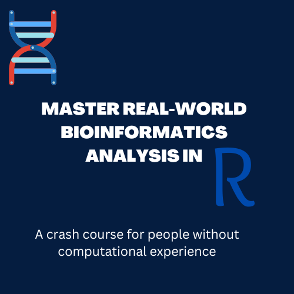

--- 
title: "Master Real-world Bioinformatics analysis in R"
author: "Ming Tommy Tang"
date: "2024-07-26"
site: bookdown::bookdown_site
output: bookdown::gitbook
documentclass: book
bibliography: [book.bib, packages.bib]
biblio-style: apalike
link-citations: yes
github-repo: rstudio/bookdown-demo
description: "This is an R course teaching you skills to do real-world bioinformatics"

always_allow_html: true
---

# Preface

