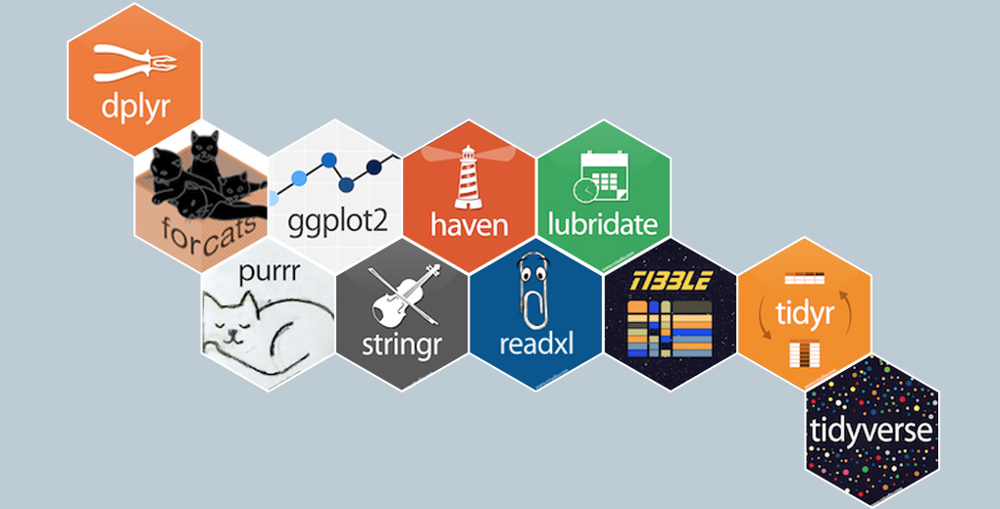

--- 
title: "Master Real-world Bioinformatics analysis in R"
author: "Ming Tommy Tang"
date: "`r Sys.Date()`"
site: bookdown::bookdown_site
output: bookdown::gitbook
documentclass: book
bibliography: [book.bib, packages.bib]
biblio-style: apalike
link-citations: yes
github-repo: rstudio/bookdown-demo
description: "This is an R course teaching you skills to do real-world bioinformatics"

always_allow_html: true
---

```{r setup, include=FALSE}
knitr::opts_chunk$set(
  warning = FALSE,
  message = FALSE
)
```


# Preface


<!--chapter:end:index.Rmd-->

# Introduction {#intro}

## Meet your Instructor

Hello, Welcome! all the students!

this is Tommy, your instructor for this course. Congratulations on signing up for this course. I am sure you will learn a lot. I created the first draft of this course during the holidays and with the help of ChatGPT, I was able to polish it quite a bit. This is not a perfect course, your feedback is greatly appreciated!

A little bit more about me. With over a decade of experience in computational biology, I specialize in genomics, epigenomics, and (single-cell) transcriptomics data analysis. I have taken on pivotal roles in various cancer research projects, notably contributing to the NCI's Cancer Moonshot initiative at the Dana-Farber Cancer Institute.

I am now the Director of Computational Biology at Immunitas Therapeutics, we employ machine-learning techniques to investigate immune cells in human tumors by analyzing single-cell RNAseq, single-cell TCRseq, and spatial transcriptome data. Our goal is to develop novel therapeutics for cancer patients. 

I am a self-trained computational biologist. I fully understand how challenging it is to learn computational biology from scratch. That's why beyond my professional work, I am passionate about promoting open science and improving bioinformatics education to equip biologists with computational skills.  More about me can be found at my website https://divingintogeneticsandgenomics.com/.

Enjoy this course! Let's go!

## Leveraging our online community


## Install R and R studio

```{r echo=FALSE}
library("vembedr")

embed_url("https://www.youtube.com/watch?v=4c9Al47k_V8")
```


## The role of programming in Biology

In this lesson, we will discover how programming languages empower biologists to unravel the mysteries of life, make critical discoveries, and automate complex tasks. While we won't be diving into intricate technicalities, we'll explore the fundamental concepts that will serve as the foundation for your exploration into the world of computational biology and bioinformatics.

### What are programming languages?

Programming languages are a set of rules and instructions used by humans to communicate with computers. They serve as a bridge between human thought and machine execution, allowing us to convey complex tasks and algorithms to computers in a way they can understand and execute.

* Communication Tool: Programming languages are a means of communication between humans and computers. They provide a structured and understandable way for programmers to convey their intentions to the computer.

* Instructions: In a programming language, you write instructions or commands that specify what the computer should do. These instructions can range from simple tasks like adding numbers to complex processes like data analysis or simulation.

* Syntax: Programming languages have their syntax or grammar rules that programmers must follow. Syntax defines how instructions should be structured, including the order of words, punctuation, and formatting. Following the correct syntax is crucial for the computer to interpret the code correctly.

* Abstraction: Programming languages provide a level of abstraction. They allow us to work at a higher level of understanding, dealing with concepts like variables, functions, and data structures, without needing to worry about the low-level details of how the computer processes these instructions.

* Interpreter or Compiler: To execute code written in a programming language, you need either an interpreter or a compiler. An interpreter reads and executes code line by line, while a compiler translates the entire code into machine code before execution.

### Why programming is important in biology?

Ever wondered why programming is such a big deal in biology? It's because it gives biologists the superpower to handle mountains of data, uncover hidden patterns, and automate those repetitive lab tasks. Read this paper: All Biology is computational Biology. So, what makes programming tick in the world of biology? Let's delve deeper:

* Efficient Data Handling: In biology, we deal with enormous volumes of data, from DNA sequences to ecological observations. Programming allows us to efficiently manage and process this data. By automating data collection and analysis, we save time and minimize errors, ensuring that our research is based on accurate and comprehensive information.

* Complex Analysis: Biological research often involves intricate analyses, such as genetic sequence comparisons, statistical modeling, and simulations. Programming languages provide the tools to perform these complex tasks with precision and speed. These analyses can unveil hidden patterns, relationships, and insights that would be challenging or impossible to discover manually.

* Reproducibility: Reproducibility is a cornerstone of scientific research. Programming ensures that experiments and analyses can be replicated precisely. By sharing code, scientists can validate each other's findings and build upon existing research, fostering collaboration and advancing the field collectively.

* Automation: Many biological experiments and processes are repetitive. Programming enables the automation of these tasks, freeing researchers from mundane and time-consuming work. This automation not only improves efficiency but also reduces the risk of human error.

* Visualization: Visualization is a crucial aspect of biology, allowing researchers to represent complex data in understandable ways. Programming languages provide libraries and tools to create stunning visualizations, aiding in the interpretation and communication of research findings.

### What are the most used programming languages within biology?

#### Python: The Swiss Army Knife of Biology

Python is the go-to programming language in the field of biology, and for good reasons. It's known for its simplicity and readability, making it an ideal choice for biologists who may not have extensive programming backgrounds. Python offers a vast ecosystem of libraries and tools tailored for bioinformatics, data analysis, and scientific computing.

* Bioinformatics: Python excels in bioinformatics, with libraries like Biopython, which provides tools for sequence analysis, structural biology, and more. Biologists use Python to parse and manipulate DNA, RNA, and protein sequences effortlessly.

* Data Analysis: Python's libraries, such as NumPy, pandas, and matplotlib, make data analysis and visualization a breeze. Researchers can explore and visualize complex biological data, from gene expression profiles to ecological datasets.

* Machine Learning: Python's machine learning libraries like scikit-learn enable biologists to build predictive models for disease classification, drug discovery, and more. It's a valuable tool for harnessing the power of data.

#### R: The Statistical Powerhouse

R is another programming language highly favored by biologists, particularly for statistical analysis and data visualization. It's renowned for its statistical packages and robust graphing capabilities, making it an indispensable tool for researchers dealing with biological data.

* Statistical Analysis: R boasts an extensive collection of statistical packages and libraries, including Bioconductor, designed specifically for biological data analysis. Biologists rely on R for hypothesis testing, regression analysis, and experimental design.

* Data Visualization: With libraries like ggplot2, R allows biologists to create intricate and publication-quality visualizations. It's instrumental in presenting research findings effectively.

#### Julia: The Rising Star

Julia is an emerging programming language that has garnered attention in the scientific community, including biology. It's prized for its exceptional performance and versatility, making it suitable for computationally intensive tasks in genomics, proteomics, and more.

* Performance: Julia's speed rivals low-level languages like C and Fortran, making it a compelling choice for high-performance computing in biology. It's used for tasks like simulating biological systems and analyzing large datasets.

* Ease of Use: Julia's syntax is intuitive and easy to learn, appealing to both programmers and scientists. Its interactive environment fosters quick experimentation.

#### Other Programming Languages:

While Python, R, and Julia are the prominent choices, other programming languages find their niche in specific areas of biology:

* Perl: Historically used in bioinformatics for tasks like text processing and sequence analysis.

* Java: Commonly employed in developing bioinformatics software and applications.

* C/C++: Reserved for computationally intensive tasks where speed is critical, such as molecular dynamics simulations.

<!--chapter:end:01-intro.Rmd-->

# Introduction to programming

## What is an algorithm?
Welcome to the first lesson of our course! Today, we're going to explore two fundamental concepts in programming: algorithms and flowcharts. Don't worry if these terms sound a bit technical; we'll break them down into simple ideas.

Imagine you're following a recipe to bake a cake. The recipe gives you step-by-step instructions on what to do, right? An algorithm is similar. It's a set of instructions or steps designed to perform a specific task. In programming, we use algorithms to tell the computer exactly what we want it to do.

## Why are Algorithms Important in Programming?

* Clarity: Algorithms serve as an essential tool for strategizing and planning our code. They provide us with a clear roadmap of the steps we need to follow before we start writing the actual code. This pre-coding stage can help us avoid potential issues and ensure that our solutions are well thought out.

* Problem-Solving: Algorithms play a crucial role in problem-solving. They allow us to break down complex tasks into a series of simpler steps, making them easier to manage and understand. By using algorithms, we can tackle large problems by solving each small part one at a time, thus making the overall problem-solving process more efficient and manageable.

* Efficiency: A well-designed algorithm can save significant time and resources. It can help us optimize our code to perform tasks in the fastest and most efficient way possible. By improving the efficiency of our code, we can ensure that it runs smoothly and quickly, thus enhancing the performance of our software or application.

## A Real World Example:
In this algorithm, we'll learn how to find the length of a DNA sequence. Knowing the length of a DNA sequence is important for various biological analyses.

1. Start: Begin the algorithm.

2. Input DNA Sequence: Ask the user to input a DNA sequence. For example, the sequence could be a string of letters like "ATCGATGCTA."

3. Initialize Length: Set a variable called "Length" to 0. This variable will be used to keep track of the length of the sequence.

4. For Each Base in DNA Sequence:

- Start a loop that goes through each base in the DNA sequence, one by one.

- For the input "ATCGATGCTA," the loop will start with "A."

5. Increase Length by 1: For each base you encounter in the sequence, add 1 to the "Length" variable. This counts the number of bases in the sequence.

6. Repeat: Continue the loop until you have processed all the bases in the DNA sequence.

7. Output Length: Once the loop is finished, the "Length" variable will contain the length of the DNA sequence. Display this value as the output.

8. End: End the algorithm.

## Variables, Data Types, and Expressions

In this lesson, we're going to explore some fundamental concepts of programming that are crucial in understanding how to write code for computational biology. We'll focus on three key ideas: variables, data types, and expressions. Think of these as the building blocks for creating a language that your computer can understand and use to solve biological problems.

### Variables

A variable is quite similar to a labeled box. It's a container where you can store information or data. Once you have this box (variable), you can do various things with it: you can put things into it, take things out of it, or even change what's inside it to something else. This flexibility is immensely useful when dealing with large volumes of data or when you’re accessing often to a specific piece of that data, a common occurrence in the field of computational biology.


```{r}
# Step 1: Define a variable and store the DNA sequence

gene_sequence = "ATCGAGCTAGCTGCTAGCTAGCTAGCT"

# Step 2: Print the stored DNA sequence

print(gene_sequence)
```

For instance, consider a situation where you're working with gene sequences. You can use a variable like 'gene_sequence' to store a particular gene's sequence. Later, you can access this stored sequence, manipulate it, or compare it with other sequences as needed in your computational biology tasks.

### Data Types

In programming, similar to the real world, we come across various data types that help us to structure and understand information. These data types include numbers, which could be whole numbers or numbers with decimal points; text, often referred to as strings in programming terms; booleans, representing True or False values; and lists, which are utilized to hold collections of items.


Each of these data types serve a unique purpose and are used in different contexts, playing an integral role in how we write and interpret code.

* Numbers: In programming, numbers can be whole or decimal. They represent measurements or quantities in computational biology, like DNA length or chemical concentration.

* Text (Strings): Strings are sequences of characters, used for gene names, DNA sequences, or any textual information in computational biology.

* Lists/Arrays: Lists group items together, useful in handling multiple genes, proteins, or biological elements. They can store different gene names or DNA sequences.

* Booleans: Booleans represent true or false values and are used to express conditions or decisions based on a yes/no scenario, like determining if a specific gene is present.

Understanding data types is crucial because it helps you work with biological data accurately and efficiently. When you're coding in computational biology, knowing whether you're dealing with numbers, text, or lists allows you to use the right tools and operations for each type of data.

For instance, if you need to perform calculations on gene lengths (numbers), you'll use mathematical operations. If you want to search for a specific gene name (text), you'll use string manipulation techniques. And when you're handling multiple genes (lists), you'll employ list-related functions to process them effectively.

### Expressions


In the world of programming, expressions are like simple puzzles or equations that you can use to do things with data. These expressions are created by putting together a few essential elements:

* Values: Think of these as numbers, like 2 or 3, that you want to work with. In computational biology, these could be things like the length of a gene or the number of amino acids in a protein.

* Variables: These are like labeled containers where you can store information. For example, you might have a variable called 'gene_length' that holds the length of a specific gene sequence.

* Operators: Operators are special symbols like +, -, *, or / that you use to perform operations on values and variables. They tell the computer what kind of action to take.

Now, let's dive into some beginner-level examples in computational biology:

### Example: Finding the average number of bases appearances in a set of DNA strings

Let’s suppose we want to calculate the average number of bases in a DNA string. Let’s assume we already processed the DNA string and we know the counts for each one.

Given counts of each base:

```{r}
count_A = 120

count_T = 90

count_C = 80

count_G = 110
```

Calculate the total number of bases

```{r}
total_bases = count_A + count_T + count_C + count_G
```

Calculate the average number of bases

```{r}
average_bases = total_bases / 4
```

Print the result

```{r}
print(average_bases) 
```

In this code:

1. We start by declaring the counts of each base using variables (number_a, number_t, number_c, number_g).

2. We calculate the total number of bases by summing up the counts.

3. Then, we compute the average number of bases by dividing the total by the number of different bases (4 in this case, representing A, T, C, and G).

4. Finally, we print the result, which gives us the average number of bases in the DNA string.


<!--chapter:end:02-Introduction_to_programming.Rmd-->

# Getting started with R and RStudio

## What is R and why is it used in Biology?

In this lesson, we’ll dive into the world of R, a powerful programming language and environment used extensively in the field of biology for data analysis and visualization. We’ll explore what R is, why it’s so useful, and how it can be a valuable tool for biologists.

## What is R?

R is a free and open-source statistical programming language specialized for statistical analysis and data visualization. R can supercharge your data analysis and enable you to go beyond the Excel spreadsheet.

## Why is R Used in Biology?

Biologists use R for a variety of reasons:

* Data Analysis: R provides a wide range of tools and packages for data analysis, making it easier to handle and analyze complex biological datasets. Whether you’re studying gene expression, population genetics, or ecological data, R can help you make sense of your data. You can take advantage of a lot of ready-to-use Bioconductor packages for almost any data type in biology. We will learn several essential bioconductor packages in the future sections.

* Statistics: In biology, statistical analysis is crucial for drawing meaningful conclusions from experiments and observations. R offers an extensive collection of statistical functions and libraries, allowing biologists to perform advanced statistical tests and modeling.

* Data Visualization: R excels at creating stunning visualizations of biological data. You can generate graphs, charts, and plots to visualize trends, relationships, and patterns in your data. Visualization is essential for communicating your findings effectively. You can make publication-ready figures with packages such as ggplot2 which we will cover in depth too.

* Reproducibility: R promotes reproducibility in scientific research. You can write scripts or programs to automate your analyses, ensuring that others can replicate your work and verify your results. Tools such as Rmarkdown make the analysis reproducible in Rstudio or Jupyter Notebook.

* Community Support: R has a vibrant and active user community, which means you’ll find plenty of resources, tutorials, and forums where you can seek help and share your knowledge. You can visit helpful communities such as the Posit community and Bioconductor support site.

* Integration: R can be integrated with other tools and languages, such as Python and SQL, making it flexible for various research needs.

In conclusion, R is a versatile and essential tool for biologists. It empowers researchers to handle, analyze, and visualize data effectively, leading to a deeper understanding of biological phenomena.

>"Like learning anything, it takes effort to master R. However, if you take the effort to learn the basics and relevant bioinformatics packages, you can conduct your analysis 100 times faster than the point-and-click tools. The added benefit is that you can make your analysis more reproducible."-- Tommy

## Introduction to R-Studio

In this chapter, we will introduce you to RStudio, a powerful integrated development environment (IDE) for the R programming language. RStudio provides a user-friendly interface for writing, running, and managing R code. We will explore the various panes, functions, and features of RStudio to help you get started on your journey with R programming.

```{r echo=FALSE}
library("vembedr")

embed_url("https://www.youtube.com/watch?v=JPIrIIQnrrg")
```


<!--chapter:end:03-Getting_started_with_R_and_RStudio.Rmd-->

# Introduction to R for biologists

## Basic Data Types in R

### Before Starting

When you're working with R, it's crucial to name your variables properly. Here are some simple rules to follow:

1. Allowed Characters: Variable names can include letters, numbers, underscores (_), and periods (.).

2. Starting Characters: A variable name must start with a letter or a period. It can't start with a number.

3. Case Sensitivity: R treats variable names as case-sensitive. For example, myvar is different from MyVar.

4. Dots in Names: While dots are allowed in variable names, it's best to avoid them except at the beginning.

5. Avoiding Conflicts: Don't use names that match existing functions in R, like mean or c.

#### Examples:

Valid:

* myvar

* my.var

* var1

* var_1

Invalid:

* 1var (can't start with a number)

* _temp (can't start with a _)

* c (matches existing function)

* my-var (hyphens aren't allowed)

* my var (spaces aren't allowed)

#### Tips for Naming:

* Meaningful Names: Choose descriptive names like patient_data instead of generic ones like x, y, or z.

* Short and Clear: Keep your names short but make sure they clearly represent what the variable contains.

* Naming Style: You can use camelCase or underscores_between_words for multi-word names. Make sure to stick to one style and be consistent.

Case Consistency: Decide whether you want all lowercase names or CapWords (also known as PascalCase), and stick to it throughout your code.

By following these naming conventions, your code will be easier to understand, and you'll avoid unexpected errors. Consistency is key when naming variables across your R scripts.

In R, data can be classified into several fundamental types, each serving specific purposes in data analysis and manipulation. Understanding these data types is crucial for effective data handling. Let's explore the primary data types in R:

### 1. Numeric

Numeric data represents continuous numerical values. These can be integers or real numbers (floating-point). Numeric data is used for mathematical calculations and statistical analysis.

Example:

```{r}
# Numeric data
age <- 28
height <- 1.75
```

The `<-` operator and the `=` operator in R are both used for assignment but have some key differences.

The `<-` operator is the standard assignment operator in R. It assigns values to objects.

* The arrow can be read as "gets". So age gets the value of 28.

* All R objects should be created using the `<-` operator.

The `=` Operator can also be used for assignments.

```{r}
age = 28
```

* This also assigns 28 to age.

* The `=` should be read as "is equal to". This is mainly used to specify function arguments.

So in a function call like:

```{r eval=FALSE}
plot(x = mydata)
```

We are specifying that the x argument is equal to mydata.

In summary, `<-` is the operator you should use when creating R objects, while 
`=` is reserved for function arguments. For assignments, both `<-` and `=` can be used.
If you want to read more differences, take a look at https://stat.ethz.ch/R-manual/R-patched/library/base/html/assignOps.html.

### 2. Character (String)

Character data represents text or strings of characters. You use character data for storing and manipulating text-based information, such as names, descriptions, and labels.

Example:

```{r}
# Character data
name <- "John Doe"
city <- "New York"
```

### 3. Integer

Integer data represents whole numbers. Unlike numeric data, which includes decimal points, integer data includes only whole numbers. It's commonly used when dealing with counts or discrete quantities.

Example:
```{r}
# Integer data
count <- 10
students <- 42
```

### 4. Logical (Boolean)

Logical data consists of two possible values: `TRUE` or `FALSE`. These values are used for binary decisions, conditions, and logical operations.

Example:

```{r}
# Logical data
is_student <- TRUE
has_permission <- FALSE
```

### 5. Factor

Factor data represents categorical variables with predefined levels or categories. Factors are used when you have data that can be divided into distinct categories, such as "High," "Medium," and "Low."

Example:

```{r}
# Factor data
grade <- factor(c("A", "B", "C", "B", "A"))
```

### 6. Date and Time

Date and time data types are used for representing dates, times, or both. These data types are crucial when dealing with time series data or conducting temporal analysis.

Example:

```{r}
# Date and time data
birth_date <- as.Date("1990-05-15")
timestamp <- as.POSIXct("2023-01-09 14:30:00")
```

### 7. Complex

Complex data types represent complex numbers, which have both real and imaginary parts. Complex numbers are used in advanced mathematical and engineering applications.

Example:

```{r}
# Complex data
z <- 3 + 2i
```

### 8. Missing Values (NA)

In R, missing values are represented as NA. These values indicate the absence of data or an undefined value. Handling missing data is essential in data analysis.

Example:
```{r}
# Missing value
missing_data <- NA
```

Understanding these data types and their characteristics is fundamental to effective data manipulation and analysis in R. Different operations and functions may behave differently depending on the data type, so being familiar with these types will help you work with data effectively.

## The key concept of R: Vectors

In the world of R, vectors are the building blocks of data. In fact, everything in R is a vector. Whether you're dealing with numbers or characters, R treats them all as vectors, which are simply collections of these elements. There is no concept of a scalar in R; even a single value is considered a one-element vector. To create a vector, you'll use the c function, which stands for "combine" or "concatenate."

### Creating Numeric and Character Vectors

Let's dive right in with examples:

```{r}
# A numeric vector
c(1, 2, 3)

# Output: [1] 1 2 3

# A character vector
c("A", "T", "C", "G")

# Output: [1] "A" "T" "C" "G"

```

Notice how `c()` is used to combine values into vectors. Even a single element, such as "A", is a vector in R. Similarly, numeric values like 5 are considered one-element vectors.

### Saving Vectors to Variables

Now, let's save these vectors into variables with meaningful names:

```{r}
number_vec <- c(1, 2, 3)
dna_base <- c("A", "T", "C", "G") 
gene_ids <- c("PAX6", "TP53", "MYC")
```

Remember, it's good practice to use informative variable names. Variable names cannot start with a number, so opt for names like `number_vec` and `dna_base`.

### Vectorized Calculations
One of the powerful features of R is vectorization, where operations are automatically applied element-wise to vectors. For example:

```{r}
number_vec + 1 
```

Here, we've added 1 to each element of `number_vec`. This vectorized behavior simplifies many calculations.

#### Understanding Indexing
You may have noticed the `[1]` that appears in the output. In R, it's called an index, and it indicates the position of each element in the result. For instance:

```{r}
x <- 1:100
x

```

In this case, `[1]` denotes the first position of each element. Understanding indexing helps when working with large datasets.

### Performing Vectorized Calculations
You can perform various calculations on vectors in R:

```{r}
number_vec * 2

# Output: [1] 2 4 6

number_vec / 2

# Output: [1] 0.5 1.0 1.5
```
Remember, all these calculations are vectorized, making R a powerful tool for data manipulation.

### Operations with character vectors

Character vectors in R offer a wide range of operations for text manipulation and analysis. Let's explore some of the essential operations:

#### Concatenation

You can combine character vectors using the c function:

```{r}
new_bases <- c(dna_base, "N")
new_bases
```
This operation is useful for extending or combining character vectors.

#### Changing Case

Transforming the case of characters is straightforward in R. You can convert characters to uppercase or lowercase:

```{r}
toupper(dna_base)

tolower(dna_base)

```

This is handy when you need consistent formatting.

### Logical Vectors

Character vectors also allow for logical operations, which can be incredibly powerful

```{r echo=FALSE}
library("vembedr")

embed_url("https://www.youtube.com/watch?v=DtiatInAJ-Q")
```

#### Finding Matches

To check which elements in a character vector meet certain criteria, use the %in% operator:

```{r}
dna_base %in% c("A", "C", "T")
```
This produces a logical vector where `TRUE` indicates a match. This is because the vector dna_base contains `A`, `T`, `C`, `G` and `G` does not match any element in the vector created by `c("A", "C", "T")`.

#### Saving a Logical Vector

Save the resulting logical vector to a new variable for future use:
```{r}
logical_vec <- dna_base %in% c("A", "C", "T")
logical_vec
```

The length of the logical vector matches the original character vector.

#### Negating a Logical Vector
You can negate a logical vector using the `!` operator:

```{r}
!logical_vec
```

Now, `TRUE` represents elements that do not match the criteria.

#### Subsetting with Logical Vectors
Using a logical vector for subsetting another vector is a common operation. It allows you to filter and extract specific elements:

```{r}
# Subsetting elements that meet the criteria
dna_base[logical_vec]

# Subsetting elements that do not meet the criteria
dna_base[!logical_vec]
```

This powerful technique helps you extract and manipulate data efficiently based on specified conditions.


### Conclusion
You've learned the fundamental operations that can be performed on both numeric and character vectors. These essential skills will serve as a strong foundation as you delve deeper into the world of data analysis and manipulation using R.

Remember that vectors are the building blocks of R, and they are used extensively in various data analysis tasks. Whether you're combining elements, changing case, or using logical operations to filter and extract data, you have now gained valuable insights into how vectors can be harnessed to accomplish your data analysis goals.

As you continue your journey in R programming, you'll encounter more complex data structures and operations, but the understanding of vectors will remain a cornerstone of your proficiency.

## Subsetting and Indexing

In this guide, we will explain one of the fundamental concepts for dealing with vectors: indexing and slicing. Understanding how R handles these operations is crucial as it differs from some other programming languages, like Python.

### Indexing in R

In R, unlike Python where indexing starts at 0, it begins at 1. This means that the first element in a sequence is located at position 1, the second at position 2, and so on. Let's dive into some practical examples to illustrate this concept.

```{r}
# Let's create a vector of DNA bases
dna_base <- c("A", "T", "C", "G")

# Accessing the second element (T) using indexing
dna_base[2]

# second and fourth element
dna_base[c(2,4)]
```

Here, we use square brackets `[ ]` to access elements by their position in the dna_base vector. So, `dna_base[2]` returns the second element, which is "T".

### Slicing in R
Slicing in R allows you to extract a chunk of elements from a vector or sequence. You can specify the start and end positions within the square brackets to define the slice.

```{r}
# Slicing the first two elements (A and T) from the dna_base vector
dna_base[1:2]
```

In this example, `dna_base[1:2]` retrieves elements from position 1 to 2, giving us "A" and "T".

### Negative Indexing
R also allows negative indexing to remove that element at that position:

```{r}
# remove first element by negative indexing
remove_first_element <- dna_base[-1]
```

```{r}
# remove second and fourth
dna_base[-c(2,4)]
# Output: [1] "A" "C"
```

### Conclusion
Remember that R starts indexing at 1, not 0, and you can use square brackets `[ ]` to access elements and slices within vectors and sequences. This is essential for working with data and performing various operations in R.

## Understanding and Manipulating Matrices

Matrices are essential for organizing and processing data, especially when dealing with gene expression data from technologies like RNA sequencing (RNAseq). In this tutorial, we will explore how to create, manipulate, and extract information from matrices using the R programming language. We will cover topics ranging from basic matrix operations to more advanced tasks like normalization for RNAseq data analysis.

### Creating a Matrix

To create a matrix in R, you can use the matrix() function. A matrix is essentially a 2-dimensional table for storing numerical data. Let's start by creating a simple matrix:

```{r}
expression_mat <- matrix(1:12, nrow = 3, ncol = 4)
expression_mat
```

Here, `expression_mat` is a dummy gene expression matrix with 3 rows (genes) and 4 columns (samples), where the entries represent counts for each gene in each sample.

### Adding Row and Column Names
You can enhance the clarity of your matrix by adding row and column names. This is particularly useful when dealing with real biological data. For example:

```{r}
rownames(expression_mat) <- c("gene1", "gene2", "gene3")
colnames(expression_mat) <- c("sample1", "sample2", "sample3", "sample4")
expression_mat
```

Now, instead of numerical indices, your matrix displays gene and sample names, making it easier to interpret.

### Subsetting a Matrix
Subsetting allows you to extract specific rows and columns from a matrix. You can use numerical indices, row/column names, or logical vectors. Remember, R is 1-based. Indices start at 1 while Python starts at 0.


#### Subsetting using numerical indices

```{r}
# Accessing a single element
expression_mat[1, 2]
```

slice a chunk

```{r}
expression_mat[1:2, 1:2]
```

If you leave either the row index blank or the column index, it will subset all the rows or columns. Subset the first two rows and all columns:

```{r}
expression_mat[1:2,]
```

Subset the columns 2 and 4 and all rows

```{r}
expression_mat[, c(2,4)]
```

#### Subsetting using row names

```{r}
# Accessing a specific gene's data
expression_mat["gene3", ]
```

When only one row or one column is left after subsetting, R returns a vector instead of a matrix. To return a single row or column matrix, add `drop=FALSE`.

```{r}
expression_mat["gene3", , drop=FALSE]
```

#### Subsetting using column names

```{r}
# Using predefined gene and sample names
differential_genes<- c("gene3", "gene1")
expression_mat[differential_genes, c("sample1", "sample2")]
```

You see how the matrix is subsetted and the row names are ordered as in `differential_genes`.

#### Subsetting using logical vectors

We have a matrix called `expression_mat` that contains gene expression data, and you want to subset it to include only the rows corresponding to certain "differential genes." Here's how you can do it:

```{r}
logical_vec_genes <- rownames(expression_mat) %in% differential_genes
expression_mat[logical_vec_genes,]
```

### Calculations with Matrices
You can perform various calculations on matrices, such as calculating the sum of counts for each sample (column level) or gene (row level):

```{r}
colSums(expression_mat)
```

```{r}
rowSums(expression_mat)
```

### Normalization

Normalization is crucial in RNAseq data analysis to account for differences in sequencing depth and gene length. Two common methods for normalization are RPKM (Reads Per Kilobase per Million) and TPM (Transcripts Per Million). Watch this video to understand better of their differences 

```{r echo=FALSE}
library("vembedr")

embed_url("https://www.youtube.com/watch?v=TTUrtCY2k-w")
```

>RPKM (Reads Per Kilobase per Million) and TPM (Transcripts Per Million) are two widely-used methods for normalizing gene expression data in RNAseq, with RPKM considering gene length and total reads per sample and TPM further accounting for differences in sequencing depth between samples.

Here's how you can normalize a matrix to RPKM and TPM:

```{r}
# Gene lengths (in kilobases)
gene_lengths <- c(1000, 2000, 3000)

# Normalizing to RPKM
rpkm_normalized <- t(t(expression_mat)/colSums(expression_mat))/gene_lengths * 1e6
rpkm_normalized

# Normalizing to TPM
tpm_normalized <- t(t(expression_mat/gene_lengths)/ colSums((expression_mat/gene_lengths))) * 1e6

tpm_normalized
```

Note, when you divide a matrix by a vector, the operation is row-wise.

```{r}
expression_mat

gene_lengths

expression_mat/gene_lengths
```

That's why if we want to divide the matrix by the column sum, we use the `t()` to transpose the matrix first.

### Conclusion
Understanding matrices and their manipulation is fundamental when working with biological data in R. Whether you're analyzing gene expression or any other numerical data, these matrix operations are essential tools for data exploration and analysis in the field of bioinformatics.

## Essential Functions in R

In this foundational lesson, we will explore several fundamental R functions that are indispensable for your daily bioinformatics tasks. As a beginner in programming, mastering these basic building blocks will provide you with a sturdy groundwork upon which to build your bioinformatics skills.

### `length` Function

The `length` function is your go-to tool for determining the size of a vector or list in R. It's immensely useful when working with gene expression data, as it allows you to gauge the number of elements in your dataset. Let's dive into an example:

```{r}
expression_vec <- c(10, 25, 30, 12, 20)
names(expression_vec) <- c("gene1", "gene2", "gene3", "gene4", "gene5")

length(expression_vec)
```

In this case, our `expression_vec` contains gene expression values, and the length function tells us that it comprises five elements. This straightforward function provides a crucial dimension for managing your data.

### `unique` Function

When working with genomics data, you'll often encounter lists of genes or sequences. The unique function is a valuable asset for identifying and extracting unique elements from such lists. Let's illustrate with a simple example:

```{r}
genes <- c("GeneC", "GeneA", "GeneB", "GeneA")
unique_genes <- unique(genes)

unique_genes
```

In this snippet, we have a list of genes, and unique helps us extract the unique gene names, which can be essential for various genomics analyses.

### `sort` Function

Sorting is a fundamental operation in data manipulation. The `sort` function in R allows you to arrange your data in ascending or descending order. It's particularly handy when dealing with gene lists, as it helps you organize genes alphabetically or numerically. Let's explore some examples:

```{r}
unique_genes <- c("GeneC", "GeneA", "GeneB")

# Sort alphabetically
sort(unique_genes)

```

```{r}
# Sort alphabetically in descending order
sort(unique_genes, decreasing = TRUE)
```

```{r}
# Sort numeric values
sort(expression_vec)
```

```{r}
# Sort numeric values in descending order
sort(expression_vec, decreasing = TRUE)
```

These examples demonstrate how the `sort` function can be applied to both character and numeric data. Sorting can be particularly useful when you need to organize and prioritize genes or data for downstream analyses.

### `cor` Function
The cor function is indispensable for bioinformatics tasks that involve assessing the relationships between variables, such as gene expression levels. It calculates the correlation coefficient, which measures the degree of association between two variables. Let's explore how it works:

```{r}
gene1 <- c(10, 15, 20, 25)
gene2 <- c(8, 12, 18, 22)

correlation_coefficient <- cor(gene1, gene2)

correlation_coefficient
```

In this example, we calculate the correlation between the expression levels of two genes, `gene1` and `gene2`. The resulting correlation coefficient value provides insights into the similarity of their expression patterns.

It's worth noting that the cor function supports various correlation methods, such as Pearson and Spearman. Understanding these correlations is crucial for deciphering gene interactions and conducting network analyses.

## Functions: Organizing Your Code for Reusability

In this section, we will delve into the concept of functions in R—a fundamental building block for creating organized and reusable code. Functions serve as a means to encapsulate specific tasks within your code and can significantly enhance your programming capabilities. In essence, a function is like a black box that takes input, processes it, and produces output, shielding you from the inner workings of the logic. We will explore how to create functions, define input arguments, and ensure they provide meaningful output.

### What is a Function?
A function in R is a way to bundle code that accomplishes a specific task or computation. It comprises defined input arguments and a code block, and you can invoke the function whenever you need to execute that particular logic.

Let's begin by creating a simple function to calculate the mean of a numeric vector.

### Creating a Basic Function: Calculating the Mean

To create a function, you should follow these steps:

1. Name Your Function: Give your function a meaningful name. In our example, we'll call it `mean_customer`.

2. Use the function Keyword: Begin your function with the function keyword, followed by parentheses. Inside the parentheses, define your input arguments. You can have multiple arguments for a function.

3. Body of the Function: The actual code of the function is enclosed within curly braces {}.

Let's create a mean_customer function to compute the mean of a numeric vector:

```{r}
mean_customer <- function(x) {
  total <- sum(x)
  mean_value <- total / length(x)
}
```

In this function, we first calculate the total sum of the input vector x using the built-in `sum` function. Then, we divide this sum by the length of the vector to obtain the mean.

### Using the Custom Function

Now that we have defined our `mean_customer` function, let's use it with an example vector:

```{r}
input_vec <- c(1, 2, 3, 4)
result <- mean_customer(input_vec)

result
```

You might have noticed that our initial function did not print anything to the console. To make a function display an output, you need a `return` statement. Let's add it to our function.

### Returning a Value from the Function

Returning a value in a function in a programming language like R is a fundamental concept that determines what the function does with its computed result. When you include a return statement within a function, you are specifying the value that the function should provide as output when it's called elsewhere in your code.

1. Calculation or Operation: Inside the function, there is a block of code that performs some calculation, operation, or task based on the input arguments provided to the function.

2. return Statement: When you include a return statement, it signifies that the function should terminate its execution at that point and immediately provide the value specified after return as its output. This value can be a single variable, an expression, or even a complex data structure.

3. Function Execution: When you call the function in your code, it starts executing from the beginning and proceeds until it encounters the return statement. At that point, the function stops executing further code within its body and exits, returning the value specified in the return statement.

4. Assigning to a Variable: Typically, you capture the returned value by assigning it to a variable when you call the function. This allows you to store and use the result elsewhere in your code.

For example, in R, following the previous example

```{r}
mean_customer <- function(x) {
  total <- sum(x)
  mean_value <- total / length(x)
  return(mean_value)
}
```

Now, when you use `mean_customer(input_vec)`, it will correctly display the mean value.

```{r}
# Calculate the mean of a numeric vector
input_vec <- c(1, 2, 3, 4)
result <- mean_customer(input_vec)
result
```

### Optional: Omitting the return Statement
You can also omit the return statement. By default, the last expression in the function will be returned as the output. Here's the updated function:

```{r}
mean_customer <- function(x) {
  total <- sum(x)
  mean_value <- total / length(x)
  mean_value
}
```

The behavior remains the same as before when you use `mean_customer(input_vec)`.


### Using more than one argument

Missing data is a common occurrence in real-world biological datasets, and learning how to handle it is crucial for robust data analysis in R. Let's create a custom function to calculate the mean of a numeric vector while accommodating missing values (NAs). We'll introduce the concept of the na.rm argument and illustrate how it allows us to decide whether or not to remove NAs before performing calculations.

### Understanding Missing Values (NAs) in R

In R, "NA" stands for "Not Available," and it is used to represent missing or undefined values in your data. Let's start by creating a couple of example vectors:

```{r}
genes <- c("TP53", NA, "MYC")
NA_vec <- c(1, 2, 3, NA)
```

As you can see, our genes vector contains a missing value (`NA`). To identify and handle `NAs`, we can use the `is.na()` function, which returns a logical vector indicating which elements are `NAs`:

```{r}
is.na(genes)

is.na(NA_vec)
```

### Initial Attempt: A Function Without Handling NAs

Let's start by creating a custom function to calculate the mean of a numeric vector. However, if the vector contains `NAs`, our initial function doesn't handle them correctly:

```{r}
mean_customer <- function(x){
    total <- sum(x)
    mean_value <- total / length(x)
    return(mean_value)
}
```

When we try to calculate the mean of `NA_vec`, it returns `NA`:

```{r}
mean_customer(NA_vec)
```

This outcome is not ideal, especially when we want to calculate the average of the non-missing values.

### Adding the `remove_na` Argument

To address this issue, we can enhance our function by introducing a new argument called `remove_na`, which allows us to control whether `NAs` should be removed before performing calculations. By default, we set `remove_na` to TRUE, indicating that NAs should be removed:

>You'll see that we declare the remove_na argument with an =. That means that if no value is provided, by default it will take the value TRUE.

```{r}
mean_customer_NA <- function(x, remove_na = TRUE){
    if (remove_na){
        x <- x[!is.na(x)]
    }
    total <- sum(x)
    mean_value <- total / length(x)
    return(mean_value)
}
```

Now, our function behaves differently based on the value of `remove_na`. If set to `TRUE`, it removes `NAs` from the vector before calculating the mean; if set to `FALSE`, it includes `NAs` in the calculation.

### Practical Application
Let's see how this enhanced function works with our example vector:

```{r}
mean_customer_NA(NA_vec)  # Default behavior (remove_na = TRUE)

mean_customer_NA(NA_vec, remove_na = TRUE)  # Explicitly removing NAs

mean_customer_NA(NA_vec, remove_na = FALSE)  # Including NAs
```

In the first two calls, we get a result of 2 by removing the `NAs`, while in the last call, we receive `NA` since we chose not to remove them.

### Getting help with functions

#### Using the `?` Operator for Documentation. 

The `?` operator is a quick and convenient way to access documentation directly within the R environment. Simply type in the console `?` followed by the name of the function you want to learn more about. For example:

```{r eval=FALSE}
?mean
```

This command will open the documentation for the `mean()` function, providing details on its usage, arguments, examples, and related functions.

#### Accessing Documentation via the `help()` Function

Alternatively, you can use the `help()` function to retrieve documentation for a specific function. Syntax:

```{r}
help(mean)
```

Executing this command will display the documentation for the `mean()` function in the Help pane of R Studio.

#### Utilizing the `help.search()` Function

f you are unsure about the exact function name or wish to search for functions related to a certain topic, you can use the help.search() function. This function allows you to search for keywords across all available documentation. Syntax:

```{r eval=FALSE}
help.search("keyword")
```

For example:

```{r}
help.search("linear regression")
```
This command will return a list of relevant documentation entries containing the specified keyword, assisting you in finding relevant functions and packages.

####  Exploring Online Resources and Community Forums

In addition to built-in documentation, online resources such as the official R documentation website (https://www.rdocumentation.org/) and community forums like Stack Overflow (https://stackoverflow.com/) are valuable sources of information and support. You can search for specific functions, read user discussions, and even ask questions if needed.

### A Real World Example

In the field of bioinformatics, analyzing gene expression data is a fundamental task. One common analysis involves identifying the most highly variable genes within a gene expression matrix. Let's create a custom R function for this purpose.

>Before diving into the creation our function, it's essential to understand some key pre-concepts. Firstly, gene expression data typically consists of a matrix where rows represent genes and columns represent samples or conditions. Second, the variability of gene expression across samples is a crucial metric, often measured by variance or standard deviation. Highly variable genes can provide valuable insights into biological processes.

Let's create a custom function, `findVariableGenes`, which identifies the top N most highly variable genes in a gene expression matrix. Below is the code for the function, with explanations:

```{r}
# Define the custom function
findVariableGenes <- function(expr_matrix, n = 10) {
  # Calculate variances for each gene
  gene_variances <- apply(expr_matrix, MARGIN = 1, var)
  
  # Sort genes by variance in descending order
  sorted_genes <- sort(gene_variances, decreasing=TRUE) 
  
  # Select the top N variable genes
  top_n <- names(sorted_genes[1:n])
  
  # Return the names of top variable genes
  return(top_n)
}
```

* expr_matrix: This is the gene expression matrix you want to analyze.

* n: The number of top variable genes you want to identify (default is 10).

* apply function applies the var function to the matrix for rows (`MARGIN =1`). if you want to apply a function for columns, use `MARGIN =2`.

Now, let's put our custom function to the test using some randomly generated gene expression data.

#### Generating Random Data

We'll create a gene expression matrix with 25 genes (rows) and 4 samples (columns) using normally distributed random data. To ensure reproducibility, we'll set a seed value (123). Here's the code and the resulting data matrix:

```{r}
# Set a seed for reproducibility (ensure all get the same random data)
set.seed(123)  # This sets a random seed to ensure that the random data generated below is reproducible.

data <- matrix(rnorm(100), ncol = 4)  # This line generates a matrix with 100 random numbers from a standard normal distribution and organizes them into 4 columns.
rownames(data) <- paste0("gene", 1:25)  # This line assigns row names to the matrix, labeling each row as "gene1", "gene2", and so on, up to "gene25".

# Display the generated data
print(data)
```

#### Using the Custom Function
Now that we have our gene expression data, let's apply our `findVariableGenes` function to identify the top 10 most highly variable genes:

```{r}
# Use the custom function to find highly variable genes
highly_variable <- findVariableGenes(data, n = 10)

# Display the list of highly variable genes
print(highly_variable)
```

Encapsulating logic into functions makes our code more organized, reusable, and scalable.Functions make code more organized, reusable, and scalable. As you code more in R, you’ll want to encapsulate logic into functions just as shown here.

### Conclusion
Understanding functions and their ability to encapsulate code and return specific values is crucial in R programming. Functions enhance code organization, maintainability, and reusability, making them a valuable tool for any data analyst or scientist. The flexibility and efficiency they offer become increasingly evident as you tackle more complex data analysis tasks in R.

## Common Mistakes to avoid

In this lesson we will discuss some common mistakes that absolute beginners often make when learning R. Learning a new programming language can be challenging, and it's natural to encounter stumbling blocks along the way. By understanding these common mistakes, you can avoid them and become a more proficient R programmer.

### Mixing Data Types
One common mistake is mixing different data types in operations. For instance, trying to add a number to a string or perform mathematical operations on non-numeric data types.

```{r eval=FALSE}
# Example:
x <- "5"
y <- 3
z <- x + y  # This will result in an error because you cannot add a string and a number.
```

### Forgetting Function Parentheses
Another mistake is forgetting to include parentheses when calling functions. In R, functions typically require parentheses, even if they don't have any arguments.

```{r eval=FALSE}
# Incorrect:
print "Hello, World!"

# Correct:
print("Hello, World!")
```

### Overwriting Built-in Functions
Sometimes you might unintentionally overwrite built-in functions or variable names, causing unexpected behavior in your code.

```{r eval=FALSE}
# Example:
# Incorrect:
mean <- function(x) {
  sum(x) / length(x)
}
# Now, mean function is overwritten and will not work as expected.
# e.g, it can not handel na.rm argument 
```

### Misunderstanding Variable Scoping

Variable scoping in R defines where a variable can be used in a program. If a variable is defined inside a function, it's only accessible within that function (local scope). Variables defined outside functions, usually at the start of a script or in the main program, can be used anywhere (global scope).

Understanding variable scoping is crucial for avoiding errors and writing maintainable code. One common mistake is assuming that variables defined in one part of the program will be accessible from another part.

Let's look at an example:

```{r}
# Example 1: Incorrect variable scoping
calculate_sum <- function(a, b) {
  result <- a + b
}

# Trying to access 'result' outside the function will result in an error.
print(result)
```

### Best practices for variable scoping include

1. Explicitly Pass Variables: When variables are needed in different parts of the program, it's better to explicitly pass them as arguments to functions rather than relying on global variables.

```{r}
# Example 2: Explicitly passing variables
calculate_sum <- function(a, b) {
  result <- a + b
  return(result)
}

# Call the function with arguments
result <- calculate_sum(3, 5)
print(result) 
```

2. Use Meaningful Variable Names: Clear and meaningful variable names can help avoid confusion about variable scope and improve code readability.

```{r}
# Example 3: Clear variable names
calculate_area <- function(length, width) {
  area <- length * width
  return(area)
}

# Call the function with arguments
area <- calculate_area(4, 5)
print(area)  
```

3. Avoid Modifying Global Variables Within Functions: Modifying global variables within functions can lead to unexpected behavior and make code harder to understand and debug. Instead, prefer returning values from functions.

```{r}
# Example 4: Avoid modifying global variables
x <- 10

modify_variable <- function() {
  x <- 20  # This creates a new local variable 'x', it does not modify the global 'x'
}

modify_variable()
print(x)  # Output: 10 (global 'x' remains unchanged)
```

### Conclusion
Learning R can be a rewarding experience, but it's common to encounter challenges along the way. By being aware of these common mistakes and understanding the allowed operations in R, you can avoid many pitfalls and become a more proficient R programmer. Remember to practice regularly and don't hesitate to seek help from resources like documentation, online tutorials, and community forums. Happy coding!


<!--chapter:end:04-Introduction_to_R_for_biologists.Rmd-->

# Controlling the flow of our programs

## Boolean Operators

In R, understanding boolean operators is crucial for making logical comparisons and decisions in your code. Boolean operators are used to compare values and evaluate conditions, providing a foundation for decision-making processes in programming.

In this tutorial, we will explore the basics of boolean operators, including equality, greater-than, and less-than comparisons. We will also delve into logical operations, introducing the essential concepts of "and" and "or" with both vectorized and non-vectorized forms.

### Comparison Operators

Comparison operators allow us to compare values and return a boolean result, either `TRUE` or `FALSE`. Let's start with some common comparison operators:

#### Equality (`==`)

The equality operator (`==`) checks if two values are equal. For example:

```{r}
"A" == "A"

3 == 3
```

#### Greater Than (`>`)
The greater-than operator (>) checks if one value is greater than another:

```{r}
5 > 3
```

#### Less Than (`<`)
The less-than operator (`<`) checks if one value is less than another:

```{r}
5 < 3
```

### Logical Operators
Now, let's explore logical operators, which allow us to combine multiple conditions and make more complex decisions in our code.

#### Vectorized "AND" (`&`)
The vectorized "and" operator (`&`) allows us to perform element-wise comparisons on vectors. It returns a vector of boolean values, which is extremely useful when dealing with data sets. For example:

```{r}
# Check if elements in -2:2 are greater than or equal to 0
-2:2 >= 0

# Check if elements in -2:2 are less than or equal to 0
-2:2 <= 0

# Combine the two conditions using vectorized "and"
(-2:2 >= 0) & (-2:2 <= 0)

```

#### Vectorized "OR" (`|`)

Similar to the "and" operator, the vectorized "or" operator (`|`) performs element-wise comparisons and returns a vector of boolean values. Here's an example:

```{r}
# Check if elements in -2:2 are greater than or equal to 0
-2:2 >= 0

# Check if elements in 2:6 are less than or equal to 0
2:6 <= 0

# Combine the two conditions using vectorized "or"
(-2:2 >= 0) | (2:6 <= 0)

```

#### Non-Vectorized "AND" (`&&`) and "OR" (`||`)

Non-vectorized "and" (`&&`) and "or" (`||`) operators in R are used for performing logical operations that return a **single** boolean value based on the evaluation of multiple conditions

The non-vectorized forms of "and" (`&&`) and "or" (`||`) return a single value and are typically used for non-vectorized logical operations. For example:

```{r}
# Non-vectorized "and" operator
(-2:2 >= 0) && (-2:2 <= 0)
```

Keep in mind that as of `R 4.3.0`, these operators must be given inputs of length 1.

### Conclusion
Understanding boolean operators and logical operations is fundamental in programming with R. These operators enable you to make decisions based on comparisons, creating more dynamic and powerful code. Whether you are comparing values or combining conditions, boolean operators are essential tools in your programming toolkit. Experiment with different comparisons and logical combinations to gain a deeper understanding of their versatility and practicality in R.

## Conditional statements (`if`, `else`)

In the world of programming, making decisions based on data is crucial. Imagine you're analyzing gene expression data, and you want to process it differently depending on whether a gene is highly expressed or not. In R, this decision-making ability is known as control flow, and it's essential for creating flexible and adaptive programs. In this tutorial, we'll explore the power of the if statement, which allows us to control the flow of our R code based on specific conditions. We'll walk through practical examples, starting with gene expression analysis.

### The `if` Statement

The `if` statement is a fundamental tool for controlling program flow in R. It checks whether a specified condition evaluates to `TRUE` or `FALSE`. Depending on the result, either the code within the if block or the else block (if defined) gets executed.

Imagine you're working with DNA sequences, and you want to check if a given sequence contains the sequence motif "ATG" which is a start codon in genetics. Here's a basic example using the if statement:

```{r}
# Bioinformatics example: DNA sequence
sequence <- "GCTAGTGTAGCGT"

# Check if the sequence contains the start codon "ATG"
if (grepl("ATG", sequence)) {
    print("Start codon found")
} else {
    print("Start codon not found")
}
```

>In this scenario, the if statement checks whether the sequence contains "ATG" using the grepl function. If it's found, it prints a message indicating that the start codon is present; otherwise, it prints a message indicating that the start codon is not found.

If you want to check whether both start codon and stop codon are in the DNA sequence:

```{r}
sequence <- "GCTAGTGTAGCGT"

# Check if the sequence contains the start codon "ATG" or the stop codon "TAA"
if (grepl("ATG", sequence) || grepl("TAA", sequence)) {
    print("Start codon or Stop Codon are found")
} else {
    print("No Start codon or Stop codon are found")
}
```

Note we use `||` , the non-vectorized version or for condition checking.

### `else` statement 

Now, let's explore the `else` statement in the context of DNA sequence analysis. Suppose you want to perform a different action if the sequence doesn't contain the start codon. For instance, you might want to check for a stop codon. Here's a simplified example:

```{r}
# Bioinformatics example: DNA sequence without the start codon
sequence <- "CGTACTAGCGT"

# Check if the sequence contains the start codon "ATG"
if (grepl("ATG", sequence)) {
    print("Start codon found")
} else {
    print("Start codon not found, checking for stop codon")
    
    # Check if the sequence contains the stop codon "TAA"
    if (grepl("TAA",sequence)) {
        print("Stop codon found")
    } else {
        print("No start or stop codon found")
    }
}
```

>In this example, the if statement first checks for the presence of the start codon "ATG." If it's not found, it enters the else block and checks for the stop codon "TAA." Depending on the outcome, it prints the corresponding message.

### `else if`

If you have multiple conditions and want to test them one by one, the pseudo-code is:

```{r eval=FALSE}
if (condition1) { 
    expr1
    } else if (condition2) {
    expr2
    } else if  (condition3) {
    expr3
    } else {
    expr4
}
```

### Exercise

In real biology, there are multiple stop codons: UAA, UAG, and UGA (T is converted to U in RNA). Use the multiple else if clauses to find the stop codon: TAA, TAG, and TGA in a DNA sequence.


### Conclusion
In conclusion, the if and else statements in R provide bioinformaticians with the means to adapt their analyses and make data-driven decisions. By employing these control flow structures, researchers can enhance the reproducibility and adaptability of their bioinformatics workflows, ultimately advancing our understanding of biological systems. Whether you're searching for genetic elements or classifying sequences, mastering control flow is an essential skill in the bioinformatics toolbox.

## Loops

In the world of data analysis and programming, loops are indispensable tools for executing repetitive tasks efficiently. They allow us to automate processes like processing multiple files or iterating through steps in an analysis pipeline. In R, we have two main types of loops: the `while` loop and the `for` loop. In this section, we'll delve into their usage with real-world examples and explore when to employ each type.

### The `while` Loop


The `while` loop repeatedly runs a block of code as long as a specified condition remains true. A practical scenario could involve quality-controlling sequencing files one by one until we encounter a file that fails a test. Here's an example:

```{r}
expression_vec <- c(0, 4, 8, 16, 32)
new_expression_vec <- c()
i <- 1

while (i <= length(expression_vec)) {
  expression_value <- expression_vec[i]
  new_expression_vec[i] <- log2(expression_value)  # Calculate the base-2 logarithm
  i <- i + 1  # Increment the index to process the next element
}

new_expression_vec
```

In the given code, the loop counter `i` is initially set to 1. The while loop iterates as long as `i` is less than or equal to the length of the `expression_vec` vector. In each iteration, it calculates the base-2 logarithm of the current element in `expression_vec` and stores it in `new_expression_vec`, while incrementing the value of i by 1. This incrementing of `i` ensures that the loop processes the next element in the vector during each iteration until all elements have been processed.

Note, the calculation in R is vectorized, you can use:

```{r}
log2(expression_vec)
```
to get the same results.

### While Loops in Real Life
Researchers often work with large datasets generated from DNA sequencing machines. These machines produce files containing vast amounts of genetic information, and it's crucial to ensure the quality of this data before using it in further analyses. Imagine these files as a collection of books, each representing genetic information from a different sample.

To ensure that the data is reliable, scientists perform a process called quality control (QC). It's similar to checking books for errors, missing pages, or smudged ink before studying their contents. One important aspect of QC in sequencing data is assessing the quality of the readings from the sequencing machine. This quality is often represented as a [numerical score](https://en.wikipedia.org/wiki/Phred_quality_score), with higher scores indicating better data. Researchers typically set a threshold value, like a score of 30, which they consider acceptable quality.

The code snippet below (this is just a pseudo-code) illustrates how to iterate through a vector of file names, read each file, and check if the mean quality score falls below a specified threshold:

```{r eval=FALSE}
files <- c("sample1.fq", "sample2.fq", "sample3.fq")
i <- 1

# Start a `while` loop with the condition: while `i` is less than or equal to the length of `files`
while (i <= length(files)) {
  
  # Read the current file
  fq <- readFastq(files[i])
  
  # Check if the mean quality score is below 30
  if (meanQual(fq) < 30) {
     # Print a failure message if the quality check fails
     print(paste(files[i], "failed QC"))
     # Exit the loop using `break`
     break
  } 
  
  # Increment the index `i` to move to the next file
  i <- i + 1
}
```

In this case, the loop iterates through files, reads each one, and performs quality control. If a file fails the quality check, the loop prints a failure message and exits.

### The `for` Loop


On the other hand, the for `loop` iterates through a predefined sequence of values. Consider a scenario where we want to standardize gene expression across all samples using Z-scores:

```{r}
# Create a matrix of gene expression data
expression_mat <- matrix(1:12, nrow = 3, ncol = 4)

# Define the row names (gene names) and column names (sample names)
rownames(expression_mat) <- c("gene1", "gene2", "gene3")
colnames(expression_mat) <- c("sample1", "sample2", "sample3", "sample4")

# Get the gene names
genes <- rownames(expression_mat)

# Start a for loop that iterates through each gene name 'g' in 'genes'
for (g in genes) {
  
  # Calculate the mean expression for the current gene 'g'
  mean_expr <- mean(expression_mat[g, ]) 
  
  # Calculate the standard deviation of expression for the current gene 'g'
  sd_expr <- sd(expression_mat[g, ])
  
  # Standardize the expression values for the current gene 'g' using Z-scores
  expression_mat[g, ] <- (expression_mat[g, ] - mean_expr) / sd_expr
}

# Print the resulting standardized expression matrix 'expression_mat'
expression_mat
```

In this example, the for loop efficiently iterates through each gene, calculates the mean and standard deviation of expression, and then standardizes that gene's row. This process repeats for all genes, allowing for consistent normalization.

Of course, you can use the scale function in R to do this directly without using a `for` loop. Note, `scale` works by columns. To get the same result, you need to first transpose the matrix, scale it and then transpose it back.

```{r}
t(scale(t(expression_mat)))
```

### Conclusion
It's crucial to understand that loops can provide fine-grained control for accessing and transforming data at an element level. However, in many cases, R offers vectorized operations that simplify code and make it more readable, as demonstrated with the Z-score calculation using the scale function.

Remember, `while` loops and `for` loops are valuable tools in your data analysis toolkit, but it's essential to choose the most suitable method for the task at hand. By mastering these loop structures, you can streamline your data analysis and automation processes, making your work more efficient and precise. Computers are good at repetitive work.
Whenever you are manually doing the same task multiple times, think of the loops!

## Gene Expression Annotation using Loops and Control Structures

We often encounter scenarios where we need to categorize data based on specific criteria. In this example, we'll use a combination of loops and control structures in the R programming language to add custom annotations to gene expression measurements for a group of patients. We'll categorize their expression levels into different classes: "not-expressed," "low," "medium," and "high."

### The Data

Suppose we have gene expression measurements for 5 patients stored in a vector called expression_vec. These measurements represent the expression levels of a specific gene.

```{r}
expression_vec <- c(0, 5, 10, 6, 22)
```

### Creating Annotations

We want to annotate each patient's expression status based on the range of their expression values. To do this, we'll initiate an empty vector called `annotations` to store our annotations.

```{r}
annotations <- c()
```

Now, let's go through the process step by step.

### The Loop

```{r}
for (expression_value in expression_vec) {
  if (expression_value == 0) {
    annotation <- "not-expressed" 
  } else if (expression_value > 0 & expression_value < 5) {
    annotation <- "low"
  } else if (expression_value >= 5 & expression_value < 20) {
    annotation <- "medium"
  } else {
    annotation <- "high"
  }
  annotations <- c(annotations, annotation)
}
```

Here's what's happening in the code:

* We use a for loop to iterate through each expression_value in the expression_vec vector.

* Inside the loop, we use a series of if and else if statements to categorize each expression_value based on its range.

* If the value is exactly 0, we assign the annotation "not-expressed."

* If the value is greater than 0 but less than 5, we assign the annotation "low."

* If the value is greater than or equal to 5 but less than 20, we assign the annotation "medium."

* If none of the above conditions are met, we assign the annotation "high."

* Finally, we append each annotation to the annotations vector.

### Output

Let's see the results of our annotations:

```{r}
annotations
```

### Putting it all together

```{r}
expression_vec<- c(0, 5, 10, 6, 22)

# initiate an empty vector 
annotations <- c() 

for (expression_value in expression_vec){
  if ( expression_value ==0 ){
    annotation <- "not-expressed" 
    } else if (expression_value >0 & expression_value < 5) {
      annotation<- "low"
    } else if (expression_value >=5 & expression_value <20) {
      annotation<- "medium"
    } else {
      annotation<- "high"
    }
    annotations<- c(annotations, annotation)
  }

annotations
```

In R, everything is vectorized. There is a much better way to achieve the same thing using the [`case_when`](https://dplyr.tidyverse.org/reference/case_when.html) function in the `dplyr` package. We will cover it in the later lecture.

### Conclusion
This approach to categorizing gene expression data is essential in various biological and medical research contexts. For example:

* Drug Development: When studying the impact of a drug on gene expression, researchers need to categorize gene expression levels to assess the drug's effectiveness.

* Cancer Research: Identifying genes with high or low expression levels can provide insights into cancer progression and potential therapeutic targets.

* Disease Biomarker Discovery: Categorizing gene expression in patients with a specific disease can help identify biomarkers for early diagnosis.

By combining loops and control structures as shown in this example, scientists and analysts can efficiently handle and interpret complex biological data.

## Let's solve a Challenge

You're given a vector of daily average temperatures (in Celsius) for a month. Your task is to analyze the temperature data to find out the following:

* The number of days with temperatures above the monthly average.

* Whether any day's temperature exceeds 30°C (considering it as a threshold for a very hot day).

* The number of days with temperatures below 15°C (considering it as a threshold for a cold day).

Given Data:

```{r}
temperatures <- c(12, 14, 16, 20, 22, 24, 26, 28, 30, 32, 18, 16, 14, 22, 24, 26, 20, 18, 17, 15, 13, 11, 9, 7, 5, 8, 10, 12, 14, 16)
```

Tasks:

1. Calculate the monthly average temperature.

2. Use a loop to iterate through the temperatures vector.

* For each temperature, check if it's above the monthly average and count these occurrences.

* Check if there's any day with a temperature exceeding 30°C.

* Count the number of days with temperatures below 15°C.

3. Print the results:

* Total number of days above the monthly average.

* Whether there was a very hot day (temperature > 30°C).

* Number of cold days (temperature < 15°C).

## Solution

Before diving into the solution, I encourage all students to take a moment to challenge themselves and attempt to solve the problem independently. This coding exercise provides a valuable opportunity to practice essential programming concepts in R, such as loops, conditional statements, and basic data manipulation. Start by considering how you would calculate the monthly average temperature from a list of daily temperatures and how you might track the number of days above the average, very hot days (above 30°C), and cold days (below 15°C). Once you've given it a try, feel free to compare your approach with the provided solution to deepen your understanding and refine your coding skills. Happy coding!

### using a for loop

```{r}
# Given data: Daily average temperatures for a month (in Celsius)
temperatures <- c(12, 14, 16, 20, 22, 24, 26, 28, 30, 32, 18, 16, 14, 22, 24, 26, 20, 18, 17, 15, 13, 11, 9, 7, 5, 8, 10, 12, 14, 16)

# Manually calculate the monthly average temperature
total_temperature <- 0  # Initialize a variable to hold the sum of all temperatures
for (temp in temperatures) {
  total_temperature <- total_temperature + temp  # Accumulate the total temperature
}
monthly_average <- total_temperature / length(temperatures)  # Divide by the number of temperatures to get the average
print(paste("Monthly average temperature:", monthly_average, "C"))

# Initialize counters for the conditions
days_above_average <- 0
very_hot_days <- 0
cold_days <- 0

# Use a loop to iterate through the temperatures vector
for (temp in temperatures) {
  # Check if the temperature is above the monthly average
  if (temp > monthly_average) {
    days_above_average <- days_above_average + 1
  }
  
  # Check if the temperature exceeds 30°C (very hot day)
  if (temp > 30) {
    very_hot_days <- very_hot_days + 1
  }
  
  # Check if the temperature is below 15°C (cold day)
  if (temp < 15) {
    cold_days <- cold_days + 1
  }
}

# Print the results
print(paste("Number of days above the monthly average:", days_above_average))
print(paste("Number of very hot days (temperature > 30°C):", very_hot_days))
print(paste("Number of cold days (temperature < 15°C):", cold_days))
```

In this solution, we start with a list of daily average temperatures for a month, stored in the 'temperatures' vector. The first part of the code calculates the monthly average temperature by adding up all the daily temperatures and then dividing the total by the number of days in the month. We use a loop to go through each temperature, adding it to the 'total_temperature' variable. Once we have the sum, we divide it by the number of days to find the average and print it using the 'cat' function.

The second part of the code uses loops and conditional statements to analyze the temperatures. It tracks three things: the number of days with temperatures above the monthly average, the number of very hot days (where the temperature is above 30°C), and the number of cold days (where the temperature is below 15°C). For each temperature in the 'temperatures' vector, the code checks if it's above the monthly average, above 30°C, or below 15°C, and increments the corresponding counter if the condition is met. Finally, the code prints out the results using 'paste', displaying the count of days for each condition.

### vectorized solution

The solution shown here is how you usually solve the problem in python. However, as I introduced earlier, R is vectorized, many of the calculations can be simplified.

```{r}
temperatures <- c(12, 14, 16, 20, 22, 24, 26, 28, 30, 32, 18, 16, 14, 22, 24, 26, 20, 18, 17, 15, 13, 11, 9, 7, 5, 8, 10, 12, 14, 16)

monthly_average<- mean(temperatures)

monthly_average

# get a logical vector
very_hot_days_lgl<- temperatures > 30

very_hot_days_lgl


# remember in R, FALSE is 0 and TRUE is 1 under the hood. you can sum it up to 
# find how many are TRUE
very_hot_days<- sum(very_hot_days_lgl)
very_hot_days
```
Similarly, you can

```{r}
cold_days<- sum(temperatures < 15)
cold_days
```
You see how powerful R is when combining the logical vector and its vectorized feature!

## Section complete

Congratulations on completing this section of our course! You've made significant progress in understanding the essentials of boolean operators, control flow with if statements, and the power of loops. These foundational skills are crucial for analyzing data, automating tasks, and making logical decisions in your code. It's impressive how much you've learned and can now apply to real-world problems, from gene expression analysis to data quality control and beyond.

Keep this momentum going as you move forward. The concepts you've mastered here will serve as building blocks for more advanced programming techniques and analytical methods. Remember, practice is key to deepening your understanding and honing your skills. Let's move on to the next section.

<!--chapter:end:05-Controlling_the_flow_of_our_programs.Rmd-->

---
output: html_document
editor_options: 
  chunk_output_type: console
---
# Going more in-depth with R

## Handling Missing Values

In bioinformatics, dealing with missing data is a common challenge. Missing values can arise from various sources, including experimental limitations or data collection errors. It's crucial to understand how to identify and handle these missing values effectively to ensure the accuracy of your analyses. In R, missing values are represented by `NA`, indicating the absence of a value. In this tutorial, we will explore key properties of `NA`, learn how to identify missing values, and discover techniques to handle them in your gene expression datasets.

### Understanding NA in R

#### Propagation of `NA`:

When performing operations on vectors or data frames, most functions in R will propagate `NA` values. This means that if even a single element within a vector is `NA`, the result of the operation will also be `NA`. For example:

```{r}
# Example vector with missing values
gene_expression <- c(10, 15, NA, 25, 18, NA, 30)

# Performing a calculation on the vector
result <- gene_expression * 2

result
```

As you can see, the presence of `NA` in the `gene_expression` vector leads to `NA` values in the result vector.

#### Handling NA in Summary Statistics

By default, `NA` values are omitted from summary statistics like the mean, median, or standard deviation. However, specialized functions often allow you to handle `NA` values explicitly using the na.rm parameter. For instance:

```{r}
# Calculate the mean, ignoring NA values
mean_expression <- mean(gene_expression, na.rm = TRUE)
mean_expression

# NA propgates
mean_expression <- mean(gene_expression)
mean_expression
```

### Identifying Missing Values
To identify missing values in your data, you can use the `is.na()` function. It returns a logical vector where `TRUE` indicates a missing value. For example:

```{r}
# Identify missing values
missing_values <- is.na(gene_expression)

missing_values
```

### remove missing values

Now, let's explore how to handle missing values in your gene expression dataset. Suppose you want to remove missing values to clean your data. You can do this using subsetting with the logical vector we created earlier:

```{r}
# Remove missing values
clean_data <- gene_expression[!missing_values]

clean_data
```

The `clean_data` vector now contains only the non-missing values from the original `gene_expression` vector.

### real-life note

In real life, the data are usually messy. People use different ways to represent missing values. It can be `-`, `N/A`, `NULL` etc. see below


More often, you have data in a dataframe. You can use the `table(df$column_name, useNA="ifany")` function to check all the possible values and you will spot the `NAs`. 

See this old post from me https://rpubs.com/crazyhottommy/when_NA_is_not_NA

### Conclusion
Handling missing values is a crucial skill in bioinformatics, as it ensures the reliability of your analyses. Whether you're calculating summary statistics or performing complex analyses, understanding how to work with missing data is an essential part of your bioinformatics toolkit.

## Introduction to Statistical Tests and P-Values
We often need to determine whether there are significant differences between groups of data. Let's consider a scenario where we have two sets of cells: a control group and a treatment group (which could represent various treatments like chemical or radiation exposure). Our goal is to assess if a particular gene, let's call it Gene A, exhibits differential expression under treatment conditions. Each group has 12 replicates.

We typically start with a null hypothesis (H0), which suggests that there is no difference in gene expression for Gene A after treatment, and an alternative hypothesis (H1), which suggests that Gene A's expression changes after treatment.

Now, we perform a statistical test, like the t-test, on the averages of the two groups. If the test yields a p-value, say p = 0.035, and we've set a significance threshold (alpha) of 0.05, we compare these values. A p-value of 0.035 is less than 0.05, which leads us to reject the null hypothesis, concluding that Gene A's expression significantly changes after treatment.

>But what does a p-value of 0.035 really mean?

A p-value starts with the assumption that the null hypothesis is true. In this context, a p-value of 0.035 means that under the null hypothesis, the probability of observing the observed difference in gene expression after treatment is 0.035, which is quite low. By selecting a significance level of 0.05, we establish a threshold for significance. When the p-value falls below this threshold, we reject the null hypothesis in favor of the alternative hypothesis. Thus, understanding the null hypothesis is crucial for interpreting the p-value's significance.

### Practical Application of statistical test with R

Let's dive deeper into t-tests and their practical application using R:

#### Two-Sample t-Test
In bioinformatics, the two-sample t-test is a valuable tool for comparing the means of two groups when you have continuous data, such as gene expression levels. It assesses whether the difference between the two group means is statistically significant.

Let's consider an example with two sets of gene expression data, 'condition1' and 'condition2':

```{r}
# Gene expression data for two conditions
condition1 <- c(12, 15, 20, 25)
condition2 <- c(8, 10, 7, 9)

# Perform a two-sample t-test
t_test_result <- t.test(condition1, condition2)
t_test_result
```

In this example, the t-test yields a p-value of 0.04159. This p-value represents the probability of observing the difference in gene expression between 'condition1' and 'condition2' if the null hypothesis were true (i.e., no difference). Since 0.04159 is less than the typical significance level of 0.05, we reject the null hypothesis, indicating that there is a statistically significant difference in gene expression between the two conditions.

#### One-Sided t-Test
In some cases, you may be interested in whether one group's mean is greater than the other. This is where one-sided t-tests come into play.

```{r}
# Perform a one-sided t-test (condition1 > condition2)
t.test(condition1, condition2, alternative = "greater")
```

In this example, the p-value is 0.0208. This test specifically checks if the gene expression in 'condition1' is greater than in 'condition2'. By specifying the 'alternative' parameter as 'greater,' we focus our test on this direction. Again, the p-value is compared to the significance level to make a determination.

#### Non-Parametric Test

The t-test assumes that the data follows a normal distribution. If this assumption is not met, you can use non-parametric tests like the Wilcoxon rank-sum test.

```{r}
wilcox.test(condition1, condition2)
```

In this example, the p-value is 0.02857. The Wilcoxon rank-sum test is valuable when your data doesn't meet the normality assumption, making it a robust choice for analyzing gene expression or other biological data.

These t-tests are essential tools in bioinformatics for assessing the significance of differences between groups, helping researchers make data-driven decisions in various experimental scenarios.

### Conclusion
Understanding statistical tests and p-values is fundamental in the field of bioinformatics. These tools empower researchers to determine whether observed differences in data are statistically significant, enabling informed decisions and discoveries in the world of life sciences. The t-test, with its variations and non-parametric alternatives, is a powerful ally when comparing groups and assessing changes in gene expression or other biological phenomena. By grasping the significance of p-values and the interplay with null and alternative hypotheses, you can confidently interpret the results of your analyses, paving the way for meaningful insights and breakthroughs in bioinformatics.

## Understanding R Packages

In R, packages are similar to complementary toolboxes that can significantly enhance your data analysis capabilities. Think of R as your basic toolkit, but packages are the specialized instruments that make complex tasks easier. In this lesson, we'll embark on a journey to understand what R packages are, how to find them, install them, and put them to use in your data analysis.

### What is an R Package?

At its core, R provides a set of fundamental functions and features. However, when you dive into more complex tasks like genomics workflows or advanced statistical analysis, you'll quickly realize that creating everything from scratch is neither efficient nor practical. That's where R packages come in! These are like pre-made modules created by the R community, containing specialized functions and tools for various tasks.

We have learned functions in R. An R package is a collection of R functions, data, and code organized in a specific directory structure. It allows users to bundle related functionality, making it easier to distribute, share, and reuse code.

* Purpose: Packages provide a way to extend R's capabilities. They can contain functions, datasets, documentation, and more. Using packages enhances code organization, collaboration, and efficiency.

### Why Use R Packages?
Imagine you need to perform complex statistical analysis, visualize data, or carry out genomics-related tasks. Instead of writing extensive code from scratch, R packages allow you to leverage the expertise of other researchers and developers. These packages encapsulate data processing routines, saving you time and effort.

### How to use a package?

#### Installation
To use an R package, you first need to install it. Most packages are hosted on CRAN (Comprehensive R Archive Network), which is the primary repository for R packages. You can install a package using the `install.packages()` function. For example, if you want to install the popular `ggplot2` package for data visualization:

```{r eval=FALSE}
install.packages("ggplot2")
```

Once installed, you need to load the package into your current R session using the `library()` function:

```{r eval=FALSE}
library(ggplot2)
```
This action makes all the functions and tools from the `ggplot2` package available for use in your environment.

#### Installing specialized packages

For specialized fields like biology or bioinformatics, Bioconductor is a valuable resource. Bioconductor provides a vast array of genomics and statistics packages tailored to these domains. To install Bioconductor packages, you first need to check if you have the `BiocManager` package installed and then use it to install other packages. For instance, to install the `DESeq2` package for differential expression analysis:

```{r eval=FALSE}
if (!requireNamespace("BiocManager", quietly = TRUE))
    install.packages("BiocManager")

BiocManager::install("DESeq2")

```

Remember, you typically only need to install a package once on your machine.

Sometimes, people host their R packages on `github`. To install an package from
github you need an R package called `devtools`. Install it first

```{r eval=FALSE}
install.packages("devtools")
```

Then we can use it to install packages from github:

e.g., this package https://github.com/immunogenomics/presto

```{r eval=FALSE}
library(devtools)

install_github("immunogenomics/presto")
```

#### Putting Packages to Work

Once you've installed and loaded a package, you can harness its power. For example, let's say you want to perform differential expression analysis on your count data:

```{r}
library(DESeq2)
counts <- matrix(c(10, 15, 5, 20, 8, 12, 18, 25, 30), nrow = 3, byrow = TRUE)

rownames(counts) <- c("Gene1", "Gene2", "Gene3")

colnames(counts) <- c("Sample1", "Sample2", "Sample3")

# create a 'samples' dataframe
samples <- data.frame(condition = c("Control", "Treatment", "Control"), 
              misc1 = c(1, 2, 1),
              misc2 = c("A", "B", "C"))

dds <- DESeqDataSetFromMatrix(countData = counts, 
                              colData = samples, 
                              design = ~ condition) 

res <- DESeq(dds)

res
```

In this example, we use the `DESeq2` package to handle the analysis. This package takes care of normalization and statistical calculations behind the scenes.

### Embracing Errors

As you explore new packages, don't be alarmed if you encounter errors during installation. Error messages can be your allies, providing valuable information. If the message seems mysterious, copy it and try googling it, or seek help from online forums like `biostars.org`, `seqanswers.com`, or `support.bioconductor.org`. Error messages are part of the learning process, and you'll soon become skilled at deciphering them.

### How to look for package docs within R studio?

Once a package is loaded, you can access its documentation using the `help()` function or the `?` operator. Simply provide the name of the function from the package as the argument to `help()` or follow `?` with the function name. For instance:

```{r}
library(dplyr)
?select

help("select")
```

This command opens the documentation for the `select()` function from the `dplyr` package, providing details on its usage and arguments.

### Exploring Package Vignettes

Many R packages include vignettes, which are comprehensive documents detailing package functionalities, use cases, and examples. You can access these vignettes using the `browseVignettes()` function. Syntax:

```{r eval=FALSE}
browseVignettes(package_name)
```

For example:

```{r eval=FALSE}
browseVignettes("dplyr")
```

Executing this command opens a list of available vignettes for the dplyr package, allowing you to explore specific topics in detail.

### Practical Tip

When looking for packages, you can search for specific ones related to your data type or analysis task. For instance, if you're working with DNA methylation data, you can search for packages like "DNA methylation bioconductor" in google.

### Conclusion
In conclusion, R packages are your companions on the journey of data analysis. They allow you to stand on the shoulders of the community and streamline your work. As you advance in your data science or bioinformatics endeavors, you'll discover that these packages play a pivotal role in making your tasks more efficient and effective.

## Exploring Functions in Different Packages: Avoiding Collisions and Accessing Them

One of the key skills you'll develop is harnessing the power of packages or libraries in R to extend its functionality. However, it's crucial to understand how to navigate and use functions when multiple packages offer functions with the same name, as collisions can occur. In this tutorial, we'll demystify this concept and show you how to access functions from different packages without loading them, enabling you to choose which one to use.

Imagine you're working on a project that requires both `dplyr` for data frame wrangling and `AnnotationDbi` for mapping gene IDs. You know that both packages offer a `select` function. Here's where the challenge arises: if you load both libraries, the function in the later-loaded library will override the previous one. So, how do you access the `select` function from the desired package?

### Using Double Colon (`::`)

The answer lies in the double colon (`::`) operator. You can specify the package along with the function name to avoid ambiguity. Let's look at some examples:

#### Data Selection

Suppose you are working with data frames and need to select specific columns. The dplyr package offers a `select` function for this task, but there is also a select function in the `AnnotationDbi` package. To avoid confusion, use the following approach:

```{r eval=FALSE}
# Select data columns using 'select' from 'dplyr' and 'AnnotationDbi' packages
selected_data_dplyr <- dplyr::select(data_frame, column1, column2)
selected_data_AnnotationDbi <- AnnotationDbi::select(x, keys, columns, keytype)
```

Here, we illustrate how to select specific columns using 'select' functions from both the `dplyr` and `AnnotationDbi` packages.

#### Data Reduction

Imagine you need to reduce a dataset to a single value. The `purrr` package offers a `reduce` function for this purpose, and so does the GenomicRanges package. Here's how to differentiate between them:

```{r eval=FALSE}
# Reduce data using 'reduce' from 'purrr' and 'GenomicRanges' packages
reduced_data_purrr <- purrr::reduce(data_list, reducer_function)
reduced_data_GenomicRanges <- GenomicRanges::reduce(gr)
```
For data reduction, we show how to use `reduce` functions from `purrr` and `GenomicRanges` packages.

#### Set Operations
In some cases, you may need to find the differences between two sets of data. The `GenomicRanges` package offers a `setdiff` function, but base R also has a `setdiff` function. Here's how to use them separately:

```{r eval=FALSE}
# Perform set difference using 'setdiff' from 'GenomicRanges' and base R
set_diff_GenomicRanges <- GenomicRanges::setdiff(gr1, gr2)
set_diff_base_R <- base::setdiff(set1, set2)
```
Lastly, for set operations, we demonstrate how to perform set differences using `setdiff` functions from `GenomicRanges` and base R.

>These examples might seem abstract, but in the real world, you'll encounter situations where different packages offer functions with the same name but cater to distinct needs. By mastering the '::' operator, you gain the ability to choose the right tool for the job, ensuring that your data analysis and manipulation are precise and tailored to your specific requirements.

### Conclusion

Accessing functions from packages without loading them is a powerful technique that allows you to resolve function collisions and use the right function for your specific needs. It's a valuable skill for any data analyst or programmer working with R packages, ensuring that your code runs smoothly and produces accurate results.

## Writing Custom Scripts

Writing organized and modular code is crucial for improving code readability, maintainability, and reusability. In this lesson, we will explore the process of creating, organizing, and loading scripts in R, with a focus on modular programming. We assume no prior computer science experience, making this lesson beginner-friendly.

This will be our hypothetical project structure:

```{bash eval=FALSE}
my_awesome_project
├── data
    ├── data.csv
└── scripts
    ├── data_loading.R
    ├── main_script.R
└── results
    ├── intermediate_table.csv
    ├── figure.pdf
```

### Your Working Directory

>In R, the working directory is like a current location on your computer where R will look for files and where it will save files by default. It's important to set the working directory correctly because it helps R know where to find and store your data and scripts.

People tend to use `setwd()` to set their working directory. 
```{r eval=FALSE}
setwd("/path/to/your/project")
```

However, this makes the analysis not reproducible. If people take your code and run in their own computer,the file paths are different.

**Tip:** For more advanced users, you may want to stay away from `setwd()` and use the `here()` function for reproducibility. Read this blog post for more information https://www.tidyverse.org/blog/2017/12/workflow-vs-script/


In RStudio, you can create a new R script by following these steps:

* Click on "File" in the top menu.

* Select "New File" and then "R Script."

This will open a new R script file where you can write your code.

### Writing Functions in Scripts

To make your code modular, you can define functions within your script files. Functions allow you to encapsulate specific tasks, making your code more readable and reusable. For example:

```{r eval=FALSE}
# data_loading.R
load_data <- function(file_path) {
  data <- read.csv(file_path)
  return(data)
}
```

This function, `load_data` reads data from a CSV file and returns it. Save this script as `data_loading.R` in the `scripts` folder.

### Importing Functions from Scripts

Now that you've defined a function in a script, you can import it into your main script for use. To do this, use the `source()` function:

```{r eval=FALSE}
# main_script.R
source("scripts/data_loading.R")

# Now you can use the imported function
my_data <- load_data("data/my_data.csv")
```

The `source()` function reads and evaluates the code in the specified script file, making the `load_data` function available for use in `main_script.R`.

In this dummy example, the `data_loading` function is very simple, but in real life analysis, it can be more complicated: search on the web, crawl the files, download them
to the local computer and then read into R.

## Data I/O

In this lesson, we'll dive into the fundamental skills of handling data in R. Being proficient in inputting and outputting data is essential for automating data analysis workflows. We'll explore how to import, explore, and export files using R, all while cultivating good coding habits.

### Built-In Functions

>Built-in functions are pre-made tools in a programming language or software that do specific jobs without you having to create them from scratch or find extra tools elsewhere. They simplify common tasks in coding and are readily available for use.

#### Importing Data
When working with data analysis, one of the common challenges is reading data into R. Two common file formats for data storage are tab-separated/delimited values (TSV) and comma-separated values (CSV).

R comes to the rescue with functions designed to understand these languages - `read.csv()` and `read.table()`. These functions are like translators for R, helping it understand the data you provide.

Let's begin by importing an example gene expression file. You can download it from this [link](https://osf.io/yeun5). We will use `read.csv()` to load the data into R.

```{r}
# Import data from a CSV file
# by default the downloaded file will be in your Downloads folder
tcga_data <- read.csv("~/Downloads/TCGA_cancer_genes_expression.csv")
```
This code reads the data from the CSV file and stores it in the tcga_data dataframe. Now, we can manipulate and analyze this dataset.

#### Exploring Data

To understand the data, it's crucial to explore its structure. One way to do this is by examining the unique values in a specific column. In the following code, we count the occurrences of each cancer study type:

```{r}
# Count the occurrences of each study type
table(tcga_data$study)
```
#### Data Inspection
To get a quick look at the data, we can use the head() function, which displays the first six rows of the dataframe:

```{r}
# Display the first 6 rows of the dataframe
head(tcga_data)

```

This visual check helps us spot any potential issues early in the analysis. You may notice that the first column name is 'X,' which can happen when the data file has no column header.
The output will display a table with the study abbreviations and their respective counts, providing insights into the dataset.

#### Data Anomalies
In some cases, data anomalies may arise, such as missing column names. For example, when opening the data in Excel, the first column may appear empty. In R, it defaults to using 'X' for that missing column name.

To inspect the last six rows of the data:

```{r}
# Display the last 6 rows of the dataframe
tail(tcga_data)
```

This helps identify any anomalies or inconsistencies towards the end of the dataset.

#### Exporting Data
Once we've processed and analyzed the data, it's essential to save our results. We can export edited datasets using the `write.csv()` function. For instance, if we want to save the first six rows of the dataframe to a new CSV file:

```{r}
# Export the first 6 rows to a new CSV file
write.csv(head(tcga_data), "~/Downloads/top_6_tcga.csv")
```

This code creates a new CSV file containing the selected data.

### Real-World Applications

* Importing Data: Imagine you work in a research lab and need to analyze experimental results stored in CSV files. You can use R to import and process this data efficiently.

* Data Exploration: If you are a data analyst, you might use R to explore datasets, count occurrences of specific values, and gain insights to guide your analysis.

* Data Cleaning: Data often comes with anomalies or missing values. R can help you identify and address these issues before conducting statistical analyses.

* Data Export: Whether you're conducting research or generating reports, exporting your analysis results to share with colleagues or stakeholders is a common requirement. 

### Conclusion
In this lesson, we've covered the basics of handling data in R. You've learned how to import, explore, and export data, which are crucial skills for automating data analysis workflows. These skills will serve as a strong foundation for your journey into data science and analysis.

For more detailed information on these functions or any other aspect of R, you can always refer to the documentation by typing `?function_name` in R, such as `?read.table`, to access the help page for that function.

## Best Practices in Modular Programming and Project Management

When using the R programming language, it is crucial to write code that is well-organized, reusable, and scalable. This guide will introduce you to best practices for modular programming and project management, making it accessible even if you have no prior experience in computer science. We will cover the following topics:

### Introduction to Modular Programming
When you find yourself copying and pasting the same code more than twice, it's a clear signal that it's time to write a function. Functions in R allow you to encapsulate a set of instructions into a reusable block of code. This not only enhances code readability but also promotes reusability and maintainability.

#### Why Use Functions?
Imagine you are working on a data analysis project that involves multiple steps like loading data, data manipulation, and visualization. Instead of having one long script that combines all these tasks, you can break it down into smaller, more manageable functions. Here's an example:

```{r eval=FALSE}
get_count_data <- function() {
  counts <- read.csv("expression.csv")
  counts <- filter_zeros(counts)
  normalize(counts)
}
```

In this code, `get_count_data` is a function responsible for loading data, filtering out zeros, and normalizing the data. Now, when you need to access the data in your analysis, you can simply call this function:

```{r eval=FALSE}
counts <- get_count_data()
```

#### Benefits of Modular Functions

* Code Reusability: You can reuse these functions across different projects, saving time and effort. If you need to modify data loading or normalization logic, you only have to do it in one place.

* Code Clarity: Functions make your code more readable and maintainable. Each function encapsulates a specific part of your workflow, making it easier to understand.

* Easy Debugging: Smaller functions are easier to debug than long scripts. If there's an issue with data loading, you only need to focus on the get_count_data function.

* Scalability: As your project grows, you can easily add new functions to handle additional tasks without disrupting the existing code.

### Breaking Down Your Project

To further enhance modularity in your data analysis projects, it's advisable to break down your project into separate files and directories. This structure simplifies project management and encourages a more organized workflow.

A typical project structure might look like this:

```{bash eval=FALSE}
project
├── data
├── results
└── scripts
    ├── data_loading.R
    ├── downstream.R
    ├── preprocessing.R
    └── visualization.R
```

Here's what each component represents:

* data: This directory contains your data files or datasets.

* results: This is where you can store the results of your analysis, such as plots, tables, or reports.

* scripts: This directory is divided into separate files, each responsible for a specific part of your analysis.

Watch the video to understand how to set up a project fold structure and use 
the package [`here`](https://github.com/jennybc/here_here) to avoid using `setwd()`.

```{r echo=FALSE}
library("vembedr")

embed_url("https://www.youtube.com/watch?v=wXXhp9sXqao")
```

In this Real-World RNAseq analysis Example, we 

1. Loading Data and Preprocessing: By creating a `data_loading` function and `preprocessing` function, you can easily load, clean, and merge data from various sources in a consistent manner.

2. Exploratory Data Analysis (EDA): During EDA, you might need to create various visualizations for different aspects of your data. Separating visualization code into a dedicated script makes it easier to experiment with different plots and ensures a consistent look and feel across your project.

3. Statistical Modeling: When building predictive models, you can encapsulate the modeling process into a function called downstream.R. This allows you to apply the same model to different datasets or update the model with ease when new data becomes available.

Even better if you apply a consistent naming convention to all your scripts. In this case, you know the order of the scripts you used for each project.

```{bash eval=FALSE}
project
├── data
├── results
└── scripts
    ├── 01_data_loading.R
    ├── 02_preprocessing.R
    ├── 03_visualization.R
    └── 04_downstream.R
```

Advantages of Project Structure:

* Clear Organization: By segregating your code into different files, you have a clear view of which script handles what aspect of your analysis.

* Focused Files: Each script file can focus on a specific task, making it easier to work on and understand.

* Easy Collaboration: When collaborating with others, this structure allows team members to work on different parts of the project simultaneously.

* Version Control: If you use version control systems like Git, having separate files for different tasks facilitates tracking changes and collaboration.

You should take advantage of the [R project feature](https://support.posit.co/hc/en-us/articles/200526207-Using-RStudio-Projects) in Rstudio.

### Conclusion
In summary, adopting modular programming practices and organizing your data analysis projects effectively in R not only enhances code quality but also simplifies project management. Functions serve as reusable building blocks, while a well-structured project directory keeps your work organized and maintainable. Embracing these principles will help you become a more efficient and effective data analyst, regardless of your level of experience.

## Section complete 

Congratulations on completing this section of the course! You've tackled complex topics such as handling missing values, explored statistical tests and P-values, and expanded your knowledge of R packages. Your understanding of functions within different packages has equipped you with strategies for efficient access and avoidance of collisions. Not only have you improved your scripting skills, but you've also mastered effective data input/output management.

Your are making great progress, and these skills are essential for advanced data analysis. As you continue your journey in R, remember that these concepts form the foundation for further growth in modular programming and beyond.

Maintain your momentum as you move into the next section, where we'll build upon this foundation. If you have any questions, our community's Q&A section and lesson-specific comments are available for support.

Let's continue exploring together with curiosity and determination!

<!--chapter:end:06-Going_more_in-depth_with_R.Rmd-->

---
output: html_document
editor_options: 
  chunk_output_type: console
---
# Fundamental Data Structures in R

## Named Vectors

A named vector allows you to assign names to individual elements within the vector. This may seem like a small feature, but it can greatly enhance your ability to organize, manipulate, and analyze data effectively.

### What is a Named Vector?
In R, a vector can be named, meaning that each element within the vector can have a descriptive name associated with it. Think of it as a way to label your data. You can use the `names()` function to create a named vector by assigning names to the elements within the vector.

Let's start with a simple example:

```{r}
# Create a numeric vector
expression_vec <- c(10, 25, 30, 12, 20)

# Assign names to the vector elements
names(expression_vec) <- c("gene1", "gene2", "gene3", "gene4", "gene5")

# View the named vector
expression_vec
```

As you can see, each element now has a corresponding name, making it easier to identify and work with specific values in the vector.

### Using Names to Subset a Vector
One of the key advantages of named vectors is the ability to subset them based on the names. This allows you to access specific elements of the vector easily.

For example, if you want to select only the values associated with "gene1" and "gene3," you can do so like this:

```{r}
# Subset the vector using names
selected_genes <- expression_vec[c("gene1", "gene3")]

# View the selected genes
selected_genes
```

### Named Vectors as Dictionary-Like Structures

Unlike some programming languages like Python, R doesn't have a built-in dictionary data structure. However, named vectors can serve as a similar tool because they establish a one-to-one mapping between names and values.

Imagine you have gene expression measurements across various conditions that you want to analyze. You can create a named vector like this:

```{r}
# Create a named vector from scratch
expression <- c(normal = 2.3, treated = 5.1, resistant = 3.8, sensitive = 1.2)

# View the named vector
expression
```

Now, if you want to retrieve the expression value for the "resistant" condition, you can do so by using the name as follows:

```{r}
# Access the expression value for "resistant" condition
expression["resistant"]
```

### Real-life example
In single-cell RNAseq analysis, you have tens of thousands of cells in the experiment and you cluster the cells into different clusters (cell types). Usually, you get the cluster id as numeric numbers:1,2,3,4,5,...

After you annotate the clusters with marker genes, you can give the clusters a specific name.

```{r}
cells<- c("cell1", "cell2", "cell3", "cell4", "cell5", "cell6")

# the clustering algorithum assign each cell to cluster 1-4 
clusters<- c(1, 2, 3, 2, 1, 4)

# we have annotated the clusters 1-4 as follows:
annotation<- c("CD4T", "CD8T", "NK", "B cell")

# create a named vector
names(annotation)<- c(1,2,3,4)

annotation
```

We can use this named vector to re-annotate the original cells

```{r}
annotation[clusters]
```
We can then combine the cells and the new annotation as a data frame (which we will cover later).

```{r}
data.frame(cell= cells, cell_annotation= annotation[clusters])
```

You see that the named vector can be very useful as a dictionary.

### Reordering and Subsetting with Names
One of the remarkable features of named vectors is their flexibility. Even if the order of names differs from another vector, you can still use the names to reorder or subset the vector effectively.

Let's say you have another vector representing fold changes in gene expression:

```{r}
# Create a vector for fold change of gene expression
folds <- c(resistant = 1.1, sensitive = 4.2, normal = 1.3, treated = 2.1)

# View the fold change vector
folds
```

Notice that the order of conditions is different from the expression vector. However, you can use the names from the expression vector to reorder or subset the fold change vector:

```{r}
# Reorder the fold change vector using names from the expression vector
folds[names(expression)]
```

### Conclusion
Named vectors may seem simple, but they offer a valuable way to organize and manipulate your data, serving as a powerful tool for tasks like subsetting, indexing, and organizing information. This beginner-friendly guide has introduced you to the concept of named vectors and demonstrated their practical use in real-world scenarios. As you delve deeper into R, you'll find that mastering this fundamental feature will greatly enhance your data analysis capabilities.

## Lists
Lists in R are versatile data structures that can hold various types of elements, including both numeric values and character strings, and even elements of different lengths. In this section, we will explore the concept of lists, understand how to create and manipulate them, and learn different ways to access their elements.

### Introduction to Lists
Unlike matrices and vectors, which can only store elements of the same type, lists can accommodate a mix of numeric and character elements with different lengths. This flexibility makes lists a powerful tool for organizing and storing complex data structures.

### Creating a List
Imagine you are conducting a series of biological experiments over multiple days. For each day, you collect various data, including numeric measurements (e.g., gene expression levels) and descriptive summaries (e.g., experimental conditions). Lists can be used to store this data efficiently. Each list element can represent a day's data, containing both numeric vectors and character strings to capture the diverse information for each experiment:

```{r}
results <- list(p_values = c(0.01, 0.56),
                summary = "Non-significant",
                experiments = c("day1", "day2"))
results
```

When we print the `results` list, you will notice that each element is preceded by a `$` sign, indicating its name.

### Accessing List Elements
You can access list elements using various methods:

#### Using $ Notation
To access an element by its name, you can use the `$` notation:

```{r}
results$experiments

results$summary
```

#### Using Single Brackets
Using single brackets `[ ]` will return a list:

```{r}
results[1]
```

####Slicing the List
You can slice a list by specifying a range of indices:

```{r}
results[1:2]
```

#### Using `[[ ]]` Double Brackets

To access the actual element rather than a list, use double brackets `[[ ]]`:

```{r}
results[[1]]

results[["p_values"]]
```

#### Using Names
You can also access elements by their names using single brackets and double brackets:

```{r}
# returns a list
results["p_values"]

# return the element 
results[["p_values"]]
```

**Tip**: In RStudio, when you type `$` after the list, it will display a dropdown menu showing all the available names of the list elements, making it easier to access them.

### Conclusions

Lists are essential for managing diverse data structures efficiently in R. They allow you to store and organize data with different characteristics, making them a valuable tool for data manipulation and analysis in various applications.

## Dataframes

Data frames are one of the fundamental data structures in R, and they play a pivotal role in various data analysis tasks. In the realm of biology research, data frames are exceptionally useful for organizing and manipulating biological data efficiently. In this tutorial, we will explore the basics of data frames, including their creation, column access, and subsetting.

### What is a Data Frame?
A data frame is a two-dimensional tabular data structure in R. It is similar to a spreadsheet or a database table, where rows and columns intersect to form a grid-like structure. In a data frame, each row can hold different types of data, such as numbers, text, or factors, but all columns must have the same number of rows and each column should have the same data type.

### Creating a Data Frame

To create a data frame, you can use the `data.frame()` function. Here's an example of creating a simple data frame for patient data in a biology study.

```{r}
patient_data <- data.frame(
  id = c("P1", "P2"),
  age = c(42, 36),
  status = c("normal", "tumor")
)
```

In this example, we have three vectors (id, age, and status) that are combined into a data frame. The variable names of the vectors become the column names of the data frame. You can see the resulting data frame by simply typing `patient_data`.

```{r}
patient_data
```

### Accessing Columns
You can access individual columns within a data frame using the `$` sign, which is similar to accessing elements in a list. For instance:

```{r}
patient_data$id
```

This command will retrieve the `id` column from the `patient_data` data frame.

Similarly, you can access the `status` column by using `patient_data$status`.

### Subsetting a Data Frame
Subsetting a data frame means extracting specific rows and columns based on your analysis needs. You can use square brackets `[row_indices, column_indices]` to subset or slice the data frame, similar to subsetting a matrix.

For example, to select the first row and the first and third columns from the patient_data data frame:

```{r}
patient_data[1, c(1, 3)]
```

This command returns a subset of the data frame with the `id` and `status` columns for the first row.

### Conclusion
In biology research, data frames are invaluable for organizing and analyzing diverse datasets. Imagine you have a dataset with patient information, where each row represents a patient and columns contain attributes like age, gender, and diagnosis. You could use data frames to filter patients by specific criteria, calculate summary statistics, or create visualizations to gain insights into your biological data.

Data frames in R serve as the backbone for handling and exploring data in a structured and meaningful way, making them an essential tool for any biologist or data scientist working in the field of life sciences.

## How to Represent Categorical Data in R? Understanding Factors

In R, factors are a fundamental data type used to represent categorical data. Factors are akin to biological categories, such as gene types, experimental conditions, or mutation classes. They provide a structured way to handle and analyze qualitative data. In this tutorial, we will explore factors in R, starting from their creation, manipulation, and practical applications.

### Creating Factors
Let's begin with a hypothetical scenario involving phenotypes: wild type (WT), mutant (Mut), and heterozygote (Het). We can create a factor called `phenotypes` to represent these categories:

```{r}
phenotypes <- factor(c("WT", "Mut", "Mut", "WT", "Het"))
```

When you print `phenotypes`, you'll see the categories along with their associated levels:

```{r}
phenotypes
```

In this example, the factor phenotypes has three levels: "Het," "Mut," and "WT."

### Changing levels
By default, the levels are ordered alphabetically. You can use the relevel to change it

```{r}
relevel(phenotypes, ref = "WT")
```

Now, the `WT` becomes the base level.

### Converting Factors

Factors can be converted to characters or numeric values. When you convert them to numbers, R assigns a numerical value to each category based on their order in the factor levels. The lowest level gets assigned the number 1, and the highest level gets the highest number.

#### As character

This R command converts the phenotypes factor into a character vector. In other words, it changes the factor's categorical labels into text.

```{r}
as.character(phenotypes)
```

#### Converting to numbers

This R command converts the `phenotypes` factor into a numeric vector. It assigns a numerical value to each category based on their order in the factor levels.

```{r}
as.numeric(phenotypes)
```

In this case, "WT" corresponds to 3, "Mut" to 2, and "Het" to 1.

### Customizing Factor Levels
You can customize the order of factor levels to control how they are converted to numbers. Suppose you want "Mut" to be assigned the lowest value. You can specify the desired order when creating the factor:

```{r}
phenotypes <- factor(c("WT", "Mut", "Mut", "WT", "Het"), 
                     levels= c("Mut", "Het", "WT"))

```

Now, when you convert it to numbers, "Mut" will be 1:

```{r}
as.numeric(phenotypes)
```

### Creating Factors from Character Vectors
You can also create a factor from a character vector and explicitly specify the desired factor levels. For example:

```{r}
phenotypes <- c("WT", "Mut", "Mut", "WT", "Het")
phenotypes <- factor(phenotypes, levels= c("Mut", "Het", "WT"))

phenotypes
```

This approach allows you to control the factor levels directly.

### Subsetting Factors
When you subset a factor, the factor levels are preserved. For instance:

```{r}
phenotypes[1:2]
```

Even though we only extracted elements 1 and 2, the factor levels "Mut," "Het," and "WT" are still present.

### Removing Unused Levels
Sometimes, you may want to remove unused factor levels to keep your data clean. You can achieve this using the `droplevels()` function. For example:

```{r}
droplevels(phenotypes[1:2])
```
In this case, the "Het" level was removed because it was not present in the subset.

### Conclusion
Factors are invaluable in various fields of research, including biology and genetics, where they are used to represent and analyze categorical data like gene types, mutation classes, or experimental conditions. Understanding factors and their manipulation is essential for accurate data analysis and interpretation.

Statistical modeling uses factors heavily. For example, when doing differential gene expression analysis, the factor levels determine which group is used as the baseline. Also, when plotting figures, the order of the geometric objects (e.g, the boxes in the boxplot) is ordered by the factor levels. Changing the factor levels will change the look of the plots. We will see an example in the later data visulization lecture.

In summary, factors in R provide a structured way to work with categorical data, allowing you to control the order of levels and efficiently manage and analyze information. Mastery of factors is a crucial skill for any data scientist or researcher working with categorical data in R.

## Section Complete 
Congratulations on completing the section!

You've learned about named vectors, lists, data frames, and factors. Understanding these basics is essential for working with data effectively. This knowledge will be valuable as you tackle more advanced data analysis tasks.

As you move on to the next section, remember to use our Q&A section and comments for any questions you have. Let's keep exploring and learning together in our R programming journey!


                     

<!--chapter:end:07_Fundamental_Data_Structures_in_R.Rmd-->

---
output: html_document
editor_options: 
  chunk_output_type: console
---
# Introduction to the tidyverse ecosystem

## What is the Tidyverse?
In this lesson, we will explore the Tidyverse, a powerful collection of R packages designed to simplify and streamline the data science workflow. The Tidyverse is particularly well-suited for beginners and professionals alike, as it encourages a structured and intuitive approach to data manipulation and visualization.



The Tidyverse is a comprehensive ecosystem of R packages that share common principles for data manipulation and visualization. It encourages the use of tidy data, a specific data structure that makes data analysis more straightforward. Tidy data arranges observations in rows and variables in columns, making it easier to work with and visualize.

## Key Tidyverse Packages
Let's dive into some of the essential packages within the Tidyverse and understand how they can be beneficial in data analysis.

### dplyr
Explore dplyr docs [here](https://dplyr.tidyverse.org/).

The core of the Tidyverse is the `dplyr` package. It provides a set of functions for data manipulation, including filtering, summarizing, and transforming data frames. Here's a simple example of how you might use `dplyr` to filter data:

```{r}
# install.packages("dplyr")
# Load the dplyr package
library(dplyr)

# Create a data frame
data <- data.frame(
  Name = c("Alice", "Bob", "Charlie"),
  Age = c(25, 30, 22)
)

data 
# Filter the data to select individuals older than 25
filtered_data <- data %>%
  filter(Age > 25)

# View the filtered data
filtered_data
```

In this example, we used `filter()` to select rows where the "Age" column is greater than 25.

### A note on the pipe

You just saw the `%>%` operator. It is also called a pipe.

`%>%` is from the [magrittr](https://cran.r-project.org/web/packages/magrittr/vignettes/magrittr.html) package and when you load the `dplyr` package, the `%>%` will be available for you to use.

The R language has a new, built-in pipe operator as of R version 4.1: `|>`.

```{r}
mtcars %>%
  head()

mtcars |>
  head()
```

Think of `%>%` and `|>` in R the same as `|` in the unix commands: the output of the previous command is the input of the next command.

The pipe operator `%>%` is a very useful tool for writing efficient, easy-to-read code in R. You can use as many pipes as you want. I usually build the pipes one by one by looking at the output.

```{r}
mtcars %>% 
  head() %>% 
  tail(n=3)
```
This means print out the first 6 rows and then take the last 3 rows.

### ggplot2

Explore `ggplot2` docs [here](https://ggplot2.tidyverse.org/index.html).

The `ggplot2` package is the go-to choice for data visualization in the Tidyverse. It follows the "grammar of graphics" approach, allowing you to build complex plots layer by layer. Here's a basic example:

```{r}
# install.packages("ggplot2")
# Load the ggplot2 package
library(ggplot2)

# Create a scatter plot
ggplot(data, aes(x = Age, y = Name)) +
  geom_point()
```

n this code, we used `ggplot()` to set up the plot and `geom_point()` to add scatterplot points to the canvas.

### tidyr

Explore tidyr docs [here](https://tidyr.tidyverse.org/index.html).

The `tidyr` package assists in reshaping data between **wide** and **long** formats, which is often necessary for analysis and visualization. Suppose you have a dataset with columns representing different years and want to convert it to a long format for easier analysis. `tidyr` can help with this transformation.

```{r, echo=FALSE, out.width='100%', fig.align='default'}
knitr::include_graphics(c('images/wide.png'))
```

### readr

Explore readr docs [here](https://readr.tidyverse.org/index.html).

`readr` is a fast and efficient package for reading **tabular** data into R. It's faster than the base R functions like `read.csv()`. When working with large datasets, this can significantly speed up your data loading process.

Tabular data are rectangular:


### tibble

Explore tibble docs [here](https://tibble.tidyverse.org/index.html).

the rectangular data will be read into R as a dataframe. `tibble` provides an improved data frame structure that addresses some issues with traditional R data frames. It displays data more neatly and provides better compatibility with the Tidyverse functions.

### stringr
Explore stringr docs [here](https://stringr.tidyverse.org/index.html).

The `stringr` package offers a range of string manipulation functions that are easier to use and more consistent than the base R functions. It's particularly handy when dealing with text data, such as cleaning and formatting strings.

### forcats
Explore forcats docs [here](https://forcats.tidyverse.org/index.html).

`forcats` is designed for handling factor variables, which are categorical variables with predefined levels. It provides tools for changing the order of levels and combining levels when necessary.

### Real-World Applications
To illustrate the practical utility of the Tidyverse, consider the following scenarios:

1. Data Import: `readr` helps you efficiently import data from various sources, such as CSV files, Excel spreadsheets, or even web-based data.

2. Data Cleaning: When working with messy data, `tidyr` and `stringr` can assist in reshaping and cleaning data for analysis.

3. Data Exploration: When you receive a dataset, you can use `dplyr` to quickly filter, summarize, and explore the data, helping you understand its characteristics.

4. Data Visualization: `ggplot2` allows you to create stunning visualizations, making it easier to convey insights to others. For instance, you can create bar charts, scatter plots, and histograms.

5. Working with Factors: `forcats` simplifies tasks like reordering factor levels for better visual representation.

By mastering the Tidyverse, you'll have a powerful set of tools at your disposal for all stages of data analysis, from data preprocessing to visualization and modeling. Happy coding!

## Tibble and Readr - Modern Data Structures in R

In this lesson, we will explore two essential concepts in data manipulation with R: tibbles and the readr package. These tools are designed to make working with data more efficient and user-friendly, especially when dealing with large datasets. We'll see why tibbles are preferred over traditional data frames and how to read and manipulate data using the readr package.

### Tibbles: A Better Way to Store Data

Traditional Data Frames vs. Tibbles:


In R, data frames are widely used for storing and manipulating data. However, tibbles offer several advantages over traditional data frames:

1. Cleaner Printing: Tibbles offer a more organized way to present your data. When you print a tibble, it only displays the first 10 rows and as many columns as can fit on your screen. This ensures a concise overview of your data, which is particularly helpful for large datasets. In contrast, traditional data frames tend to print all rows and columns by default, leading to overwhelming output.

2. Structured Indexing: When you subset a tibble using [ ], it returns another tibble that retains the original data's structure. This means you still have clear column names and data types. In contrast, data frames return vectors, which provide less information about the structure of the data subset. You need to specify drop = FALSE to retain as a data frame and we see examples in previous lectures.

3. Preservation of Variable Types: Tibbles respect the original data types of your variables, even after subsetting. This is important because it ensures that your data remains consistent. In some cases, data frames may convert variables to factors or matrices when you subset them, potentially causing unexpected issues.

4. String Handling: In tibbles, character vectors remain as characters, maintaining the integrity of your data. However, data frames may automatically convert character vectors to factors by default. This behavior can lead to unexpected changes in your data and, subsequently, your analysis.

5. List-Columns: One unique feature of tibbles is their ability to directly contain list-columns. List-columns allow you to store lists within your tibble, providing a convenient way to work with complex data structures. Data frames do not offer this feature, which can limit your ability to represent certain types of data effectively.

6. Enhanced Output: Tibbles enhance the print display by showing data types, highlighting missing values, and truncating output for better readability. This additional information helps you understand your data at a glance, making it easier to spot potential issues or trends.

### Rownames and Tibbles
In regular data frames, you can assign and work with rownames, which are helpful for labeling and referencing rows. However, tibbles do not support rownames, so you want to add another column that contains the row ids.

### Reading Data with readr

To work with data effectively, you first need to import it into R. The `readr` package provides a powerful toolset for reading various data file formats. Let's see how to read data using readr.

#### Reading CSV Data

Download the TCGA gene expression data (CSV file) to your working directory or specify the correct file path.

>Download the file at https://osf.io/yeun5

Click the `Download`:


Suppose we have a CSV file named "TCGA_cancer_genes_expression.csv" in the Downloads folder, to read it using `readr::read_csv`, follow these steps:

```{r}
# Load the readr package (if not already loaded)
library(readr)

# Read the CSV data into a tibble
tcga_data <- readr::read_csv("~/Downloads/TCGA_cancer_genes_expression.csv")

# Display the first few rows of the tibble
head(tcga_data)
```

Here, we load the `readr` package, use `read_csv` to read the CSV file, and store the data in the `tcga_data` tibble. Finally, we use `head` to display the first few rows of the tibble.

note that the first column's name changes to "...1," which is a default behavior when column names are missing in the source data.


#### Understanding the Output

The output shows the data in a neat tabular format. Column names are displayed at the top, followed by rows of data. Each column's data type is indicated (e.g., `dbl` for double-precision floating point numbers or `chr` for character).


### Using Tibbles with Imported Data
When working with tibbles, imported data maintains its format and advantages over data frames. Here's how you can convert the imported data into a tibble:

```{r}
# Load the dplyr package for tibble conversion
library(dplyr)

# read in the data using built-in read.csv
tcga_data<- read.csv("~/Downloads/TCGA_cancer_genes_expression.csv")

# regular dataframe, and the first column name is X if it is empty
head(tcga_data)

# Convert the data to a tibble
tcga_data <- tcga_data %>% 
  tibble::as_tibble()

# Display the first few rows of the tibble
head(tcga_data)
```

By using the `%>%` pipe operator and `tibble::as_tibble()`, we convert the data into a tibble while preserving its structure and advantages.

The output remains in a similar format as before, with clear column names and data types.

### Note on reading Excel files

We still deal with a lot of spreadsheets, to read in Excel files, take a look at the [`readxl`](https://readxl.tidyverse.org/) package.

### Conclusion

In this lesson, we learned about `tibbles`, a modern data structure in R that offers several advantages over traditional data frames. We also explored how to read and manipulate data using the readr package, converting imported data into tibbles for efficient data analysis. Tibbles and readr are valuable tools for data scientists and analysts working with R, making data manipulation and exploration more user-friendly and efficient.

## The tidy data format

In this lesson, we will delve into the essential data cleaning and tidying operations in R using the powerful dplyr package. Tidying data is a crucial step in data analysis, especially when dealing with real-world data that can be messy and inconsistent. We will explore the concept of tidy data and learn about the distinction between long and wide dataset formats.

### The Importance of Tidy Data
Real-world data is often messy, scattered across various files, missing metadata, and inputted in inconsistent formats. Before we can effectively analyze this data, we need to bring it all together into one structured table and resolve any issues. This process of data ingestion and standardization is known as data tidying.


The tidyverse packages, including `dplyr`, work seamlessly with tidy data. As defined by Hadley Wickham in [R for Data Science](https://r4ds.had.co.nz/), tidy data adheres to three interrelated rules:

1. Each variable must have its own column.

2. Each observation must have its own row.

3. Each value must have its own cell.

Why should we make our data tidy? There are both general and specific advantages:

* General Advantage: Using a consistent data structure makes it easier to learn and work with data manipulation tools because they follow a uniform pattern.

* Specific Advantage: Placing variables in columns allows R's vectorized nature to shine. Most built-in R functions work efficiently with vectors of values. This natural alignment between tidy data and R's capabilities makes data transformation feel particularly intuitive.

### Long Format vs. Wide Format

Before we dive into the practical aspects of tidying data, let's understand the difference between long format and wide format for a dataframe. We'll use an example with the dplyr package:

```{r}
library(tidyverse)

head(table4a)
```

The `table4a` dataframe is in the wide format, which is a common way to enter data into software like Excel. In this format, each column often represents a year, and the values are spread across columns for each country.

To convert this data into the long format, we'll use `tidyr::pivot_longer()`. This function reshapes the data, making it easier to work with:

```{r}
table4a %>% 
  pivot_longer(c(`1999`, `2000`), names_to = "year", values_to = "cases")
```

Now, the data fulfills the three rules for tidy data:

1. Each variable (country and year) has its own column.

2. Each observation (combinations of country and year) has its own row.

3. Each value (the number of cases) has its own cell.

Understanding the difference between long and wide formats is essential because it determines how we structure our data for analysis. Once you grasp these concepts, reshaping and tidying data becomes a more comfortable and intuitive process.

Take your time to study and understand these data formats. It will significantly boost your confidence in reshaping and tidying data for your analytical tasks.

## Introducing dplyr: Your Data Wrangling Toolkit

In this lesson, we'll delve into the world of the dplyr package in R, which offers a powerful and concise set of tools for working with data frames. As a biology student new to programming, dplyr will be your trusty companion for effortlessly managing, filtering, and summarizing biological data.

To master dplyr, it's crucial to grasp its five core functions: `mutate()`, `select()`, `filter()`, `summarise()`, and `arrange()`. Each function serves a specific purpose in data manipulation.

### Selecting Specific Columns
We will be working with the same tibble called tcga_data that has numerous columns, but you're interested in extracting the "EPCAM" column along with other metadata columns. `EPCAM`, short for epithelial cellular adhesion molecule, is highly relevant in the context of epithelial cancer cells.

```{r}
tcga_data %>%
  select(EPCAM, tcga.tcga_barcode:sample_type)
```

This code utilizes the `select()` function to pick specific columns by their names, creating a tidy subset of your data. We used `:` to select a range of columns. Note that the columns are reordered 
putting `EPCAM` to the first column.

You can also use index to select the columns
```{r}
colnames(tcga_data)
```

The `EPCAM` column is the 16th column; `tcga.tcga_barcode` is the 23rd column;
`sample_type` is 25th column:

```{r}
tcga_data %>%
  select(16, 23:25)
```

We can even mix the index with column names:

```{r}
tcga_data %>%
  select(EPCAM, 23:25)

# save it to a new variable

tcga_data<- tcga_data %>%
  select(EPCAM, 23:25)
```

### Adding New Columns
The `mutate()` function allows you to introduce new variables that are derived from existing ones. For instance, you can create a new column, "log2EPCAM," containing the logarithm base-2 of the EPCAM values:

```{r}
tcga_data<- tcga_data %>%
  mutate(log2EPCAM = log2(EPCAM))

tcga_data
```

### Reordering Columns
If you want to rearrange the order of columns, you can again use `select()`. Here, we move the "log2EPCAM" column to the front while keeping all other columns intact:

```{r}
tcga_data %>%
  select(EPCAM, log2EPCAM, everything())

```

The `everything()` helper function denotes all other columns, ensuring your numeric columns are at the front.

### Filtering Data

`filter()` is your go-to function for extracting observations that meet specific criteria. To isolate data only related to glioblastoma (GBM), you can apply the following filter:

```{r}
tcga_data %>%
  filter(study == "GBM")
```
  
This code snippet retains only the rows corresponding to GBM in your dataset.

### Summarizing Data
Suppose you want to calculate the average EPCAM expression for each cancer type in your dataset. You can utilize `summarise()` in conjunction with `group_by()`:

```{r}
tcga_data %>%
  group_by(study) %>%
  summarise(average_EPCAM = mean(EPCAM))
```

Here, the data is grouped by the "study" variable, and the `summarise()` function calculates the mean `EPCAM` value for each group.

### Sorting Data
To sort your data frame based on a specific column, employ `arrange()`. For instance, you can order your dataset by the median level of EPCAM:

```{r}
tcga_data %>%
  group_by(study) %>%
  summarise(average_EPCAM = mean(EPCAM),
            median_EPCAM = median(EPCAM)) %>%
  arrange(median_EPCAM)
```

The default is arrange from the smallest to the biggest. Let’s reverse it by using the helper descending function `desc`:

```{r}
tcga_data %>%
  group_by(study) %>%
  summarise(average_EPCAM = mean(EPCAM),
            median_EPCAM = median(EPCAM)) %>%
  arrange(desc(median_EPCAM))
```
  
We see `READ` and `COAD` colon cancers have the highest `EPCAM` expression.

This code sorts the dataset from the smallest to the largest median EPCAM values.

### Conclusion 

In summary:

* mutate() adds new columns.

* filter() extracts specific observations.

* select() picks/reorders columns.

* summarise() reduces multiple values to summaries.

* arrange() reorders rows.

These four fundamental functions empower you to efficiently manipulate, analyze, and summarize biological data frames, providing a more concise and readable approach compared to traditional R methods. As your programming skills grow, `dplyr` will remain an indispensable tool in your data science toolkit.

## stringr: your essential toolkit to manipulate strings

xxxx

## purrr: ditch your for loops

In this lesson, we’ll learn about the `purrr` package in R. `Purrr` provides a set of tools for working with lists and other recursive data structures in a functional programming style.

>A recursive data structure in R refers to a data object that can contain other objects of the same type as its components. For example, a list in R can be recursive because it can contain other lists within it, creating a nested or hierarchical structure.

As a biology student, you’ll likely need to apply the same operation to multiple data sets or columns. That’s where `purrr` becomes really handy! The key functions we’ll cover are:

* `map()` and its variants `map_chr()`, `map_dbl()` - Applies a function to each element of a list or vector. For example, you could calculate the mean of every column in a data frame:

In the previous section, we learned about loops. There is nothing wrong with for loops. However, with `purrr::map()`, I find myself writing less and less for loops.

### Nesting Data with nest()

The `nest()` function in R, when used with tibbles, groups your data based on a specific variable and creates a new column containing nested data frames for each group. It's like putting similar data into separate containers, making it easier to work with and analyze them as a whole or individually.

Imagine you have a large table of information about different types of cancer samples. You want to organize this data in a way that groups all the information related to each type of cancer separately. One way to do this is by using the `tidyr::nest()` function along with the purrr package in R.

Here's how you can achieve this:

```{r}
# read in the data again
tcga_data <- readr::read_csv("~/Downloads/TCGA_cancer_genes_expression.csv")

# Group and nest the data
tcga_nest <- tcga_data %>%
  filter(sample_type == "cancer") %>%
  select(EPCAM, tcga.tcga_barcode:sample_type) %>%
  group_by(study) %>%
  tidyr::nest()

tcga_nest
```
The `tidyr::nest()` function creates a list-column within your tibble, where each element of the list is a nested data frame. This is a powerful feature of tibbles, as they can contain tables within the table.

You can access the nested data using the `$` sign, just like you would with a regular data frame, and use the double bracket to access the element. For example:

```{r}
# Accessing the first nested data frame
first_nested_df <- tcga_nest$data[[1]]

first_nested_df
```
In this example, first_nested_df contains the first nested data frame, which corresponds to one of the "study" groups.

You can add the names to the list column, and now you can access it by cancer type:

```{r}
names(tcga_nest$data)<- tcga_nest$study

tcga_nest

tcga_nest$data[["ACC"]]
```

### `map()` and Its Variants
Let’s calculate the median value of EPCAM for each cancer type using `map()`.

`map()` takes in a vector or a list, and a function to be applied to every element of the vector or the list.

```{r}
map(tcga_nest$data, function(x) (median(x$EPCAM)))
```

In this example, the function takes each element of the list of the data frame and return the median of the EPCAM.

### Note on Anonymous functions

There are three ways to specify a function

```{r eval=TRUE}
# full function with a function name
calculate_median<- function(x){
  return(median(x$EPCAM))
}
```

```{r eval=FALSE}
# base R anonymous function
function(x) (median(x$EPCAM))
```

```{r eval=FALSE}
# purrr anonymouse function using formula ~, note you use .x instead of x
~ median(.x$EPCAM)
```

The following will have the same results

```{r eval=FALSE}
map(tcga_nest$data, calculate_median)
map(tcga_nest$data, function(x) (median(x$EPCAM)))
map(tcga_nest$data, ~ median(.x$EPCAM))
```

read more at https://jennybc.github.io/purrr-tutorial/ls03_map-function-syntax.html#anonymous_function,_conventional.

map always returns a list, it returns a list of median values in this case. If you want to return a vector, use `map_dbl`:

```{r}
map_dbl(tcga_nest$data, function(x) (median(x$EPCAM)))
```

Let’s save the output to a new variable

```{r}
median_EPCAM<- map_dbl(tcga_nest$data, function(x) (median(x$EPCAM)))

# returns a list of log2 values
map(median_EPCAM, function(x) log2(x))

# returns a vector
map_dbl(median_EPCAM, function(x) log2(x))
```

We can stay in the original tibble by just adding the median to a new column with `mutate()`:

```{r}
tcga_nest %>%
  mutate(median_EPCAM = map_dbl(data, function(x) (median(x$EPCAM))))
```

of course, we can use `group_by` followed by summarise as shown above to get the same thing, but it demonstrates how we can combine `map()` function and list column to do powerful data analysis within a data frame.

```{r}
tcga_data %>%
  filter(sample_type == "cancer") %>%
  select(EPCAM, tcga.tcga_barcode:sample_type) %>%
  group_by(study) %>%
  summarise(median_EPCAM = median(EPCAM))
```

Read this https://dplyr.tidyverse.org/reference/summarise.html for more examples using group_by with summarise.

You can even nest by two columns:

```{r}
tcga_data %>%
  select(EPCAM, tcga.tcga_barcode:sample_type) %>%
  group_by(study, sample_type) %>%
  tidyr::nest()
```

You can easily see some cancer types have normal and some have metastatic samples and you can do everything within a dataframe.

The other way to check the information is to use the table function:

```{r}
table(tcga_data$sample_type, tcga_data$study)
```

The key takeaways is:

* map() applies a function over each element of a list/vector

### Conclusion

With purrr, you get a powerful toolkit for iterating over biological data in a functional programming style. As you advance in bioinformatics, purrr will continue to make your code more clear and more concise. This is introduction is just the tip of the iceberg. To learn more about purrr, read this https://jennybc.github.io/purrr-tutorial/

Some key benefits of the tidyverse include:

1. Consistent language and grammar across packages like piping (%>%) and verb functions (filter(), mutate()).

2. Works well with pipe workflows for transforming and visualizing data.

3. Enhances exploratory data analysis and makes it easy to go from raw data to insights.

4. Large community providing learning resources and support.

The tidyverse packages work seamlessly together, allowing you to conduct complete data science projects in R. From import to wrangling to visualization, the tidyverse provides a set of tools that follow common principles. While we can dedicate a full chapter on each package, we only focused on `dplyr`, `tidyr` and `purrr`.

## Tidying metadata from GEO.

In this lesson, we will learn how to tidy metadata obtained from the [`Gene Expression Omnibus (GEO)`](https://www.ncbi.nlm.nih.gov/geo/) database using the Tidyverse package in R. Tidying metadata is an essential step in preparing data for analysis. We will use a real-world example from GEO to demonstrate the process step-by-step.

### Prerequisites

Before we begin, make sure you have R and the necessary packages installed. You can install the required packages using the following commands:

```{r eval=FALSE}
BiocManager::install("GEOquery")
install.packages("tidyverse")
```

### Getting Started

We'll start by loading the necessary libraries and fetching metadata from a GEO dataset called `GSE176021`. GEO is a repository for gene expression data and other omics data, and it often contains metadata in a wide format, which is not suitable for analysis.

```{r}
# Load the necessary libraries
library(GEOquery)
library(tidyverse)

# Fetch metadata from GEO
GSE176021_meta <- getGEO(GEO = "GSE176021", GSEMatrix = FALSE)
```

Let's use the `str` structure command to inspect the GSE176021_meta@gsms object

```{r}
str(GSE176021_meta@gsms, max.level = 1)
```

So it is a list of 110 GSM objects. Let's take a look at the first element of the list

```{r}
GSE176021_meta@gsms[[1]]@header 
```

It will print out a long text. We only need the `characteristics_ch1`

```{r}
GSE176021_meta@gsms[[1]]@header$characteristics_ch1
```

This contains the metadata we need.

Now, let's extract all the metadata for all samples and bind them to a dataframe.

```{r}
GSE176021_meta <- purrr::map(GSE176021_meta@gsms, 
                             function(x) x@header$characteristics_ch1) %>%
  bind_rows() %>%
  dplyr::slice(c(1, 3))

GSE176021_meta
```

In this code:

1. We load the `GEOquery` library to access functions related to the Gene Expression Omnibus (GEO) database.

2. We fetch metadata from the GEO dataset "GSE176021" using the `getGEO` function. The `GSEMatrix = FALSE` argument ensures that we retrieve metadata rather than expression data.

3. We use `purrr::map` to extract the "characteristics_ch1" information from each sample within the GEO dataset. This information typically contains details about the samples, such as patient identifiers and response statuses.

4. Next, we use `bind_rows()` to combine these extracted characteristics into a single data frame.

5. We use `dplyr::slice(c(1, 3))` to select only the first and third rows of the resulting data frame, essentially keeping a subset of the metadata for demonstration purposes.

Now, let's take a look at the wide-format metadata:

```{r}
# Display the first two rows and first ten columns of the wide-format metadata
GSE176021_meta[1:2, 1:10]
```

The wide-format metadata is not suitable for analysis. It has many columns, and we need to tidy it before proceeding.

### Tidying the Metadata
We will follow these steps to tidy the metadata:

1. Add a "meta" column with labels.

2. Reorder the columns to have the "meta" column first.

```{r}
# Add a "meta" column and reorder the columns
GSE176021_meta <- GSE176021_meta %>%
  mutate(meta = c("id", "response")) %>%
  select(meta, everything())
```

Now, let's see how it looks like:

```{r}
# Display the first two rows and first ten columns of the tidied metadata
GSE176021_meta[1:2, 1:10]
```

The metadata is ready to be shaped into a long format.

### Converting to a Tidy Data Frame
To fulfill the three tidy data rules, we will convert the metadata into a tidy data frame using the `pivot_longer` and `pivot_wider` functions:

```{r}
# pivot it to long format
GSE176021_meta %>%
  pivot_longer(cols = -meta)

# pivot to wide format
GSE176021_meta %>%
  pivot_longer(cols = -meta) %>%
  pivot_wider(names_from = meta, values_from = value)

# put it together
tidy_data <- GSE176021_meta %>%
  pivot_longer(cols = -meta) %>%
  pivot_wider(names_from = meta, values_from = value)
```

Let's take a look at the resulting tidy data frame:

```{r}
# Display the first 10 rows of the tidy data frame
head(tidy_data, 10)

```
Now, our data fulfills the three tidy data rules, making it suitable for analysis.

### Bonus: Reading Multiple TSV Files

If you have multiple TSV (Tab-Separated Values) files in a directory that you want to read into R and combine, here's how you can do it:

```{r eval=FALSE}
# List all TSV files in the current directory
files <- as.list(dir(".", pattern = ".tsv"))

# Read and combine all TSV files into a single data frame
datlist <- lapply(files, function(f) {
  dat <- read_tsv(f, col_names = TRUE)
  dat$sample <- gsub(".tsv", "", f)
  return(dat)
})

data <- do.call(rbind, datlist)
```

Alternatively, you can use the `bind_rows` function from the dplyr package:

```{r eval=FALSE}
# Read and combine all TSV files into a single data frame using bind_rows
data <- bind_rows(datlist, .id = "sample")
```

If your files have a common column (e.g., "GeneID"), and you want to create a single data frame with gene IDs and raw counts, you can use the reduce function from the purrr package:

```{r eval=FALSE}
# Combine data frames using reduce and left_join
CCLE_counts <- purrr::reduce(datlist, left_join, by = "GeneID")
```

Watch this video:

```{r echo=FALSE}
library("vembedr")

embed_url("https://www.youtube.com/watch?v=gIQe5kGEiIA")
```

## Section Complete

Congratulations on completing this segment of the course!

We've covered the Tidyverse, data manipulation, and analysis techniques, including handling GEO metadata and using purrr for functional programming. These skills are crucial for efficient data analysis in R, simplifying workflows and cleaning up complex datasets.

As you move forward in the course, remember to utilize the Q&A section and comments for support. Engage actively for any clarifications or assistance you need.


### Conclusion
In this lesson, we learned how to tidy metadata from GEO using Tidyverse in R. Tidying data is a crucial step in data preparation for analysis. We also explored how to read and combine multiple TSV files from a directory, which is a common task when dealing with large datasets.

Remember that these skills are valuable in many data analysis and bioinformatics tasks, allowing you to work efficiently with real-world data.


<!--chapter:end:08_Introduction_to_the_tidyverse_ecosystem.Rmd-->

## Data visualization with ggplot2

In this lesson, we’ll learn how to create basic data visualizations in R using ggplot2. As a biology student, developing your data visualization skills is crucial for exploring trends and communicating findings.

If you read genomics papers, most of the figures are fell into several categories:

* A bar plot

* A line plot

* A scatter plot

* A boxplot or violin plot

* A histogram

* A heatmap

If you master those six types of figures, you can reproduce 90% of the figures in any genomics paper. Watch this:

```{r echo=FALSE}
library("vembedr")

embed_url("https://www.youtube.com/watch?v=l0xueHaMY3A")
```

ggplot2 is a powerful R package for flexible and professional-quality graphics. The key is thinking about visualization in layers:

* The data layer - the data frame you want to plot

* The aesthetic mapping - how data columns map to visual properties like x/y position, color, size etc.

* Geometric objects like points, lines, boxes - the type of plot

* Facets - panels for subgrouping the data

* Stats transformations like group means, regressions etc.

* Themes to refine the final look

Let’s walk through examples of common plot types.

## Creating Scatter Plots

In this lesson, we will delve into data visualization and statistical analysis using R. We will work with a real-world dataset related to gene expression from The Cancer Genome Atlas (TCGA) and learn how to create scatter plots, calculate correlation coefficients, and visualize regression lines. These skills are fundamental for understanding relationships between variables in your data, which can be crucial for making data-driven conclusions.

### Prerequisites
Before we begin, make sure you have R installed on your computer, along with the following R packages: readr, dplyr, and ggplot2. You can install these packages using the `install.packages()` function if you haven't already.

```{r eval=FALSE}
install.packages("readr")
install.packages("dplyr")
install.packages("ggplot2")
```

Also, download the same TCGA gene expression data (CSV file) to your working directory or specify the correct file path.

>Download the file at https://osf.io/yeun5

### Loading and Exploring the Data
We'll start by loading the TCGA gene expression data into R using the read_csv function from the readr package. This dataset contains information about various genes' expression levels across different samples, including cancer, metastatic, and normal samples.

```{r}
library(readr)
library(dplyr)

# Load the TCGA gene expression data
tcga_data <- read_csv("~/Downloads/TCGA_cancer_genes_expression.csv")
```

Let's take a look at the first few rows of the dataset to understand its structure.

```{r}
head(tcga_data)
```

Now, you should see a table with multiple columns, where each row represents a sample. The columns represent different genes' expression levels, and we also have columns indicating the sample type, study, and more.

### Filtering the Data
For our analysis, we want to focus on cancer samples only. Let's filter the dataset to include only these samples and exclude normal and metastatic samples.

```{r}
table(tcga_data$sample_type)

# Filter the data to include only cancer samples
tcga_cancer <- tcga_data %>%
  filter(sample_type == "cancer")
```

We use the `%>%` operator to chain commands together. Here, we first filter the dataset to include only rows where sample_type is "cancer."

### Creating a Scatter Plot

>For docs check: https://ggplot2.tidyverse.org/reference/ggplot.html

Now, let's create a scatter plot to visualize the relationship between two gene expression levels. We'll plot the expression of the `EPCAM` gene on the x-axis and the `CEACAM5` gene (CEA) on the y-axis.

>Docs on geom_point: https://ggplot2.tidyverse.org/reference/geom_point.html

```{r}
library(ggplot2)

# Create a scatter plot
ggplot(tcga_cancer, aes(x = EPCAM, y = CEACAM5)) +
  geom_point()
```

In the code above:

* We use ggplot() to initialize a new ggplot2 plot.

* Inside aes(), we specify the aesthetic mappings, where x represents the `EPCAM` gene expression and y represents the `CEACAM5` gene expression.

* We add ``geom_point()` to plot the data points on the graph.

#### Interpretation

The scatter plot visually represents the relationship between the `EPCAM` and `CEACAM5` gene expression levels. Each point on the plot corresponds to a cancer sample, with its EPCAM expression on the x-axis and CEACAM5 expression on the y-axis. If the points tend to fall on the diagonal line, it suggests a relationship between the two gene expressions.

### Calculating Correlation

To quantify the relationship between `EPCAM` and `CEACAM5` gene expressions, we can calculate the Pearson correlation coefficient. This coefficient measures the strength and direction of the linear relationship between two variables.

```{r}
# Calculate the Pearson correlation coefficient
correlation <- cor(tcga_cancer$EPCAM, tcga_cancer$CEACAM5)
correlation
```

The output will be a value between -1 and 1, where:


* A positive value (closer to 1) indicates a positive correlation (both variables increase together).

* A negative value (closer to -1) indicates a negative correlation (one variable increases as the other decreases).

* A value close to 0 indicates little to no linear correlation.

In our example, the correlation coefficient (Pearson's r) is approximately `0.6324`, which suggests a moderately positive correlation between `EPCAM` and `CEACAM5` gene expressions among cancer samples.

### Hypothesis Testing

>Check docs here: https://rdrr.io/r/stats/cor.test.html

To determine if this correlation is statistically significant, we can perform a hypothesis test. In our case, we're interested in testing whether the correlation is significantly different from zero.

```{r}
# Perform a correlation hypothesis test
cor_test_result <- cor.test(tcga_cancer$EPCAM, tcga_cancer$CEACAM5)
cor_test_result
```
The output will provide various statistics, including the t-value, degrees of freedom, and the p-value.

#### Interpretation

In the results, you'll see:

* The t-value, which measures the number of standard errors the correlation coefficient is away from zero.

* The degrees of freedom (df), which are related to the sample size.

* The p-value, which tells us whether the correlation is statistically significant.

In our case, the p-value is very close to zero (`p-value < 2.2e-16`), indicating strong evidence against the null hypothesis (the true correlation is zero). Therefore, we can conclude that the correlation between EPCAM and CEACAM5 gene expressions is statistically significant. You need to keep in mind that in genomics data analysis, typically you have thousands of samples and you will inherently get tiny p values. In our case, focus on the effect size (in this case, the coefficient value which is 0.63).

### Adding a Regression Line

>Check docs on geom_smooth here: https://ggplot2.tidyverse.org/reference/geom_smooth.html

To further explore the relationship between the two gene expressions, we can add a linear regression line to our scatter plot using `geom_smooth()`.

```{r}
# Create a scatter plot with a regression line
ggplot(tcga_cancer, aes(x = EPCAM, y = CEACAM5)) +
  geom_point() +
  geom_smooth(method = "lm")
```

The `geom_smooth()` function with `method = "lm"` fits a linear regression line to the data points, helping us visualize the trend more clearly.

The regression line provides a visual representation of how one gene's expression (EPCAM) changes concerning the other (CEACAM5). If the line slopes upward, it suggests a positive correlation, while a downward slope indicates a negative correlation.

### Conclusion
In this lesson, we've covered the basics of creating scatter plots, calculating correlation coefficients, and performing hypothesis tests using R. These skills are essential for exploring relationships between variables in your data, whether you're analyzing gene expressions, financial data, or any other dataset. Remember that correlation does not imply causation, so it's essential to interpret your findings carefully and consider the context of your analysis.

## Understanding Distributions with Histograms

In this section, we will explore another powerful data visualization tool: histograms. Histograms are especially useful for understanding the distribution of a single numerical variable. We will use R and the ggplot2 package to create histograms and customize them to gain insights into the distribution of gene expression levels.

For this course we're using the data we generated in previous lesson.

### Creating a Basic Histogram
Let's start by creating a basic histogram to visualize the distribution of the EPCAM gene expression levels across all cancer samples.

```{r}
# Create a basic histogram for EPCAM gene expression
ggplot(tcga_cancer, aes(x = EPCAM)) +
  geom_histogram()
```

In this code:

* We use `ggplot()` to initialize a new ggplot2 plot.

* Inside `aes()`, we specify that we want to map the `EPCAM` gene expression values to the x-axis.

* We add `geom_histogram()` to create the histogram.

The resulting plot will display the EPCAM gene expression levels on the x-axis and the count of samples falling into each "bin" on the y-axis. A bin is a range of values, and the height of each bar represents how many samples have expression levels within that range.

### Customizing Histogram Bins
You can customize the granularity of your histogram by changing the number of bins or specifying the bin size. This allows you to get a more detailed or broader view of the data distribution.

#### Changing the Number of Bins
To change the number of bins, you can use the bins parameter within geom_histogram(). Increasing the number of bins provides more detail.

```{r}
# Create a histogram with 50 bins
ggplot(tcga_cancer, aes(x = EPCAM)) +
  geom_histogram(bins = 50)
```

#### Customizing Bin Borders
By default, the borders of the bins in the histogram are not very visible. You can change the border color to white to make them more distinct.

```{r}
# Create a histogram with white bin borders
ggplot(tcga_cancer, aes(x = EPCAM)) +
  geom_histogram(bins = 50, color = "white")
```

Changing the bin border color to white makes it easier to distinguish between adjacent bins.

### Conclusion

Histograms are valuable tools for visualizing the distribution of a single numerical variable, helping you understand the underlying data structure. By customizing the number of bins, bin sizes, and bin borders, you can tailor your histograms to reveal the level of detail you need. Whether you are analyzing gene expression data or any other quantitative data, histograms are an essential part of your data exploration toolkit.

## Visualizing Data Distribution with Boxplots and Violin Plots

In this lesson, we will explore how to visualize the distribution of gene expression data across different cancer types using boxplots and violin plots in R. These graphical tools are invaluable for gaining insights into the spread and central tendency of data within different categories.

We will continue to work with the TCGA gene expression dataset, specifically focusing on cancer samples (tcga_cancer). This dataset contains various gene expression measurements across different cancer types.

### Creating a Basic Boxplot
Let's start by creating a basic boxplot to visualize the distribution of the EPCAM gene expression across different cancer types.

```{r}
library(ggplot2)

ggplot(tcga_cancer, aes(x = study, y = EPCAM)) +
  geom_boxplot()
```

In this code:

* We use `ggplot()` to initialize the plot.

* We map the x-axis to study (representing cancer types) and the y-axis to EPCAM gene expression.

* We add `geom_boxplot()` to create the boxplots.

### Rotating X-axis Labels

You may notice that the x-axis labels (cancer types) overlap. To make the plot more readable, we can rotate the x-axis labels by 90 degrees and remove the x-axis label using the `theme` function.

```{r test}
ggplot(tcga_cancer, aes(x = study, y = EPCAM)) +
  geom_boxplot() +
  theme(axis.text.x = element_text(angle = 90, vjust = 0.5, hjust = 1),
        axis.title.x = element_blank())
```
Now, the x-axis labels are more legible.

### Adding Color to Boxplots
To distinguish between cancer types more effectively, let's add color to the boxplots by mapping the color aesthetic to the study.

```{r}
ggplot(tcga_cancer, aes(x = study, y = EPCAM)) +
  geom_boxplot(aes(color = study)) +
  theme(axis.text.x = element_text(angle = 90, vjust = 0.5, hjust = 1),
        axis.title.x = element_blank())
```

Alternatively, you can use `fill` to color the boxes instead of the outlines:

```{r}
ggplot(tcga_cancer, aes(x = study, y = EPCAM)) +
  geom_boxplot(aes(fill = study)) +
  theme(axis.text.x = element_text(angle = 90, vjust = 0.5, hjust = 1),
        axis.title.x = element_blank())
```

By default, ggplot2 uses a default color palette, but you can specify colors manually if needed.

### Customizing Color Palettes

In case you want to define your color palette for the cancer types, you can use the Polychrome package.

```{r}
# there are total 32 cancer types
length(unique(tcga_cancer$study))
```

Here's how to create a custom color palette for 32 cancer types:

```{r}
# install.packages("Polychrome")
library(Polychrome)

# There are a total of 32 cancer types
length(unique(tcga_cancer$study))

# Create a custom color palette with Polychrome
P32 <- createPalette(32, c("#FF0000", "#00FF00", "#0000FF"), range = c(30, 80))

P32
```
You see the [hex code](https://en.wikipedia.org/wiki/Web_colors) for the colors.

Now, we have a custom color palette P32 with 32 unique colors. You can visualize the colors using `swatch(P32)` in the polychrom package.

```{r}
swatch(P32)
```

### Applying Custom Color Palette

To use the custom color palette with your boxplot, use `scale_fill_manual()` or `scale_color_manual()` to map the colors manually to the study variable.

```{r}
ggplot(tcga_cancer, aes(x = study, y = EPCAM)) +
  geom_boxplot(aes(fill = study)) +
  scale_fill_manual(values = unname(P32)) +
  theme(axis.text.x = element_text(angle = 90, vjust = 0.5, hjust = 1),
        axis.title.x = element_blank())
```
Note, you need to remove the names of the named color vector using `unname`.

Now, the boxplot colors are based on your custom palette, making it more visually appealing and distinct.

### Reordering Boxplots

To reorder the boxes according to the median level of EPCAM expression, you can use the `forcats::fct_reorder()` function within your `aes()` mapping.

```{r}
ggplot(tcga_cancer, aes(x = study %>%
                          forcats::fct_reorder(EPCAM, median), 
                        y = EPCAM)) +
  geom_boxplot(aes(fill = study)) +
  scale_fill_manual(values = unname(P32)) +
  theme(axis.text.x = element_text(angle = 90, vjust = 0.5, hjust = 1),
        axis.title.x = element_blank())
```

The `forcats::fct_reorder()` function takes two arguments:

* The first argument (study) is the factor variable whose levels we want to reorder.

* The second argument (EPCAM) is the numeric variable based on which the reordering will be done (in this case, the median expression levels of EPCAM).

As a result of this reordering, the levels of the study factor will be rearranged from low to high median EPCAM expression levels. Now, the boxes are arranged from low to high EPCAM expression levels, providing a clearer view of the data distribution.

### Using Violin Plots
Violin plots combine a boxplot with a kernel density plot, allowing you to visualize both the summary statistics and the entire data distribution.

```{r}
ggplot(tcga_cancer, aes(x = study %>%
                          forcats::fct_reorder(EPCAM, median), 
                        y = EPCAM)) +
  geom_violin(aes(fill = study), scale = "width") +
  scale_fill_manual(values = unname(P32)) +
  theme(axis.text.x = element_text(angle = 90, vjust = 0.5, hjust = 1),
        axis.title.x = element_blank())
```

In this code, we replaced `geom_boxplot` with `geom_violin` to create a violin plot. The width of the violin plots is scaled for better visibility.

### Conclusion
In this lesson, we've explored how to visualize data distribution using boxplots and violin plots in R. These techniques are essential for understanding the spread and central tendencies of data within different categories or groups. By customizing colors, reordering boxes, and using violin plots, you can effectively communicate insights from your data to others.

## Creating Bar Plots to Visualize Median EPCAM Levels by Cancer Type
In this section, we will learn how to create informative bar plots using R. Specifically, we'll use bar plots to display the median levels of the EPCAM gene expression for different types of cancer. This visualization will help us understand how EPCAM expression varies across various cancer studies. We will also explore techniques to reorder and customize our bar plots for better data interpretation.

### Calculating Median EPCAM Levels by Cancer Type
The median EPCAM expression levels represent the middle value of EPCAM gene expression measurements for different types of cancer studies, providing a central measure to understand how this gene behaves in each type of cancer.

To begin, we'll calculate the median EPCAM expression levels for each cancer study type. We will create a summary table that includes the cancer study names and their corresponding median EPCAM values.

```{r}
# Calculate median EPCAM levels by cancer type
EPCAM_median <- tcga_cancer %>%
  group_by(study) %>%
  summarize(median_EPCAM = median(EPCAM))

# Display the summary table
EPCAM_median
```

This table now shows the median EPCAM expression levels for each cancer study type, making it easier to compare across different types of cancer.

### Creating a Basic Bar Plot

Now, let's create a simple bar plot to visualize these median EPCAM levels. We will use `geom_bar()` to create bars representing the median values.

```{r}
library(ggplot2)

# Create a basic bar plot
ggplot(EPCAM_median, aes(x = study, y = median_EPCAM)) +
  geom_bar(stat = "identity") +
  theme(axis.text.x = element_text(angle = 90, vjust = 0.5, hjust = 1),
        axis.title.x = element_blank())
```

In this code:

* We use `ggplot()` to initialize the plot.

* `aes()` specifies the aesthetic mappings, where `x` represents the cancer study names, and `y` represents the median EPCAM values.

* `geom_bar(stat = "identity")` creates bars where the height of each bar corresponds to the median EPCAM value.

* `theme()` is used to customize the appearance of the plot, including rotating the x-axis labels for better readability.

The basic bar plot displays the median EPCAM levels for each cancer study type, but the bars are not ordered based on the values. We can improve the plot by reordering the bars according to the median EPCAM levels.

### Reordering the Bars

To make our bar plot more informative, let's reorder the bars based on the median EPCAM values. We can use the `forcats::fct_reorder()` function to achieve this.

```{r}
# Reorder the bars based on median EPCAM values
ggplot(EPCAM_median, aes(x = study %>%
                           forcats::fct_reorder(median_EPCAM), 
                         y = median_EPCAM)) +
  geom_bar(stat = "identity") +
  theme(axis.text.x = element_text(angle = 90, vjust = 0.5, hjust = 1),
        axis.title.x = element_blank())
```

In this code:

We use `forcats::fct_reorder()` within `aes()` to reorder the study variable based on the `median_EPCAM` values.

The `median_EPCAM` values determine the order of the bars from lowest to highest.

Now, the bars are reordered based on the median EPCAM levels, allowing for easier comparison between different cancer study types. This visualization provides insights into which studies exhibit higher or lower median EPCAM expression levels.

### Reversing the Order
If you want to reverse the order of the bars, you can use the .desc = TRUE argument with `forcats::fct_reorder()`.

```{r}
# Reverse the order of the bars
ggplot(EPCAM_median, aes(x = study %>%
                           forcats::fct_reorder(median_EPCAM, .desc = TRUE), 
                         y = median_EPCAM)) +
  geom_bar(stat = "identity") +
  theme(axis.text.x = element_text(angle = 90, vjust = 0.5, hjust = 1),
        axis.title.x = element_blank())
```

By specifying `.desc = TRUE`, the bars will be reordered in descending order based on the median EPCAM values.

### Note on factor levels 

xxxx

### Conclusion
In this lesson, we have learned how to create bar plots to visualize median EPCAM expression levels by different cancer study types. We explored the process of reordering bars based on values, allowing us to better compare and interpret the data. The order of the bar depends on the factor levels of the study and we used fct_reorder to accomplish that. Remember that effective data visualization can greatly enhance your ability to communicate insights and make data-driven decisions.


<!--chapter:end:09_Data_visualization_with_ggplot2.Rmd-->

---
output: html_document
editor_options: 
  chunk_output_type: console
---
# Introduction to BioConductor

In the ever-evolving field of bioinformatics and computational biology, researchers and scientists rely on specialized tools and packages to analyze and interpret biological data efficiently. [`Bioconductor`](https://bioconductor.org/), a powerful and comprehensive suite of R packages, plays a pivotal role in addressing the unique challenges posed by genomics, transcriptomics, proteomics, and other biological data domains.

This section, "Introduction to Bioconductor in R," will serve as your gateway to this remarkable resource. We will explore the fundamentals of Bioconductor, its significance in the realm of life sciences, and how you can harness its capabilities to unlock valuable insights from complex biological datasets. Whether you are a biologist, bioinformatician, or data scientist, understanding Bioconductor is a crucial step towards advancing your research and data analysis endeavors in the field of biology. Let's embark on this exciting journey into the world of Bioconductor, where data meets discovery.

## Introduction to BiocManager

`BiocManager` is an R package that serves as the primary interface for managing `Bioconductor` packages, which are extensions of R developed specifically for bioinformatics applications. Bioconductor itself is a project that provides tools for the analysis and comprehension of high-throughput genomic data, including but not limited to next-generation sequencing (NGS), microarrays, and proteomics.

### Why Use BiocManager?
The role of BiocManager is ensuring compatibility among Bioconductor packages and between these packages and your version of R. It simplifies the process of installing Bioconductor packages, managing dependencies, and keeping packages up-to-date with the latest releases, thereby fostering a stable and efficient bioinformatics workflow.

### Installing BiocManager
To get started with BiocManager, you first need to install it from CRAN (the Comprehensive R Archive Network), which can be done using the following command in R:

```{r eval=FALSE}
install.packages("BiocManager")
```

Once installed, you can load `BiocManager` just like any other R package:

```{r}
library(BiocManager)
```

### Installing Bioconductor Packages
With `BiocManager` loaded, installing Bioconductor packages is straightforward. Suppose you want to install the `GenomicRanges` package; you can do so with the following command:

```{r eval=FALSE}
BiocManager::install("GenomicRanges")
```

BiocManager automatically resolves and installs any dependencies, ensuring that all required packages are installed for the `GenomicRanges` package to function correctly.

### Updating Bioconductor Packages

Keeping your Bioconductor packages up-to-date is crucial for accessing the latest features, improvements, and bug fixes. BiocManager facilitates this through the install function, which also checks for and updates any out-of-date packages:

```{r eval=FALSE}
BiocManager::install()
```

Running this command without specifying a package name updates all installed Bioconductor packages to their latest versions.

### Checking for Valid Bioconductor Versions
Compatibility between your R version and Bioconductor packages is vital for smooth bioinformatics analyses. BiocManager offers a function to validate this compatibility:

```{r eval=FALSE}
BiocManager::valid()
```

This command checks that all installed Bioconductor packages are compatible with each other and with your current version of R, providing a report of any inconsistencies.

### Conclusion

`BiocManager` is an indispensable tool for bioinformatics practitioners working with R and `Bioconductor`. It simplifies package management, ensuring that researchers can focus on their analyses without being bogged down by software compatibility issues. By leveraging `BiocManager`, you can maintain a cutting-edge bioinformatics toolkit, fully equipped to tackle the challenges of genomic data analysis.

## Working with Genomic Coordinates and Regions in R

Genomic coordinates are fundamental in the field of genomics. Whether you're dealing with genes, regulatory elements, ChIP-seq peaks, or mutation calling data, they are all represented as genomic coordinates. In R, you can efficiently handle genomic coordinates and regions using the `GenomicRanges` package and related tools. In this guide, we'll explore how to work with genomic ranges, extract relevant information, and perform common operations.

>For a complete overview check docs here: https://bioconductor.org/packages/release/bioc/vignettes/GenomicRanges/inst/doc/GenomicRangesIntroduction.html

### Introduction to GenomicRanges

The `GenomicRanges` package in R provides data structures for storing and manipulating genomic ranges. A genomic range typically includes information about the chromosome (seqname), the start and end positions, and the strand of the sequence.

1. Every gene or regulatory element (promoters, enhancers) in the genome can be represented in chromosome: start-end format.

2. You get a peak file from a ChIP-seq experiment. The peak file is usually represented in a at least 3-column bed format: chromosome, start and end.

3. You get a mutation calling [VCF](https://genome.ucsc.edu/goldenPath/help/vcf.html) file. You will have the chromosome and position of that single variant.

Let's start by creating a simple genomic range:

```{r}
library(GenomicRanges)

# Create a GenomicRanges object
gr <- GRanges(seqnames = "chr1", 
              ranges = IRanges(1:10, width = 3))

gr
```

In this example, we've created a GenomicRanges object for chromosome 1 with ten intervals of width 3. We did not specify the strand, so it is `*`. Alternatively, we can 
specify the genomic regions are on the `+` strand.

```{r}
GRanges(seqnames = "chr1", 
        ranges = IRanges(1:10, width = 3),
        strand = "+")
```

To understand the standness, read this [blog post](https://crazyhottommy.blogspot.com/2014/08/understanding-forward-strand-and.html) by me.


### Basic Operations with GenomicRanges

These operations are commonly used in genomics data analysis to perform tasks such as calculating the length of genomic features, extracting specific regions of interest, and modifying intervals for downstream analysis. `GenomicRanges` provides a flexible and efficient way to work with genomic intervals, which is essential for tasks like annotation, visualization, and statistical analysis of genomics data.

### Calculating width of Each Genomic Interval

Genomic intervals can represent various features in a genome, such as genes, exons, or regulatory regions. Knowing the width of these intervals is crucial when analyzing genomic data. For example, you might want to calculate the size of a gene or measure the distance between two regulatory elements. The `width()` function helps you obtain this information quickly.

```{r}
width(gr)
```

This function calculates the width (or length) of each genomic interval in the GenomicRanges object `gr`. In genomics, the width typically represents the number of base pairs or genomic coordinates covered by each interval.

### Start and End Positions
Genomic intervals are defined by their start and end positions along a chromosome. These functions allow you to extract these positions, which can be essential for tasks like determining the transcription start site of a gene or identifying the boundaries of a specific genomic region.

#### Getting start position

```{r}
start(gr)
```

This function retrieves the starting position (or the leftmost coordinate) of each genomic interval in the `GenomicRanges` object `gr`. It tells you where each interval begins along the genome.

#### Getting end position

```{r}
end(gr)
```

This function retrieves the ending position (or the rightmost coordinate) of each genomic interval in the `GenomicRanges` object `gr`. It tells you where each interval ends along the genome.

### Strand Information

In genomics, it's important to know the orientation of genomic features. The strand information (`+` or `-`) indicates whether a feature is on the forward (`+`) or reverse (`-`) strand of DNA. This can be crucial for understanding gene transcription direction, reading frames, and other biological processes.

```{r}
strand(gr)
```

Genomic intervals can be associated with a strand information to represent the directionality of a genomic feature. The strand function retrieves the strand information for each interval. The strand can be either "+" for the forward strand, "-" for the reverse strand, or "*" for strand-agnostic intervals.

### Shifting the Genomic Range
Sometimes, you need to shift genomic intervals to examine neighboring regions. For instance, you might want to find regions that overlap with a gene's promoter, which is typically located upstream of the transcription start site. Shifting intervals allows you to explore nearby genomic areas easily.

```{r}
gr + 1
```

This operation demonstrates how you can manipulate the genomic intervals in `gr`. Here, you are adding 1 to each start **AND** end position in the intervals, effectively expanding them by one base left and right .

```{r}
width(gr+1)
```

### Subsetting
Genomic data can be extensive, and you often need to focus on specific regions of interest. Subsetting helps you extract only the relevant intervals from a larger dataset. This is especially useful when you want to analyze a particular set of genes or genomic regions.

```{r}
gr[1:2]
```

This code subset the GenomicRanges object gr to select the first two intervals. It returns a new GenomicRanges object containing only those intervals.

### Flanking Regions

Imagine you have a specific location in the DNA, and you want to study not only that location but also the regions right before and after it. flank lets you do this. For example, if you're interested in a particular gene, you can use flank to include a bit of the DNA sequence before and after that gene. This helps you see the surrounding context and understand how the gene fits into the bigger picture.

```{r}
flank(gr, 2)
```

`flank` is useful for tasks like expanding genomic regions of interest to capture nearby regions or creating control regions around known features for downstream analysis. It is commonly used in genomics research to study the context around specific genomic locations.

### Resizing
Think of a situation where you have many different pieces of DNA (intervals), and they're all different lengths. Maybe you want to compare them or count something in each of them. It's easier to work with them if they're all the same size. That's what `resize` does. It makes sure that all the pieces of DNA are the same length, so you can compare or analyze them more easily.

```{r}
resize(gr, 10)
```

`resize` is used to standardize the length of genomic intervals, which can be useful for comparing or analyzing regions of interest with consistent sizes. It is often applied to ensure that intervals have the same width, making them suitable for various downstream analyses, such as counting reads or comparing features.

### 0 based and 1 based coordinate system

One needs to be aware that there are two genomics coordinate systems: 1 based and 0 based. There is really no mystery between these two. You EITHER count start at 0 OR at 1. However, this can make confusions when analyzing genomic data and one may make mistakes if not keep it in mind. Read https://www.biostars.org/p/84686/.

The reason that why it matters is that python index starts at 0 while R starts at 1.

Make sure you understand how different bioinformatics format use different coordinate
system. 


### Other packages 
In genomics research, we often work with genomic data in various formats such as GTF (Gene Transfer Format) and BED files. To facilitate this, we have a few essential packages at our disposal:

* **AnnotationHub**: This package provides access to a wide range of genome annotations, including GTF files, which are commonly used to represent gene models. These annotations are invaluable for understanding genomic regions and gene structures.

* **GenomicFeatures**: This package is the powerhouse for working with genomic data in R. It provides functions for creating and manipulating genomic feature objects.

* **rtracklayer**: This package specializes in reading and handling genomic data files, including BED and GTF files.

### Accessing Genome Annotations

>You can check AnnotationHub docs here: https://bioconductor.org/packages/release/bioc/vignettes/AnnotationHub/inst/doc/AnnotationHub.html

Genome annotations provide essential information about the location and structure of genes, which is crucial for understanding how genes function and how they are regulated. For example, knowing the coordinates of exons, introns, and promoters allows us to analyze where specific genetic elements are located in the genome.

```{r}
library(AnnotationHub)

# Initialize the AnnotationHub
ah <- AnnotationHub()

# Query for specific annotations, for example, Homo sapiens (human) in the GRCh37 assembly
annotations <- AnnotationHub::query(ah, c("gtf", "Homo_sapiens", "GRCh37"))

# Select one of the annotations (e.g., GRCh37.gtf)
GRCh37.gtf <- annotations[['AH10684']]
```

Now, we have a `GenomicRanges` object called `GRCh37.gtf`, which contains genomic features from the GRCh37 assembly of the human genome.

### Understanding Genomic Biotypes

Genes in the genome can have different biotypes, indicating their functional roles. We can filter our genomic features based on biotypes, such as "protein_coding" and "lincRNA."

Filtering genes by biotype helps us focus on specific classes of genes, such as protein-coding genes, which are involved in producing proteins, or long intergenic non-coding RNAs (lincRNAs), which play regulatory roles.

```{r}
# what are the avaiable biotypes
table(GRCh37.gtf$gene_biotype)

# subset 
GRCh37.gtf <- GRCh37.gtf[GRCh37.gtf$gene_biotype %in% c("protein_coding", "lincRNA")]
```

### Creating a Transcript Database (TxDb)

>You can check GenomicFeatures docs here: https://bioconductor.org/packages/release/bioc/vignettes/GenomicFeatures/inst/doc/GenomicFeatures.html

To perform more advanced analyses, we'll create a transcript database (`TxDb`) from our genomic features. A `TxDb` is a structured database of transcript information, allowing us to efficiently query and retrieve specific genomic elements for analysis.

```{r}
library(GenomicFeatures)

# Create a TxDb from the filtered genomic features
GRCh37.txdb <- makeTxDbFromGRanges(GRCh37.gtf)
```

### Extracting Exons, Introns, and Intergenic Regions
Now that we have our TxDb, we can extract various genomic elements for further analysis.

#### Exons by Gene

Analyzing exons by gene is essential for understanding the coding regions of genes and their splicing patterns. Let's retrieve exons grouped by genes.

```{r}
exonsByGene <- exonsBy(GRCh37.txdb, "gene") %>% 
  unlist()

exonsByGene
```

### Merging All Exons

Merging exons (exons can overlap with each other) helps simplify analysis, such as quantifying the overall exonic content of genes. To get a single range representing all exons, we can reduce them.

```{r}
allExons <- exons(GRCh37.txdb) %>% reduce()

allExons
```

### Introns

Identifying introns is crucial for studying gene splicing and understanding the non-coding regions within genes. To find intronic regions, we can use the `intronsByTranscript` function.

```{r}
introns <- intronsByTranscript(GRCh37.txdb) %>% 
  unlist() %>%
  reduce()

introns
```

### Getting All Genes
Having a complete list of genes is essential for various genomics analyses, including differential gene expression studies. Obtaining all genes is straightforward.

```{r}
allGenes <- genes(GRCh37.txdb)

allGenes
```

### Promoters
Promoter regions are critical for understanding gene regulation and identifying potential binding sites for transcription factors. To find promoter regions, typically defined as the region from `-1kb` to `+500bp` around the transcription start site (`TSS`), we can use the promoters function.

```{r}
promoterRegions <- promoters(genes(GRCh37.txdb), 
                             upstream = 1000, 
                             downstream = 500)

promoterRegions
```

### Full Genome
Having the entire genome as a single object is useful for genome-wide analyses and visualizations. To represent the entire genome as a GRanges object:

```{r}
chrom_granges <- as(seqinfo(GRCh37.txdb), "GRanges")
chrom_granges
```

### Full Transcriptome

Merging overlapping transcripts simplifies transcript-level analyses and helps identify the full extent of genes. To represent the entire transcriptome, we can merge overlapping features.

```{r}
collapsed_tx <- reduce(transcripts(GRCh37.txdb))

# Set strand information to '*'
strand(collapsed_tx) <- "*"
```

### Intergenic Regions
Intergenic regions often contain important regulatory elements, and identifying them can provide insights into gene regulation. To find regions that are not within any annotated genes, we can use the setdiff function.

```{r}
intergenicRegions <- GenomicRanges::setdiff(chrom_granges, collapsed_tx)

intergenicRegions 
```

### Exploring Untranslated Regions (UTRs)

UTRs play crucial roles in post-transcriptional regulation, and analyzing them can provide insights into gene regulation mechanisms. If you're interested in untranslated regions (UTRs) of genes, you can use functions like `fiveUTRsByTranscript` and `threeUTRsByTranscript` provided by the `GenomicFeatures` package.

```{r eval=FALSE}
# To get 5' UTRs by transcript
fiveUTRs <- fiveUTRsByTranscript(GRCh37.txdb)

# To get 3' UTRs by transcript
threeUTRs <- threeUTRsByTranscript(GRCh37.txdb)
```


### Real-World Applications
Understanding genomic features is crucial for various genomics tasks, including:

* ChIP-seq Analysis: You can use these genomic ranges to determine how many ChIP-seq peaks fall into promoters, exons, introns, or intergenic regions, helping you interpret the functional significance of your data.

* RNA-seq Analysis: Identifying which exons are covered by RNA-seq reads and counting reads in each exon allows you to quantify gene expression accurately.

* Functional Genomics: Investigating the genomic context of genes helps in understanding their regulatory elements, including promoters and enhancers.

* Genome Annotation: These tools are essential for creating comprehensive annotations of genomes, enabling researchers to understand gene structures and functions.

### Conclusion
In this lesson, we've explored various genomic features and their manipulation using R packages such as `GenomicFeatures`, `AnnotationHub`, and `rtracklayer`. These tools are invaluable for genomics research, allowing you to analyze and interpret genomic data effectively. Whether you're working with ChIP-seq, RNA-seq, or genome annotation, understanding genomic features is essential to uncover the secrets of the genome.


<!--chapter:end:10_Introduction_to_BioConductor.Rmd-->

