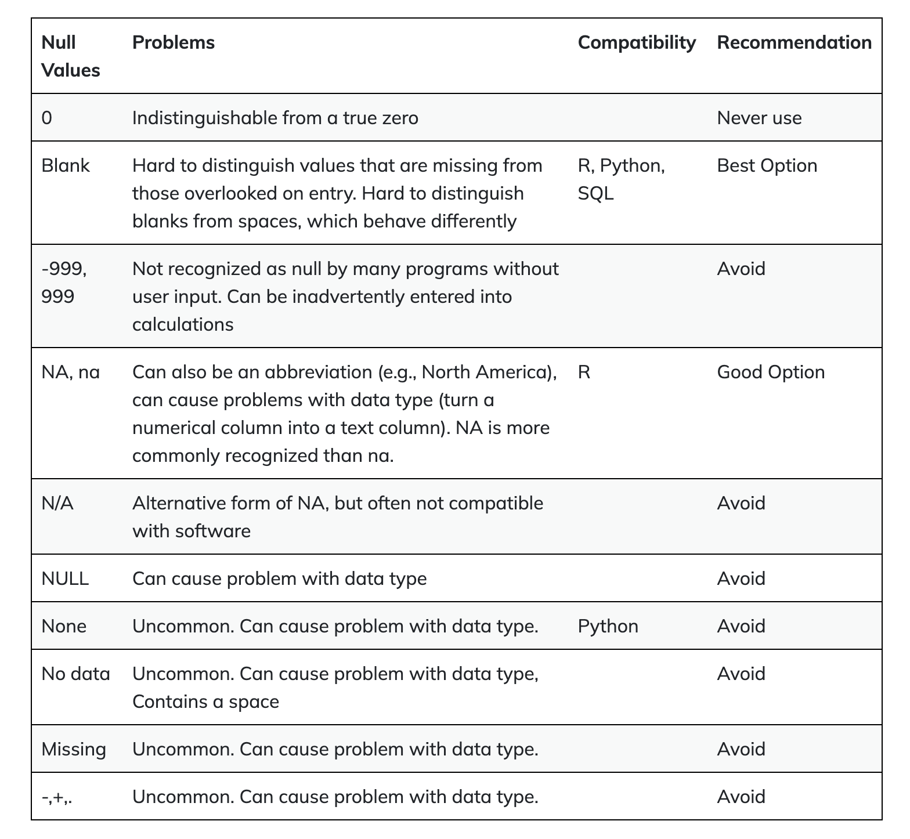

--- 
always_allow_html: true
---


# Going more in-depth with R

## Handling Missing Values

In bioinformatics, dealing with missing data is a common challenge. Missing values can arise from various sources, including experimental limitations or data collection errors. It's crucial to understand how to identify and handle these missing values effectively to ensure the accuracy of your analyses. In R, missing values are represented by `NA`, indicating the absence of a value. In this tutorial, we will explore key properties of `NA`, learn how to identify missing values, and discover techniques to handle them in your gene expression datasets.

### Understanding NA in R

#### Propagation of `NA`:

When performing operations on vectors or data frames, most functions in R will propagate `NA` values. This means that if even a single element within a vector is `NA`, the result of the operation will also be `NA`. For example:


```r
# Example vector with missing values
gene_expression <- c(10, 15, NA, 25, 18, NA, 30)

# Performing a calculation on the vector
result <- gene_expression * 2

result
```

```
## [1] 20 30 NA 50 36 NA 60
```

As you can see, the presence of `NA` in the `gene_expression` vector leads to `NA` values in the result vector.

#### Handling NA in Summary Statistics

By default, `NA` values are omitted from summary statistics like the mean, median, or standard deviation. However, specialized functions often allow you to handle `NA` values explicitly using the na.rm parameter. For instance:


```r
# Calculate the mean, ignoring NA values
mean_expression <- mean(gene_expression, na.rm = TRUE)
mean_expression
```

```
## [1] 19.6
```

```r
# NA propgates
mean_expression <- mean(gene_expression)
mean_expression
```

```
## [1] NA
```

### Identifying Missing Values
To identify missing values in your data, you can use the `is.na()` function. It returns a logical vector where `TRUE` indicates a missing value. For example:


```r
# Identify missing values
missing_values <- is.na(gene_expression)

missing_values
```

```
## [1] FALSE FALSE  TRUE FALSE FALSE  TRUE FALSE
```

### remove missing values

Now, let's explore how to handle missing values in your gene expression dataset. Suppose you want to remove missing values to clean your data. You can do this using subsetting with the logical vector we created earlier:


```r
# Remove missing values
clean_data <- gene_expression[!missing_values]

clean_data
```

```
## [1] 10 15 25 18 30
```

The `clean_data` vector now contains only the non-missing values from the original `gene_expression` vector.

### real-life note

In real life, the data are usually messy. People use different ways to represent missing values. It can be `-`, `N/A`, `NULL` etc. see below



More often, you have data in a dataframe. You can use the `table(df$column_name, useNA="ifany")` function to check all the possible values and you will spot the `NAs`. 

See this old post from me https://rpubs.com/crazyhottommy/when_NA_is_not_NA

### Conclusion
Handling missing values is a crucial skill in bioinformatics, as it ensures the reliability of your analyses. Whether you're calculating summary statistics or performing complex analyses, understanding how to work with missing data is an essential part of your bioinformatics toolkit.

## Introduction to Statistical Tests and P-Values
We often need to determine whether there are significant differences between groups of data. Let's consider a scenario where we have two sets of cells: a control group and a treatment group (which could represent various treatments like chemical or radiation exposure). Our goal is to assess if a particular gene, let's call it Gene A, exhibits differential expression under treatment conditions. Each group has 12 replicates.

We typically start with a null hypothesis (H0), which suggests that there is no difference in gene expression for Gene A after treatment, and an alternative hypothesis (H1), which suggests that Gene A's expression changes after treatment.

Now, we perform a statistical test, like the t-test, on the averages of the two groups. If the test yields a p-value, say p = 0.035, and we've set a significance threshold (alpha) of 0.05, we compare these values. A p-value of 0.035 is less than 0.05, which leads us to reject the null hypothesis, concluding that Gene A's expression significantly changes after treatment.

>But what does a p-value of 0.035 really mean?

A p-value starts with the assumption that the null hypothesis is true. In this context, a p-value of 0.035 means that under the null hypothesis, the probability of observing the observed difference in gene expression after treatment is 0.035, which is quite low. By selecting a significance level of 0.05, we establish a threshold for significance. When the p-value falls below this threshold, we reject the null hypothesis in favor of the alternative hypothesis. Thus, understanding the null hypothesis is crucial for interpreting the p-value's significance.

### Practical Application of statistical test with R

Let's dive deeper into t-tests and their practical application using R:

#### Two-Sample t-Test
In bioinformatics, the two-sample t-test is a valuable tool for comparing the means of two groups when you have continuous data, such as gene expression levels. It assesses whether the difference between the two group means is statistically significant.

Let's consider an example with two sets of gene expression data, 'condition1' and 'condition2':


```r
# Gene expression data for two conditions
condition1 <- c(12, 15, 20, 25)
condition2 <- c(8, 10, 7, 9)

# Perform a two-sample t-test
t_test_result <- t.test(condition1, condition2)
t_test_result
```

```
## 
## 	Welch Two Sample t-test
## 
## data:  condition1 and condition2
## t = 3.2426, df = 3.3053, p-value = 0.04159
## alternative hypothesis: true difference in means is not equal to 0
## 95 percent confidence interval:
##   0.6450826 18.3549174
## sample estimates:
## mean of x mean of y 
##      18.0       8.5
```

In this example, the t-test yields a p-value of 0.04159. This p-value represents the probability of observing the difference in gene expression between 'condition1' and 'condition2' if the null hypothesis were true (i.e., no difference). Since 0.04159 is less than the typical significance level of 0.05, we reject the null hypothesis, indicating that there is a statistically significant difference in gene expression between the two conditions.

#### One-Sided t-Test
In some cases, you may be interested in whether one group's mean is greater than the other. This is where one-sided t-tests come into play.


```r
# Perform a one-sided t-test (condition1 > condition2)
t.test(condition1, condition2, alternative = "greater")
```

```
## 
## 	Welch Two Sample t-test
## 
## data:  condition1 and condition2
## t = 3.2426, df = 3.3053, p-value = 0.0208
## alternative hypothesis: true difference in means is greater than 0
## 95 percent confidence interval:
##  2.857331      Inf
## sample estimates:
## mean of x mean of y 
##      18.0       8.5
```

In this example, the p-value is 0.0208. This test specifically checks if the gene expression in 'condition1' is greater than in 'condition2'. By specifying the 'alternative' parameter as 'greater,' we focus our test on this direction. Again, the p-value is compared to the significance level to make a determination.

#### Non-Parametric Test

The t-test assumes that the data follows a normal distribution. If this assumption is not met, you can use non-parametric tests like the Wilcoxon rank-sum test.


```r
wilcox.test(condition1, condition2)
```

```
## 
## 	Wilcoxon rank sum exact test
## 
## data:  condition1 and condition2
## W = 16, p-value = 0.02857
## alternative hypothesis: true location shift is not equal to 0
```

In this example, the p-value is 0.02857. The Wilcoxon rank-sum test is valuable when your data doesn't meet the normality assumption, making it a robust choice for analyzing gene expression or other biological data.

These t-tests are essential tools in bioinformatics for assessing the significance of differences between groups, helping researchers make data-driven decisions in various experimental scenarios.

### Conclusion
Understanding statistical tests and p-values is fundamental in the field of bioinformatics. These tools empower researchers to determine whether observed differences in data are statistically significant, enabling informed decisions and discoveries in the world of life sciences. The t-test, with its variations and non-parametric alternatives, is a powerful ally when comparing groups and assessing changes in gene expression or other biological phenomena. By grasping the significance of p-values and the interplay with null and alternative hypotheses, you can confidently interpret the results of your analyses, paving the way for meaningful insights and breakthroughs in bioinformatics.

## Understanding R Packages

In R, packages are similar to complementary toolboxes that can significantly enhance your data analysis capabilities. Think of R as your basic toolkit, but packages are the specialized instruments that make complex tasks easier. In this lesson, we'll embark on a journey to understand what R packages are, how to find them, install them, and put them to use in your data analysis.

### What is an R Package?

At its core, R provides a set of fundamental functions and features. However, when you dive into more complex tasks like genomics workflows or advanced statistical analysis, you'll quickly realize that creating everything from scratch is neither efficient nor practical. That's where R packages come in! These are like pre-made modules created by the R community, containing specialized functions and tools for various tasks.

We have learned functions in R. An R package is a collection of R functions, data, and code organized in a specific directory structure. It allows users to bundle related functionality, making it easier to distribute, share, and reuse code.

* Purpose: Packages provide a way to extend R's capabilities. They can contain functions, datasets, documentation, and more. Using packages enhances code organization, collaboration, and efficiency.

### Why Use R Packages?
Imagine you need to perform complex statistical analysis, visualize data, or carry out genomics-related tasks. Instead of writing extensive code from scratch, R packages allow you to leverage the expertise of other researchers and developers. These packages encapsulate data processing routines, saving you time and effort.

### How to use a package?

#### Installation
To use an R package, you first need to install it. Most packages are hosted on CRAN (Comprehensive R Archive Network), which is the primary repository for R packages. You can install a package using the `install.packages()` function. For example, if you want to install the popular `ggplot2` package for data visualization:


```r
install.packages("ggplot2")
```

Once installed, you need to load the package into your current R session using the `library()` function:


```r
library(ggplot2)
```
This action makes all the functions and tools from the `ggplot2` package available for use in your environment.

#### Installing specialized packages

For specialized fields like biology or bioinformatics, Bioconductor is a valuable resource. Bioconductor provides a vast array of genomics and statistics packages tailored to these domains. To install Bioconductor packages, you first need to check if you have the `BiocManager` package installed and then use it to install other packages. For instance, to install the `DESeq2` package for differential expression analysis:


```r
if (!requireNamespace("BiocManager", quietly = TRUE))
    install.packages("BiocManager")

BiocManager::install("DESeq2")
```

Remember, you typically only need to install a package once on your machine.

Sometimes, people host their R packages on `github`. To install an package from
github you need an R package called `devtools`. Install it first


```r
install.packages("devtools")
```

Then we can use it to install packages from github:

e.g., this package https://github.com/immunogenomics/presto


```r
library(devtools)

install_github("immunogenomics/presto")
```

#### Putting Packages to Work

Once you've installed and loaded a package, you can harness its power. For example, let's say you want to perform differential expression analysis on your count data:


```r
library(DESeq2)
counts <- matrix(c(10, 15, 5, 20, 8, 12, 18, 25, 30), nrow = 3, byrow = TRUE)

rownames(counts) <- c("Gene1", "Gene2", "Gene3")

colnames(counts) <- c("Sample1", "Sample2", "Sample3")

# create a 'samples' dataframe
samples <- data.frame(condition = c("Control", "Treatment", "Control"), 
              misc1 = c(1, 2, 1),
              misc2 = c("A", "B", "C"))

dds <- DESeqDataSetFromMatrix(countData = counts, 
                              colData = samples, 
                              design = ~ condition) 

res <- DESeq(dds)

res
```

```
## class: DESeqDataSet 
## dim: 3 3 
## metadata(1): version
## assays(4): counts mu H cooks
## rownames(3): Gene1 Gene2 Gene3
## rowData names(22): baseMean baseVar ... deviance maxCooks
## colnames(3): Sample1 Sample2 Sample3
## colData names(4): condition misc1 misc2 sizeFactor
```

In this example, we use the `DESeq2` package to handle the analysis. This package takes care of normalization and statistical calculations behind the scenes.

### Embracing Errors

As you explore new packages, don't be alarmed if you encounter errors during installation. Error messages can be your allies, providing valuable information. If the message seems mysterious, copy it and try googling it, or seek help from online forums like `biostars.org`, `seqanswers.com`, or `support.bioconductor.org`. Error messages are part of the learning process, and you'll soon become skilled at deciphering them.

### How to look for package docs within R studio?

Once a package is loaded, you can access its documentation using the `help()` function or the `?` operator. Simply provide the name of the function from the package as the argument to `help()` or follow `?` with the function name. For instance:


```r
library(dplyr)
?select
```

```
## Help on topic 'select' was found in the following packages:
## 
##   Package               Library
##   dplyr                 /Library/Frameworks/R.framework/Versions/4.1/Resources/library
##   AnnotationDbi         /Library/Frameworks/R.framework/Versions/4.1/Resources/library
## 
## 
## Using the first match ...
```

```r
help("select")
```

```
## Help on topic 'select' was found in the following packages:
## 
##   Package               Library
##   dplyr                 /Library/Frameworks/R.framework/Versions/4.1/Resources/library
##   AnnotationDbi         /Library/Frameworks/R.framework/Versions/4.1/Resources/library
## 
## 
## Using the first match ...
```

This command opens the documentation for the `select()` function from the `dplyr` package, providing details on its usage and arguments.

### Exploring Package Vignettes

Many R packages include vignettes, which are comprehensive documents detailing package functionalities, use cases, and examples. You can access these vignettes using the `browseVignettes()` function. Syntax:


```r
browseVignettes(package_name)
```

For example:


```r
browseVignettes("dplyr")
```

Executing this command opens a list of available vignettes for the dplyr package, allowing you to explore specific topics in detail.

### Practical Tip

When looking for packages, you can search for specific ones related to your data type or analysis task. For instance, if you're working with DNA methylation data, you can search for packages like "DNA methylation bioconductor" in google.

### Conclusion
In conclusion, R packages are your companions on the journey of data analysis. They allow you to stand on the shoulders of the community and streamline your work. As you advance in your data science or bioinformatics endeavors, you'll discover that these packages play a pivotal role in making your tasks more efficient and effective.

## Exploring Functions in Different Packages: Avoiding Collisions and Accessing Them

One of the key skills you'll develop is harnessing the power of packages or libraries in R to extend its functionality. However, it's crucial to understand how to navigate and use functions when multiple packages offer functions with the same name, as collisions can occur. In this tutorial, we'll demystify this concept and show you how to access functions from different packages without loading them, enabling you to choose which one to use.

Imagine you're working on a project that requires both `dplyr` for data frame wrangling and `AnnotationDbi` for mapping gene IDs. You know that both packages offer a `select` function. Here's where the challenge arises: if you load both libraries, the function in the later-loaded library will override the previous one. So, how do you access the `select` function from the desired package?

### Using Double Colon (`::`)

The answer lies in the double colon (`::`) operator. You can specify the package along with the function name to avoid ambiguity. Let's look at some examples:

#### Data Selection

Suppose you are working with data frames and need to select specific columns. The dplyr package offers a `select` function for this task, but there is also a select function in the `AnnotationDbi` package. To avoid confusion, use the following approach:


```r
# Select data columns using 'select' from 'dplyr' and 'AnnotationDbi' packages
selected_data_dplyr <- dplyr::select(data_frame, column1, column2)
selected_data_AnnotationDbi <- AnnotationDbi::select(x, keys, columns, keytype)
```

Here, we illustrate how to select specific columns using 'select' functions from both the `dplyr` and `AnnotationDbi` packages.

#### Data Reduction

Imagine you need to reduce a dataset to a single value. The `purrr` package offers a `reduce` function for this purpose, and so does the GenomicRanges package. Here's how to differentiate between them:


```r
# Reduce data using 'reduce' from 'purrr' and 'GenomicRanges' packages
reduced_data_purrr <- purrr::reduce(data_list, reducer_function)
reduced_data_GenomicRanges <- GenomicRanges::reduce(gr)
```
For data reduction, we show how to use `reduce` functions from `purrr` and `GenomicRanges` packages.

#### Set Operations
In some cases, you may need to find the differences between two sets of data. The `GenomicRanges` package offers a `setdiff` function, but base R also has a `setdiff` function. Here's how to use them separately:


```r
# Perform set difference using 'setdiff' from 'GenomicRanges' and base R
set_diff_GenomicRanges <- GenomicRanges::setdiff(gr1, gr2)
set_diff_base_R <- base::setdiff(set1, set2)
```
Lastly, for set operations, we demonstrate how to perform set differences using `setdiff` functions from `GenomicRanges` and base R.

>These examples might seem abstract, but in the real world, you'll encounter situations where different packages offer functions with the same name but cater to distinct needs. By mastering the '::' operator, you gain the ability to choose the right tool for the job, ensuring that your data analysis and manipulation are precise and tailored to your specific requirements.

### Conclusion

Accessing functions from packages without loading them is a powerful technique that allows you to resolve function collisions and use the right function for your specific needs. It's a valuable skill for any data analyst or programmer working with R packages, ensuring that your code runs smoothly and produces accurate results.

## Writing Custom Scripts

Writing organized and modular code is crucial for improving code readability, maintainability, and reusability. In this lesson, we will explore the process of creating, organizing, and loading scripts in R, with a focus on modular programming. We assume no prior computer science experience, making this lesson beginner-friendly.

This will be our hypothetical project structure:


```bash
my_awesome_project
├── data
    ├── data.csv
└── scripts
    ├── data_loading.R
    ├── main_script.R
└── results
    ├── intermediate_table.csv
    ├── figure.pdf
```

### Your Working Directory

>In R, the working directory is like a current location on your computer where R will look for files and where it will save files by default. It's important to set the working directory correctly because it helps R know where to find and store your data and scripts.

People tend to use `setwd()` to set their working directory. 

```r
setwd("/path/to/your/project")
```

However, this makes the analysis not reproducible. If people take your code and run in their own computer,the file paths are different.

**Tip:** For more advanced users, you may want to stay away from `setwd()` and use the `here()` function for reproducibility. Read this blog post for more information https://www.tidyverse.org/blog/2017/12/workflow-vs-script/


In RStudio, you can create a new R script by following these steps:

* Click on "File" in the top menu.

* Select "New File" and then "R Script."

This will open a new R script file where you can write your code.

### Writing Functions in Scripts

To make your code modular, you can define functions within your script files. Functions allow you to encapsulate specific tasks, making your code more readable and reusable. For example:


```r
# data_loading.R
load_data <- function(file_path) {
  data <- read.csv(file_path)
  return(data)
}
```

This function, `load_data` reads data from a CSV file and returns it. Save this script as `data_loading.R` in the `scripts` folder.

### Importing Functions from Scripts

Now that you've defined a function in a script, you can import it into your main script for use. To do this, use the `source()` function:


```r
# main_script.R
source("scripts/data_loading.R")

# Now you can use the imported function
my_data <- load_data("data/my_data.csv")
```

The `source()` function reads and evaluates the code in the specified script file, making the `load_data` function available for use in `main_script.R`.

In this dummy example, the `data_loading` function is very simple, but in real life analysis, it can be more complicated: search on the web, crawl the files, download them
to the local computer and then read into R.

## Data I/O

In this lesson, we'll dive into the fundamental skills of handling data in R. Being proficient in inputting and outputting data is essential for automating data analysis workflows. We'll explore how to import, explore, and export files using R, all while cultivating good coding habits.

### Built-In Functions

>Built-in functions are pre-made tools in a programming language or software that do specific jobs without you having to create them from scratch or find extra tools elsewhere. They simplify common tasks in coding and are readily available for use.

#### Importing Data
When working with data analysis, one of the common challenges is reading data into R. Two common file formats for data storage are tab-separated/delimited values (TSV) and comma-separated values (CSV).

R comes to the rescue with functions designed to understand these languages - `read.csv()` and `read.table()`. These functions are like translators for R, helping it understand the data you provide.

Let's begin by importing an example gene expression file. You can download it from this [link](https://osf.io/yeun5). We will use `read.csv()` to load the data into R.


```r
# Import data from a CSV file
# by default the downloaded file will be in your Downloads folder
tcga_data <- read.csv("~/Downloads/TCGA_cancer_genes_expression.csv")
```
This code reads the data from the CSV file and stores it in the tcga_data dataframe. Now, we can manipulate and analyze this dataset.

#### Exploring Data

To understand the data, it's crucial to explore its structure. One way to do this is by examining the unique values in a specific column. In the following code, we count the occurrences of each cancer study type:


```r
# Count the occurrences of each study type
table(tcga_data$study)
```

```
## 
##  ACC BLCA BRCA CESC CHOL COAD DLBC ESCA  GBM HNSC KICH KIRC KIRP LAML  LGG LIHC 
##   79  433 1256  309   45  546   48  198  175  548   91  618  323  178  532  424 
## LUAD LUSC MESO   OV PAAD PCPG PRAD READ SARC SKCM STAD TGCT THCA THYM UCEC  UCS 
##  601  555   87  430  183  187  558  177  265  473  453  156  572  122  589   57 
##  UVM 
##   80
```
#### Data Inspection
To get a quick look at the data, we can use the head() function, which displays the first six rows of the dataframe:


```r
# Display the first 6 rows of the dataframe
head(tcga_data)
```

```
##                                      X    TACSTD2      VTCN1       MUC1
## 1 43e715bf-28d9-4b5e-b762-8cd1b69a430e  0.7035937 0.00000000 0.67502205
## 2 1a5db9fc-2abd-4e1b-b5ef-b1cf5e5f3872 25.4360736 0.00000000 2.01525394
## 3 93b382e4-9c9a-43f5-bd3b-502cc260b886  1.5756197 0.00000000 0.90784666
## 4 1f39dadd-3655-474e-ba4c-a5bd32c97a8b  0.2702156 0.09099681 0.04293345
## 5 8c8c09b9-ec83-45ec-bc4c-0ba92de60acb  0.4122814 0.00000000 0.11484380
## 6 85a86b91-4f24-4e77-ae2d-520f8e205efc  4.5469193 4.85973690 0.04208195
##      NECTIN4     FOLH1      FOLR1     CD276       MSLN      CLDN6     ERBB2
## 1 0.08620727  7.213342 0.00000000  52.75981 0.06674445 0.09704962  1.879518
## 2 0.07279804 23.552286 0.12154673  78.78551 0.95554610 0.25458796  7.777976
## 3 0.69905270  2.853812 1.01000271 145.84399 0.04563568 0.25701910  2.905926
## 4 0.01652257  1.157070 0.27942068  48.45022 0.03154912 0.24746913  4.914280
## 5 0.03168398  2.408137 0.04922458  42.25592 0.26968788 0.12576720  1.494744
## 6 0.06828305  1.010411 0.02248965  20.63795 0.01336404 0.01823883 13.474689
##          MUC16       DLL3 CEACAM5      PVR     EPCAM       PROM1       CD24
## 1 0.0011479879 0.49589978       0 52.08113  4.521984 0.025311008 0.55036003
## 2 0.0008049670 2.52244014       0 40.87926  9.530414 0.023576862 9.67272890
## 3 0.0026190288 0.77074712       0 33.26727 42.358567 0.000000000 0.06939934
## 4 0.0051705741 0.10636402       0 28.26457 16.316524 0.007783431 0.84522244
## 5 0.0004894306 0.04483123       0 41.66776 12.529742 0.019204339 0.21369023
## 6 0.0000000000 0.01184285       0 30.18711  2.430109 0.043719865 4.95506593
##        EGFR        MET TNFRSF10B            tcga.tcga_barcode
## 1  1.286481  0.9320235  12.80547 TCGA-OR-A5KU-01A-11R-A29S-07
## 2  5.373307  8.0610999  31.46289 TCGA-P6-A5OG-01A-22R-A29S-07
## 3  4.600918  0.1295387  65.57967 TCGA-OR-A5K5-01A-11R-A29S-07
## 4  3.010374  2.9728030  24.31636 TCGA-OR-A5K4-01A-11R-A29S-07
## 5 16.476552 19.7360055  21.11014 TCGA-OR-A5LP-01A-11R-A29S-07
## 6  2.010338  8.6087283  37.91574 TCGA-PK-A5H9-01A-11R-A29S-07
##   tcga.cgc_sample_sample_type study sample_type
## 1               Primary Tumor   ACC      cancer
## 2               Primary Tumor   ACC      cancer
## 3               Primary Tumor   ACC      cancer
## 4               Primary Tumor   ACC      cancer
## 5               Primary Tumor   ACC      cancer
## 6               Primary Tumor   ACC      cancer
```

This visual check helps us spot any potential issues early in the analysis. You may notice that the first column name is 'X,' which can happen when the data file has no column header.
The output will display a table with the study abbreviations and their respective counts, providing insights into the dataset.

#### Data Anomalies
In some cases, data anomalies may arise, such as missing column names. For example, when opening the data in Excel, the first column may appear empty. In R, it defaults to using 'X' for that missing column name.

To inspect the last six rows of the data:


```r
# Display the last 6 rows of the dataframe
tail(tcga_data)
```

```
##                                          X    TACSTD2      VTCN1      MUC1
## 11343 9506723f-9193-4d8e-bd97-8a0062ab2f9c 0.08154275 0.06388402 0.2653041
## 11344 3ee533bd-5832-4007-8f1f-439166256eb0 0.09602460 0.00000000 0.5017033
## 11345 a2c71c07-af0c-4016-808c-dfef458c91c7 0.11766953 0.06015085 1.0880740
## 11346 98b2a7f8-a7bd-4da2-8541-950e44d9acd7 0.00000000 0.00000000 0.6843479
## 11347 d3fc3968-b263-4756-bf7f-1941f70b04da 0.23376567 0.00000000 0.4993842
## 11348 f5b9b89b-6821-43ee-bcfd-623689d03af9 0.04404158 0.00000000 0.5674195
##           NECTIN4      FOLH1      FOLR1    CD276      MSLN       CLDN6
## 11343 0.027466444 0.55495200 0.00000000 16.30346 0.0000000 0.000000000
## 11344 0.000000000 0.28053151 0.00000000 30.29320 0.0000000 0.000000000
## 11345 0.070299290 1.48065011 0.39058212 52.87115 0.0000000 0.328483815
## 11346 0.011930801 0.09355531 1.69415825 28.02235 0.0000000 0.002753009
## 11347 0.011465502 0.38806433 0.04872839 26.70443 0.0000000 0.000000000
## 11348 0.006823029 0.20336014 0.37653301 27.12231 0.1554201 0.003539148
##           ERBB2 MUC16       DLL3     CEACAM5       PVR      EPCAM      PROM1
## 11343  9.768257     0  5.0197156 0.000000000 14.792782 0.67698452 0.04564542
## 11344 16.990612     0 13.6913305 0.000000000 13.244923 0.53035459 0.12887000
## 11345 17.496578     0  6.9048415 0.001147923 38.883462 0.32233902 0.07192491
## 11346 14.669438     0  3.8565185 0.000000000  8.523324 0.00000000 0.07007871
## 11347  8.645711     0  0.7416064 0.000000000 12.697792 0.00000000 0.10824816
## 11348 21.718607     0  5.5137596 0.000000000 11.473157 0.04096058 0.01835981
##             CD24      EGFR       MET TNFRSF10B            tcga.tcga_barcode
## 11343 0.11377251 0.1559625  67.49615 22.528273 TCGA-VD-A8K7-01B-11R-A405-07
## 11344 0.03138053 0.1998664  89.53855  5.072147 TCGA-VD-A8KB-01A-11R-A405-07
## 11345 0.08860096 1.0542988 200.75676 10.206628 TCGA-V4-A9EI-01A-11R-A405-07
## 11346 0.06745506 0.3034171  10.81844  3.908425 TCGA-V4-A9EY-01A-11R-A405-07
## 11347 0.10317872 0.1465101  49.09478  2.825917 TCGA-VD-AA8N-01A-11R-A405-07
## 11348 0.34742178 0.2299831  19.00013  3.644837 TCGA-V4-A9ET-01A-11R-A405-07
##       tcga.cgc_sample_sample_type study sample_type
## 11343               Primary Tumor   UVM      cancer
## 11344               Primary Tumor   UVM      cancer
## 11345               Primary Tumor   UVM      cancer
## 11346               Primary Tumor   UVM      cancer
## 11347               Primary Tumor   UVM      cancer
## 11348               Primary Tumor   UVM      cancer
```

This helps identify any anomalies or inconsistencies towards the end of the dataset.

#### Exporting Data
Once we've processed and analyzed the data, it's essential to save our results. We can export edited datasets using the `write.csv()` function. For instance, if we want to save the first six rows of the dataframe to a new CSV file:


```r
# Export the first 6 rows to a new CSV file
write.csv(head(tcga_data), "~/Downloads/top_6_tcga.csv")
```

This code creates a new CSV file containing the selected data.

### Real-World Applications

* Importing Data: Imagine you work in a research lab and need to analyze experimental results stored in CSV files. You can use R to import and process this data efficiently.

* Data Exploration: If you are a data analyst, you might use R to explore datasets, count occurrences of specific values, and gain insights to guide your analysis.

* Data Cleaning: Data often comes with anomalies or missing values. R can help you identify and address these issues before conducting statistical analyses.

* Data Export: Whether you're conducting research or generating reports, exporting your analysis results to share with colleagues or stakeholders is a common requirement. 

### Conclusion
In this lesson, we've covered the basics of handling data in R. You've learned how to import, explore, and export data, which are crucial skills for automating data analysis workflows. These skills will serve as a strong foundation for your journey into data science and analysis.

For more detailed information on these functions or any other aspect of R, you can always refer to the documentation by typing `?function_name` in R, such as `?read.table`, to access the help page for that function.

## Best Practices in Modular Programming and Project Management

When using the R programming language, it is crucial to write code that is well-organized, reusable, and scalable. This guide will introduce you to best practices for modular programming and project management, making it accessible even if you have no prior experience in computer science. We will cover the following topics:

### Introduction to Modular Programming
When you find yourself copying and pasting the same code more than twice, it's a clear signal that it's time to write a function. Functions in R allow you to encapsulate a set of instructions into a reusable block of code. This not only enhances code readability but also promotes reusability and maintainability.

#### Why Use Functions?
Imagine you are working on a data analysis project that involves multiple steps like loading data, data manipulation, and visualization. Instead of having one long script that combines all these tasks, you can break it down into smaller, more manageable functions. Here's an example:


```r
get_count_data <- function() {
  counts <- read.csv("expression.csv")
  counts <- filter_zeros(counts)
  normalize(counts)
}
```

In this code, `get_count_data` is a function responsible for loading data, filtering out zeros, and normalizing the data. Now, when you need to access the data in your analysis, you can simply call this function:


```r
counts <- get_count_data()
```

#### Benefits of Modular Functions

* Code Reusability: You can reuse these functions across different projects, saving time and effort. If you need to modify data loading or normalization logic, you only have to do it in one place.

* Code Clarity: Functions make your code more readable and maintainable. Each function encapsulates a specific part of your workflow, making it easier to understand.

* Easy Debugging: Smaller functions are easier to debug than long scripts. If there's an issue with data loading, you only need to focus on the get_count_data function.

* Scalability: As your project grows, you can easily add new functions to handle additional tasks without disrupting the existing code.

### Breaking Down Your Project

To further enhance modularity in your data analysis projects, it's advisable to break down your project into separate files and directories. This structure simplifies project management and encourages a more organized workflow.

A typical project structure might look like this:


```bash
project
├── data
├── results
└── scripts
    ├── data_loading.R
    ├── downstream.R
    ├── preprocessing.R
    └── visualization.R
```

Here's what each component represents:

* data: This directory contains your data files or datasets.

* results: This is where you can store the results of your analysis, such as plots, tables, or reports.

* scripts: This directory is divided into separate files, each responsible for a specific part of your analysis.

Watch the video to understand how to set up a project fold structure and use 
the package [`here`](https://github.com/jennybc/here_here) to avoid using `setwd()`.


```{=html}
<div class="vembedr">
<div>
<iframe src="https://www.youtube.com/embed/wXXhp9sXqao" width="533" height="300" frameborder="0" allowfullscreen="" data-external="1"></iframe>
</div>
</div>
```

In this Real-World RNAseq analysis Example, we 

1. Loading Data and Preprocessing: By creating a `data_loading` function and `preprocessing` function, you can easily load, clean, and merge data from various sources in a consistent manner.

2. Exploratory Data Analysis (EDA): During EDA, you might need to create various visualizations for different aspects of your data. Separating visualization code into a dedicated script makes it easier to experiment with different plots and ensures a consistent look and feel across your project.

3. Statistical Modeling: When building predictive models, you can encapsulate the modeling process into a function called downstream.R. This allows you to apply the same model to different datasets or update the model with ease when new data becomes available.

Even better if you apply a consistent naming convention to all your scripts. In this case, you know the order of the scripts you used for each project.


```bash
project
├── data
├── results
└── scripts
    ├── 01_data_loading.R
    ├── 02_preprocessing.R
    ├── 03_visualization.R
    └── 04_downstream.R
```

Advantages of Project Structure:

* Clear Organization: By segregating your code into different files, you have a clear view of which script handles what aspect of your analysis.

* Focused Files: Each script file can focus on a specific task, making it easier to work on and understand.

* Easy Collaboration: When collaborating with others, this structure allows team members to work on different parts of the project simultaneously.

* Version Control: If you use version control systems like Git, having separate files for different tasks facilitates tracking changes and collaboration.

You should take advantage of the [R project feature](https://support.posit.co/hc/en-us/articles/200526207-Using-RStudio-Projects) in Rstudio.

### Conclusion
In summary, adopting modular programming practices and organizing your data analysis projects effectively in R not only enhances code quality but also simplifies project management. Functions serve as reusable building blocks, while a well-structured project directory keeps your work organized and maintainable. Embracing these principles will help you become a more efficient and effective data analyst, regardless of your level of experience.

## Section complete 

Congratulations on completing this section of the course! You've tackled complex topics such as handling missing values, explored statistical tests and P-values, and expanded your knowledge of R packages. Your understanding of functions within different packages has equipped you with strategies for efficient access and avoidance of collisions. Not only have you improved your scripting skills, but you've also mastered effective data input/output management.

Your are making great progress, and these skills are essential for advanced data analysis. As you continue your journey in R, remember that these concepts form the foundation for further growth in modular programming and beyond.

Maintain your momentum as you move into the next section, where we'll build upon this foundation. If you have any questions, our community's Q&A section and lesson-specific comments are available for support.

Let's continue exploring together with curiosity and determination!
